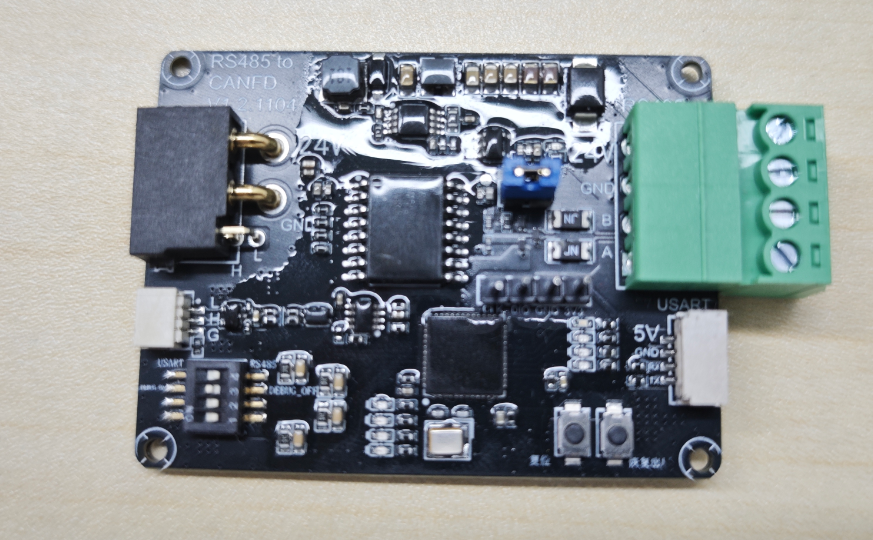
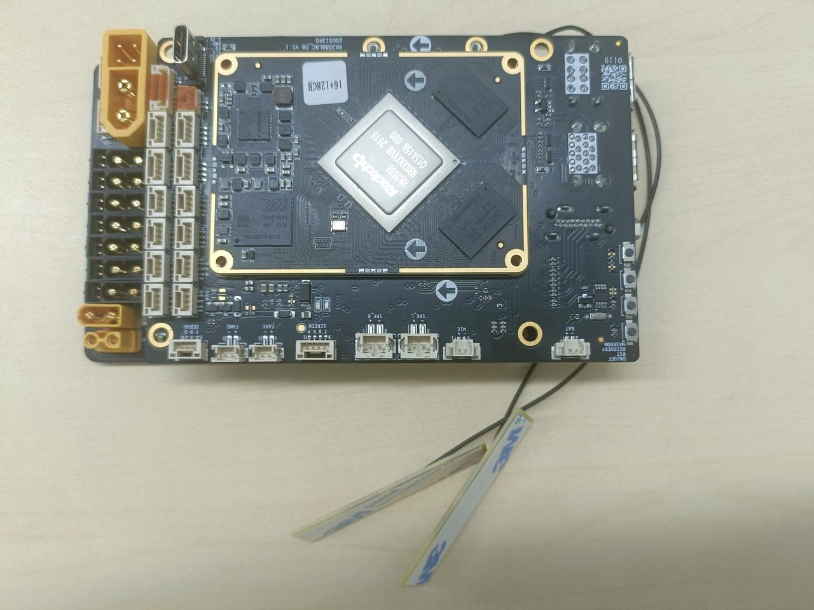

# 00-阅读指南

欢迎使用本产品文档库！为了帮助您快速定位所需信息，请参考以下阅读指引：

#### 🧩 产品介绍

**模组手册**：[1.1高擎机电模组产品手册.pdf](./01-电机/1.1-产品手册.md)

#### 🧩 模型图纸

**电机模型图纸**：[电机3D模型图纸](https://www.hightorque.cn/%e4%b8%8b%e8%bd%bd-%e8%a1%8c%e6%98%9f%e7%b3%bb%e5%88%97%e5%85%b3%e8%8a%82%e6%a8%a1%e7%bb%84%e6%a8%a1%e5%9e%8b%e5%9b%be)

#### 🧩 使用说明

在使用高擎产品前，请仔细阅读说明书

1. **初次使用**可以查看高擎电机调试助手快速上手文档[2.1 上位机快速上手](./02-高擎电机调试助手/2.1-快速上手.md)，了解模组的使用和连接方式，检查模组是否正常，然后再查看上位机说明文档[2.2 上位机说明](./02-高擎电机调试助手/2.2-使用说明.md)，进行模组的初步调试，了解模组的各种控制模式。
2. **只购买模组不购买通讯板自行开发**可以查看协议例程进行参考，建议直接移植例程进行使用。
    - 如果使用**FDCAN协议**可以查看fdcan例程详细说明文档[3.2 FDCAN 例程详细说明](./03-电机使用例程/3.2-FDCAN例程详细说明.md)和fdcan协议解析文档[1.2 fdcan协议解析](./01-电机/1.2-fdcan协议解析.md)，如果不了解单片机使用流程，可以查看例程快速上手[3.1 快速上手](./03-电机使用例程/3.1-快速上手.md)进行了解。
    - 如果使用**can协议**进行控制请查看[3.3 CAN 例程详细说明](./03-电机使用例程/3.3-CAN例程详细说明.md)和[1.3 CAN协议解析](./01-电机/1.3-CAN协议解析.md)
3. **配套通讯板使用**可以根据购买产品情况查看下面文档
    - **h730开发板**使用可以先看例程快速上手文档，[3.1 快速上手](./03-电机使用例程/3.1-快速上手.md)，连接开发板的连接和程序运行方式，然后再看[3.2 FDCAN 例程详细说明](./03-电机使用例程/3.2-FDCAN例程详细说明.md)和[1.2 fdcan协议解析](./01-电机/1.2-fdcan协议解析.md)
     h730开发板
    - **RS485转fdcan板**使用可以先看[5.1 硬件说明](./05-RS485转FDCAN/5.1-硬件说明.md)，连接通讯板的使用方式和接线方式，然后再看[5.2 使用说明](./05-RS485转FDCAN/5.2-使用说明.md)和[5.3 寄存器表](./05-RS485转FDCAN/5.3-寄存器表.md)，进行调试和使用。
     RS485转fdcan板
    - **SDK配套板（具体有：7路CAN主控盒子、通用盒子、4路CAN叠板）** 使用可以先看[4.1 SDK快速上手](./04-SDK/4.1-SDK快速上手.md)根据购买的通讯板方案进行查看对应的快速上手说明文档了解产品的使用方法，然后再查看[4.2 软件说明](./04-SDK/4.2-软件说明.md)进行调试和使用。

| SDK配套板如下图 |  |  |
| --- | --- | --- |
|  7路CAN主控盒子 |  通用盒子 |  4路CAN叠板 |

**注意事项：**

1. 请不要热插拔电机，在连接和断开电机连线时，请先关闭电源
2. 使用电机时请在CAN 总线两端连接终端电阻（通常为 120 Ω），并联之后为60Ω。
3. 如果有使用上的问题可以微信联系高擎小管家，**电话：15021806766 微信号：GQJD2022**
