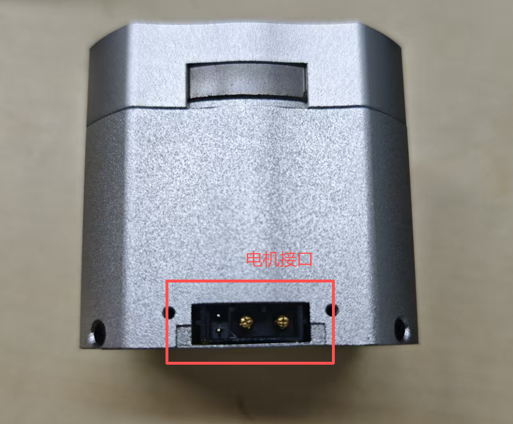

# 1.4 电机接口说明

## 说明

**注释说明：**

1. 电机接口为 XT30（2+2）端子，用于给电机供电与 CAN 信号传输。
2. 通过 XT30(2+2) 端子的电源连接线连接电源，额定电压为 24V，为电机供电。
3. 通过 CAN 通信端子连接外部控制设备，可接收 CAN 控制命令，反馈电机状态信息。
4. 电机包含两个接口，任一接口可单独连接使用，也可多机串联使用，方便走线。
