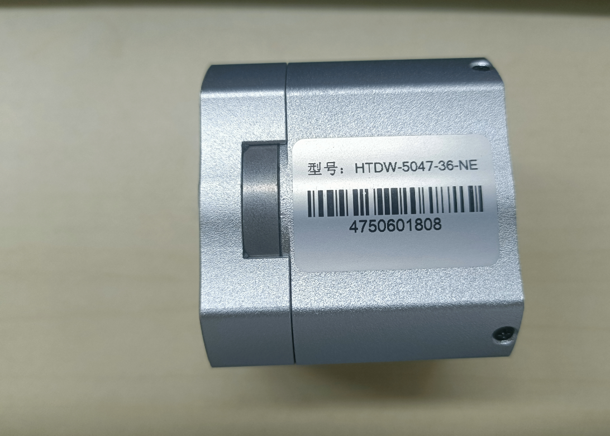
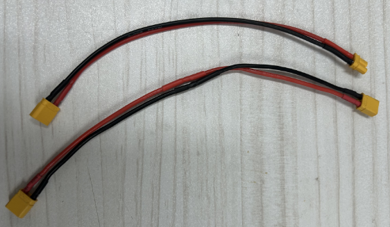
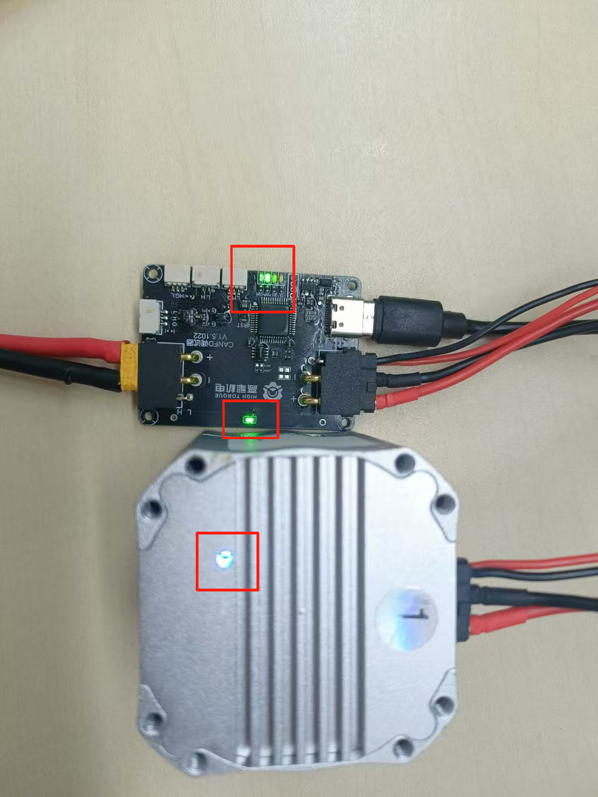
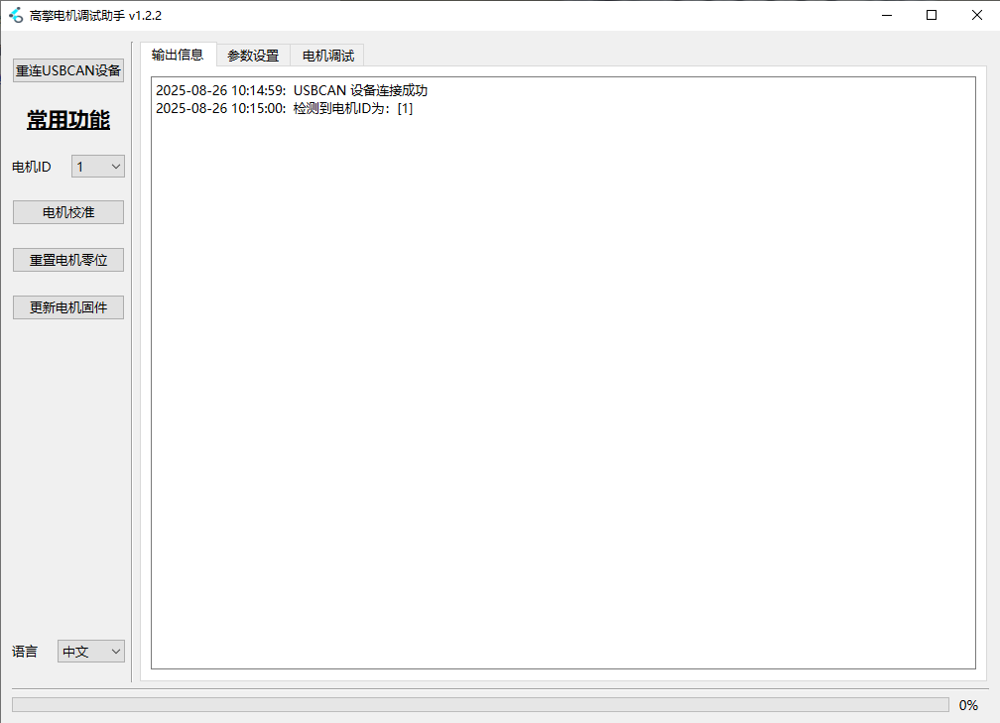
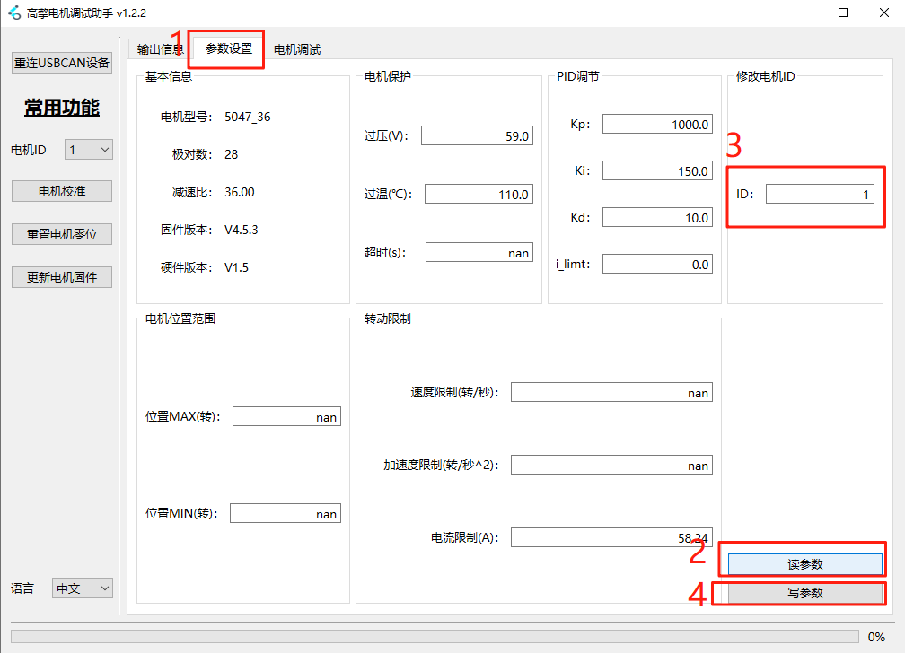

# 2.1 高擎电机调试助手快速上手

## 使用目的

**目的：**

- 使用USB转FDCAN调试板连接高擎电机调试助手，通过高擎电机调试助手修改电机ID。
- 通过高擎电机调试助手发送指令控制电机进行缓慢转动。

## 物料清单

| 物料 | 数量 | 图片 |
| --- | --- | --- |
| 直流稳压电源 | 1 |  |
| USB转FDCAN调试板 | 1 |  |
| 高擎电机（型号：5047） | 1 |  |
| USB数据线 | 1 |  |
| TX30（2+2）线材 | 1 |  |
| TX30母线 | 1 |  |
| 高擎电机调试助手软件 |  |  |

**软件下载地址：**[电机调试助手最新版下载地址](https://www.hightorque.cn/%e4%b8%8b%e8%bd%bd-%e7%94%b5%e6%9c%ba%e8%b0%83%e8%af%95%e5%8a%a9%e6%89%8bv0-10-5)

**注意：高擎电机调试助手仅支持win10及以上系统**

## 硬件准备

### 设备连接

1. 电机额定电压：24V
2. 调试接线：
    - USB转FDCAN调试板模块：通过Type-C接口连接电脑。
    - 电机连接：使用XT30（2+2）线将电机与调试板模块相连。
    - 电源连接：使用XT30线将电源接入调试板的任意一个XT30（2+2）接口（两个接口功能相同，可互换使用）。

### 上电说明

1. 打开电源，此时电机底部有灯亮起，并且USB转FDCAN调试板的信号灯亮起。

## 软件使用

### 测试环境

- 操作系统：Windows 10
- 高擎电机调试助手软件：电机调试助手 v1.2.2
- 驱动支持：COM端口驱动（确保串口通信正常）

### 打开高擎电机调试助手

1. 双击高擎电机调试助手。在高擎电机调试助手输出信息界面显示连接电机成功。

**注意：** 若出现与下图情况不符请查看“高擎电机调试助手说明手册”连接情况说明查看问题。

### 修改电机ID

**电机ID:**

- 电机的序号，用于识别对应电机，对指定电机进行控制。
- 电机ID起始为1，同一条CAN通道上不能有ID重复的电机。

**修改电机ID操作：**

1. 点击参数设置。
2. 点击读参数。
3. 查看电机ID，可修改成需要的电机ID。
4. 点击写参数，保存修改的电机ID。

### 控制电机

1. 点击到电机调试界面，
2. 点击速度模式
3. 设置速度为0.1转/秒
4. 点击添加波形,可以看到位置速度力矩的波形图
5. 点击发送，此时电机缓慢转动起来，该状况说明电机正常可以运行。
6. 若要让电机停止，点击停止键即可。
