# 2.2 高擎电机调试助手说明

## 适用版本及系统说明

- 本**说明书**适用于高擎调试助手 v1.0.0 及以上版本。
- **高擎调试助手**适用于电机固件在 v3.1.0 及以上版本。
- **高擎调试助手支持系统**：win10、win11（不支持 win7）。

## 硬件介绍

### 所需器材

<br>XT30线材

<br>XT30(2+2) 线材（5046电机不需要）

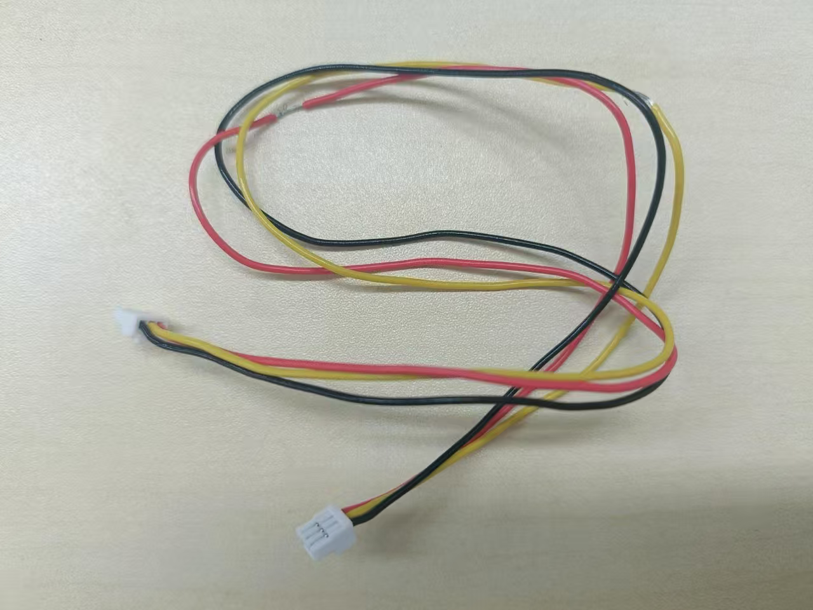<br>GH1.25_3P线（仅5046电机需要）

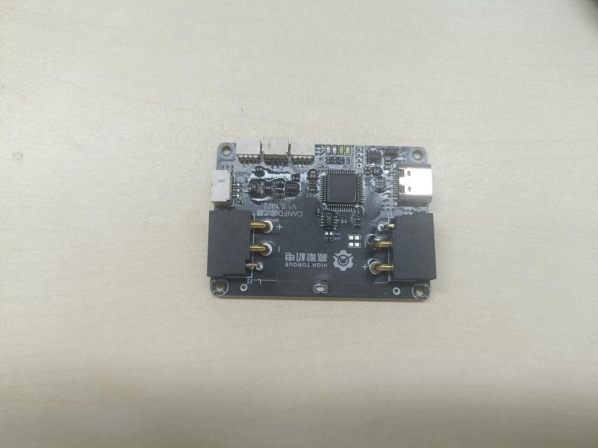

USB 转 FDCAN 小板


USB 数据线

### 设备连接

电压范围：参考电机电压范围

电机接口：XT30（2+2）接口

#### **连接方式****：**

- 如下图：用一条数据线连接电脑和 USB 转 FDCAN 小板的 Type-C 口，将电机与 USB 转 FDCAN 小板相连，并将直流稳压电源与 USB 转 FDCAN 小板相连。
- 示例电机型号：5047
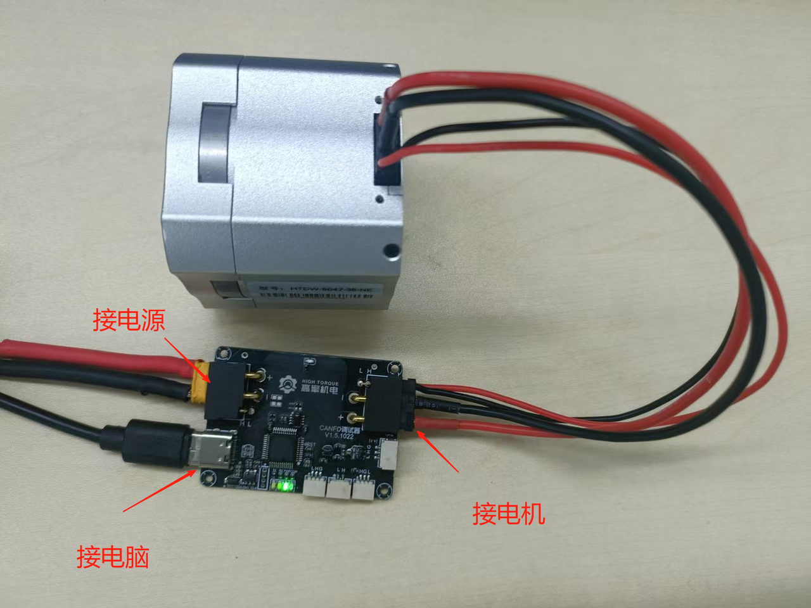<br>连接方式

## 软件介绍

### 基本信息及功能

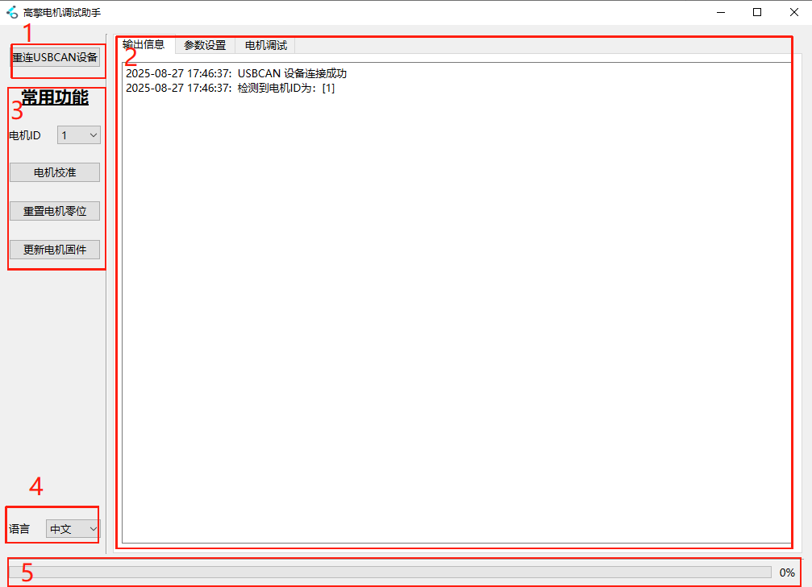

1. **重连 USBCAN 设备：**
    - **执行操作如下**
        1. 扫描并连接 USBCAN 设备。
        2. 检测并连接电机。
    - 使用上位机控制电机时，连接错误时执行此操作进行上位机与电机的重新连接。
    - 若调试过程中断连或多电机识别不全，可再次点击重连。
2. **输出信息：** 显示电机连接状态、校准过程等调试信息。
3. **常用功能**
    - **电机 ID：** 显示当前连接电机的 ID。
        - 点击 ID 可以选择要控制的电机。
        - 可以选择控制全部电机即选择 ALL。
        - 连接多个电机时，电机 ID 不能重复。
    - **电机校准：** 重新校准电机，**校准过程中电机不要有任何负载**，同时在输出信息窗口打印校准过程以及在下方显示进度。
    - **重置电机零位：** 对选定电机执行零位重置操作，把当前位置设置为 0。
    - **更新电机固件：** 选择的固件更新至电机中，会有信息打印输出。更新电机固件即为更新电机软件版本，可以在参数设置页面查看电机固件版本，更新固件操作可查看 2.6 章节。
4. **语言：** 支持中文、英文界面。
5. **进度条：** 用来显示电机校准和更新电机固件这两个操作时的进度。

### 参数设置


1. **参数设置：** 在当前"参数设置"界面可查看并修改电机的各项运行参数，所有参数按功能分区显示，便于快速定位。
2. **读参数：** 先点击读参数可显示出各种电机参数信息。
3. **写参数：** 完成参数修改后，必须点击此按钮才能将新参数写入电机。
4. **电机 ID**：显示电机的 ID，可修改电机 ID。
    - 电机的序号，用于识别对应电机，对指定电机进行控制。
    - 电机 ID 起始为 1，同一条 CAN 通道上不能有 ID 重复的电机。
5. **基本信息：** 显示电机的基本信息，不可修改，包括：
    - 电机型号
    - 固件版本
    - 硬件版本
    - 极对数
    - 减速比
6. **电机保护：**
    - 过压：设置供电电压限制值，超过设置电压值，进行电机报错并停止电机，防止电机损坏。
    - 过温：设置 MOS 管温度限制值，超过设置温度值，进行电机报错并停止电机，防止电机损坏。
    - 超时：设置超时时间，当电机在设定时间内未收到新**控制指令**时进入阻尼模式，用于防止电机通信异常电机仍然运动。`nan`表示无限制。
7. **PID 调节：** 电机内部 PID（i_limt 是积分限制），PID 是电机内部的位置环参数，一般不做修改。
8. **电机位置范围：**
    - 位置 MAX：限制电机位置的最大值，控制电机时位置不能超过该设置值。（`nan`表示无限制）
    - 位置 MIN：限制电机位置的最小值，控制电机时位置不能超过该设置值。（`nan`表示无限制）
9. **转动限制：**
    - 速度限制：设置速度限制，控制电机时速度不会超过设置值。（`nan`表示无限制）
    - 加速度限制：设置加速度限制，限制电机运行的最大加速度，可用来降低加速度防止电机启动时加速度过大引起报错。（`nan`表示无限制）
    - 电流限制：设置电流限制，限制电机运行时的电流输入，可用来降低电流输入防止电机启动和停止时的加速度过大引起报错。（`nan`表示无限制）

### 电机调试

1. **电机调试界面：** 支持多种控制模式切换，并且可以实时监测电机运行状态及波形数据。
2. **电机运行模式：** 支持位置/速度/力矩等 8 种控制模式，可切换模式进行电机控制。
3. **电机 ID：** 通过 ID 选择指定电机进行控制（`ALL`表示全部电机）。
4. **添加波形、移除波形：** 可添加/移除电机位置、速度、力矩的实时波形和实时的状态、温度信息。
5. **电机信息：**
    - **波形：** 实时显示位置、速度、力矩数据波形。
    - **状态：** 表示电机的错误码状态，
        - `0`：正常状态
        - `非0值`：详细报错信息请查看[表3-电机报错代码说明](../06-附件/表3-电机报错代码说明.md)。
    - **温度：** 显示电机运行过程中的 MOS 管的温度（单位：摄氏度）。
6. **发送、停止和刹车：**
    - **发送：** 发送 2 处设置的控制指令。
    - **停止：** 电机三相都断开，此时电机仅有本身的摩擦力，效果等同于电机断电。
    - **刹车：****又称阻尼模式**，电机三相都接地，表现为“阻尼”效果，阻力与电机转速成正相关，此时电机可在外力作用下缓慢转动。
7. **生成帧：** 电机当前运行状态的 FDCAN 帧信息（可选 float、int16、int32、CAN 帧）。
    - **float、int16、int32：** 根据选择的模式还有给的控制数据转换成数据帧。
    - 具体可查看[1.2 fdcan协议解析](./1.2-fdcan协议解析.md)进行数据帧的解析（一般使用例程的控制函数进行控制电机，不需要自己研究和写电机协议进行控制）。
    - **CAN 帧：** 具体数据帧解析可查看 “[1.3 CAN协议解析](./1.3-CAN协议解析.md)（一般使用例程的控制函数进行控制电机，不需要自己研究和写电机协议进行控制）。


### 电机运行模式说明

#### 位置模式

**说明：**

1. 电机将以最大速度和最大加速度运动到指定目标位置，可通过添加波形实时监测电机运行状态及波形数据。
2. 单位说明：
    - `位置`：转（rev）

**注意：**

1. 该模式下速度与力矩均为最大，运动过程较为激烈。
2. 瞬时电流可能会飙到 5A～10A，若电源响应不够快，或电源电流限制过小，可能导致电机在瞬间获得的电流不足，从而报错。
3. 此模式适用于对响应速度有极端要求的场合，一般不建议使用，如需进行位置控制，推荐使用**梯形控制**模式。
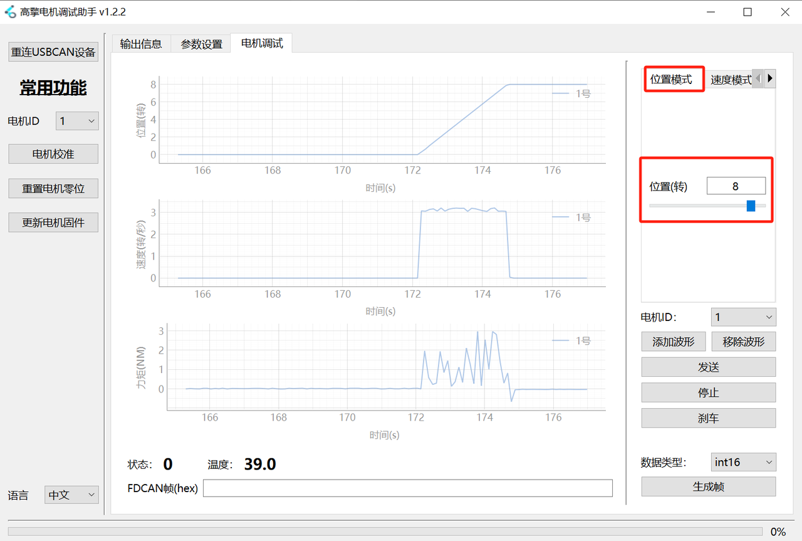

#### 速度模式

**说明：**

1. 电机以最大加速度加速到指定目标速度，可通过添加波形实时监测电机运行状态及波形数据。
2. 单位说明
    - 速度：转/秒（rps）
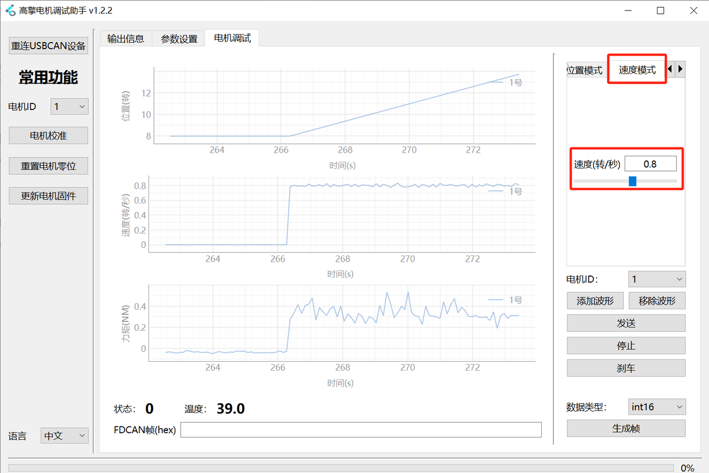

#### 力矩模式

**说明：**

1. 电机按照设定的目标力矩进行转动，可通过添加波形实时监测电机运行状态及波形数据。
2. 单位说明
    - 力矩：牛·米（N·m）

**注意：**

1. 若设置的力矩过小，电机可能无法转动。


#### 电压模式

**说明：**

1. 通过给定的 Q 相电压控制电机运行，可通过添加波形实时监测电机运行状态及波形数据。
2. 单位说明
    - Q 相电压：伏特（V）
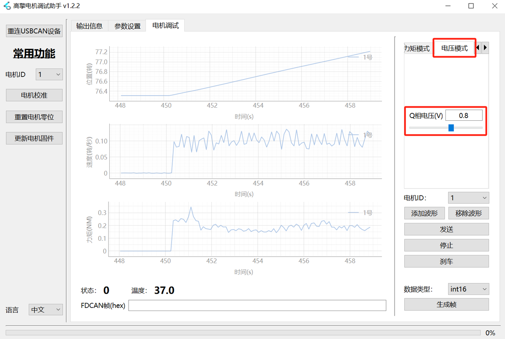

#### 电流模式

**说明：**

1. 通过给定的 Q 相电流控制电机运行，可通过添加波形实时监测电机运行状态及波形数据。
2. 单位说明
    - Q 相电流：安培（A）


#### 位置、速度、最大力矩模式

**说明：**

1. 电机以目标速度运动至指定的目标位置，同时限制最大输出力矩，可通过添加波形实时监测电机运行状态及波形数据。
2. 单位说明：
    - 位置：转（rev）
    - 速度：转/秒（rps）
    - 力矩：牛·米（N·m）

**注意：**

1. 该模式对输出力矩有限制，若设置的最大力矩过小，电机可能无法达到目标速度。


#### 梯形控制模式

**说明：**

1. 电机按照恒定加速度运动，实现先加速 → 匀速 → 减速的梯形速度控制，可通过添加波形实时监测电机运行状态及波形数据。
2. 单位说明：
    - 位置：转（rev）
    - 速度：转/秒（rps）
    - 加速度：转每秒平方（rps²）


#### 运控模式（MIT模式）

**说明：**

1. 电机输出力矩的计算公式为：

```c
输出力矩 = 位置偏差 * kp + 速度偏差 * kd + 前馈力矩
```

2. 模式用法说明
    1. 当 kp=0，kd=0 时，给定 tqe 即可实现给定扭矩输出。在该情况下，电机会持续输出一个恒定力矩。
    2. 当 kp=0，kd≠0 时，给定 vel 即可实现匀速转动。匀速转动过程中存在速度静差，另外 kd 不宜过大， kd 过大时会引起震荡。
    3. 当 kp≠0，kd=0 时，会引起震荡。即对位置进行控制时，kd 不能赋 0，否则会造成电机震荡，甚至失控。
    4. 当 kp≠0，kd≠0 时，有多种情况，这里下面简单介绍两种情况。
        - 当目标位置 pos 为常量，目标速度 vel 为0时，可实现定点控制，系统会使实际位置趋近于 pos，实际速度趋近于 0，最终静止在目标位置。
        - 当 pos 是随时间变化的连续可导函数时，同时 vel 是 pos 的导数，可实现位置跟踪和速度跟踪，即按照期望速度旋转期望角度。
3. 可通过添加波形实时监测电机运行状态及波形数据。
4. 单位说明：
    - 位置：转（rev）
    - 速度：转/秒（rps）
    - 力矩：牛·米（N·m）

**注意：**

1. 需要设置合适的 `kp` 和 `kd`，否则控制效果可能较差。
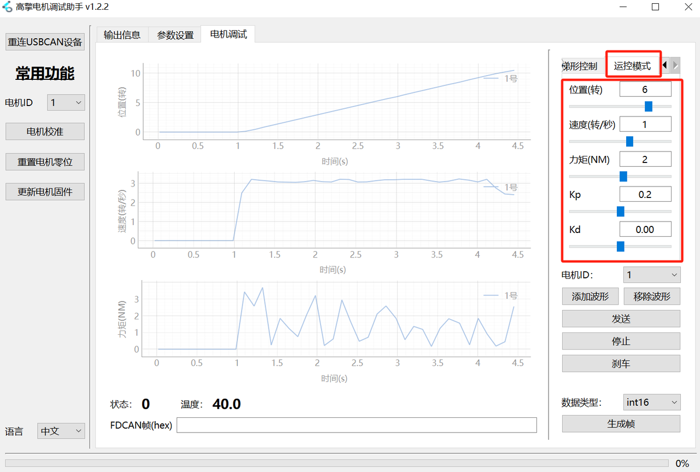

### 更新电机固件操作

1. 在参数设置页面找到读参数选项点击，可以看到电机型号。
    
    - **注意**：部分电机型号命名在不同版本有所不同，具体如下：

| 电机型号 | 减速比 | 固件 V3 版本 | 固件 V4 以上版本 |
| --- | --- | --- | --- |
| 3536 | 32 | 3536 | 3536_32 |
| 4438 | 16 | 4438_2 | 4438_30 |
| 5046 | 20 | 5046 | 5046_20 |
| 5047 | 9 | 5047_1 | 5047_9 |
| 5047 | 36 | 5047_2 | 5047_36 |
| 6056 | 8 | 6056 | 6056_8 |

2. 在主页位置点击更新电机固件选项
    
3. 找到固件文件位置，然后选择固件打开，然后等电机固件更新完成
    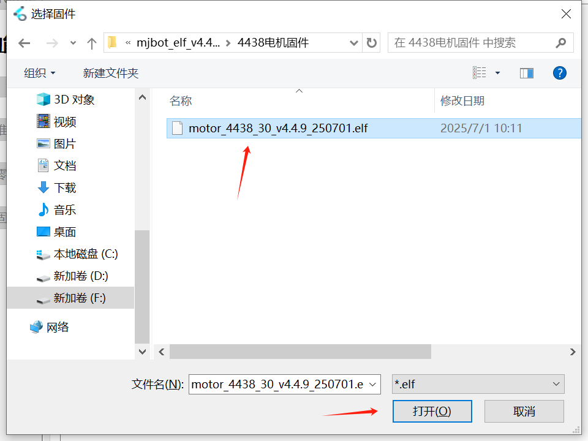

    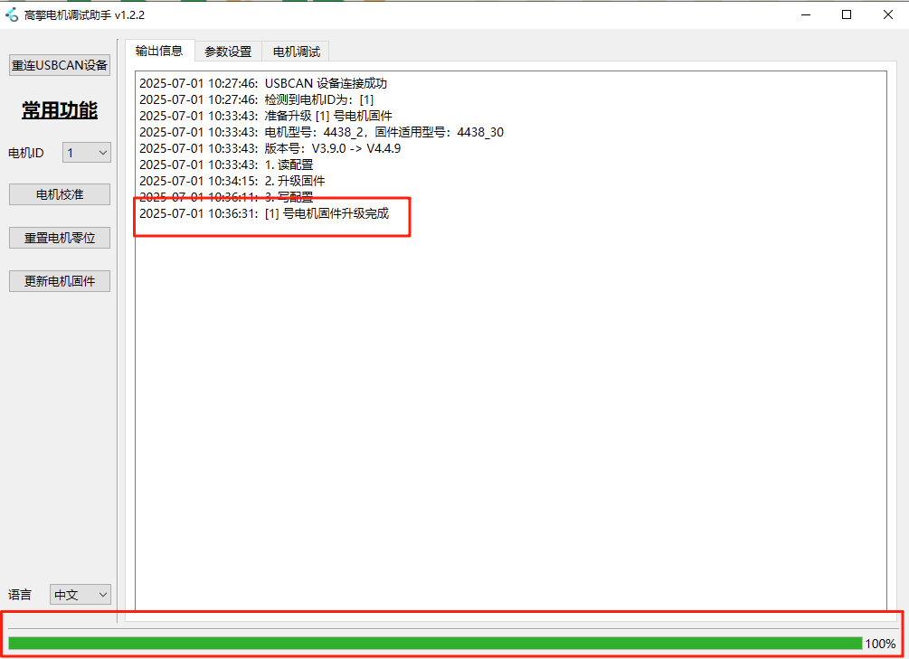

**注意事项：**

1. 选择的电机型号若与固件不匹配，则无法更新固件，并会提示报错。
    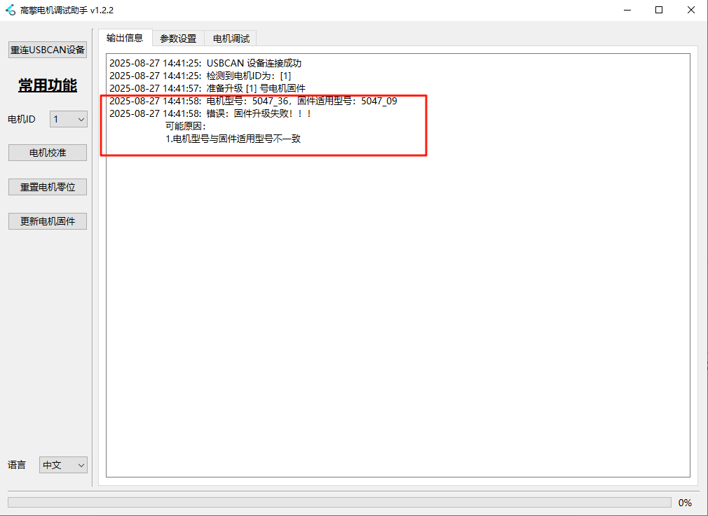
2. 进行更新固件操作时，请不要操作上位机和电机，注意不要断开电机电源，否则会导致**电机****损坏**。

### 生成帧说明

#### 使用说明

1. 生成的数据帧可以通过 CAN 通信设备发送给电机进行控制。
2. 完整协议说明请参考 [1.2 fdcan协议解析](./1.2-fdcan协议解析.md)，一般使用例程的控制函数进行控制电机，不需要自己研究和写电机协议进行控制电机。

#### FDCAN 数据帧使用

- 生成控制电机转 1 圈的`int16`的数据帧：`01000a05201027`
    
- 使用 CANPRO 进行数据帧发送，点击设备管理，启动设备，并选择 FDCAN 协议。
    
- 进行发送数据帧
    
    - 点击发送数据，选择普通发送。
    - 选择使用的 CAN 通道
    - 修改帧 ID 改为电机 ID，设置数据长度，将生成的数据帧写在此处。
    - 点击发送，在主页可以看到发送的数据帧，并且电机转动到 1 转位置。

#### CAN 数据帧使用

- 生成 CAN 数据帧控制电机进行 0.1 转/秒转动，数据帧为：`0707008090010080`**。**
    
- 使用 CANPRO 进行数据帧发送，点击设备管理，启动设备，并且选择 CAN 协议。
    
- 进行发送数据帧
    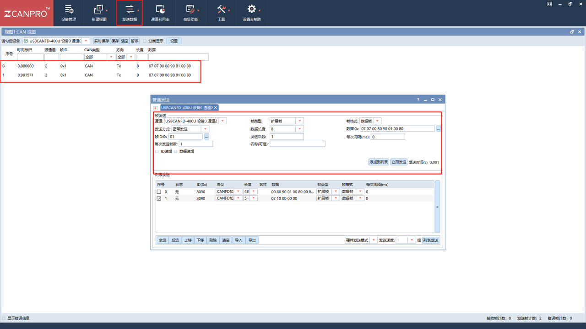
    - 点击发送数据，选择普通发送。
    - 选择使用的 CAN 通道
    - 修改帧 ID 改为电机 ID，设置数据长度，将生成的数据帧写在此处。
    - 点击发送，在主页可以看到发送的数据帧，并且电机进行转动。

## 使用技巧

### 检测 CAN 总线

#### 操作说明

##### 现象一

在连接电机后，并给电机上电出现连接电机时出现连接失败。


##### 现象二

查看电机波形时，提示电机断开连接。

1. 连接电机与上位机，并点击电机调试，进入电机调试界面
    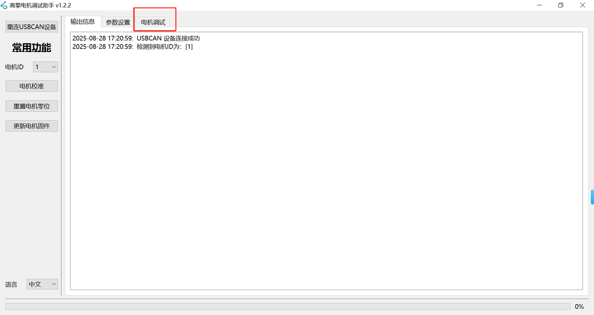

    
2. 点击添加波形，查看电机的位置、速度、力矩的数据波形
    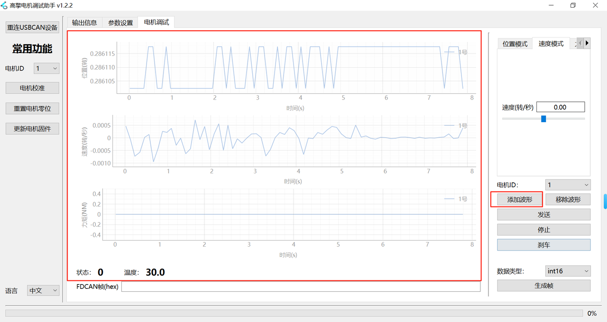
3. 判断结果：
- 生成波形后，等待并观察一段时间，如果上位机提示**电机断开连接**，表示 CAN 总线接触不良或者断开了。
    <br>CAN信号断开

**注意：** 在上位机中 CAN 通信波特率是 1MHz，而在程序中为 5MHz，相比较上位机控制电机，使用程序控制电机更容易受到干扰。因此，即使在上位机中检测到 CAN 总线信号正常，也并不代表通信完全可靠，也存在 CAN 总线有接触不良和受到干扰的情况。

## 常见问题

### 基本问题

1. 调试助手的 pid 调节是什么环

答：是电机的位置环，我们电机没有速度环

1. 上位机的 fdcan 的频率是多少

答：1MHZ 的波特率

1. 上位机给的速度上限是 5.0，为什么转不到给定速度

答：速度还有力矩等数据要查看电机的产品介绍，电机速度和力矩有最大值，上位机给大于电机最大值的数据只能控制电机运行最大速度或者最大力矩。

### 故障问题

#### 调试助手显示无法检测到 USBCAN

如下图：

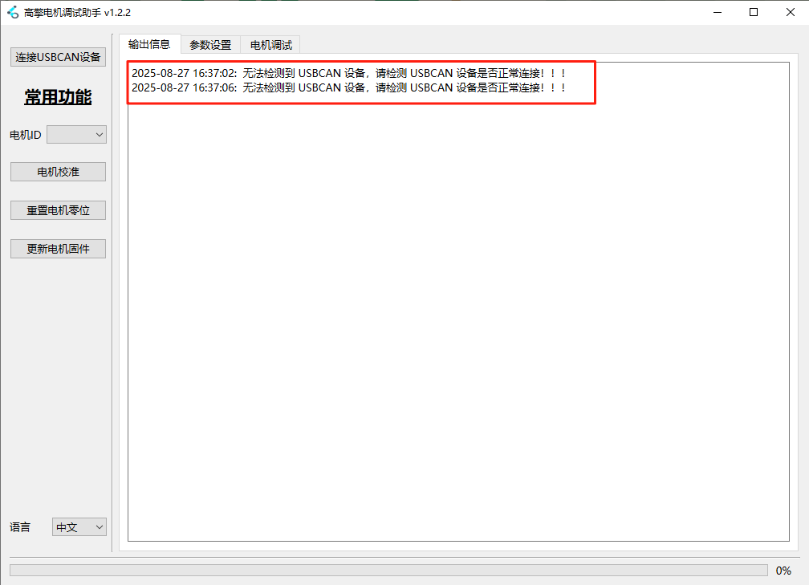

**原因：**

- 调试助手无法连接到 USB 转 FDCAN 小板
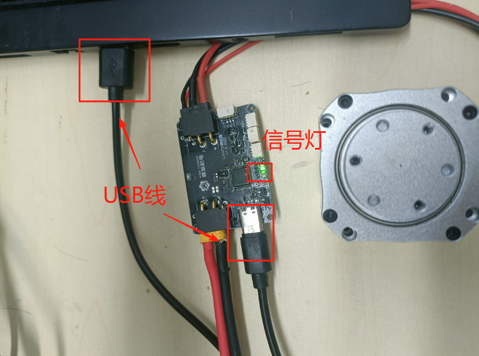

**解决方法：**

1. 检查 USB 转 FDCAN 小板的 LED 灯是否亮起。
2. 重新插拔 USB 线，点击`重连USBCAN设备`。
3. 更换 USB 线，点击`重连USBCAN设备`。

#### 调试助手显示无法检测电机

**如下图：**


**原因：**

- 无法连接到电机。
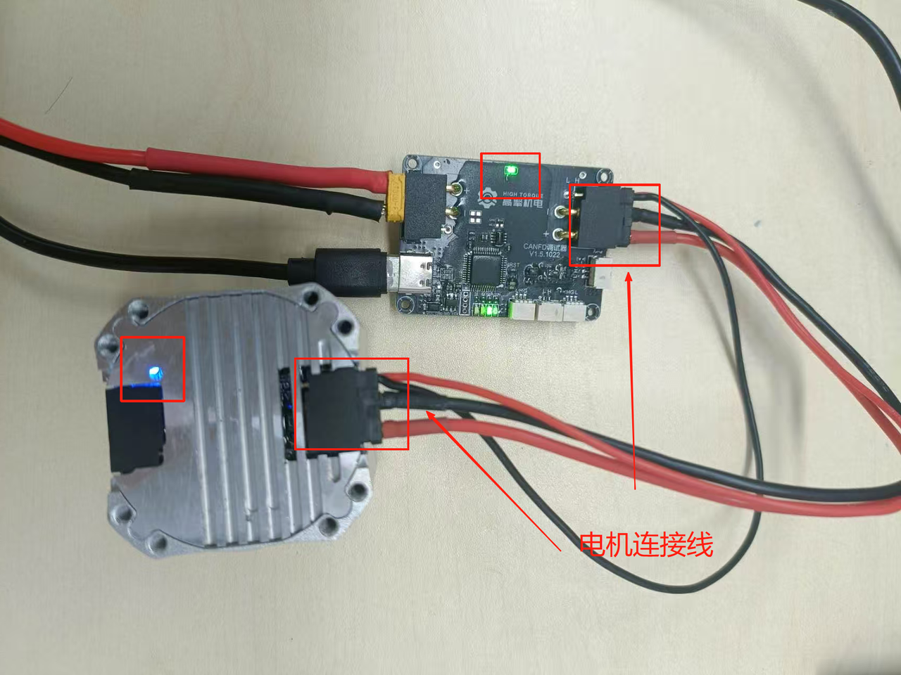

**解决方法：**

- 检查电机底部和 USB 转 FDCAN 小板信号灯是否正常亮起。
- 重新启动电源，给电机重新上电，点击`重连USBCAN设备`。
- 重新插拔电机连接线，点击`重连USBCAN设备`。
- 替换电机连接线，点击`重连USBCAN设备`。

#### 连接多个电机，显示连接电机个数不对。

**如下图：**


**原因：**

- 有电机没有识别到


**解决方法：**

1. 检查没有连接的电机底部信号灯是否正常亮起。
2. 重新启动电源，给电机重新上电，点击`重连USBCAN设备`。
3. 重新插拔电机连接线，点击`重连USBCAN设备`。
4. 替换电机连接线，点击`重连USBCAN设备`。

#### 成功连接电机后，进入到电机调试界面的位置模式，点击添加波形，发送位置为 5 转，电机启动一会后断电报错


问题：这个模式下在停止的时候是按照限制电流反向输出力矩实现急刹的，在停止一瞬间电流变化很大，如果电源反应不过来的话，就会导致瞬间掉电报错。

解决方案：

    - 调小电流限制，或者在电机线中并联一个电容
    
    - 推荐使用梯形控制模式
