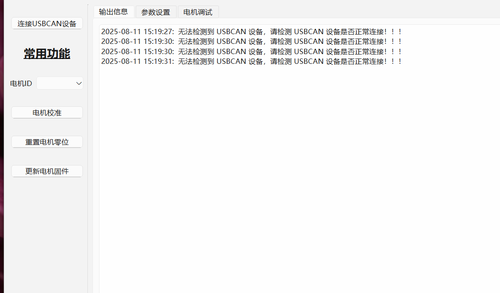
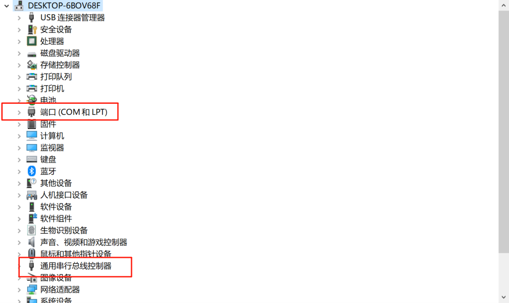
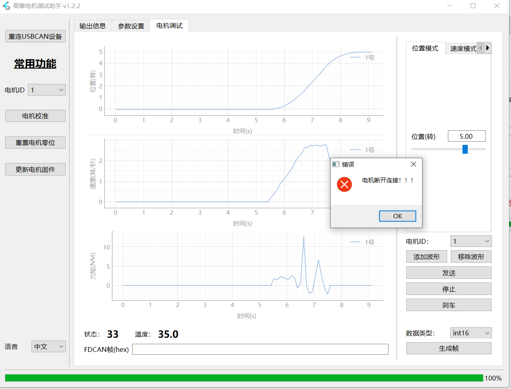

# 2.3 高擎电机调试助手使用问题

1. 上位机无法识别usb转fdcan
    
    - 问题描述：使用usb线连接电脑，打开上位机连接usbcan设备，无法检测到USBCAN设备，查看设备管理器在通用串行总线控制器处可以看到usb-fdcan设备,而端口处没有识别设备
        
    - 问题：系统驱动问题，是电脑驱动进行过修改，导致无法连接usb转fdcan调试板
2. 成功连接电机后，进入到电机调试界面的位置模式，点击添加波形，发送位置为5转，电机启动一会后断电报错
    

    问题：这个模式下在停止的时候是按照限制电流反向输出力矩实现急刹的，在停止一瞬间电流变化很大，如果电源反应不过来的话，就会导致瞬间掉电报错。

    解决方案：

        - 调小电流限制，或者在电机线中并联一个电容
        
        - 推荐使用梯形控制模式
