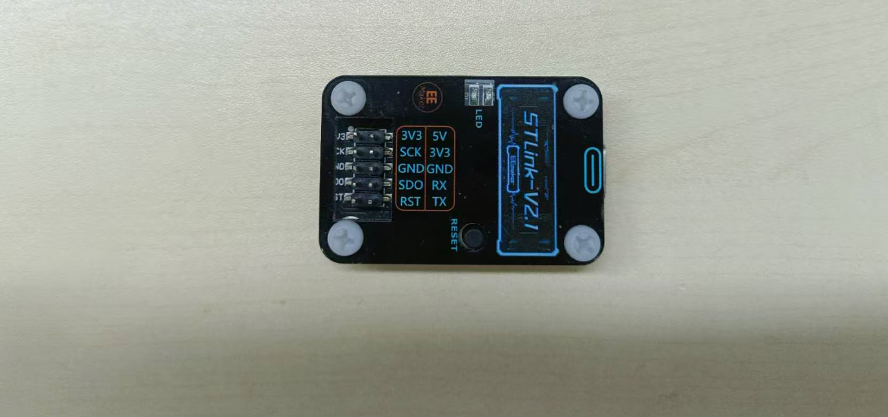
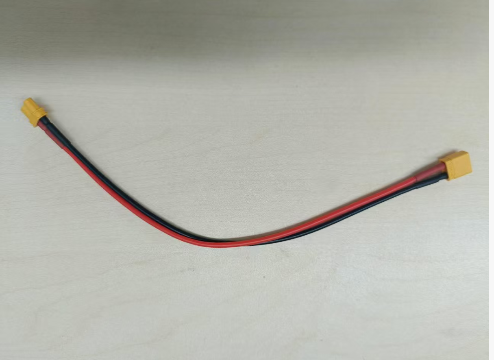
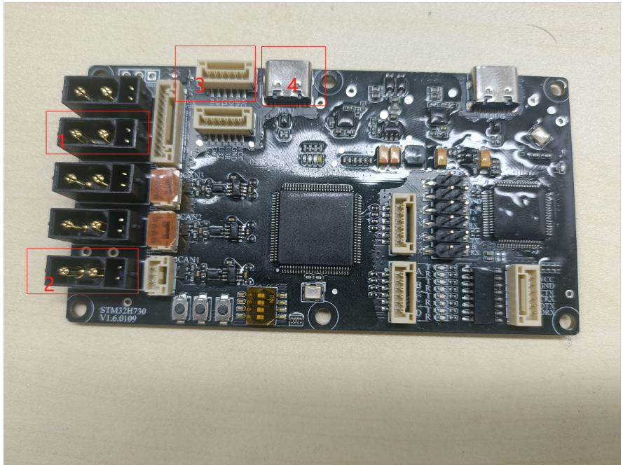
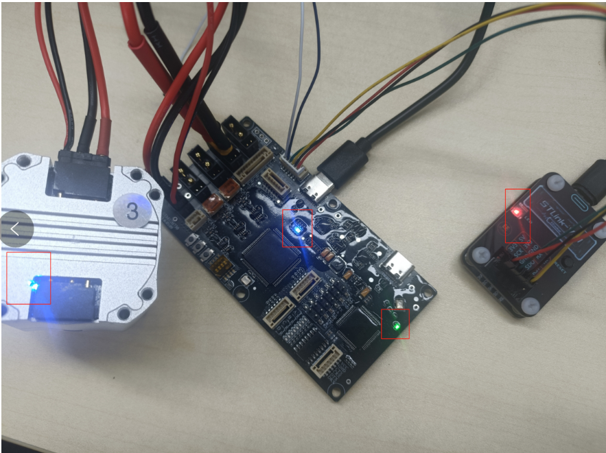
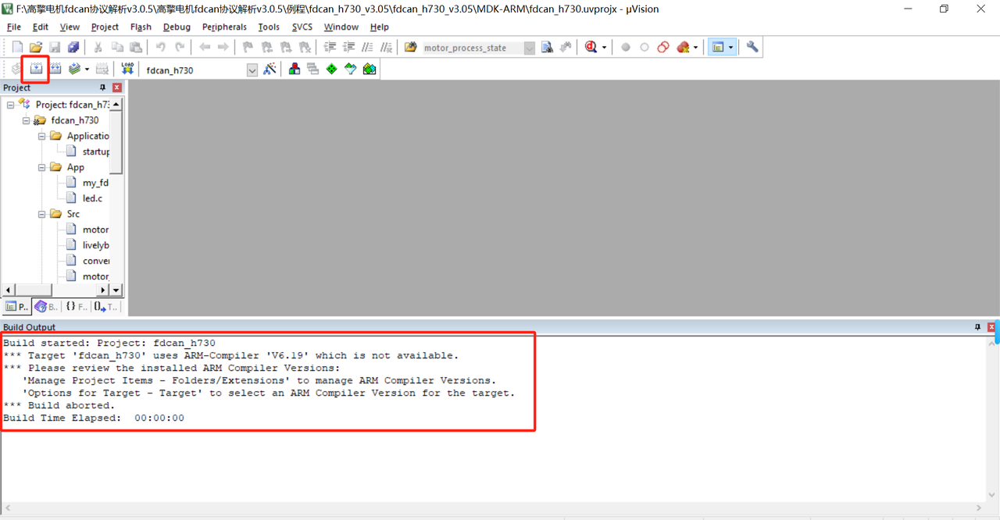
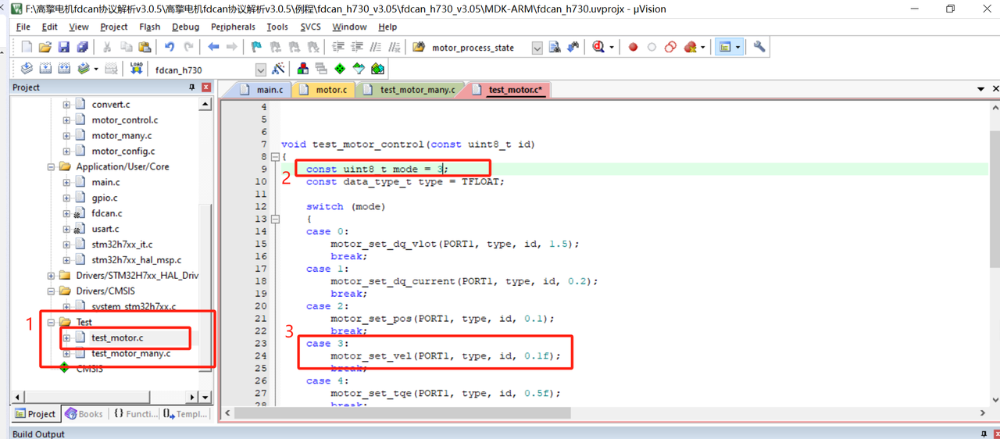
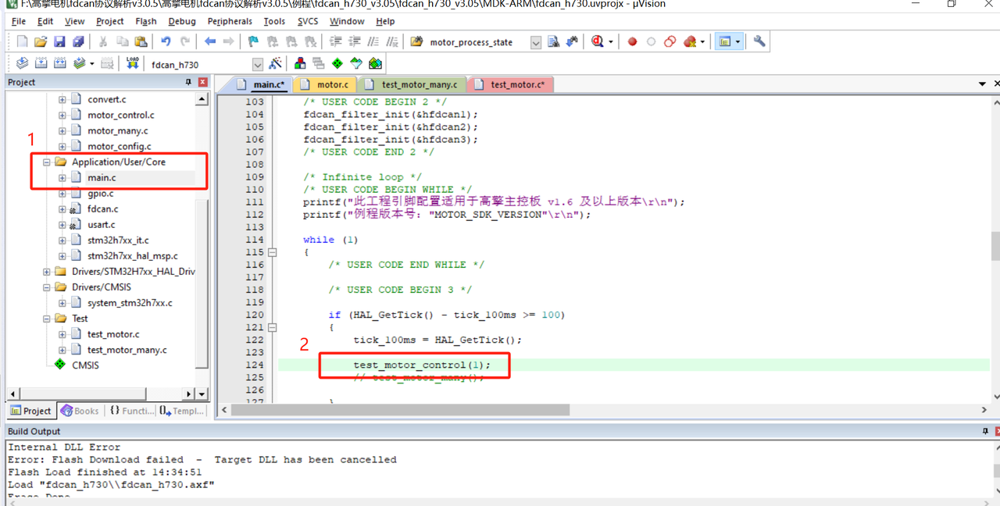
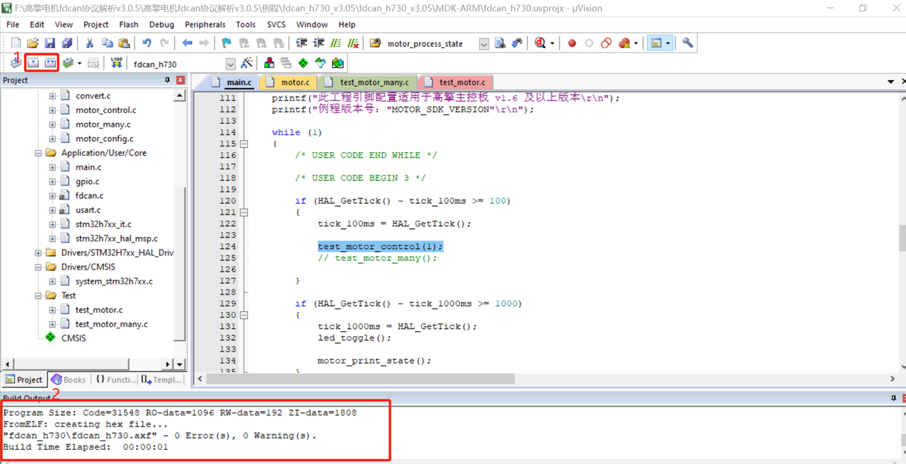
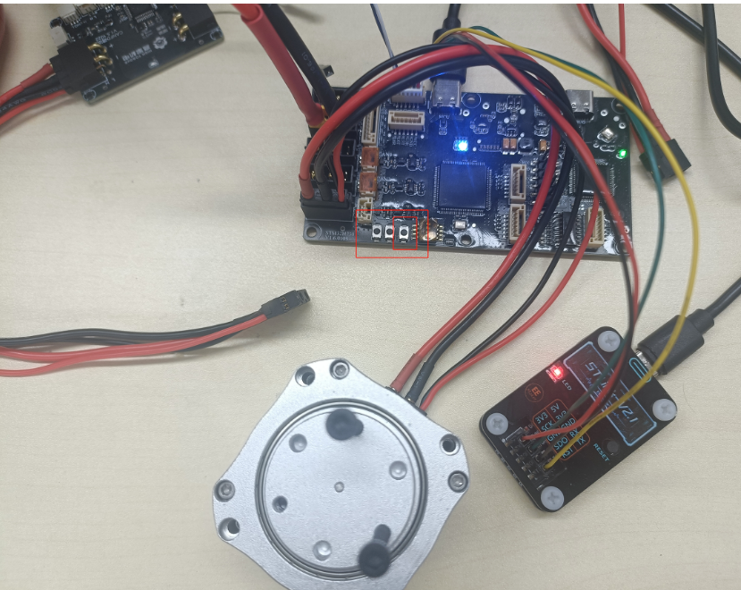

# 3.1 快速上手

## 一、硬件准备

- 直流稳压电源一个
- STM32H730VBT6主控板一个
- USB转FDCAN板一个
- USB线2根
- 高擎电机（此处为4438-30电机）
- 下载器一个（此处为st-link下载器，可根据自身情况选择）
- 5P段子线一根
- XT30(2+2)电机线材
- TX30电源线材一根

STM32H730VBT6主控板

st-link下载器

TX30线材

 XT30(2+2)线材

5P端子线

USB转FDCAN板

USB数据线

4438型号电机

## 二、修改ID

使用调试板连接电机并打开调试助手（具体可参考调试助手快速使用[2.1 快速上手](https://lingdongfangcheng.feishu.cn/wiki/BwSPwpjyLimtXTkTt0JczYOhned)）

1. 点击参数设置。
2. 点击3处的读参数，并且查看2处的电机ID。
3. 对电机ID进行修改成1，并且点击写参数保存信息。

注：本次使用电机ID为1的电机。实际使用可根据情况设置电机ID

## 三、接线

1. 连接电源，如右图所示
2. 连接电机
3. 连接st-link下载器
- VCC——VCC  3.3v电源
- GND——GND 地线
- DIO——SDO DIO信号线
- CLK——SCK CLK时钟线
- U10T和U10K不接
1. USB接口接电脑给单片机供电
2. st-link上的USB线接电脑进行下载程序

1. 供电并检查状态

（1）通讯板中间蓝灯闪烁，右边绿灯亮起，st-link红灯亮起，电机底部蓝灯亮起

## 四、下载并编译运行程序

前往高擎机电官网-服务与支持-下载中心-关节模组处下载FDCAN协议解析说明（包含h730的可用工程代码），如果使用CAN例程，使用方式与FDCAN例程相同，只需要下载CAN例程即可。

下载地址：

[FDCAN例程下载地址](https://www.hightorque.cn/%e3%80%90%e8%b5%84%e6%96%99%e4%b8%8b%e8%bd%bd%e3%80%91can%e5%8d%8f%e8%ae%ae%e8%a7%a3%e6%9e%90%e8%af%b4%e6%98%8e)

[CAN例程下载地址](https://www.hightorque.cn/%e9%ab%98%e6%93%8e%e6%9c%ba%e7%94%b5-can%e5%8d%8f%e8%ae%ae%e8%a7%a3%e6%9e%90%e8%af%b4%e6%98%8e)

在该文件下含有我们的示例程序

在对应文件中找到fdcan_h730,并双击打开。（如果你要使用这个示例程序请先安装keil）

### 1.程序编译

打开程序进行编译程序

点击上方编译键，如果运行结果不为"fdcan_h730\fdcan_h730.axf" - 0 Error(s), 0 Warning(s).

而是如下图所示

点击1处，再在2处选择编译器，选择您有的编译器（此处我使用的是V6.15），再点击ok，确认保存

1.双击main.c进入主程序

2.点击编译键进行重新编译

3.编译通过在此处会显示"fdcan_h730\fdcan_h730.axf" - 0 Error(s), 0 Warning(s).此时表示程序编译成功

**注意**：Error表示错误此项必须为0，Warning会因为其他原因不为0，这个是可以接受的。

### 2.程序修改

（1）点击Test文件，在该文件下点击test_motor.c

（2）在test_motor.c程序中找到mode，将其值改成3，表示为速度模式（此次实验为测试通讯板是否正常。开发时可自选模式）

（3）3处对应为mode对应的控制模式

(1) 点击`Application/User/Core`文件下的`main.c`程序

(2)在`int main（void）`主程序里面的`while`循环里面的`test_motor_control(1);`把（）里面的数字改成1（此处的数字对应电机ID，正常使用时确认电机ID正确）

修改程序后请重新编译程序并确保其通过编译。

### 3.下载程序

点击1处的下载键，如果弹出2中的问题

（1）我们点击1处的设置键，弹出下图界面

（2）点击2处的`Debug`

（3）在3处选择您使用的下载器(此处使用为st-link)

（1）点击1处下载键

（2）编译框显示下载成功

点击通讯板的复位键，此时电机转动。

