# 3.2 FDCAN 例程详细说明

### 介绍

这是一个用于控制高擎机电电机的软件接口包。

通过这个接口包，用户可以方便地与高擎机电的电机进行通信，获取电机的状态信息，并控制电机的动作。

### 软件结构介绍

- **App：硬件**
    - `led`：负责 LED 灯的控制。
    - `my_fdcan`：与 FDCAN 硬件相关的功能实现。
- **Src：应用**
    - `convert`：负责单位转换，包括电机的位置、速度、加速度、力矩、电压、电流、PID 以及**转（rev）、弧度（rad）、度（°）** 等单位的转换。
    - `livelybot_fdcan`：实现电机底层协议，处理原始数据。
    - `motor_control`：用于单电机控制，支持 16 种电机控制模式。
    - `motor_many`：用于一拖多模式的电机控制，支持 12 种电机控制模式。
    - `motor_config`：负责电机设置相关功能，包括带反馈的电机零位重置和电机设置保存。
    - `motor`：包含 FDCAN 接口通道映射、电机类型定义以及电机返回信息解析（包括 FDCAN 中断函数 `HAL_FDCAN_RxFifo0Callback` 的实现），***移植和使用的时候主要就是修改这个部分***。
- **test：测试**
    - `test_motor`：包含单电机函数使用例程和一些简单的控制。
    - `test_motor_many`：包含一拖多模式的函数使用例程和一些简单的控制。

### 移植和配置说明

- 如果没有移植需求可直接跳到 3. 2 配置 部分。
- 操作如下
    - 将 `App` 文件夹下的 `my_fdcan` 文件夹和 `Src` 文件夹下的 `convert` 、`livelybot_fdcan` 、`motor_control` 、`motor_many`、`motor_config` 和 `motor` 5 个文件夹复制到新工程。
    - 将 `my_fdcan`、`convert` 、`livelybot_fdcan` 、`motor_control` 、`motor_many`、`motor_config` 和 `motor` 6 个文件夹都加入到头文件路径。

#### 移植指南

具体移植操作如下

##### 新建工程

1. 创建项目：打开 STM32CubeMX，点击 `New Project`。
2. 选择芯片：在芯片选择器中，输入您使用的单片机型号（例程使用 STM32H730VBT6），双击选中该型号。
3. 关键系统配置：在 `Pinout & Configuration` 选项卡中，进入 `System Core` -> `SYS` 菜单：
    - 将 `Debug` 选项设置为 `Serial Wire`。此处是为了通过 ST-Link 等进行调试和烧录。
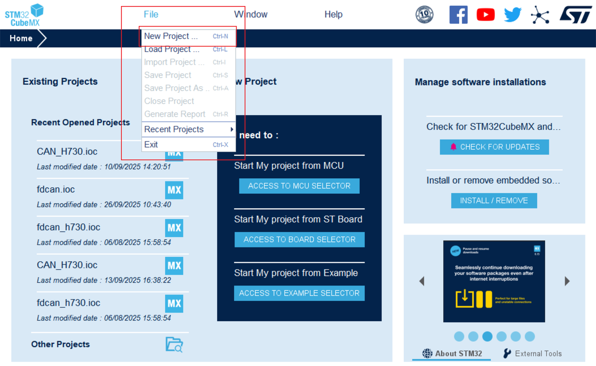


##### 时钟与 FDCAN 配置

本部分是移植成功的关键，请严格按照步骤操作。

###### 配置外部高速时钟 (HSE)

为了确保系统时钟准确稳定，需要配置外部高速时钟源。

1. 在左侧分类中找到 System Core > RCC（复位和时钟控制）。
2. 在右侧的 RCC Mode and Configuration 模式下，找到 High Speed Clock (HSE) 选项。
3. 将其从默认的 "Disable" 修改为 Crystal/Ceramic Resonator。
    - 作用：这告诉单片机，我们将使用外接的晶振作为高速时钟源，而不是使用芯片内部的 RC 振荡器。外部晶振能提供更精确的时钟频率，是整个系统（包括 FDCAN 通信波特率）稳定的基础。


###### 配置时钟树

1. 进入 `Clock Configuration` 选项卡。
2. 根据芯片情况设置主频率，此处配置为 480MHZ。
3. **找到并确认 FDCAN 的时钟源频率为 80MHz。此频率是计算 FDCAN 通信波特率的基础，必须相同。**
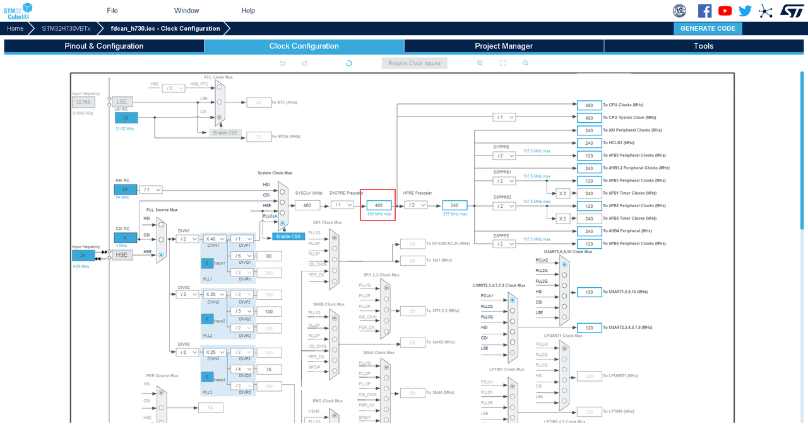

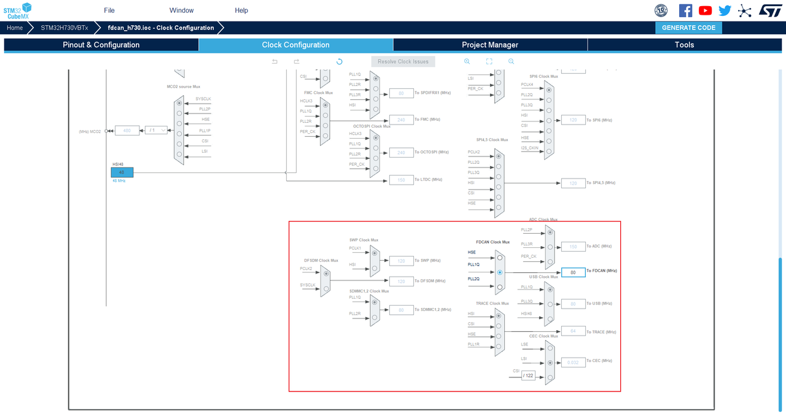

###### 配置 FDCAN

1. 在 `Connectivity` 菜单下，启用您计划使用的所有 FDCAN 模块（如 FDCAN1, FDCAN2, FDCAN3）。
2. 对每个启用的 FDCAN 模块，根据下表进行参数配置（此配置基于 80MHz 时钟，可实现仲裁段 1Mbps，数据段 5Mbps）：

> 飞书/wiki 中该表为 **嵌入电子表格**（`sheet` 块），Docx `client_vars` 导出不会展开；下表与 CubeMX 中 FDCAN 参数一致。

| 参数分类 | 参数名称 | 设定值 | 说明 |
| --- | --- | --- | --- |
| 基本参数 | Frame Format | FD mode with BitRate Switching | 启用比特率切换 |
| 基本参数 | Mode | Normal mode | 模式：Normal / FD |
| 基本参数 | Auto Retransmission | Enable | 自动重传 |
| 基本参数 | Transmit Pause | Disable | 发送暂停 |
| 基本参数 | Protocol Exception | Enable | 协议异常处理 |
| 基本参数 | Nominal Sync Jump Width | 8 | 仲裁段同步跳转宽度 |
| 基本参数 | Data Prescaler | 2 | 数据段预分频 |
| 基本参数 | Data Sync Jump Width | 2 | 数据段同步跳转宽度 |
| 基本参数 | Data Time Seq1 | 5 | 数据段相位缓冲段1 |
| 基本参数 | Data Time Seq2 | 2 | 数据段相位缓冲段2 |
| 基本参数 | Message Ram Offset | 0 | 消息 RAM 的起始地址偏移量 |
| 基本参数 | Std Filters Nbr | 0 | 标准ID过滤器数量 |
| 基本参数 | Ext Filters Nbr | 0 | 扩展ID过滤器数量 |
| 基本参数 | Rx Fifo0 Elmts Nbr | 10 | Rx FIFO0 元素数量 |
| 基本参数 | Rx Fifo0 Elmt Size | 64 bytes | FIFO0 元素大小 |
| 基本参数 | Rx Fifo1 Elmts Nbr | 0 | Rx FIFO1 元素数量 |
| 基本参数 | Rx Fifo1 Elmt Size | 64 bytes | FIFO1 元素大小 |
| 基本参数 | Rx Buffers Nbr | 0 | Rx 缓冲区数量 |
| 基本参数 | Rx Buffer Size | 64 bytes | Rx 缓冲区大小 |
| 基本参数 | Tx Events Nbr | 0 | Tx 事件数量 |
| 基本参数 | Tx Buffers Nbr | 0 | Tx 缓冲区数量 |
| 基本参数 | Tx Fifo Queue Elmts Nbr | 4 | Tx FIFO 队列元素数量 |
| 基本参数 | Tx Fifo Queue Mode | FiFO mode | Tx 队列模式 |
| 基本参数 | Tx Elmt Size | 64 bytes | Tx 元素大小 |
| 时钟校准 | Clock Calibration | Disable | 时钟校准开关 |
| 位定时参数 | Nominal Prescaler | 2 | 仲裁段预分频 |
| 位定时参数 | Nominal Time Quantum | 25.0 ns | 仲裁段时间量子 |
| 位定时参数 | Nominal Time Seq1 | 31 | 仲裁段相位缓冲段1 |
| 位定时参数 | Nominal Time Seq2 | 8 | 仲裁段相位缓冲段2 |
| 位定时参数 | Nominal Time for one Bit | 1000 ns | 仲裁段每比特时间 |
| 位定时参数 | Nominal Baud Rate | 1000000 bit/s | 仲裁段波特率 |

3. 开启中断：对每个 FDCAN 模块，进入 `NVIC Settings` 标签页，勾选使能 `FDCANx Interrupt 0`（x 为 CAN 编号）。这是接收电机数据的必要条件，至少要开启两个FDCAN通道的中断。


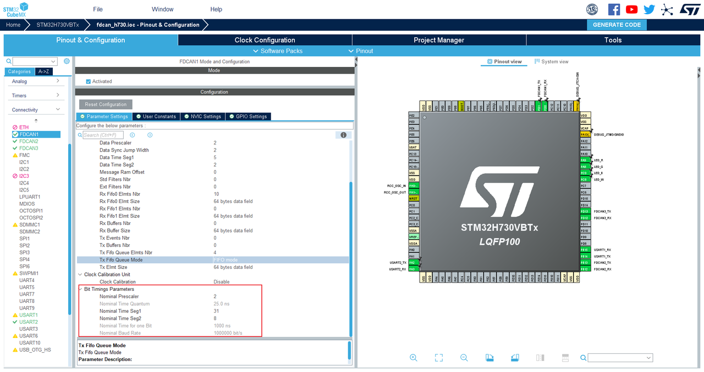

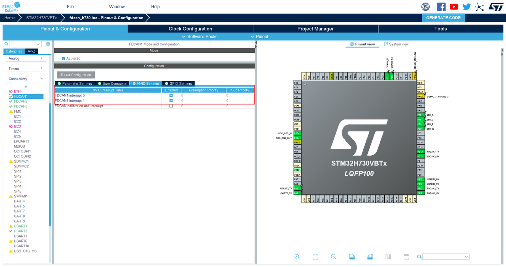

4. 可在程序中的`fdcan.c`查看配置情况

```cpp
hfdcan1.Instance = FDCAN1;
    hfdcan1.Init.FrameFormat = FDCAN_FRAME_FD_BRS;
    hfdcan1.Init.Mode = FDCAN_MODE_NORMAL;
    hfdcan1.Init.AutoRetransmission = ENABLE;
    hfdcan1.Init.TransmitPause = DISABLE;
    hfdcan1.Init.ProtocolException = ENABLE;
    hfdcan1.Init.NominalPrescaler = 2;
    hfdcan1.Init.NominalSyncJumpWidth = 8;
    hfdcan1.Init.NominalTimeSeg1 = 31;
    hfdcan1.Init.NominalTimeSeg2 = 8;
    hfdcan1.Init.DataPrescaler = 2;
    hfdcan1.Init.DataSyncJumpWidth = 2;
    hfdcan1.Init.DataTimeSeg1 = 5;
    hfdcan1.Init.DataTimeSeg2 = 2;
    hfdcan1.Init.MessageRAMOffset = 0;
    hfdcan1.Init.StdFiltersNbr = 0;
    hfdcan1.Init.ExtFiltersNbr = 0;
    hfdcan1.Init.RxFifo0ElmtsNbr = 10;
    hfdcan1.Init.RxFifo0ElmtSize = FDCAN_DATA_BYTES_64;
    hfdcan1.Init.RxFifo1ElmtsNbr = 0;
    hfdcan1.Init.RxFifo1ElmtSize = FDCAN_DATA_BYTES_64;
    hfdcan1.Init.RxBuffersNbr = 0;
    hfdcan1.Init.RxBufferSize = FDCAN_DATA_BYTES_64;
    hfdcan1.Init.TxEventsNbr = 0;
    hfdcan1.Init.TxBuffersNbr = 0;
    hfdcan1.Init.TxFifoQueueElmtsNbr = 4;
    hfdcan1.Init.TxFifoQueueMode = FDCAN_TX_FIFO_OPERATION;
    hfdcan1.Init.TxElmtSize = FDCAN_DATA_BYTES_64;
```

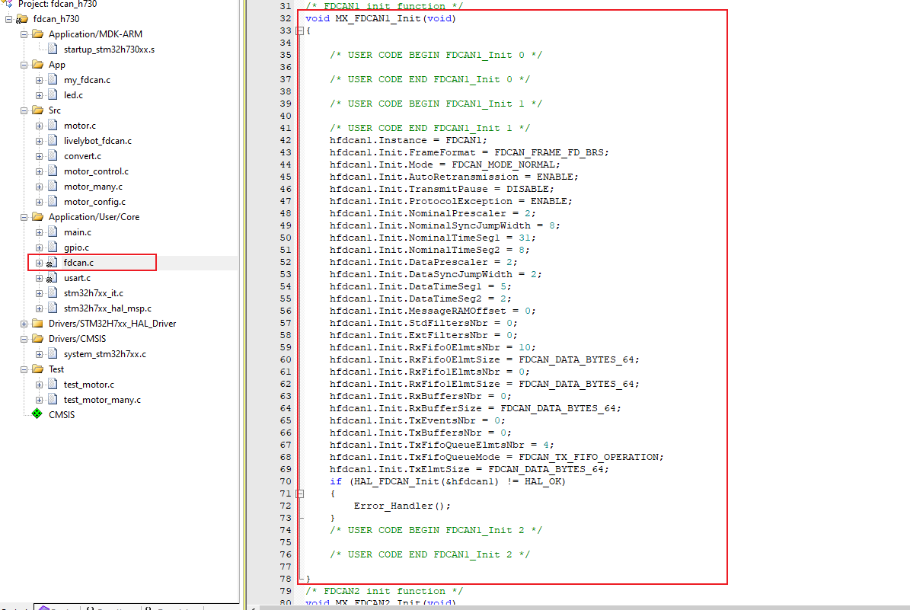

###### 配置其他外设（可选）

可根据您的项目需求，配置串口、LED GPIO 等外设。例程中开启了相关功能供参考。

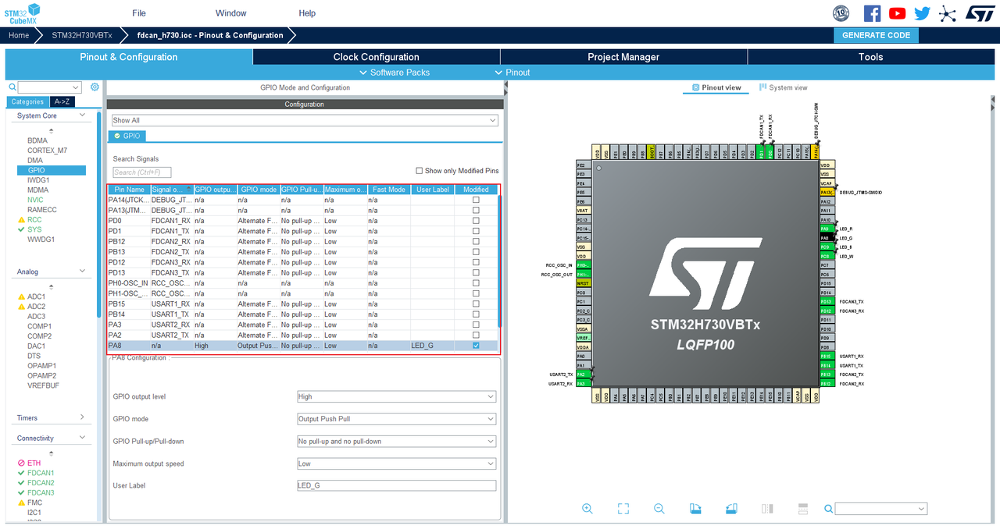

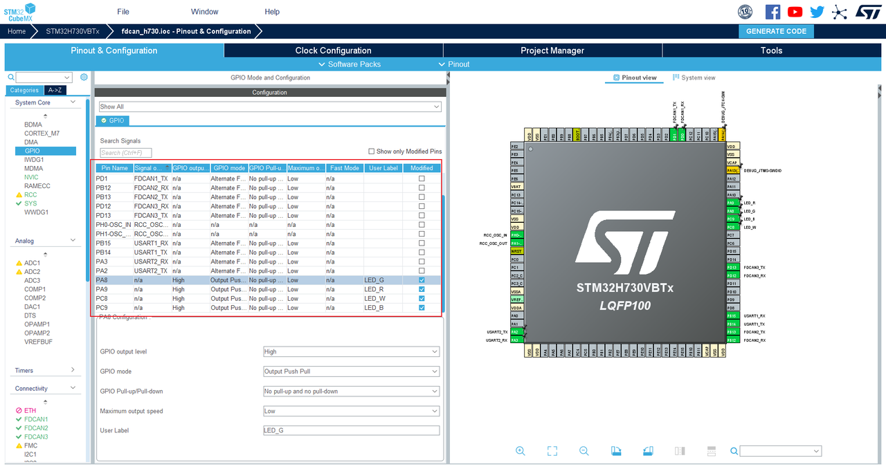

##### 生成代码与文件移植

###### 生成代码：

1. 配置生成选项
- 进入 `Project Manager` -> `Code Generator` 页面进行关键设置：
    - 取消勾选 `Generate peripheral initialization as a pair of '.c/.h' files per peripheral`。此设置能将所有外设初始化代码整合到 `main.c` 中，极大简化项目结构，避免产生过多零散文件。
    - 务必勾选 `Keep User Code when re-generating`。这是最重要的设置，可以保护您在特定注释标签（`/* USER CODE BEGIN */`）内编写的代码在重新生成时不被覆盖。
- 进入 `Project Manager` -> `Project` 选项卡，为项目命名并选择保存路径。
    - 在 `Toolchain / IDE` 选项中选择您使用的 IDE（如 `MDK-ARM`）。
1. 生成项目文件
完成设置后，回到 `Project` 页面，检查项目路径和 IDE 选项无误，点击 GENERATE CODE 按钮生成完整的工程代码。


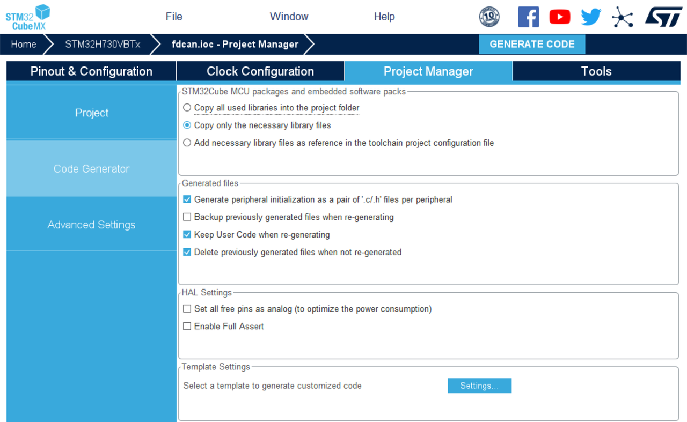

###### 文件移植

- 将以下文件夹从原始软件包目录完整复制到您新生成的 STM32 工程根目录下：

```bash
├── App/
│   └── my_fdcan/           # 硬件抽象层 (HAL)
├── Src/
│   ├── convert/            # 单位转换
│   ├── livelybot_fdcan/    # 底层协议处理
│   ├── motor_control/      # 单电机控制
│   ├── motor_many/         # 一拖多控制
│   ├── motor_config/       # 电机设置（如零位重置）
│   └── motor/              # 【核心】电机类型定义、通信映射、数据解析
└── test/                   # （建议复制，供参考）
    ├── test_motor/         # 单电机使用例程
    └── test_motor_many/    # 一拖多使用例程
```

- （建议复制）将 `test/test_motor` 和 `test/test_motor_many` 文件夹也复制到工程中，作为使用范例参考。


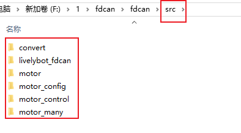


###### 添加头文件路径：

- 在 IDE（如 Keil MDK）中打开工程，进入 `Options for Target` -> `C/C++` 选项卡。
- 在 `Include Paths` 中，添加以下所有路径（请仔细核对，确保路径正确）：

```xml
.\App\my_fdcan
.\Src\convert
.\Src\livelybot_fdcan
.\Src\motor_config
.\Src\motor_control
.\Src\motor_many
.\Src\motor
.\test\test_motor
.\test\test_motor_many
```


###### 添加源文件到工程

1. 在 IDE 的项目管理窗口中，创建三个新的文件组（Group），分别命名为 `App`, `Src`, 和 `Test`。
2. 将对应的源文件（`.c` 文件）拖放或添加到相应的组中：
    - `App` 组：添加 `my_fdcan.c`、`led.c(不是必要的)`。
    - `Src` 组：添加 `motor.c`, `livelybot_fdcan.c`, `convert.c`, `motor_control.c`, `motor_many.c`, `motor_config.c`。
    - `Test` 组（可选）：添加 `test_motor.c`, `test_motor_many.c` 作为参考例程。
3. 将对应的源文件添加到各自的组中。添加成功后，您可以在 IDE 的项目管理器界面中清晰地看到完整的、按功能模块分组的工程文件结构。

```xml
my_fdcan.c
convert.c
livelybot_fdcan.c
motor_control.c
motor_many.c
motor_config.c
motor.c
（可选）test_motor.c 和 test_motor_many.c
```

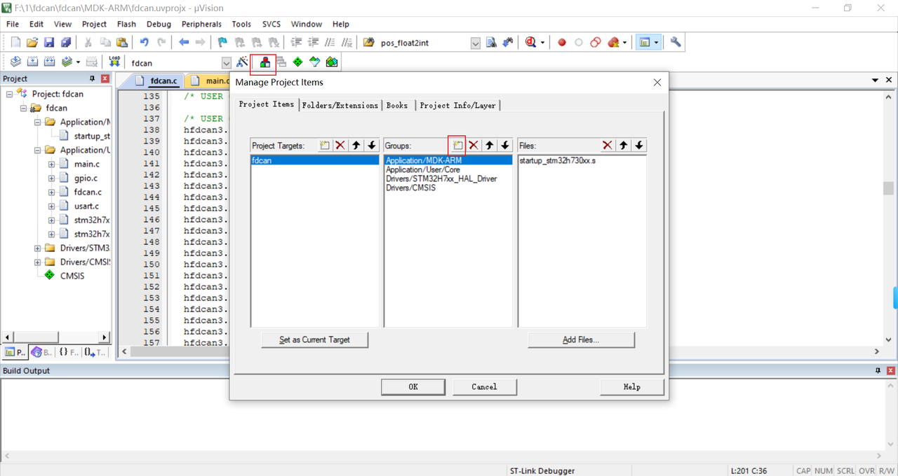

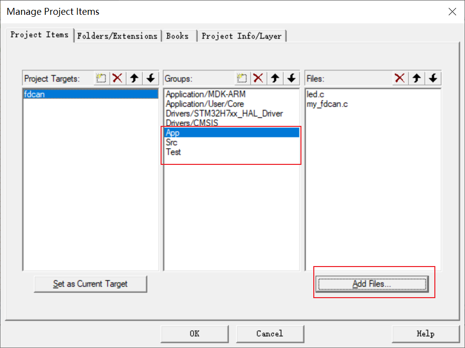

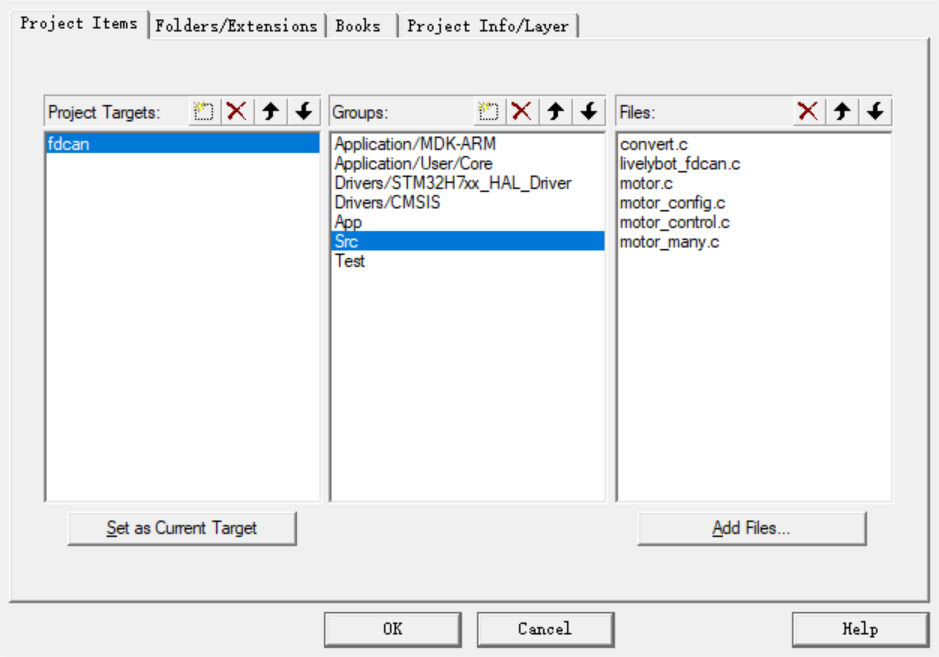

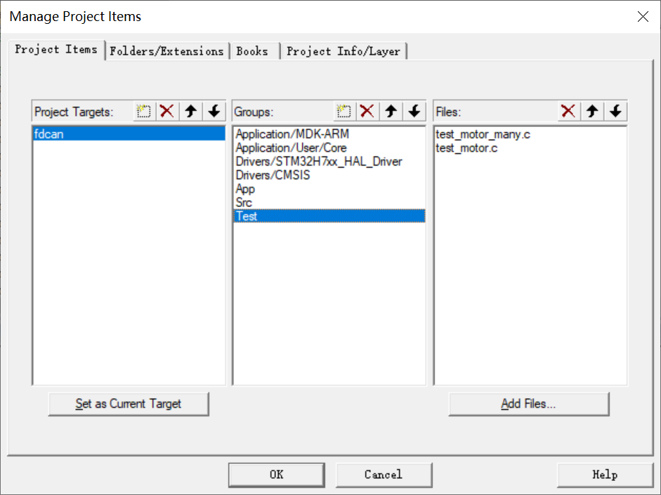

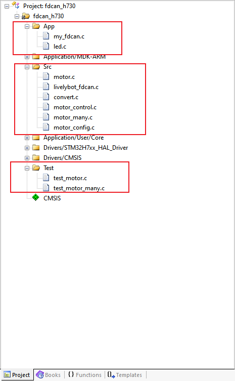

###### 在项目中包含头文件

在您的主程序文件（如`main.c`）中，包含必要的头文件：

```text
#include "motor.h"
#include "motor_control.h"
#include "motor_many.h"
#include "motor_config.h"

#include "test_motor.h"
#include "test_motor_many.h"
```

###### 修改报错宏：

1. 在 `convert. h` 文件中，有用于检查某些配置或使用错误的宏，默认使用 `led_toggle_err` 所有 LED 同时闪烁报错，可根据需要自行修改。
2. `#include "led.h"` 这里引入 led 头文件只为使用 `led_toggle_err` 函数，如不需要直接删除即可。

```text
#include "led.h"
#ifdef  LED_ERR_FLAG  // 这个宏定义在 led.h 中
#define  MOTOR_ERR    led_toggle_err  // 所有 led 闪烁
#else
static inline void MOTOR_ERR(void) {}
#endif
```

1. 编辑成功，移植完成。

###### my_fdcan 移植文件说明

1. 发送

```c
FDCAN_TxHeaderTypeDef TxHeader =
{
    .TxFrameType = FDCAN_DATA_FRAME,
    .ErrorStateIndicator = FDCAN_ESI_ACTIVE,
    .BitRateSwitch = FDCAN_BRS_ON,
    .FDFormat = FDCAN_FD_CAN,
    .TxEventFifoControl = FDCAN_NO_TX_EVENTS,
    .MessageMarker = 0,
};

void fdcan_send(FDCAN_HandleTypeDef *fdcanHandle, uint32_t id, uint8_t *data, uint16_t size)
{
    TxHeader.Identifier = id;

    if(id > 0x7ff)
    {
        TxHeader.IdType = FDCAN_EXTENDED_ID;
    }
    else
    {

        TxHeader.IdType = FDCAN_STANDARD_ID;
    }
    TxHeader.DataLength = get_fdcan_dlc(size);
    HAL_FDCAN_AddMessageToTxFifoQ(fdcanHandle, &TxHeader, data);
}
```

    - `FDCAN_TxHeaderTypeDef TxHeader`是发送的句柄，配置为fdcan数据帧、错误状态指示器、启用比特率切换、使用CAN FD帧格式、不生成发送事件记录到Tx Event FIFO、消息标记设置为0
    - `fdcan_send`是自动识别标准帧和扩展帧并发送CAN FD数据的函数
2. 数据长度字节数与DLC编码值转换

```c
uint32_t get_fdcan_dlc(uint16_t size)
{
    uint32_t fdcan_dlc = 0;

    if(size == 0)
    {
        fdcan_dlc = FDCAN_DLC_BYTES_0;
    }
    else if(size <= 1)
    {
        fdcan_dlc = FDCAN_DLC_BYTES_1;
    }
    else if(size <= 2)
    {
        fdcan_dlc = FDCAN_DLC_BYTES_2;
    }
    else if(size <= 3)
    {
        fdcan_dlc = FDCAN_DLC_BYTES_3;
    }
    else if(size <= 4)
    {
        fdcan_dlc = FDCAN_DLC_BYTES_4;
    }
    else if(size <= 5)
    {
        fdcan_dlc = FDCAN_DLC_BYTES_5;
    }
    else if(size <= 6)
    {
        fdcan_dlc = FDCAN_DLC_BYTES_6;
    }
    else if(size <= 7)
    {
        fdcan_dlc = FDCAN_DLC_BYTES_7;
    }
    else if(size <= 8)
    {
        fdcan_dlc = FDCAN_DLC_BYTES_8;
    }
    else if(size <= 12)
    {
        fdcan_dlc = FDCAN_DLC_BYTES_12;
    }
    else if(size <= 16)
    {
        fdcan_dlc = FDCAN_DLC_BYTES_16;
    }
    else if(size <= 20)
    {
        fdcan_dlc = FDCAN_DLC_BYTES_20;
    }
    else if(size <= 24)
    {
        fdcan_dlc = FDCAN_DLC_BYTES_24;
    }
    else if(size <= 32)
    {
        fdcan_dlc = FDCAN_DLC_BYTES_32;
    }
    else if(size <= 48)
    {
        fdcan_dlc = FDCAN_DLC_BYTES_48;
    }
    else if(size <= 64)
    {
        fdcan_dlc = FDCAN_DLC_BYTES_64;
    }
    return fdcan_dlc;
}

uint16_t get_fdcan_data_size(uint32_t dlc)
{
    uint16_t size = 0;

    switch (dlc)
    {
    case FDCAN_DLC_BYTES_0:
        size = 0;
        break;
    case FDCAN_DLC_BYTES_1:
        size = 1;
        break;
    case FDCAN_DLC_BYTES_2:
        size = 2;
        break;
    case FDCAN_DLC_BYTES_3:
        size = 3;
        break;
    case FDCAN_DLC_BYTES_4:
        size = 4;
        break;
    case FDCAN_DLC_BYTES_5:
        size = 5;
        break;
    case FDCAN_DLC_BYTES_6:
        size = 6;
        break;
    case FDCAN_DLC_BYTES_7:
        size = 7;
        break;
    case FDCAN_DLC_BYTES_8:
        size = 8;
        break;
    case FDCAN_DLC_BYTES_12:
        size = 12;
        break;
    case FDCAN_DLC_BYTES_16:
        size = 16;
        break;
    case FDCAN_DLC_BYTES_20:
        size = 20;
        break;
    case FDCAN_DLC_BYTES_24:
        size = 24;
        break;
    case FDCAN_DLC_BYTES_32:
        size = 32;
        break;
    case FDCAN_DLC_BYTES_48:
        size = 48;
        break;
    case FDCAN_DLC_BYTES_64:
        size = 64;
        break;
    default:
        break;
    }

    return size;
}
```

    - 这两个函数实现了CAN FD中数据长度字节数与DLC编码值之间的双向转换：`get_fdcan_dlc`将实际字节数映射为CAN FD协议的DLC编码，`get_fdcan_data_size`则将DLC编码反向转换为对应的字节数。
    - 使用时直接复制就可以使用
3. fdcan过滤器

```c
void fdcan_filter_init(FDCAN_HandleTypeDef *fdcanHandle)
{
    if (HAL_FDCAN_ConfigGlobalFilter(fdcanHandle, FDCAN_ACCEPT_IN_RX_FIFO0, FDCAN_ACCEPT_IN_RX_FIFO0, FDCAN_FILTER_REMOTE, FDCAN_FILTER_REMOTE) != HAL_OK)
    {
        Error_Handler();
    }

    if (HAL_FDCAN_ActivateNotification(
                fdcanHandle, FDCAN_IT_RX_FIFO0_NEW_MESSAGE | FDCAN_IT_TX_FIFO_EMPTY, 0) != HAL_OK)
    {
        Error_Handler();
    }
    HAL_FDCAN_ConfigTxDelayCompensation(fdcanHandle, fdcanHandle->Init.DataPrescaler * fdcanHandle->Init.DataTimeSeg1, 0);
    HAL_FDCAN_EnableTxDelayCompensation(fdcanHandle);

    if (HAL_FDCAN_Start(fdcanHandle) != HAL_OK)
    {
        Error_Handler();
    }
}
```

- 这是一个全接受过滤器，相当于"接收所有数据帧"。

#### 配置（第一次使用时必须配置）

此步骤根据您的实际硬件连接进行配置。

##### 修改 `motor.h` 中的宏定义

1. 修改宏定义 `MOTOR_MAX_NUM`，根据单个 CAN 通道需连接的最大电机数量修改。
    - 假设需要使用三个 CAN 通道，其中 CAN1 接 1 个电机，CAN2 接 2 个电机，CAN3 接 5 个电机，宏定义 `MOTOR_MAX_NUM` 修改为 5（以最大使用电机数设置）。

```text
#define  MOTOR_MAX_NUM  5
```

1. 修改宏定义 `MOTOR_PORT_NUM`，需要使用个 CAN 通道用于电机通讯就改成多少。
    - 假设 STM32G474 一共有三个 CAN 通道，其中 CAN1 和 CAN3 两个 CAN 通道用于连接电机，宏定义 `MOTOR_PORT_NUM` 修改为 2。

```text
#define  MOTOR_PORT_NUM   2  // 通道数量
```

##### 修改 `motor_state_port` 结构体数组（配置电机型号）

1. 在 `motor.c` 文件中，定义了 `motor_state_port[MOTOR_PORT_NUM][MOTOR_MAX_NUM]` 结构体数组，需要根据电机型号进行修改，以进行正确的力矩修正。
2. 假设我们一共要连接四个电机，每个通道连接两个电机，分布如下：

    1`.PORT1`:

        `1.4438_30`

        `2.5047_36`

    2.`PORT2`:

        `1.6056_36`

        `2.5046_20`
        则 `motor_state_port` 配置如下

```text
static motor_state_s motor_state_port[MOTOR_PORT_NUM][MOTOR_MAX_NUM] =  // 下标 + 1 = 电机 ID
{
    {  // CAN 通道 PORT1
        {  // ID = 1
            .model = M4438_30,
        },

        {  // ID = 2
            .model = M5047_36,
        }
    },

    {  // CAN 通道 PORT2
        {  // ID = 1
            .model = M6056_36,
        },

        {  // ID = 2
            .model = M5046_20,
        }
    },
};
```

##### 修改 PORT、FDCAN、STATE 的映射关系

1. 在 `motor.c` 中，定义了结构体数组 `port_maping[MOTOR_PORT_NUM]` 用于定义 PORT、FDCAN、STATE 之间的映射关系。
2. 假设我们用到了 CAN2 和 CAN3 两个通道，我们希望定义
    - `CAN2`  映射到 `PORT1`，其状态数据存储在 `motor_state_port[0]`。
    - `CAN3`  映射到 `PORT2`，其状态数据存储在 `motor_state_port[1]`。
3. 则对应修改如下：

```text
const port_mapping_s port_maping[MOTOR_PORT_NUM] =  // 通道映射表
{
    {
        .port = PORT1,
        .fdcan = &hfdcan2,
        .state = motor_state_port[0],
    },

    {
        .port = PORT2,
        .fdcan = &hfdcan3,
        .state = motor_state_port[1],
    },
};
```

##### 修改位置速度的单位

- 位置和速度单位支持：**转(rev)、弧度（rad）、或度（°）**，通过 `convert.h` 中的宏定义 `MOTOR_DATA_TYPE_FLAG` 进行切换，**默认为转(rev)**。
1. 如果想使用**转 (rev)** 做为位置速度的单位：

```text
#define  MOTOR_DATA_TYPE_FLAG  TURNS
```

1. 如果想使用 **弧度(rad)** 做为位置速度的单位：

```text
#define  MOTOR_DATA_TYPE_FLAG  RADIAN_2PI
```

1. 如果想使用 **角度(°)** 做为位置速度的单位：

```text
#define  MOTOR_DATA_TYPE_FLAG  ANGLE_360
```

### 函数示例

#### 单电机控制模式`motor_control.c`

- 此文件内，除电机软重启函数 `motor_set_reset` 外，都带有查询电机状态信息功能（解析函数位于 `motor.c` 文件）。
- 此文件内的所有函数都是调用后立即发送对应的 FDCAN 帧，无软件缓存。
- 此文件内的位置速度单位由宏定义 `MOTOR_DATA_TYPE_FLAG` 决定，详情请看修改位置速度的单位。
- 此文件内的控制方式控制频率不能过高，在仲裁段为 1M，数据段为 5M 的情况下，一个 CAN 总线 1ms 内最多控制 3 个电机，即 1KHz 控制频率下最多控制 3 个电机，如需控制更多电机，需降低控制频率或使用一拖多控制模式（一个控制包括发送指令和接收电机状态信息）。
- 各个参数的单位在代码里的函数注释上都有详细说明。
- `TINT16`对应的是`int16`的数据类型，位置控制只能到 `±3.2` 圈。

##### DQ 电压模式

**说明：**

1. 通过给定的 Q 相电压控制电机运行，并让电机返回状态信息。
2. 参数解析：
    - `portx`:CAN 通道选择
    - `type`：通信协议的数据类型，影响数据的精度和量程，`TFLOAT、TINT32、TINT16`对应`float、int32、int16`
    - `id`：电机 ID
    - `volt`：Q 相电压，单位：伏特（V）。
3. 函数实现
    - `vol_float2int`：电压值的标度转换。
    - `set_dq_volt_float`：`flaot`数据类型的底层控制函数。
    - `set_dq_volt_int32`：`int32`数据类型的底层控制函数。
    - `set_dq_volt_int16`：`int16`数据类型的底层控制函数。

```c
void motor_set_dq_vlot(port_t portx, const data_type_t type, const uint8_t id, const float volt)
{
    FDCAN_HandleTypeDef *fdcanHandle = motor_get_fdcan_pointer(portx);
    const float temp = vol_float2int(volt, type);

    switch(type)
    {
    case TFLOAT:
        set_dq_volt_float(fdcanHandle, id, temp);
        break;
    case TINT32:
        set_dq_volt_int32(fdcanHandle, id, temp);
        break;
    case TINT16:
        set_dq_volt_int16(fdcanHandle, id, temp);
        break;
    default:
        break;
    }
}
```

##### DQ 电流模式

**说明：**

1. 通过给定的 Q 相电流控制电机运行，并让电机返回状态信息。
2. 参数解析：
    - `portx`:CAN 通道选择
    - `type`：通信协议的数据类型，影响数据的精度和量程，`TFLOAT、TINT32、TINT16`对应`float、int32、int16`
    - `id`：电机 ID
    - `cur`：Q 相电流，单位：安培（A）。
3. 函数实现
    - `cur_float2int`：电流值的标度转换。
    - `set_dq_current_float`：`flaot`数据类型的底层控制函数。
    - `set_dq_current_int32`：`int32`数据类型的底层控制函数。
    - `set_dq_current_int16`：`int16`数据类型的底层控制函数。

```c
void motor_set_dq_current(port_t portx, const data_type_t type, const uint8_t id, const float cur)
{
    FDCAN_HandleTypeDef *fdcanHandle = motor_get_fdcan_pointer(portx);
    const float temp = cur_float2int(cur, type);

    switch(type)
    {
    case TFLOAT:
        set_dq_current_float(fdcanHandle, id, temp);
        break;
    case TINT32:
        set_dq_current_int32(fdcanHandle, id, temp);
        break;
    case TINT16:
        set_dq_current_int16(fdcanHandle, id, temp);
        break;
    default:
        break;
    }
}
```

##### 位置模式

**说明：**

1. 电机将以**最大速度**和**最大加速度**运动到指定**目标位置**，并让电机返回状态信息。
2. 参数说明：
    - `portx`:CAN 通道选择
    - `type`：通信协议的数据类型，影响数据的精度和量程，`TFLOAT、TINT32、TINT16`对应`float、int32、int16`
    - `id`：电机 ID
    - `pos`：目标位置，单位可为转（rev）、弧度（rad）、或度（°），具体由宏定义`MOTOR_DATA_TYPE_FLAG` 决定。
3. 函数实现
    - `conv_to_turns`：将位置的单位转换成转（rev）
    - `pos_float2int`：位置值的标度转换。
    - `set_pos_float`：`flaot`数据类型的底层控制函数。
    - `set_pos_int32`：`int32`数据类型的底层控制函数。
    - `set_pos_int16`：`int16`数据类型的底层控制函数。

**注意：**

1. 该模式下速度与力矩均为最大，运动过程较为激烈。
2. 瞬时电流可能会飙到 5A～10A，若电源响应不够快，或电源电流限制过小，可能导致电机在瞬间获得的电流不足，从而报错。
3. 此模式适用于对响应速度有极端要求的场合，一般不建议使用，如需进行位置控制，推荐使用**梯形控制**模式。

```c
void motor_set_pos(port_t portx, const data_type_t type, const uint8_t id, const float pos)
{
    FDCAN_HandleTypeDef *fdcanHandle = motor_get_fdcan_pointer(portx);
    const float temp1 = conv_to_turns(pos, MOTOR_DATA_TYPE_FLAG);
    const float temp2 = pos_float2int(temp1, type);

    switch(type)
    {
    case TFLOAT:
        set_pos_float(fdcanHandle, id, temp2);
        break;
    case TINT32:
        set_pos_int32(fdcanHandle, id, temp2);
        break;
    case TINT16:
        set_pos_int16(fdcanHandle, id, temp2);
        break;
    default:
        break;
    }
}
```

##### 速度模式

**说明：**

1. 电机以**最大加速度**加速到指定**目标速度**，并让电机返回状态信息。
2. 参数解析：
    - `portx`:CAN 通道选择
    - `type`：通信协议的数据类型，影响数据的精度和**量程**，`TFLOAT、TINT32、TINT16`对应`float、int32、int16`
    - `id`：电机 ID
    - `vel`：目标速度，单位可为转每秒（rps）、弧度每秒（rad/s）、或度每秒（°/s），具体由宏定义 `MOTOR_DATA_TYPE_FLAG` 决定。
3. 函数实现
    - `conv_to_turns`：将速度的单位转换成转每秒（rps）
    - `vel_float2int`：速度值的标度转换。
    - `set_vel_float`：`flaot`数据类型的底层控制函数。
    - `set_vel_int32`：`int32`数据类型的底层控制函数。
    - `set_vel_int16`：`int16`数据类型的底层控制函数。

```c
void motor_set_vel(port_t portx, const data_type_t type, const uint8_t id, const float vel)
{
    FDCAN_HandleTypeDef *fdcanHandle = motor_get_fdcan_pointer(portx);
    const float temp1 = conv_to_turns(vel, MOTOR_DATA_TYPE_FLAG);
    const float temp2 = vel_float2int(temp1, type);

    switch(type)
    {
    case TFLOAT:
        set_vel_float(fdcanHandle, id, temp2);
        break;
    case TINT32:
        set_vel_int32(fdcanHandle, id, temp2);
        break;
    case TINT16:
        set_vel_int16(fdcanHandle, id, temp2);
        break;
    default:
        break;
    }
}
```

##### 力矩模式

**说明：**

1. 电机按照设定的目标力矩进行转动，并让电机返回状态信息。
2. 参数解析：
    - `portx`:CAN 通道选择
    - `type`：通信协议的数据类型，影响数据的精度和量程，`TFLOAT、TINT32、TINT16`对应`float、int32、int16`
    - `id`：电机 ID
    - `tqe`：目标力矩，单位：牛·米（N·m）。
3. 函数实现
    - `tqe_adjust`：力矩输出的修正，我们将电机内部的力矩处理在此处处理，用于补偿电机输出的力矩。
    - `tqe_float2int`：力矩值的标度转换。
    - `set_torque_float`：`flaot`数据类型的底层控制函数。
    - `set_torque_int32`：`int32`数据类型的底层控制函数。
    - `set_torque_int16`：`int16`数据类型的底层控制函数。

```c
void motor_set_tqe(port_t portx, const data_type_t type, const uint8_t id, const float tqe)
{
    FDCAN_HandleTypeDef *fdcanHandle = motor_get_fdcan_pointer(portx);
    const float temp1 = tqe_adjust(tqe, motor_get_model2(portx, id));
    const float temp2 = tqe_float2int(temp1, type);

    switch(type)
    {
    case TFLOAT:
        set_torque_float(fdcanHandle, id, temp2);
        break;
    case TINT32:
        set_torque_int32(fdcanHandle, id, temp2);
        break;
    case TINT16:
        set_torque_int16(fdcanHandle, id, temp2);
        break;
    default:
        break;
    }
}
```

##### 位置、速度模式

**说明：**

1. 电机以目标速度运动至指定的目标位置，并让电机返回状态信息。
2. 参数解析：
    - `portx`:CAN 通道选择
    - `type`：通信协议的数据类型，影响数据的精度和量程，支持int16、int32和float
    - `id`：电机 ID
    - `pos`：目标位置，单位可为转（rev）、弧度（rad）、或度（°），具体由宏定义 `MOTOR_DATA_TYPE_FLAG` 决定
    - `vel`：目标速度，单位可为转每秒（rps）、弧度每秒（rad/s）、或度每秒（°/s），具体由宏定义 `MOTOR_DATA_TYPE_FLAG` 决定
3. 函数实现
    - `conv_to_turns`：将位置的单位转换成转（rev）、速度的单位转换成转/秒（rps）。
    - `pos_float2int`：位置值的标度转换
    - `vel_float2int`：速度值的标度转换
    - `set_pos_vel_tqe_float`：`flaot`数据类型的底层控制函数。
    - `set_pos_vel_tqe_int32`：`int32`数据类型的底层控制函数。
    - `set_pos_vel_tqe_int16`：`int16`数据类型的底层控制函数。

```c
void motor_set_pos_vel(port_t portx, const data_type_t type, const uint8_t id, const float pos, const float vel)
{
    FDCAN_HandleTypeDef *fdcanHandle = motor_get_fdcan_pointer(portx);
    const float pos1 = conv_to_turns(pos, MOTOR_DATA_TYPE_FLAG);
    const float vel1 = conv_to_turns(vel, MOTOR_DATA_TYPE_FLAG);
    const float pos2 = pos_float2int(pos1, type);
    const float vel2 = vel_float2int(vel1, type);
    switch(type)
    {
    case TFLOAT:
        set_pos_vel_tqe_float(fdcanHandle, id, pos2, vel2, NAN_FLOAT);
        break;
    case TINT32:
        set_pos_vel_tqe_int32(fdcanHandle, id, pos2, vel2, NAN_INT32);
        break;
    case TINT16:
        set_pos_vel_tqe_int16(fdcanHandle, id, pos2, vel2, NAN_INT16);
        break;
    default:
        break;
    }
}
```

##### 位置、速度、最大力矩模式

**说明：**

1. 电机以目标速度运动至指定的目标位置，同时限制最大输出力矩，并让电机返回状态信息。
2. 参数解析：
    - `portx`:CAN 通道选择
    - `type`：通信协议的数据类型，影响数据的精度和量程，`TFLOAT、TINT32、TINT16`对应`float、int32、int16`
    - `id`：电机 ID
    - `pos`：目标位置，单位可为转（rev）、弧度（rad）、或度（°），具体由宏定义 `MOTOR_DATA_TYPE_FLAG` 决定
    - `vel`：目标速度，单位可为转每秒（rps）、弧度每秒（rad/s）、或度每秒（°/s），具体由宏定义 `MOTOR_DATA_TYPE_FLAG` 决定
    - `tqe`：目标力矩，单位：牛·米（N·m）。
3. 函数实现
    - `conv_to_turns`：将位置的单位转换成转(rev)、速度的单位转换成转/秒（rps）。
    - `tqe_adjust`：力矩输出的修正，我们将电机内部的力矩处理在此处处理，用于补偿电机输出的力矩。
    - `pos_float2int`：位置值的标度转换。
    - `vel_float2int`：速度值的标度转换。
    - `tqe_float2int`：力矩值的标度转换。
    - `set_pos_vel_tqe_float`：`flaot`数据类型的底层控制函数。
    - `set_pos_vel_tqe_int32`：`int32`数据类型的底层控制函数。
    - `set_pos_vel_tqe_int16`：`int16`数据类型的底层控制函数。

**注意：**

1. 该模式对输出力矩有限制，若设置的最大力矩过小，电机可能无法达到目标速度。

```text
void motor_set_pos_vel_MAXtqe(port_t portx, const data_type_t type, const uint8_t id,
                              const float pos, const float vel, const float tqe)
{
    FDCAN_HandleTypeDef *fdcanHandle = motor_get_fdcan_pointer(portx);
    const float pos1 = conv_to_turns(pos, MOTOR_DATA_TYPE_FLAG);
    const float vel1 = conv_to_turns(vel, MOTOR_DATA_TYPE_FLAG);
    const float tqe1 = tqe_adjust(tqe, motor_get_model2(portx, id));
    const float pos2 = pos_float2int(pos1, type);
    const float vel2 = vel_float2int(vel1, type);
    const float tqe2 = tqe_float2int(tqe1, type);
    switch(type)
    {
    case TFLOAT:
        set_pos_vel_tqe_float(fdcanHandle, id, pos2, vel2, tqe2);
        break;
    case TINT32:
        set_pos_vel_tqe_int32(fdcanHandle, id, pos2, vel2, tqe2);
        break;
    case TINT16:
        set_pos_vel_tqe_int16(fdcanHandle, id, pos2, vel2, tqe2);
        break;
    default:
        break;
    }
}
```

##### 位置、速度、加速度模式（梯形控制）

**说明：**

1. 电机按照**恒定加速度**运动，实现先加速 → 匀速 → 减速的梯形速度控制，并让电机返回状态信息。
2. 参数解析：
    - `portx`:CAN 通道选择
    - `type`：通信协议的数据类型，影响数据的精度和量程，`TFLOAT、TINT32、TINT16`对应`float、int32、int16`
    - `id`：电机 ID
    - `pos`：目标位置，单位可为转（rev）、弧度（rad）、或度（°），具体由宏定义 `MOTOR_DATA_TYPE_FLAG` 决定
    - `vel`：目标速度，单位可为转每秒（rps）、弧度每秒（rad/s）、或度每秒（°/s），具体由宏定义 `MOTOR_DATA_TYPE_FLAG` 决定
    - `acc`：加速度，单位可为转每秒平方（rev/s^2）、弧度每秒平方（rad/s^2）、或度每秒平方（°/s^2），具体由宏定义 `MOTOR_DATA_TYPE_FLAG` 决定
3. 函数实现
    - `conv_to_turns`：将位置的单位转换成转(rev)、速度的单位转换成转/秒（rps）、加速度的单位转换成每秒平方（rps²）
    - `pos_float2int`：位置值的标度转换。
    - `vel_float2int`：速度值的标度转换。
    - `acc_float2int`：加速度值的标度转换。
    - `set_pos_velmax_acc_float`：`flaot`数据类型的底层控制函数。
    - `set_pos_velmax_acc_int32`：`int32`数据类型的底层控制函数。
    - `set_pos_velmax_acc_int16`：`int16`数据类型的底层控制函数。

```c
void motor_set_pos_velmax_acc(port_t portx, const data_type_t type, const uint8_t id, const float pos, const float vel, const float acc)
{
    FDCAN_HandleTypeDef *fdcanHandle = motor_get_fdcan_pointer(portx);
    const float pos1 = conv_to_turns(pos, MOTOR_DATA_TYPE_FLAG);
    const float vel1 = conv_to_turns(vel, MOTOR_DATA_TYPE_FLAG);
    const float acc1 = conv_to_turns(acc, MOTOR_DATA_TYPE_FLAG);
    const float pos2 = pos_float2int(pos1, type);
    const float vel2 = vel_float2int(vel1, type);
    const float acc2 = acc_float2int(acc1, type);
    switch(type)
    {
    case TFLOAT:
        set_pos_velmax_acc_float(fdcanHandle, id, pos2, vel2, acc2);
        break;
    case TINT32:
        set_pos_velmax_acc_int32(fdcanHandle, id, pos2, vel2, acc2);
        break;
    case TINT16:
        set_pos_velmax_acc_int16(fdcanHandle, id, pos2, vel2, acc2);
        break;
    default:
        break;
    }
}
```

##### 速度、加速度模式

**说明：**

1. 以目标加速度加速到目标速度，并让电机返回状态信息。
2. 参数解析：
    - `portx`:CAN 通道选择
    - `type`：通信协议的数据类型，影响数据的精度和量程，`TFLOAT、TINT32、TINT16`对应`float、int32、int16`
    - `id`：电机 ID
    - `vel`：目标速度，单位可为转每秒（rps）、弧度每秒（rad/s）、或度每秒（°/s），具体由宏定义 `MOTOR_DATA_TYPE_FLAG` 决定
    - `acc`：加速度，单位可为转每秒平方（rev/s^2）、弧度每秒平方（rad/s^2）、或度每秒平方（°/s^2），具体由宏定义 `MOTOR_DATA_TYPE_FLAG` 决定
3. 函数实现
    - `conv_to_turns`：将位置的单位转换成转(rev)、速度的单位转换成转/秒（rps）、加速度的单位转换成每秒平方（rps²）
    - `vel_float2int`：速度值的标度转换。
    - `acc_float2int`：加速度值的标度转换。
    - `set_vel_acc_float`：`flaot`数据类型的底层控制函数。
    - `set_vel_acc_int32`：`int32`数据类型的底层控制函数。
    - `set_vel_acc_int16`：`int16`数据类型的底层控制函数。

```c
void motor_set_vel_acc(port_t portx, const data_type_t type, const uint8_t id, const float vel, const float acc)
{
    FDCAN_HandleTypeDef *fdcanHandle = motor_get_fdcan_pointer(portx);
    const float vel1 = conv_to_turns(vel, MOTOR_DATA_TYPE_FLAG);
    const float acc1 = conv_to_turns(acc, MOTOR_DATA_TYPE_FLAG);
    const float vel2 = vel_float2int(vel1, type);
    const float acc2 = acc_float2int(acc1, type);
    switch(type)
    {
    case TFLOAT:
        set_vel_acc_float(fdcanHandle, id, vel2, acc2);
        break;
    case TINT32:
        set_vel_acc_int32(fdcanHandle, id, vel2, acc2);
        break;
    case TINT16:
        set_vel_acc_int16(fdcanHandle, id, vel2, acc2);
        break;
    default:
        break;
    }
}
```

##### 运控模式（MIT模式）

**说明：**

1. 电机输出力矩的计算公式为：

```text
输出力矩 = 位置偏差 * kp + 速度偏差 * kd +前馈力矩
```

2. 模式用法说明
    1. 当 kp=0，kd=0 时，给定 tqe 即可实现给定扭矩输出。在该情况下，电机会持续输出一个恒定力矩。
    2. 当 kp=0，kd≠0 时，给定 vel 即可实现匀速转动。匀速转动过程中存在速度静差，另外 kd 不宜过大， kd 过大时会引起震荡。
    3. 当 kp≠0，kd=0 时，会引起震荡。即对位置进行控制时，kd 不能赋 0，否则会造成电机震荡，甚至失控。
    4. 当 kp≠0，kd≠0 时，有多种情况，这里下面简单介绍两种情况。
        - 当目标位置 pos 为常量，目标速度 vel 为0时，可实现定点控制，系统会使实际位置趋近于 pos，实际速度趋近于 0，最终静止在目标位置。
        - 当 pos 是随时间变化的连续可导函数时，同时 vel 是 pos 的导数，可实现位置跟踪和速度跟踪，即按照期望速度旋转期望角度。
3. 参数解析：
    - `portx`:CAN 通道选择
    - `type`：通信协议的数据类型，影响数据的精度和量程，`TFLOAT、TINT32、TINT16`对应`float、int32、int16`
    - `id`：电机 ID
    - `pos`：目标位置，单位可为转（rev）、弧度（rad）、或度（°），具体由宏定义 `MOTOR_DATA_TYPE_FLAG` 决定
    - `vel`：目标速度，单位可为转每秒（rps）、弧度每秒（rad/s）、或度每秒（°/s），具体由宏定义 `MOTOR_DATA_TYPE_FLAG` 决定
    - `tqe`：前馈力矩，单位：牛·米（N·m）。
    - `kp`: 位置比例系数。
    - `kd`: 速度比例系数。
4. 函数实现
    - `conv_to_turns`：将位置的单位转换成转(rev)、速度的单位转换成转/秒（rps）。
    - `conv_from_turns`：将`kp、kd`转换成对应使用单位的数据，例如使用了弧度，那么通过这个函数就可以将`kp、kd`的单位也转换成弧度单位。
    - `tqe_adjust`：力矩输出的修正，我们将电机内部的力矩处理在此处处理，用于补偿电机输出的力矩。
    - `pos_float2int`：位置值的标度转换。
    - `vel_float2int`：速度值的标度转换。
    - `tqe_float2int`：力矩值的标度转换。
    - `pid_float2int`：`kp、kd`值到电机数据值的标度转换，根据使用的数据类型将力矩值转换为电机控制所需的整数格式。
    - `set_pos_vel_tqe_kp_kd_`：根据数据类型自动选择对应的底层控制函数。

```java
void motor_set_pos_vel_tqe_kp_kd_2(port_t portx, const data_type_t type, const uint8_t id,
                                   const float pos, const float vel, const float tqe, const float kp, const float kd)
{
    FDCAN_HandleTypeDef *fdcanHandle = motor_get_fdcan_pointer(portx);
    const motor_type_t model = motor_get_model2(portx, id);

    /* 单位转换成转 */
    const float pos_turns = conv_to_turns(pos, MOTOR_DATA_TYPE_FLAG);
    const float vel_turns = conv_to_turns(vel, MOTOR_DATA_TYPE_FLAG);
    const float kp_turns = conv_from_turns(kp, MOTOR_DATA_TYPE_FLAG);
    const float kd_turns = conv_from_turns(kd, MOTOR_DATA_TYPE_FLAG);

    /* 力矩修正 */
    const float tqe_val_adjust = tqe_adjust(tqe, model);
    const float kp_val_adjust = pid_adjust(kp_turns, model);
    const float kd_val_adjust = pid_adjust(kd_turns, model);

    /* float -> int */
    const float pos_int = pos_float2int(pos_turns, type);
    const float vel_int = vel_float2int(vel_turns, type);
    const float tqe_int = tqe_float2int(tqe_val_adjust, type);
    const float kp_int = pid_float2int(kp_val_adjust, type);
    const float kd_int = pid_float2int(kd_val_adjust, type);

    switch(type)
    {
    case TFLOAT:
        set_pos_vel_tqe_kp_kd_float_2(fdcanHandle, id, pos_int, vel_int, tqe_int, kp_int, kd_int);
        break;
    case TINT32:
        set_pos_vel_tqe_kp_kd_int32_2(fdcanHandle, id, pos_int, vel_int, tqe_int, kp_int, kd_int);
        break;
    case TINT16:
        set_pos_vel_tqe_kp_kd_int16_2(fdcanHandle, id, pos_int, vel_int, tqe_int, kp_int, kd_int);
        break;
    default:
        break;
    }
}
```

**注意：**

1. 真正的运控模式，和`motor_set_pos_vel_tqe_kp_kd`区别是：
    - `motor_set_pos_vel_tqe_kp_kd`的位置是不断积分得到的，在低频控制下容易出现意外情况。
    - `motor_set_pos_vel_tqe_kp_kd_2` 则避免了此问题，控制更稳定。
2. 该需要设置合适的 `kp` 和 `kd`，否则控制效果可能较差。

```text
/* 不建议使用 */
void motor_set_pos_vel_tqe_kp_kd(port_t portx, const data_type_t type, const uint8_t id, 
const float pos, const float vel, const float tqe, const float kp, const float kd);

/* 建议使用 */
void motor_set_pos_vel_tqe_kp_kd_2(port_t portx, const data_type_t type, const uint8_t id, 
const float pos, const float vel, const float tqe, const float kp, const float kd);
```

##### 查询电机状态信息

**说明：**

1. 发送查询电机状态信息的指令。
2. 电机返回的状态信息包括，模式、错误码、位置、速度、力矩。
3. 电机状态信息解析在 `motor.c` 的 `motor_process_state` 函数。
4. 参数解析：
    - `portx`:CAN 通道选择
    - `type`：通信协议的数据类型，影响数据的精度和量程，`TFLOAT、TINT32、TINT16`对应`float、int32、int16`
    - `id`：电机 ID

```text
void motor_get_state_send(port_t portx, const data_type_t type, const uint8_t id);
```

##### 查询电机固件版本

**说明：**

1. 发送查询电机固件版本号指令。
2. 电机固件版本解析在 `motor.c` 的 `motor_process_state` 函数。
3. 参数解析：
    - `portx`:CAN 通道选择
    - `id`：电机 ID

```text
void motor_get_version(port_t portx, const uint8_t id);
```

##### 停止模式

**说明：**

1. 电机进入停止模式，电机三相都悬空，使电机可以自由转动。
2. 参数解析：
    - `portx`:CAN 通道选择
    - `id`：电机 ID

```text
void motor_set_stop(port_t portx, const uint8_t id);
```

##### 刹车模式

**说明：**

1. 将电机所有相短接到地，实现“阻尼刹车”效果。
2. 刹车阻力与电机转速成正相关。
3. 参数解析：
    - `portx`:CAN 通道选择
    - `id`：电机 ID

```text
void motor_set_brake(port_t portx, const uint8_t id);
```

##### 电机软重启

**说明：**

1. 对电机执行软件重启。，重启后进入停止模式。
2. 不会有任何反馈。
3. 参数解析：
    - `portx`:CAN 通道选择
    - `id`：电机 ID

```text
void motor_set_reset(port_t portx, const uint8_t id);
```

#### 一拖多控制模式 `motor_many.c`

- 此文件内，只有 `motor_many_send` 是用于发送指令的，其他的函数都是向缓存写入指令。
- 一拖多模式下，同一条 CAN 通道上的电机模式是相同的。
- 一拖多模式大致原理，发送一条通用的 FDCAN 帧，帧上不同的字节控制不同电机，其中由 ID 确定电机模式，详细说明请看 02-fdcan 协议解析。
- 一拖多模式下，在仲裁段为 1M，数据段为 5M 的情况下，一个 CAN 总线 1ms 内最多控制 10 个电机，即 1KHz 控制频率下最多控制 10 个电机，如需控制更多电机，需降低控制频率。
- 一拖多模式使用`int16`的数据类型，位置控制只能到 `±3.2` 圈。
- 一拖多模式**使用说明**：

```text
/* 写入缓存 */
motor_many_vel(PORT1, 1, 0.1);
motor_many_vel(PORT1, 2, 0.1);
motor_many_vel(PORT1, 3, 0.1);

/* 发送指令 */
motor_many_send(PORT1);
```

##### DQ 电压模式

**说明：**

1. 通过给定的 Q 相电压控制电机运行，并让电机返回状态信息。
2. 参数解析：
    - `portx`:CAN 通道选择
    - `id`：电机 ID
    - `volt`：Q 相电压，单位：伏特（V）。
3. 函数实现
    - `motor_get_many_pointer`:根据`portx`选择对应通道的缓冲区
    - `vol_float2int`：电压值的标度转换。
    - `p_many_data`：参数暂存在`p_many_data`缓冲区中，一拖多模式是通过单次通信将所有电机控制指令统一发送

```c
void motor_many_dq_volt(port_t portx, const uint8_t id, const float vol)
{
    p_many_data_s p_many_data = motor_get_many_pointer(portx);
    const int16_t vol_int16 = vol_float2int(vol, TINT16);
    const uint16_t index = id - 1;

    if (p_many_data->mode != MODE_VOLTAGE)
    {
        p_many_data->mode = MODE_VOLTAGE;
        for (int i = 0; i < MANY_DATA_BUF_MAX_LEN / sizeof(int16_t); i++)
        {
            p_many_data->data16[i] = NAN_INT16;
        }
    }
    
    p_many_data->voltage[index] = vol_int16;
}
```

**注意：**

1. 此函数仅将指令写入缓冲区，不会立即发送，需要调用 `motor_many_send` 才会生效。

##### DQ 电流模式

**说明：**

1. 通过给定的 Q 相电流控制电机运行，并让电机返回状态信息。
2. 参数解析：
    - `portx`:CAN 通道选择
    - `id`：电机 ID
    - `cur`：Q 相电流，单位：安培（A）。
3. 函数实现
    - `motor_get_many_pointer`:根据`portx`选择对应通道的缓冲区
    - `cur_float2int`：电流值的标度转换。
    - `p_many_data`：参数暂存在`p_many_data`缓冲区中，一拖多模式是通过单次通信将所有电机控制指令统一发送

```c
void motor_many_dq_current(port_t portx, const uint8_t id, const float cur)
{
    p_many_data_s p_many_data = motor_get_many_pointer(portx);
    const int16_t cur_int16 = cur_float2int(cur, TINT16);
    const uint16_t index = id - 1;

    if (p_many_data->mode != MODE_CURRENT)
    {
        p_many_data->mode = MODE_CURRENT;
        for (int i = 0; i < MANY_DATA_BUF_MAX_LEN / sizeof(int16_t); i++)
        {
            p_many_data->data16[i] = NAN_INT16;
        }
    }

    p_many_data->current[index] = cur_int16;
}
```

**注意：**

1. 此函数仅将指令写入缓冲区，不会立即发送，需要调用 `motor_many_send` 才会生效。

##### 位置模式

**说明：**

1. 电机将以最大速度和最大加速度运动到指定目标位置，并让电机返回状态信息。
2. 参数解析：
    - `portx`:CAN 通道选择
    - `id`：电机 ID
    - `pos`：目标位置，单位可为转（rev）、弧度（rad）、或度（°），具体由宏定义 `MOTOR_DATA_TYPE_FLAG` 决定
3. 函数实现
    - `motor_get_many_pointer`:根据`portx`选择对应通道的缓冲区
    - `conv_to_turns`：将位置、速度的单位转换成转(rev)。
    - `pos_float2int`：位置值的标度转换。
    - `p_many_data`：参数暂存在`p_many_data`缓冲区中，一拖多模式是通过单次通信将所有电机控制指令统一发送

```c
void motor_many_pos(port_t portx, const uint8_t id, const float pos)
{
    p_many_data_s p_many_data = motor_get_many_pointer(portx);
    const float pos_turns = conv_to_turns(pos, MOTOR_DATA_TYPE_FLAG);
    const int16_t pos_int16 = pos_float2int(pos_turns, TINT16);
    const uint16_t index = id - 1;

    if (p_many_data->mode != MODE_POSITION)
    {
        p_many_data->mode = MODE_POSITION;
        for (int i = 0; i < MANY_DATA_BUF_MAX_LEN / sizeof(int16_t); i++)
        {
            p_many_data->data16[i] = NAN_INT16;
        }
    }

    p_many_data->position[index] = pos_int16;
}
```

**注意：**

1. 该模式下速度与力矩均为最大，运动过程较为激烈。
2. 瞬时电流可能会飙到 5A～10A，若电源响应不够快，或电源电流限制过小，可能导致电机在瞬间获得的电流不足，从而报错。
3. 此模式适用于对响应速度有极端要求的场合，一般不建议使用，如需进行位置控制，推荐使用**梯形控制**模式。
4. 此函数仅将指令写入缓冲区，不会立即发送，需要调用 `motor_many_send` 才会生效。

##### 速度模式

**说明：**

1. 电机以最大加速度加速到指定目标速度，并让电机返回状态信息。
2. 参数解析：
    - `portx`:CAN 通道选择
    - `id`：电机 ID
    - `vel`：目标速度，单位可为转每秒（rps）、弧度每秒（rad/s）、或度每秒（°/s），具体由宏定义 `MOTOR_DATA_TYPE_FLAG` 决定
3. 函数实现
    - `motor_get_many_pointer`:根据`portx`选择对应通道的缓冲区
    - `conv_to_turns`：将位置、速度的单位转换成转(rev)。
    - `vel_float2int`：速度值的标度转换。
    - `p_many_data`：参数暂存在`p_many_data`缓冲区中，一拖多模式是通过单次通信将所有电机控制指令统一发送

```c
void motor_many_vel(port_t portx, const uint8_t id, const float vel)
{
    p_many_data_s p_many_data = motor_get_many_pointer(portx);
    const float vel_turns = conv_to_turns(vel, MOTOR_DATA_TYPE_FLAG);
    const int16_t vel_int16 = vel_float2int(vel_turns, TINT16);
    const uint16_t index = id - 1;

    if (p_many_data->mode != MODE_VELOCITY)
    {
        p_many_data->mode = MODE_VELOCITY;
        for (int i = 0; i < MANY_DATA_BUF_MAX_LEN / sizeof(int16_t); i++)
        {
            p_many_data->data16[i] = NAN_INT16;
        }
    }

    p_many_data->velocity[index] = vel_int16;
}
```

**注意：**

1. 此函数仅将指令写入缓冲区，不会立即发送，需要调用 `motor_many_send` 才会生效。

##### 力矩模式

**说明：**

1. 电机按照设定的目标力矩进行转动，并让电机返回状态信息。
2. 参数解析：
    - `portx`:CAN 通道选择
    - `id`：电机 ID
    - `tqe`：目标力矩，单位：牛·米（N·m）。
3. 函数实现
    - `motor_get_many_pointer`:根据`portx`选择对应通道的缓冲区
    - `tqe_adjust`：力矩输出的修正，我们将电机内部的力矩处理在此处处理，用于补偿电机输出的力矩。
    - `tqe_float2int`：力矩值的标度转换。
    - `p_many_data`：参数暂存在`p_many_data`缓冲区中，一拖多模式是通过单次通信将所有电机控制指令统一发送

```c
void motor_many_tqe(port_t portx, const uint8_t id, const float tqe)
{
    p_many_data_s p_many_data = motor_get_many_pointer(portx);
    const float tqe_float = tqe_adjust(tqe, motor_get_model2(portx, id));
    const int16_t tqe_int16 = tqe_float2int(tqe_float, TINT16);
    const uint16_t index = id - 1;

    if (p_many_data->mode != MODE_TORQUE)
    {
        p_many_data->mode = MODE_TORQUE;
        for (int i = 0; i < MANY_DATA_BUF_MAX_LEN / sizeof(int16_t); i++)
        {
            p_many_data->torque[i] = NAN_INT16;
        }
    }

    p_many_data->torque[index] = tqe_int16;
}
```

**注意：**

1. 此函数仅将指令写入缓冲区，不会立即发送，需要调用 `motor_many_send` 才会生效。

##### 位置、速度模式

**说明：**

1. 电机以目标速度运动至指定的目标位置，并让电机返回状态信息。
2. 参数解析：
    - `portx`:CAN 通道选择
    - `id`：电机 ID
    - `pos`：目标位置，单位可为转（rev）、弧度（rad）、或度（°），具体由宏定义 `MOTOR_DATA_TYPE_FLAG` 决定
    - `vel`：目标速度，单位可为转每秒（rps）、弧度每秒（rad/s）、或度每秒（°/s），具体由宏定义 `MOTOR_DATA_TYPE_FLAG` 决定
3. 函数实现
    - `motor_get_many_pointer`:根据`portx`选择对应通道的缓冲区
    - `conv_to_turns`：将位置、速度的单位转换成转(rev)。
    - `pos_float2int`：位置值的标度转换。
    - `vel_float2int`：速度值的标度转换。
    - `p_many_data`：参数暂存在`p_many_data`缓冲区中，一拖多模式是通过单次通信将所有电机控制指令统一发送

```c
void motor_many_pos_vel(port_t portx, const uint8_t id, const float pos, const float vel)
{
    p_many_data_s p_many_data = motor_get_many_pointer(portx);

    const float pos_turns = conv_to_turns(pos, MOTOR_DATA_TYPE_FLAG);
    const float vel_turns = conv_to_turns(vel, MOTOR_DATA_TYPE_FLAG);

    const int16_t pos_int16 = pos_float2int(pos_turns, TINT16);
    const int16_t vel_int16 = vel_float2int(vel_turns, TINT16);
    const uint16_t index = id - 1;

    if (p_many_data->mode != MODE_POS_VEL_TQE)
    {
        p_many_data->mode = MODE_POS_VEL_TQE;
        for (int i = 0; i < MANY_DATA_BUF_MAX_LEN / sizeof(int16_t); i++)
        {
            p_many_data->data16[i] = NAN_INT16;
        }
    }

    p_many_data->pos_vel_tqe[index].pos = pos_int16;
    p_many_data->pos_vel_tqe[index].vel = vel_int16;
    p_many_data->pos_vel_tqe[index].tqe = NAN_INT16;
}
```

**注意：**

1. 此函数仅将指令写入缓冲区，不会立即发送，需要调用 `motor_many_send` 才会生效。

##### 位置、速度、最大力矩模式

**说明：**

1. 电机以目标速度运动至指定的目标位置，同时限制最大输出力矩，并让电机返回状态信息。
2. 参数解析：
    - `portx`:CAN 通道选择
    - `id`：电机 ID
    - `pos`：目标位置，单位可为转（rev）、弧度（rad）、或度（°），具体由宏定义 `MOTOR_DATA_TYPE_FLAG` 决定
    - `vel`：目标速度，单位可为转每秒（rps）、弧度每秒（rad/s）、或度每秒（°/s），具体由宏定义 `MOTOR_DATA_TYPE_FLAG` 决定
    - `tqe`：目标力矩，单位：牛·米（N·m）。
3. 函数实现
    - `motor_get_many_pointer`:根据`portx`选择对应通道的缓冲区
    - `conv_to_turns`：将位置、速度的单位转换成转(rev)。
    - `tqe_adjust`：力矩输出的修正，我们将电机内部的力矩处理在此处处理，用于补偿电机输出的力矩。
    - `pos_float2int`：位置值的标度转换。
    - `vel_float2int`：速度值的标度转换。
    - `tqe_float2int`：力矩值的标度转换。
    - `p_many_data`：参数暂存在`p_many_data`缓冲区中，一拖多模式是通过单次通信将所有电机控制指令统一发送

```c
void motor_many_pos_vel_MAXtqe(port_t portx, const uint8_t id, const float pos, const float vel, const float tqe)
{
    p_many_data_s p_many_data = motor_get_many_pointer(portx);

    const float pos_turns = conv_to_turns(pos, MOTOR_DATA_TYPE_FLAG);
    const float vel_turns = conv_to_turns(vel, MOTOR_DATA_TYPE_FLAG);
    const float tqe_float = tqe_adjust(tqe, motor_get_model2(portx, id));

    const int16_t pos_int16 = pos_float2int(pos_turns, TINT16);
    const int16_t vel_int16 = vel_float2int(vel_turns, TINT16);
    const int16_t tqe_int16 = tqe_float2int(tqe_float, TINT16);
    const uint16_t index = id - 1;

    if (p_many_data->mode != MODE_POS_VEL_TQE)
    {
        p_many_data->mode = MODE_POS_VEL_TQE;
        for (int i = 0; i < MANY_DATA_BUF_MAX_LEN / sizeof(int16_t); i++)
        {
            p_many_data->data16[i] = NAN_INT16;
        }
    }

    p_many_data->pos_vel_tqe[index].pos = pos_int16;
    p_many_data->pos_vel_tqe[index].vel = vel_int16;
    p_many_data->pos_vel_tqe[index].tqe = tqe_int16;
}
```

**注意：**

1. 该模式对输出力矩有限制，若设置的最大力矩过小，电机可能无法达到目标速度。
2. 此函数仅将指令写入缓冲区，不会立即发送，需要调用 `motor_many_send` 才会生效。

##### 位置、速度、加速度模式（梯形控制）

**说明：**

1. 电机按照恒定加速度运动，实现先加速 → 匀速 → 减速的梯形速度控制，并让电机返回状态信息。
2. 参数解析：
    - `portx`：CAN 通道选择
    - `id`：电机 ID
    - `pos`：目标位置，单位可为转（rev）、弧度（rad）、或度（°），具体由宏定义 `MOTOR_DATA_TYPE_FLAG` 决定
    - `vel`：目标速度，单位可为转每秒（rps）、弧度每秒（rad/s）、或度每秒（°/s），具体由宏定义 `MOTOR_DATA_TYPE_FLAG` 决定
    - `acc`：加速度，单位：转每秒平方（rps²）。
3. 函数实现
    - `motor_get_many_pointer`:根据`portx`选择对应通道的缓冲区
    - `conv_to_turns`：将位置、速度的单位转换成转(rev)。
    - `pos_float2int`：位置值的标度转换。
    - `vel_float2int`：速度值的标度转换。
    - `acc_float2int`：加速度值的标度转换。
    - `p_many_data`：参数暂存在`p_many_data`缓冲区中，一拖多模式是通过单次通信将所有电机控制指令统一发送

```c
void motor_many_pos_vel_acc(port_t portx, const uint8_t id, const float pos, const float vel, const float acc)
{
    p_many_data_s p_many_data = motor_get_many_pointer(portx);

    const float pos_turns = conv_to_turns(pos, MOTOR_DATA_TYPE_FLAG);
    const float vel_turns = conv_to_turns(vel, MOTOR_DATA_TYPE_FLAG);
    const float acc_turns = conv_to_turns(acc, MOTOR_DATA_TYPE_FLAG);

    const int16_t pos_int16 = pos_float2int(pos_turns, TINT16);
    const int16_t vel_int16 = vel_float2int(vel_turns, TINT16);
    const int16_t acc_int16 = acc_float2int(acc_turns, TINT16);
    const uint16_t index = id - 1;

    if (p_many_data->mode != MODE_POS_VEL_ACC)
    {
        p_many_data->mode = MODE_POS_VEL_ACC;
        for (int i = 0; i < MANY_DATA_BUF_MAX_LEN / sizeof(int16_t); i++)
        {
            p_many_data->data16[i] = NAN_INT16;
        }
    }

    p_many_data->pos_vel_tqe[index].pos = pos_int16;
    p_many_data->pos_vel_tqe[index].vel = vel_int16;
    p_many_data->pos_vel_tqe[index].tqe = acc_int16;
}
```

**注意：**

1. 此函数仅将指令写入缓冲区，不会立即发送，需要调用 `motor_many_send` 才会生效。

##### 运控模式（MIT模式）

**说明：**

1. 电机输出力矩的计算公式为：

```text
输出力矩 = 位置偏差 * kp + 速度偏差 * kd + 前馈力矩
```

2. 模式用法说明
    1. 当 kp=0，kd=0 时，给定 tqe 即可实现给定扭矩输出。在该情况下，电机会持续输出一个恒定力矩。
    2. 当 kp=0，kd≠0 时，给定 vel 即可实现匀速转动。匀速转动过程中存在速度静差，另外 kd 不宜过大， kd 过大时会引起震荡。
    3. 当 kp≠0，kd=0 时，会引起震荡。即对位置进行控制时，kd 不能赋 0，否则会造成电机震荡，甚至失控。
    4. 当 kp≠0，kd≠0 时，有多种情况，这里下面简单介绍两种情况。
        - 当目标位置 pos 为常量，目标速度 vel 为0时，可实现定点控制，系统会使实际位置趋近于 pos，实际速度趋近于 0，最终静止在目标位置。
        - 当 pos 是随时间变化的连续可导函数时，同时 vel 是 pos 的导数，可实现位置跟踪和速度跟踪，即按照期望速度旋转期望角度。
3. 参数解析：
    - `portx`:CAN 通道选择
    - `id`：电机 ID
    - `pos`：目标位置，单位可为转（rev）、弧度（rad）、或度（°），具体由宏定义 `MOTOR_DATA_TYPE_FLAG` 决定
    - `vel`：目标速度，单位可为转每秒（rps）、弧度每秒（rad/s）、或度每秒（°/s），具体由宏定义 `MOTOR_DATA_TYPE_FLAG` 决定
    - `tqe`：前馈力矩，单位：牛·米（N·m）。
    - `kp`: 位置比例系数。
    - `kd`: 速度比例系数。
4. 函数实现
    - `motor_get_many_pointer`:根据`portx`选择对应通道的缓冲区
    - `conv_to_turns`：将位置、速度的单位转换成转(rev)。
    - `conv_from_turns`：将`kp、kd`转换成对应使用单位的数据，例如使用了弧度，那么通过这个函数就可以将`kp、kd`的单位也转换成弧度单位。
    - `tqe_adjust`：力矩输出的修正，我们将电机内部的力矩处理在此处处理，用于补偿电机输出的力矩。
    - `pos_float2int`：位置值的标度转换。
    - `vel_float2int`：速度值的标度转换。
    - `tqe_float2int`：力矩值的标度转换。
    - `pid_float2int`：`kp、kd`值的标度转换。
    - `p_many_data`：参数暂存在`p_many_data`缓冲区中，一拖多模式是通过单次通信将所有电机控制指令统一发送

```c
void motor_many_pos_vel_tqe_kp_kd_2(port_t portx, const uint8_t id, const float pos, const float vel, const float tqe, const float kp, const float kd)
{
    p_many_data_s p_many_data = motor_get_many_pointer(portx);
    const motor_type_t model = motor_get_model2(portx, id);

    /* 单位转换成转 */
    const float pos_turns = conv_to_turns(pos, MOTOR_DATA_TYPE_FLAG);
    const float vel_turns = conv_to_turns(vel, MOTOR_DATA_TYPE_FLAG);
    const float kp_turns = conv_from_turns(kp, MOTOR_DATA_TYPE_FLAG);
    const float kd_turns = conv_from_turns(kd, MOTOR_DATA_TYPE_FLAG);

    /* 力矩修正 */
    const float tqe_val_adjust = tqe_adjust(tqe, model);
    const float kp_val_adjust = pid_adjust(kp_turns, model);
    const float kd_val_adjust = pid_adjust(kd_turns, model);

    /* float -> int */
    const float pos_int16 = pos_float2int(pos_turns, TINT16);
    const float vel_int16 = vel_float2int(vel_turns, TINT16);
    const float tqe_int16 = tqe_float2int(tqe_val_adjust, TINT16);
    const float kp_int16 = pid_float2int(kp_val_adjust, TINT16);
    const float kd_int16 = pid_float2int(kd_val_adjust, TINT16);

    const uint16_t index = id - 1;

    if (p_many_data->mode != MODE_POS_VEL_TQE_KP_KD_2)
    {
        p_many_data->mode = MODE_POS_VEL_TQE_KP_KD_2;
        for (int i = 0; i < MANY_DATA_BUF_MAX_LEN / sizeof(int16_t); i++)
        {
            p_many_data->data16[i] = NAN_INT16;
        }
    }

    p_many_data->pos_vel_tqe_kp_kd[index].pos = pos_int16;
    p_many_data->pos_vel_tqe_kp_kd[index].vel = vel_int16;
    p_many_data->pos_vel_tqe_kp_kd[index].tqe = tqe_int16;
    p_many_data->pos_vel_tqe_kp_kd[index].kp = kp_int16;
    p_many_data->pos_vel_tqe_kp_kd[index].kd = kd_int16;
}
```

**注意：**

1. 真正的运控模式，和`motor_many_pos_vel_tqe_kp_kd`区别是：
    - `motor_many_pos_vel_tqe_kp_kd`的位置是不断积分得到的，在低频控制下容易出现意外情况。
    - `motor_many_pos_vel_tqe_kp_kd_2`则避免了此问题，控制更稳定。
2. 该需要设置合适的 `kp` 和 `kd`，否则控制效果可能较差。
3. 此函数仅将指令写入缓冲区，不会立即发送，需要调用 `motor_many_send` 才会生效。

```text
/* 不建议使用 */
void motor_many_pos_vel_tqe_kp_kd(port_t portx, const uint8_t id, 
const float pos, const float vel, const float tqe, const float kp, const float kd);

/* 建议使用 */
void motor_many_pos_vel_tqe_kp_kd_2(port_t portx, const uint8_t id, 
const float pos, const float vel, const float tqe, const float kp, const float kd);
```

#### 电机设置 `motor_config`

- 此文件内的函数都是用于电机设置相关。

##### 重置电机零位

**说明：**

1. 功能：
    - 将电机当前位置设置成零位。
    - 重置一个电机的零位需要要 300ms 以上，且有失败可能。
    - 返回值：
        - 0-成功
        - 1-失败，表示重置电机零位失败
        - 2-失败，表示写入设置失败
2. 参数解析：
    - `portx`:CAN 通道选择
    - `id`：电机 ID

```text
uint8_t motor_pos_reset(port_t portx, const uint8_t id);
```

##### 保存电机设置

**说明：**

1. 功能
    - 保存电机设置。
    - 一般配合其他指令运行。
    - 返回值：
        - 0-成功
        - 1-失败，表示写入设置失败
2. 参数解析：
    - `portx`:CAN 通道，`PORT1、PORT2、PORT3`对应通道 1、2、3
    - `id`：电机 ID

```text
uint8_t motor_conf_write(port_t portx, const uint8_t id);
```

#### 电机配置和协议解析 `motor`

- 此文件中定义了两个重要的结构体数组：详见 3.2配置
    - `motor_state_port[MOTOR_PORT_NUM][MOTOR_MAX_NUM]`：用于配置电机型号和储存电机返回的信息。
    - `port_maping[MOTOR_PORT_NUM]`：用于配置 PORT、FDCAN 和 STATE 的映射关系。

##### 电机信息解析

**说明：**

- 解析所有 CAN 通道 FIFO 中的电机状态数据。
- `HAL_FDCAN_GetRxMessage`是从指定的FDCAN接收FIFO中读取接收到的CAN报文。
- 此函数中调用 `motor_process_state` 进行解析。
- **此函数需要放在主循环中不断调用，也可根据需求定时调用**。

```c
void motor_process_state_all()
{
    for (int i = 0; i < MOTOR_MAX_NUM; i++)
    {
        while (HAL_FDCAN_GetRxMessage(port_maping[i].fdcan, FDCAN_RX_FIFO0, &fdcan_rx_header, fdcan_rdata) == HAL_OK)
        {
            if (fdcan_rx_header.DataLength != 0)
            {
                const uint16_t len = get_fdcan_data_size(fdcan_rx_header.DataLength);

                motor_process_state(port_maping[i].fdcan, fdcan_rx_header.Identifier >> 8, fdcan_rdata, len);
            }
        }
    }
}
```
