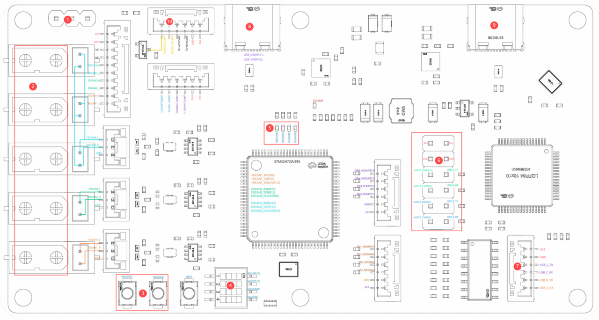

# 3.4 H730开发板接口说明

## **说明：**

注释说明：

①　通过SBUS控制USART10_RX将信号是否反相接收。

②　独立电源接口，与板子后级电路断开。

③　外接自定义开发按钮，默认引脚上拉。

④　外接自定义拨码开关，默认引脚上拉。注：3号引脚必须是OFF

⑤　自定义LED灯。

⑥　需要用6个跳线帽将左右的引脚短接，左侧是STM32主控的串口1和串口2，右侧是USB转换芯片的

两个串口。

⑦USB转换芯片备用串口（未使用）。

⑧　板子供电Type-c接口，连接主控高速USB2.0(全速12MHz)。

⑨　板子供电Type-c接口(串口转USB3.0且必须接USB3.0)，连接到USB转换芯片的USB数据引脚，接到

电脑能查看到4个串口，但单片机只用到两个串口，且使用的是电脑虚拟出的4个串口中的2个小串口号。

⑩串口10和SWD下载接口。
