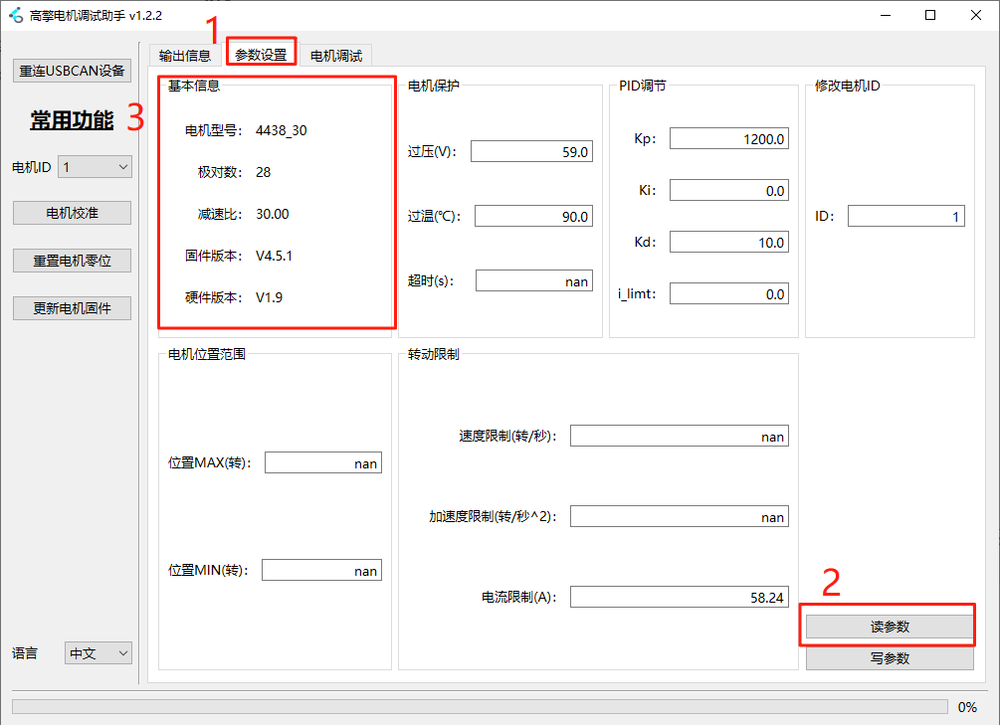
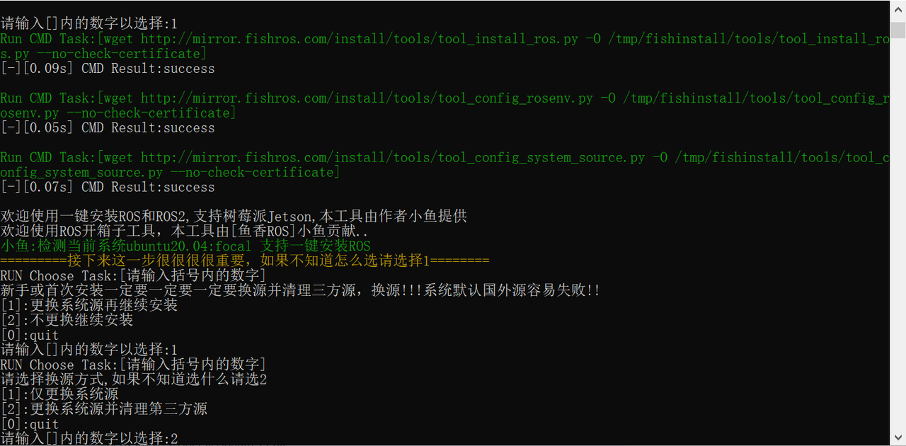
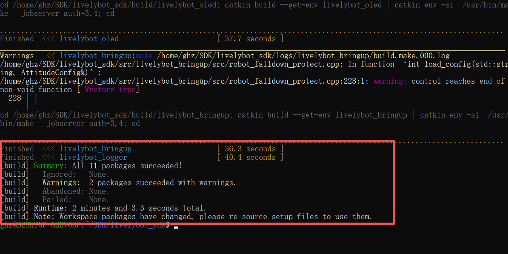
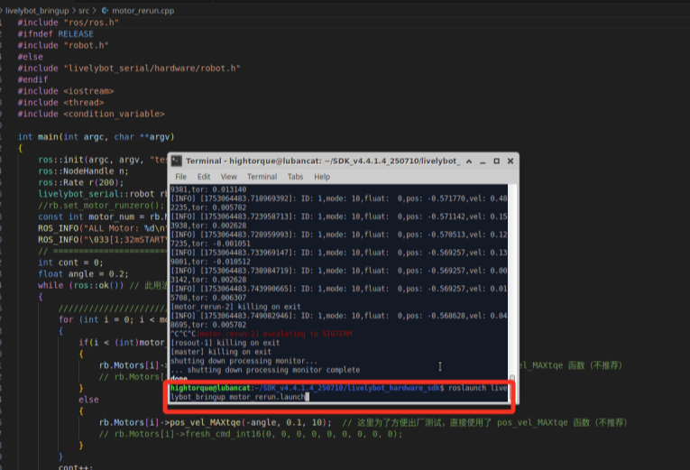

# 4.1.2 ROS版本SDK的7路主控盒子快速上手

### 使用目的

使用SDK程序在7路CAN主控盒子上控制电机进行转动。

### 物料清单

**硬件部分：**

- 直流稳压电源
- 系统主板
- 主控盒子底板
- 高擎电机（此处为4438-30电机）
- USB数据线
- 电机线材XT30(2+2)线材
- 电源线XT60线材
- 控制按钮


主控盒子底板


系统主板


USB数据线


4438型号电机


TX60线材

<br>XT30(2+2)线材

<br>控制按钮

**软件部分：**

SDK程序包：SDK叠板的配套程序，可配合叠板进行控制电机

**下载：**

### 前期准备

#### 查看电机基本信息

使用上位机进行查看电机的型号、固件版本、硬件版本。

1. 使用USB转FDCAN小板连接电机并打开上位机（具体可参考调试助手快速使用[2.1 上位机快速上手](../02-高擎电机调试助手/2.1-快速上手.md)）
2. 点击参数设置
3. 点击读参数
4. 查看基本信息中的电机型号、固件版本、硬件版本。

**注意：** V3的固件版本在SDK程序中有部分信息不会显示，具体查看[软件介绍](https://lingdongfangcheng.feishu.cn/wiki/Nm7OwYkmki1eFLkEJ6xcRhR1nug)



#### 修改电机ID

1. 使用调试板连接电机并打开调试助手（具体可参考调试助手快速使用[2.1 快速上手](https://lingdongfangcheng.feishu.cn/wiki/BwSPwpjyLimtXTkTt0JczYOhned)）
2. 点击参数设置。
3. 点击读参数。
4. 查看电机ID,并对电机ID进行修改成1。
5. 点击写参数，保存修改的电机ID。

注：本次使用电机ID为1的电机。实际使用可根据情况设置电机ID


### 硬件准备

#### 接口与接线说明


**接口详情：**

1. **电源输入接口**：采用XT60公头，支持24-48V电压范围。
2. **XT30(2+2)电机接口**：
    - 经MOS管与电源输入隔离，输出电压与输入电压一致，由下方开关控制。
    - 支持FDCAN通信，可与通信板协作，将FDCAN信息转换为串口信息及相应的CAN通道号。
    - 电机接口的CAN通道序号按图示蓝色数字顺序排列。
3. **系统板接口：** 把主板接在此处。
4. **XT30(2+2)电机控制按钮接口**：用于控制电机供电，短按进行开关操作。
5. **系统板供电按钮接口：** 用于控制系统板供电，长按进行开关操作。

**连接步骤：**

1. 将电源连接至**电源输入接口**；
2. 将电机接入**XT30（2+2）电机接口**；
3. 将系统板插入**系统板接口**；
4. 将外部开关按钮分别接入**电机控制按钮接口**和**系统板供电按钮接口**；
5. 建议在系统板的HDMI接口和USB接口上连接显示屏和鼠键设备。

#### 上电说明

**注意：**

- 使用SDK程序时请给各个设备进行供电
- 请不要带电插拔设备。

##### 底板供电

- 在电源输入接口接入电源，此时功率部分的信号灯亮起，为绿灯常亮，蓝灯闪烁。
<br>底板功率部分信号灯状态

##### 系统板供电

- 长按系统板供电按钮，使系统板的系统电脑开机，此时按钮亮起，底板和系统板的信号灯亮起，功率部分为绿灯常亮，蓝灯闪烁，通信部分为红灯常亮，蓝灯闪烁。
<br>底部信号灯状态

- 系统板信号灯为红灯亮起，蓝灯闪烁。
<br>系统板信号灯状态

##### 电机供电

给电机供电，并且短按一下电源接口处的按钮，此时电机底部信号灯亮起。

<br>开关按钮与电机信号灯状态

### 软件准备

#### 搭建环境

- 操作系统：Linux（推荐使用 Ubuntu）
- 测试环境：本次测试基于 Ubuntu 20.04，并配置有 ROS1 环境
- 主控盒子自带环境，可以直接从查看**6.程序使用说明**进行程序控制

##### 环境配置

1. 运行fishros的一键安装，操作如下

```text
wget http://fishros.com/install -O fishros && . fishros
```


1. 选择安装 ROS，这个选择`1`进行安装 ROS


1. 选择更换系统源再安装


1. 选择更换系统源并清理第三方源


1. 选择自动测速选择最快的源


1. 选择安装 ROS1 这里选择`3`


1. 选择安装桌面版，这里选择`1`


1. 安装完成，此时系统会提示安装成功


##### 安装依赖

1. 安装串口通信的相关包。

```bash
sudo apt-get install libserialport0 libserialport-dev
```


1. 安装python依赖

```bash
sudo apt update
sudo apt install python3-pip
python3 -m pip install empy
```


### 程序使用说明

#### 程序下载

1. 程序位置

程序包在资料包的ROS1 版本程序中，名称为`motor_sdk_ros1_v4.6.2.zip`


1. 创建名称为`SDK`的文件夹，把程序复制进行并解压程序，指令流程为

```text
//1. 创建SDK文件夹
  mkdir -p SDK 
//2. 查看文件夹创建是否成功
  ls
//3. 进入SDK文件夹
  cd SDK
//4. 将程序复制进SDK文件夹,/mnt/f/SDK/motor_sdk_ros1_v4.6.2.zip是我原本文件地址，~/SDK/是目标地址
  cp /mnt/f/SDK/motor_sdk_ros1_v4.6.2.zip ~/SDK/
//5.查看程序包是否复制在SDK文件夹下
  ls
//6.解压程序包
  unzip motor_sdk_ros1_v4.6.2.zip
//7.查看程序是否解压
  ls
//8.进入motor_sdk_ros1_v4.6.2文件夹
  cd motor_sdk_ros1_v4.6.2
```


#### 程序编译

1. 进入`livelybot_sdk`文件夹中，此时的路径为`/SDK/motor_sdk_ros1_v4.6.2/livelybot_sdk`

```text
cd livelybot_sdk
```


1. 进行程序编译，正常编译结束是不会出现`error`，如果出现了请检查环境与依赖是否安装成功。

```text
catkin build
```




1. 绑定运行环境空间

```text
source devel/setup.bash
```


#### 修改配置文件

在`livelybot_bring`文件下的`motor_cfg`目录下有多个电机配置文件可以选择，根据电机使用情况选择文件，并写在l`ivelybot_bringup/launch`下的`.launch`文件的路径上，用于选择对应的配置文件。

##### 选择电机模型文件

1. 在`livelybot_bring`文件下的`launch`文件下的`xxx.launch`中选择使用需要的`yaml`文件。
2. 在示例程序的`.launch`文件中有配置文件的路径，修改对应路径就可以选择配置文件
- 以`motor_rerun`为例

```bash
<launch>
  <rosparam file="$(find livelybot_bringup)/motor_cfg/robot_pi_12dof_cfg.yaml" command="load" />
  <node pkg="livelybot_bringup" name="motor_rerun" type="motor_rerun" output="screen" />
</launch>
```

`.launch`的配置如下：

- `file`：电机配置文件的路径，**修改该项的配置文件的名称用于选择配置文件**
- `pkg`：示例程序运行的节点。
- 此处用了`robot_pi_12dof_cfg.yaml`。(默认都为`robot_pi_12dof_cfg.yaml`)

**注意**：现在每个示例程序的配置文件选择都在该程序的`.launch`文件下。


##### 修改电机配置

`找到livelybot_bring文件下的motor_cfg。在motor_cfg文件下，我们选择robot_pi_12dof_cfg.yaml打开修改下列配置（开发时根据使用情况选择）`

1. 修改`CANport_num:1`：设置can通道使用数量，本次操作设置为`1`。
2. 修改`serial_id:1`：设置can通道序号，本次操作设置为`1`。
3. 修改`motor_num: 1`：设置电机数量，本次操作设置为`1`。
4. 修改`motor1`下的`type："4438_30"`：设置选用电机型号为4438_30，本次操作使用该型号电机，根据实际情况修改
5. 修改`motor1`下的`id:1 `设置电机id为`1`。

**注意**：

- **每个CANport下电机id都必须从1开始，使用时注意修改电机id。**
- 修改程序记得保存。


#### 运行测试程序

在`livelybot_sdk`路径下运行`livelybot_bringup`文件下`launch`下的`motor_rerun.launch`可以在终端输入下面指令，对应的测试程序在`src`下。

```cpp
//设置环境变量，使终端能够识别和使用ROS相关的命令和工具，用于使用launch文件
source devel/setup.bash

//运行测试程序
roslaunch livebot_bringup motor_rerun.launch
```

在运行正常后，**电机进行缓慢的正反旋转运动，并在终端更新电机当前状态**。





