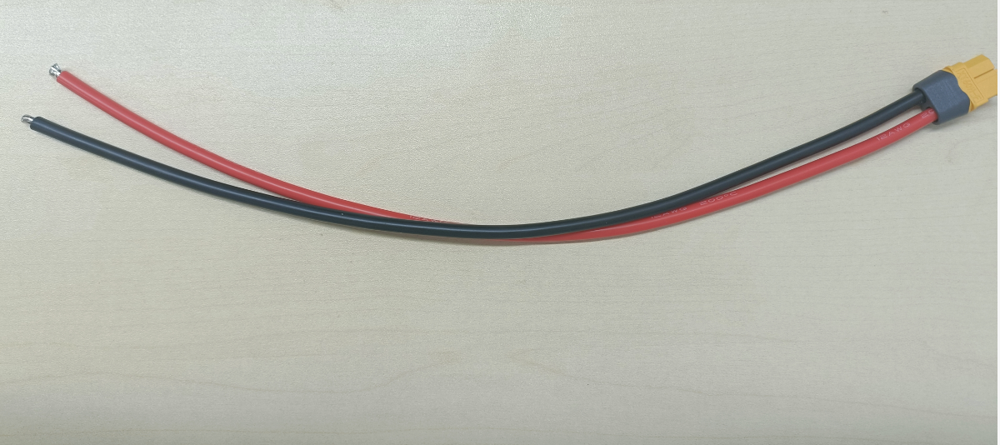
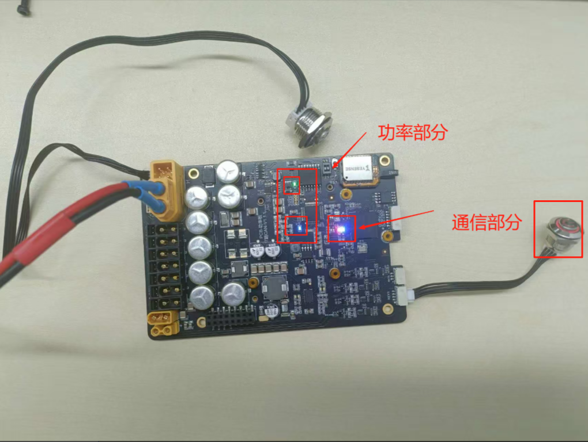
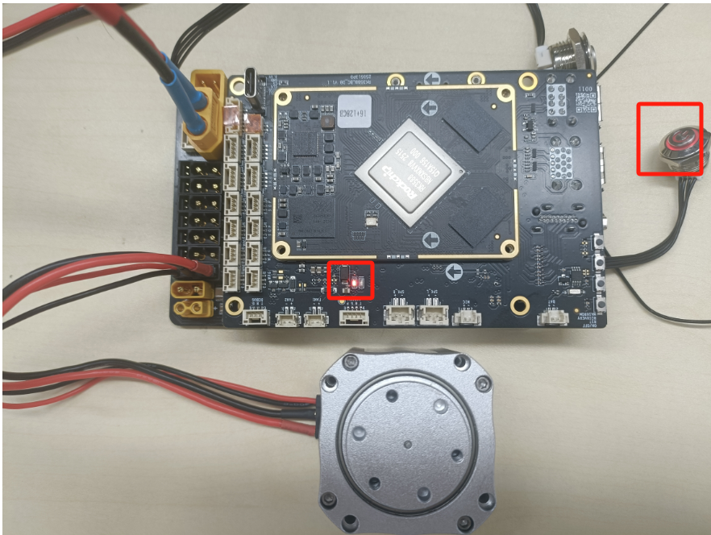
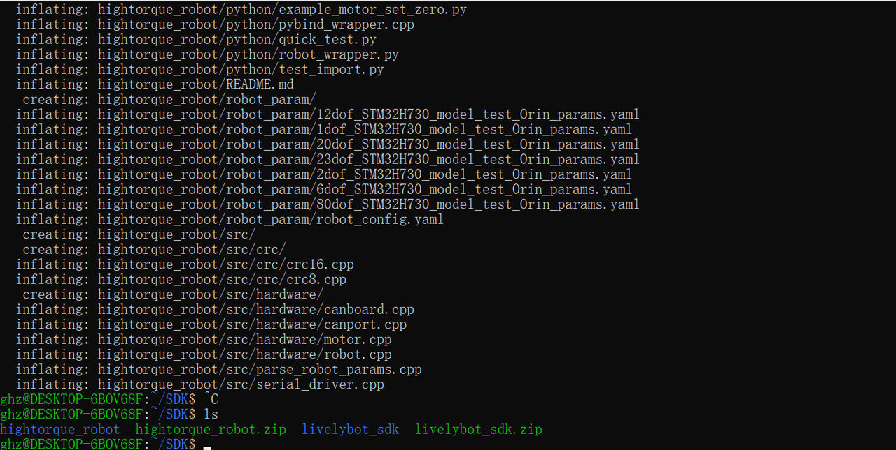
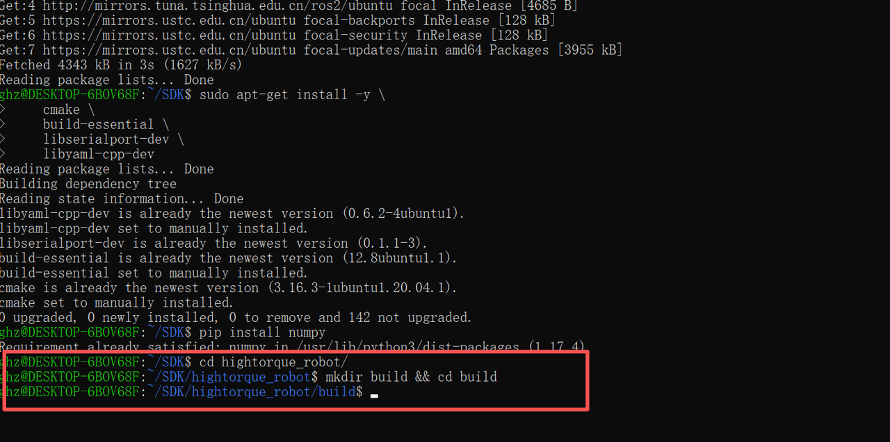
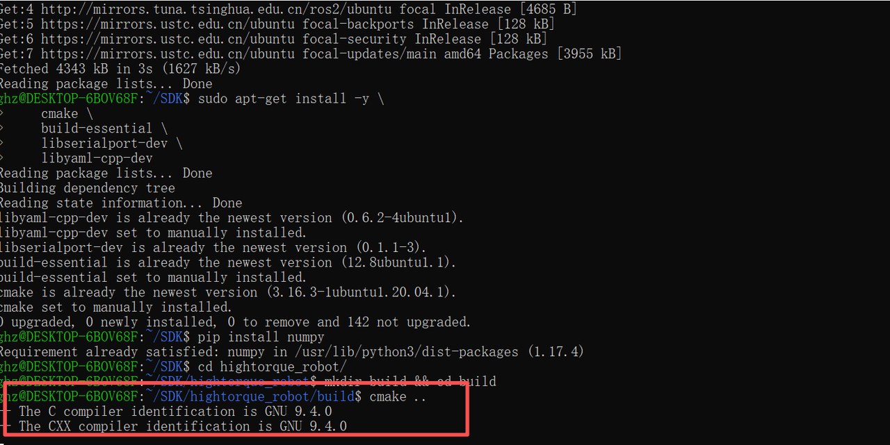
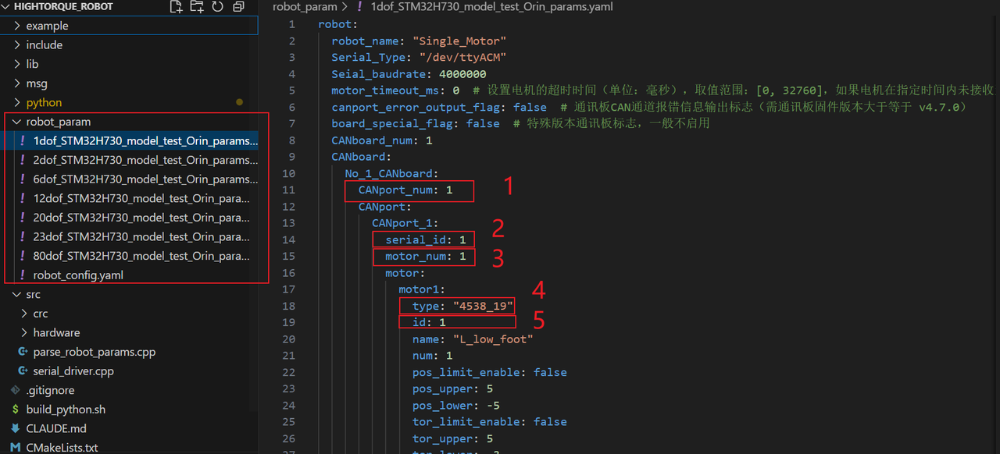
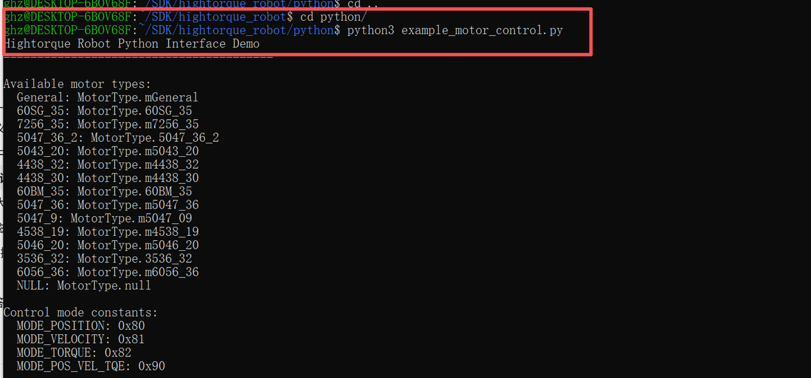

# 4.1.5 Python版本SDK的7路主控盒子快速上手

### 使用目的

使用SDK程序在7路CAN主控盒子上控制电机进行转动。

### 物料清单

**硬件部分：**

- 直流稳压电源
- 系统主板
- 主控盒子底板
- 高擎电机（此处为4438-30电机）
- USB数据线
- 电机线材XT30(2+2)线材
- 电源线XT60线材
- 控制按钮


主控盒子底板


系统主板


USB数据线


4438型号电机



TX60线材

<br>XT30(2+2)线材

<br>控制按钮

**软件部分：**

SDK程序包：SDK叠板的配套程序，可配合叠板进行控制电机

**下载：**

### 前期准备

#### 查看电机基本信息

使用上位机进行查看电机的型号、固件版本、硬件版本。

1. 使用USB转FDCAN小板连接电机并打开上位机（具体可参考调试助手快速使用[2.1 上位机快速上手](../02-高擎电机调试助手/2.1-快速上手.md)）
2. 点击参数设置
3. 点击读参数
4. 查看基本信息中的电机型号、固件版本、硬件版本。

**注意：** V3的固件版本在SDK程序中有部分信息不会显示，具体查看[软件介绍](https://lingdongfangcheng.feishu.cn/wiki/Nm7OwYkmki1eFLkEJ6xcRhR1nug)


#### 修改电机ID

1. 使用调试板连接电机并打开调试助手（具体可参考调试助手快速使用[2.1 快速上手](https://lingdongfangcheng.feishu.cn/wiki/BwSPwpjyLimtXTkTt0JczYOhned)）
2. 点击参数设置。
3. 点击读参数。
4. 查看电机ID,并对电机ID进行修改成1。
5. 点击写参数，保存修改的电机ID。

注：本次使用电机ID为1的电机。实际使用可根据情况设置电机ID


### 硬件准备

#### 接口与接线说明


**接口详情：**

1. **电源输入接口**：采用XT60公头，支持24-48V电压范围。
2. **XT30(2+2)电机接口**：
    - 经MOS管与电源输入隔离，输出电压与输入电压一致，由下方开关控制。
    - 支持FDCAN通信，可与通信板协作，将FDCAN信息转换为串口信息及相应的CAN通道号。
    - 电机接口的CAN通道序号按图示蓝色数字顺序排列。
3. **系统板接口：** 把主板接在此处。
4. **XT30(2+2)电机控制按钮接口**：用于控制电机供电，短按进行开关操作。
5. **系统板供电按钮接口：** 用于控制系统板供电，长按进行开关操作。

#### 上电说明

**注意：**

- 使用SDK程序时请给各个设备进行供电
- 请不要带电插拔设备。

##### 底板供电

- 在电源输入接口接入电源，此时功率部分的信号灯亮起，为绿灯常亮，蓝灯闪烁。
<br>底板功率部分信号灯状态

##### 系统板供电

- 长按系统板供电按钮，使系统板的系统电脑开机，此时按钮亮起，底板和系统板的信号灯亮起，功率部分为绿灯常亮，蓝灯闪烁，通信部分为红灯常亮，蓝灯闪烁。
<br>底部信号灯状态

- 系统板信号灯为红灯亮起，蓝灯闪烁。
<br>系统板信号灯状态

##### 电机供电

给电机供电，并且短按一下电源接口处的按钮，此时电机底部信号灯亮起。

<br>开关按钮与电机信号灯状态

### 软件准备

#### 搭建环境

- 操作系统：Linux（推荐使用 Ubuntu）
- 测试环境：本次测试基于 Ubuntu 20.04

##### 安装依赖

1. 下载程序

    我们将部分第三方依赖包放置在程序包中，方便依赖包的安装，所以需要下载程序进行依赖安装。

    1. 程序位置

    程序包在资料包的 python 版本程序中，名称为`motor_sdk_python_v4.5.4.zip`

    

    
    1. 创建名称为`SDK`的文件夹，把程序复制进行并解压程序，指令流程为

```text
//1. 创建SDK文件夹
  mkdir -p SDK 
//2. 查看文件夹创建是否成功
  ls
//3. 进入SDK文件夹
  cd SDK
//4. 将程序复制进SDK文件夹,/mnt/f/SDK/motor_sdk_python_v4.5.4.zip是我原本文件地址，~/SDK/是目标地址,这里需要根据实际情况进行修改，或者手动复制进文件夹
  cp /mnt/f/2/motor_sdk_python_v4.5.4.zip ~/SDK/
//5.查看程序包是否复制在SDK文件夹下
  ls
//6.解压程序包
  unzip motor_sdk_python_v4.5.4.zip
//7.查看程序是否解压
  ls
//8.进入motor_sdk_python_v4.5.4文件夹
cd motor_sdk_python_v4.5.4
```

    

    
    1. 下载系统依赖
    - 打开终端输入以下指令

```text
sudo apt-get update
sudo apt-get install -y \
    cmake \
    build-essential \
    libserialport-dev \
    libyaml-cpp-dev
```

    - 运行结果如图所示
    

    
    - 安装Python绑定依赖，运行下列指令

```python
pip install numpy
```

    - 运行结果如下图
    

###### 编译程序

    - 进入hightorque_robot文件并建立build文件。
        - 输入以下指令

```text
cd hightorque_robot
mkdir build && cd build
```

        - 运行结果如下图
            
    - 运行编译指令

```text
cmake ..
```

        - 运行结果如下，确保运行没有保错再执行后面操作。
            

        运行make指令

```text
make
```

        运行结果如下，确保运行没有保错再执行后面操作。

        

        

###### 将在build文件中生成的hightorque_robot_py.*.so文件移到到python

    - 使用下面指令进行操作，检查是否把文件移进python文件下。

```text
cp hightorque_robot_py.*.so ../python
```

    - `hightorque_robot_py.*.so`根据python版本不同此处名称有所不同，例如使用python3.8，生成的是`cpython-38`，如下图中的`hightorque_robot_py.cpython-38-aarch64-linux-gun.so`。
    <br>build文件

    <br>python文件

### 程序使用说明

#### 修改配置文件

##### **选择电机模型文件**

    主配置文件位于 `robot_param/robot_config.yaml`：

```yaml
robot:
  name: "HI"
  param_file: "../robot_param/1dof_STM32H730_model_test_Orin_params.yaml"
```

    `1dof_STM32H730_model_test_Orin_params.yaml`是电机参数文件，在`robot_param`目录下有多个电机参数文件可以选择，根据电机使用情况选择文件，并写在`robot_config.yaml`的路径上。

    

##### **修改电机配置**

    
    1. 修改`CANport_num:1` 设置can通道使用数量，本次操作设置为`1`。
    2. 修改`serial_id:1 `设置can通道序号，本次操作设置为`1`。
    3. 修改`motor_num: 1`设置电机数量，本次操作设置为`1`。
    4. 修改`motor1`下的`type："4438_30" `设置选用电机型号为4438_30，本次操作使用该型号电机，根据实际情况修改
    5. 修改`motor1`下的`id:1 `设置电机id为`1`。

    **注意：**

    - **每个CANport下电机id都从1开始，使用时注意修改电机id。**
    - 修改程序记得保存。

#### 运行测试程序

    进入python文件运行测试程序`example_motor_control.py`。

```python
cd python
python3 example_motor_control.py
```

    - 运行结果如下，python脚本运行，执行电机控制程序，选择1，电机进行往返运动。
    

    
