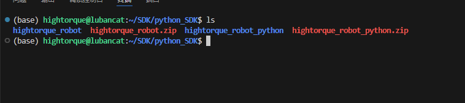
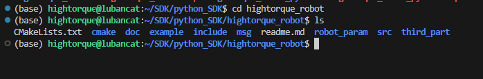
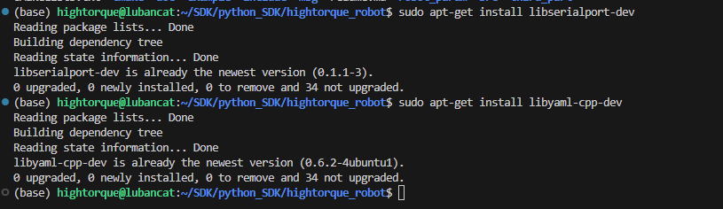
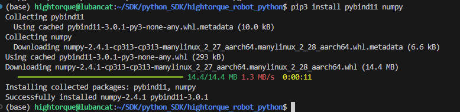

# python—SDK环境配置

该环境配置为最新版python版本的安装方式。程序分为c++版本和python版本，c++版本的sdk作为python版本的内部程序调用



### 编译c++版本程序

1. 进入c++版本的sdk程序中，文件为`hightorque_robot`

```cpp
cd hightorque_robot
```



1. 安装串口依赖

```text
sudo apt-get install libserialport-dev
```

1. 安装yaml解析器

```text
sudo apt-get install libyaml-cpp-dev
```



1. 编译c++版本的sdk

```text
mkdir build
cd build
cmake ..
make -j8
```

1. 安装程序

```text
sudo make install
```

1. 补充 当外部项目调用当前库的时候，可能会出现找不到liblivelybot_serial.so.*的情况，这个时候需要申明安装位置 在当前命令行执行：

```text
export LD_LIBRARY_PATH="/usr/local/lib:$LD_LIBRARY_PATH"
```

### 编译python程序

1. 进入python版本的sdk

```cpp
cd hightorque_robot_python
```


1. 安装系统依赖

```bash
sudo apt-get install -y \
    cmake \
    python3-dev \
    python3-pip \
    liblcm-dev \
    libyaml-cpp-dev \
    libserialport-dev
```


1. 安装Python依赖

```bash
pip3 install pybind11 numpy
```



1. 编译python_sdk

```cpp
cd path/to/hightorque_robot_python
mkdir -p build && cd build
cmake ..
make
```


### 问题

#### **找不到 hightorque_robot 模块**

确保已安装Python包:

```bash
cd path/to/hightorque_robot_python
pip3 install -e .
```
