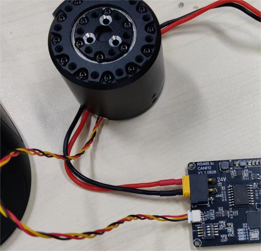
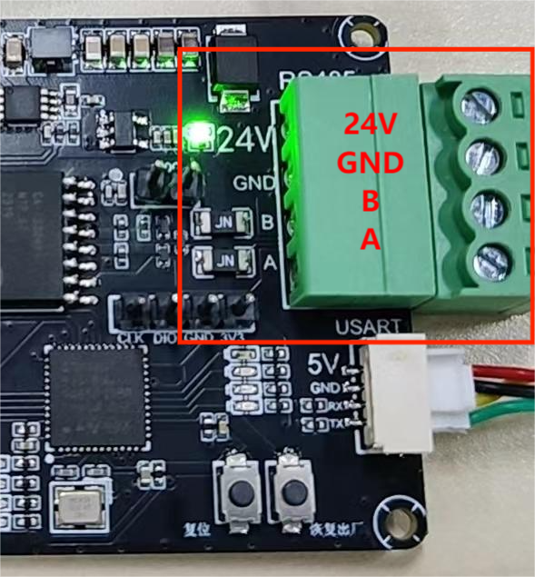
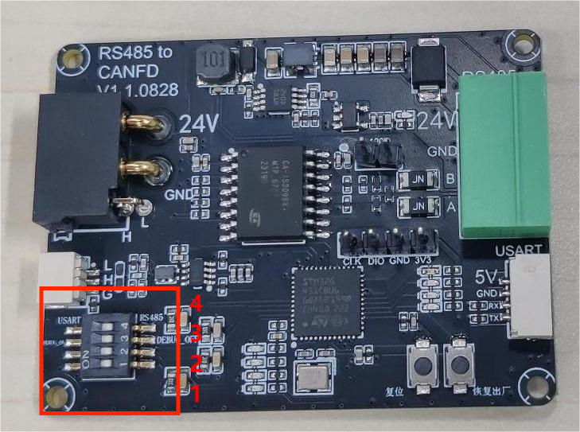
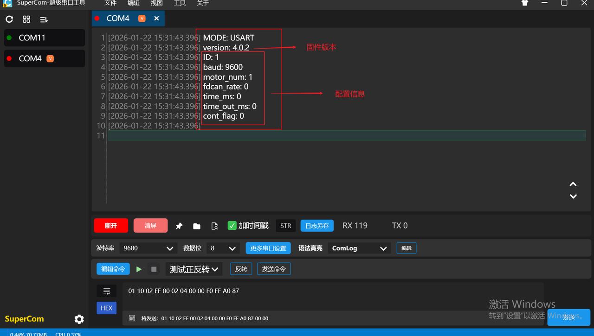
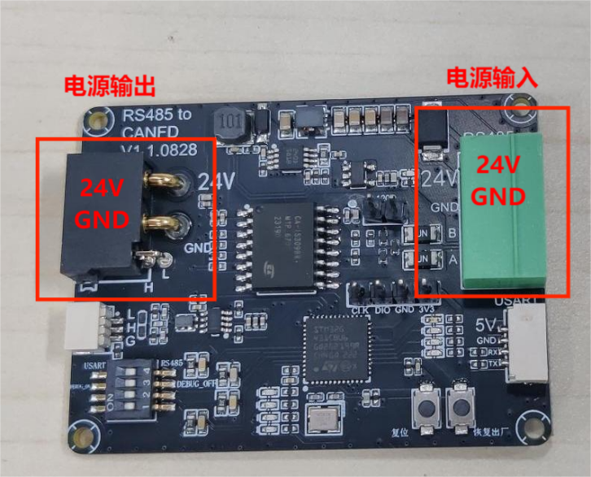

# 5.1 硬件说明

## **接口说明**

**注意：版本适配V1.1.0828。**

### **硬件信息确认**

1. 复位（RES）按键
    - 该按钮功能为重启硬件板。
2. 恢复出厂设置按键
    - 该按钮功能为重设硬件板，使其回到出厂设置。
    - 出厂配置如下：
        - 1.设备地址默认为1。
        - 2.控制电机数量默认为1。
        - 3.串口波特率默认设置为9600。
3. 电机电源以及FDCAN接口

该接口供连接电机使用，接口规格为XT30（2+2）；其中该接口的FDCAN接口是根据实际使用的电机型号进行接线，若使用的时5047或4438，FDCAN线与电源线为一个插槽则只插接口1即可；若使用的是5046电机，FDCAN线与电源线不是同一插槽，则电源线线插接口1，FDCAN线接接口2。如图

 （5046电机）不同插槽接线

 （5047电机）相同插槽接线

1. 串口USART接口

该接口供串口传输数据使用，可以连接PC上位机进行通讯进行读写指令；详细接线线序可以看硬件板材上的丝印进行确认。

接线：TX←→RX , RX←→TX , GND←→GND，（5V供电）。

1. RS485接口

该接口供连接使用RS485协议的控制器（PLC）连接使用，详细接线线序可以看硬件板材上的丝印进行确认。

接线：A←→A , B←→B , GND←→GND ，（24V供电）。

1. 拨码开关
    

    拨码开关4用于切换使用RS485接口或USART串口接口，拨向右则使用RS485,拨向左则使用串口USART。

    拨码开关3用于切换是否复位时发送设备基础设置信息，拨向右则不发送，拨向左则发送。

 拨码开关3打开时复位回复的信息

 使用RS485

 使用串口USART

**注意：**

    - **拨码开关3**仅用于上电时确认接口以及信息使用，正常使用时必须把拨码开关3拨向右端。
    - 拨码开关1，2目前没有做功能设计。

### **基础设置流程**

使用RS485转FDCAN板时，首先且必须确认RS485转FDCAN板的设备ID地址、设备所要驱动控制的电机数量以及发送数据所设定的波特率。设备地址默认为1，控制电机数量默认为1，串口波特率默认设置为9600。

#### **修改设备ID地址示例（使用RS485接口）**

目标：将RS485转FDCAN板的设备ID地址从1设置为2，再将RS485转FDCAN板的设备ID地址从2设置为1。

##### 示例使用RS485转FDCAN板的RS485接口连接RS485转USB串口连接PC作为演示。

**注意：实际使用时，应以RS485作为电源输入，电机接口端作为输出**。连接RS485转USB串口时RS485接口只连接A、B两个接口。
