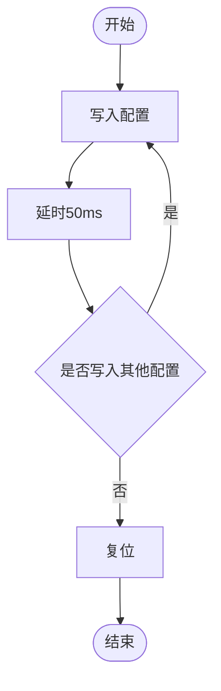
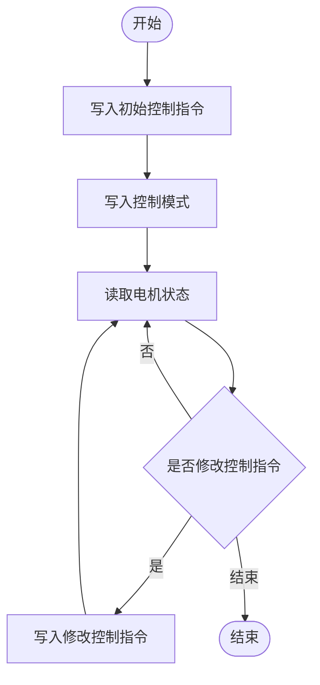
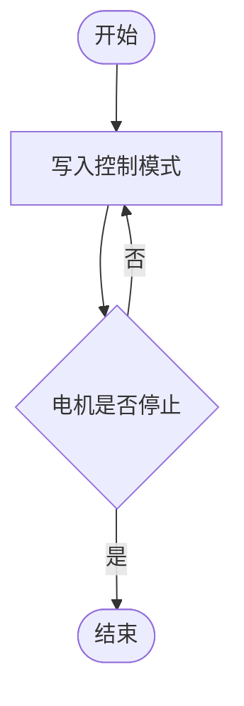
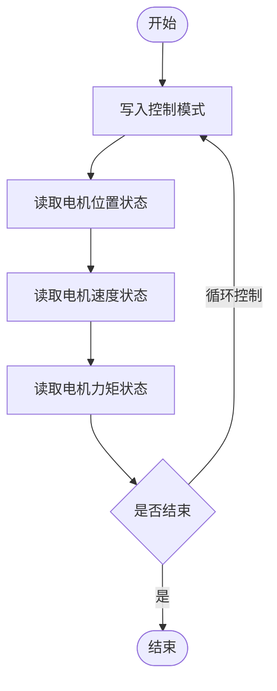

# 5.2 使用说明

**注意：该文档适配固件版本V4.0.0以上**

## 基本介绍

### 寄存器区域

#### 保持寄存器

- 地址范围：`40002` - `41051`(协议地址)，对应`0` - `1049`(相对地址)
- 核心功能：用于设备配置与发送控制指令。
- 支持功能码：
    - `03` 用于从保持寄存器中读取一个或多个连续的寄存器值
    - `06` 用于向一个单独的保持寄存器写入数据
    - `16` 用于向一个或多个连续的保持寄存器写入数据。

地址空间大致划分，具体查看[寄存器表](../05-RS485转FDCAN/5.3-寄存器表.md)：

| 地址范围 (协议) | 地址范围 (相对) | 功能描述 | 数据格式 | 备注 |
| --- | --- | --- | --- | --- |
| 40002 - 40051 | 1 - 50 | 设备配置区 | int16 | 永久性存储，写入后自动保存，保存时间 50ms，重启后生效。 当前仅 1–7（40002–40008）被定义和使用。 |
| 40052 - 40241 | 51 - 240 | 一拖多控制模式指令区 | int16 | 在此模式下，用于向多个电机发送统一的控制指令集。 |
| 40662 - 41051 | 661 - 1050 | 普通控制模式指令区 | int16、int32 | 每个电机的控制模式单独使用一个寄存器。 电机控制数据（如目标位置、速度）从地址 691（40692）开始，使用两个连续的 16 位寄存器组成一个 32 位数据。 |

#### 输入寄存器

- 地址范围：`30001` - `30830` (协议地址)，对应`0` - `829` (相对地址)
- 核心功能：用于读取设备状态与电机数据。
- 支持功能码：`04` 用于从输入寄存器中读取一个或多个连续的寄存器值

地址空间大致划分，具体查看[寄存器表](../05-RS485转FDCAN/5.3-寄存器表.md)：

| 地址范围 (协议) | 地址范围 (相对) | 功能描述 | 数据格式 | 备注 |
| --- | --- | --- | --- | --- |
| 30001 - 30051 | 0 - 50 | 设备状态区 | int16 | 存储设备号和固件版本号等只读的系统信息。 |
| 30051 - 30261 | 50 - 260 | 电机状态区 | int16 | 电机的状态信息（如位置、速度、力矩、模式、错误码）。 |
| 30651 - 30830 | 650 - 829 | 普通控制模式位置、速度、力矩区 | int32 | 在普通控制模式下，电机的位置、速度、力矩等数据是由两个连续的 16 位寄存器组成一个 32 位数。 普通控制模式只有位置、速度、力矩使用的 int32 位数据，其他的错误码、模式等使用的是 int16 位的数据。 |

---

### 功能

1. 通信协议
    - 协议标准： Modbus-RTU
    - 物理接口：串口接口与 RS-485接口.
    - 波特率范围：4800 bps ~ 2 Mbps
2. fdcan波特率切换功能
3. 安全与保护功能
4. 定时发送功能
5. 控制模式切换功能

---

## 设置说明

### 配置参数与寄存器对应表

具体寄存器关系可以查看寄存器表[寄存器表](../05-RS485转FDCAN/5.3-寄存器表.md)。

#### 设备地址ID

- modbus从站ID，也就是通讯板的ID。

#### 电机数量

- 电机个数设置要和实际连接个数相同。
- 电机ID要从1开始。
    - 例如电机数量设置为3，电机要是ID为1、2、3的电机。

#### 波特率

- 主站和从站波特率要相同才可以进行通信。
- 波特率是数值*波特率倍率（默认100），例如96是指波特率9600。

#### FDCAN波特率切换

- `0`：表示使用1M的FDCAN波特率。
    - 优点：电机通信更稳定，抗干扰能力强。
    - 缺点：通信速度较慢，控制频率不宜过快。
- `1`：表示使用5M的FDCAN波特率。
    - 优点：电机通信响应速率快，在相同控制频率下，可控制更多数量的电机。
    - 缺点：容易受到干扰，对线束质量要求高。

#### 定时发送时间

- 当开启定时发送后，手动发送的指令会立即发送，而不会影响或等待下一个定时发送周期。
- 建议时间：要根据使用连接的电机的个数决定。
    - 例如使用5M波特率，使用普通模式控制10个电机，可以设置至少4ms。
- `0`：表示关闭该功能。
- `非0数据`：表示设置的定时发送时间，单位（ms）。

#### 超时时间

- 功能：当通信时间超过设定的超时阈值时，电机会进入停止模式，防止异常控制。
- `0`：表示关闭该功能。
- `非0数据`：表示设置的电机通信超时时间，单位（10ms，即给1是表示10ms）。

#### 波特率倍率

- 用于设置485的通信波特率。
- 波特率是数值*波特率倍率（默认100），例如96是指波特率9600。

#### 控制模式切换

- `0`：表示普通控制模式。
    - 优点：
        - 位置数据使用int32位，控制超过`±3.2`圈必须使用该模式。
        - 各个电机单独控制，可以对电机进行不同模式的控制。
    - 缺点：
        - fdcan数据量大，一个数据使用2个寄存器，适合控制少量电机。
        - 没有电机同步控制
- `1`：表示一拖多控制模式，数据使用int16位。
    - 优点：
        - 多个电机数据统一发送，适合控制大量电机。
        - 具有多电机同步控制。
    - 缺点：
        - 受数据影响，最大转动`±3.2`圈。
        - 电机模式由一个寄存器控制，所有电机控制模式要相同。

---

#### 控制频率极限

- 使用485转FDCAN通讯板进行测试电机通信在FDCAN不丢帧的情况下最大的电机连接个数，与485通信没有关系，是FDCAN通信的极限，建议以下表数据的80%进行使用，确保通信的稳定。
- 例如在5Mfdcan波特率下，使用500hz的频率控制电机进行普通模式下的位置速度最大力矩模式，建议最多连接7个电机

<!-- HTML：合并单元格与飞书一致；多数 Markdown 渲染器支持内嵌 HTML。 -->
<table border="1" style="border-collapse:collapse;text-align:center;">
<thead>
<tr>
<th rowspan="2" style="padding:6px 10px;">fdcan波特率</th>
<th rowspan="2" style="padding:6px 10px;">控制模式</th>
<th rowspan="2" style="padding:6px 10px;">控制频率</th>
<th colspan="8" style="padding:6px 10px;">电机最大连接数量</th>
</tr>
<tr>
<th style="padding:4px 6px;">电压模式</th>
<th style="padding:4px 6px;">电流模式</th>
<th style="padding:4px 6px;">速度模式</th>
<th style="padding:4px 6px;">位置模式</th>
<th style="padding:4px 6px;">力矩模式</th>
<th style="padding:4px 6px;">位置速度模式</th>
<th style="padding:4px 6px;">位置速度最大力矩模式</th>
<th style="padding:4px 6px;">位置速度加速度模式</th>
</tr>
</thead>
<tbody>
<tr>
<td rowspan="6" style="padding:6px 10px;vertical-align:middle;">5M（开启FDCAN波特率切换）</td>
<td rowspan="3" style="padding:6px 10px;vertical-align:middle;">普通模式</td>
<td style="padding:4px 8px;">1000hz</td>
<td>5</td><td>5</td><td>5</td><td>5</td><td>4</td><td>5</td><td>5</td><td>5</td>
</tr>
<tr>
<td style="padding:4px 8px;">500hz</td>
<td>11</td><td>11</td><td>10</td><td>10</td><td>8</td><td>9</td><td>9</td><td>10</td>
</tr>
<tr>
<td style="padding:4px 8px;">250hz</td>
<td>20</td><td>20</td><td>20</td><td>20</td><td>16</td><td>18</td><td>18</td><td>20</td>
</tr>
<tr>
<td rowspan="3" style="padding:6px 10px;vertical-align:middle;">一拖多模式</td>
<td style="padding:4px 8px;">1000hz</td>
<td>14</td><td>14</td><td>14</td><td>14</td><td>14</td><td>12</td><td>12</td><td>12</td>
</tr>
<tr>
<td style="padding:4px 8px;">500hz</td>
<td>14</td><td>14</td><td>24</td><td>24</td><td>24</td><td>23</td><td>23</td><td>23</td>
</tr>
<tr>
<td style="padding:4px 8px;">250hz</td>
<td>30</td><td>30</td><td>30</td><td>30</td><td>30</td><td>30</td><td>30</td><td>30</td>
</tr>
<tr>
<td rowspan="6" style="padding:6px 10px;vertical-align:middle;">1M（关闭FDCAN波特率切换）</td>
<td rowspan="3" style="padding:6px 10px;vertical-align:middle;">普通模式</td>
<td style="padding:4px 8px;">1000hz</td>
<td>1</td><td>1</td><td>1</td><td>1</td><td>1</td><td>1</td><td>1</td><td>1</td>
</tr>
<tr>
<td style="padding:4px 8px;">500hz</td>
<td>3</td><td>3</td><td>3</td><td>3</td><td>2</td><td>3</td><td>3</td><td>3</td>
</tr>
<tr>
<td style="padding:4px 8px;">250hz</td>
<td>7</td><td>7</td><td>7</td><td>7</td><td>4</td><td>6</td><td>6</td><td>6</td>
</tr>
<tr>
<td rowspan="3" style="padding:6px 10px;vertical-align:middle;">一拖多模式</td>
<td style="padding:4px 8px;">1000hz</td>
<td>5</td><td>5</td><td>5</td><td>5</td><td>5</td><td>3</td><td>3</td><td>3</td>
</tr>
<tr>
<td style="padding:4px 8px;">500hz</td>
<td>11</td><td>11</td><td>11</td><td>11</td><td>11</td><td>9</td><td>9</td><td>9</td>
</tr>
<tr>
<td style="padding:4px 8px;">250hz</td>
<td>23</td><td>23</td><td>23</td><td>23</td><td>23</td><td>17</td><td>17</td><td>17</td>
</tr>
</tbody>
</table>

---

### 配置操作流程

**配置操作仅在设备初次使用或参数需要变更时执行一次。 参数设置成功自动保存，后续正常控制时无需重复设置，可直接进入 [控制操作流程]。**

请严格按照以下步骤顺序执行，以确保配置成功。

###### 步骤1：依次修改配置

向以下寄存器依次发送对应的设置值。建议每发送一条指令后，等待一个短暂的系统处理周期（如50ms）。

###### 步骤3：延时等待

发送指令后，必须等待至少50ms。在此期间，设备正在将配置写入永久存储器，请勿断电或进行其他操作。

###### 步骤4：设备复位

修改配置后，按下复位按键或重新上电，确保所有新配置完全生效。

**注：如果修改错误可以按下恢复出厂设置，可以将配置设置回原始状态。**

### 使用示例

**假设将设备地址ID从1改为2，并且将波特率改成115200。**

**写入寄存器**

- 使用modbus的功能码`06`对寄存器地址`40002`（相对地址0x0001）写入数据`0x0002`，把设备地址id改成2
- 使用modbus的功能码`06`对寄存器地址40004（相对地址0x0003）写入数据`0x0480`（1152的十六进制），把设备的波特率改成115200

#### 写入设备地址

** 1. 写入目标指令**

写入设备地址ID目标值

- 设备地址
    - 寄存器：40002（相对地址0x0001）
    - 值：`0x0002`（默认为1）
- 功能码
    - 06：对单个寄存器进行写入数据

** 2. 等待延时50ms**

#### 写入波特率

**1. 写入目标指令**

写入波特率目标值

- 设备地址
    - 寄存器：40004(相对地址3)
    - 值：`0x0480`（1152的16进制）
- 功能码
    - 06：对单个寄存器进行写入数据

** 2. 等待延时50ms**

#### 复位

**1.按下复位按键或重新上电，确保所有新配置完全生效。**

### 验证

#### 方式一：串口助手读取配置

- 打开串口助手，连接对应对应端口。
    - 使用串口端口拨码开关 4 拨向左边，拨码开关 3 拨向左边。
    - 使用485端口拨码开关 4 拨向右边，拨码开关 3 拨向左边。
- 按下复位按钮，串口打印对应配置信息

#### 方式二：读取配置信息寄存器

##### **保持寄存器的配置信息**

1. 寄存器地址
    - 设备ID
        - 寄存器：40002
    - 电机数量
        - 寄存器：40003
    - 设备波特率
        - 寄存器：40004
    - FDCAN波特率切换
        - 寄存器：40005
    - 定时发送时间
        - 寄存器：40006
    - 超时时间
        - 寄存器：40007
    - 控制模式切换
        - 寄存器：40008
2. 功能码
    - 03：读取保存寄存器的数据

##### **输入寄存器的配置信息**

1. 寄存器地址
    - 设备固件版本号
        - 寄存器：30002
2. 04：读取输入寄存器的数据

---

## 控制说明

### 单位说明

例如：使用int32类型位置数据设置为`100000`时，表示控制电机转到`1圈`的位置。

    使用int32类型速度数据设置为`100000`时，表示控制电机运动速度是`1转/秒`。

    使用int32类型力矩数据设置为`1000`时，表示控制电机运动的力矩是`1牛米`。

    使用int16类型加速度数据设置为`1000`时，表示控制电机的加速度是`1转/秒²`

### 控制流程

控制模式使用流程遵循“配置参数 → 触发执行 → 循环监控 → 动态调整”的逻辑。

1. 写入初始化控制指令
    - 根据控制需求，向相应的控制数据寄存器写入目标参数。
    - 不同控制模式的参数在下面模式介绍中有说明
    - 例如：在位置速度最大力矩模式下，将初始位置、速度、力矩值写入对应控制寄存器。
2. 写入控制模式指令
    - 向控制模式寄存器发送特定的指令代码，电机立即执行相应的模式。
    - 例如：发送控制指令(0x0A,对应十进制数据10表示位置速度最大力矩模式)，启动电机按设定速度运行到指定位置。
3. 读取电机状态数据
    - 读取电机的实际位置、实际速度、实际转矩、错误状态等状态信息。
    - 支持选择性读取：根据监控需求读取特定数据
        - 可只读取位置和错误状态
        - 可只读取关键运行参数
        - 可读取完整状态信息
4. 判断是否需要修改控制目标
    - 根据控制需求判断是否需要调整控制参数
        - 是：进入"修改控制指令"步骤，进行针对性参数修改

            修改控制指令

                - 根据运行需求调整控制参数
                - 支持精确修改：可单独修改特定指令，如：
                    - 仅修改位置目标值
                    - 仅修改转矩限制
                    - 仅修改速度指令
                    - 或组合修改多个参数
        - 否：继续循环读取状态，保持当前控制

### 普通控制模式

- **普通控制模式需要将寄存器地址为**`40008`**（相对地址**`0x0007`**）设置为**`0`**，具体操作控制查看**`1.2配置操作流程`
- **建议开定时发送功能，保证设备获取电机的状态数据具有实时性。**
- 注意：因为部分寄存器是不连续的，需要分别对各个寄存器写入数据或者读取数据
- 普通控制模式有以下电机控制
    - 1：获取电机状态 (单独读取电机状态需要先设置电机为该模式)
    - 2：停止
    - 3：刹车
    - 4：电压模式
    - 5：电流模式
    - 6：位置模式
    - 7：速度模式
    - 8：力矩模式
    - 9：位置速度模式
    - 10：位置速度最大力矩模式
    - 11：位置速度加速度模式
- 该模式的部分数据使用32位，由两个寄存器一起组成。

#### 位置速度最大力矩控制

位置速度力矩控制模式参数：位置、速度、力矩

##### **1. 写入初始控制指令**

- 说明：写入电机的目标位置、速度与力矩。三个参数的写入无顺序要求。
- 位置
    - 寄存器：
        - `40692`（相对地址`0x02B3`）：电机1-位置控制值低16位
        - `40693`（相对地址`0x02B4`）：电机1-位置控制值高16位
    - 值：目标位置值 (32位)
        - 数据是100000，对应寄存器的数据 低16位：0x86A0 高16位：0x0001
- 速度
    - 寄存器：
        - `40752`（相对地址`0x02EF`）：电机1-速度控制值低16位
        - `40753`（相对地址`0x02F0`）：电机1-速度控制值高16位
    - 值：目标速度值 (32位)
        - 数据是100000，对应寄存器的数据是低16位：0x86A0 高16位：0x0001
- 力矩
    - 寄存器：
        - `40812`（相对地址 `0x032B`）：电机1-力矩控制值低16位
        - `40813`（相对地址 `0x032C`）：电机1-力矩控制值高16位
    - 值：目标力矩值 (32位)
        - 数据是100000，对应寄存器的数据是低16位：0x86A0 高16位：0x0001
- 功能码
    - 16：对多个寄存器进行写入数据

##### **2.** **写入控制模式**

- 说明：写入控制模式，使电机按控制模式运动。
- 寄存器：
    - `40662`（相对地址`0x0295`）：电机1-控制模式
- 值：`10`(代表位置速度最大力矩模式)
- 功能码 ：06 对单个寄存器进行写入数据

##### **3. 读取状**态

- 说明：周期性地读取电机实时状态，用于监控、显示或逻辑判断。可根据需要选择读取一个或多个参数，无顺序要求。
- 位置
    - 寄存器：
        - `30651`（相对地址 `0x028A`）：电机1位置状态低16位
        - `30652`（相对地址 `0x028B`）：电机1位置状态高16位
    - 说明：电机实际位置 (32位)（数据大小可查看单位说明）
- 速度
    - 寄存器：
        - `30711`（相对地址 `0x02C6`）：速度状态低16位
        - `30712`（相对地址 `0x02C7`）：速度状态高16位
    - 说明：电机实际速度 (32位)
- 力矩
    - 寄存器：
        - `30771`（相对地址 `0x0302`）：力矩状态低16位
        - `30772`（相对地址 `0x0303`）：力矩状态高16位
    - 说明：电机实际力矩 (32位)
- 功能码
    - 04：读取输入寄存器的数据

##### **4.** **循环控制与动**态调整

- 操作：重复**步骤 3 **以持续监控电机状态。
- 调整：当需要改变运动目标时（如到达新位置、改变速度）进行**步骤 5。**

##### **5. 修**改控制指令

- 说明：修改电机的目标位置。（这里以要修改电机位置为例）
- 位置
    - 寄存器：
        - `40692`（相对地址`0x02B3`）：电机1-位置控制值低16位
        - `40693`（相对地址`0x02B4`）：电机1-位置控制值高16位
    - 值：目标位置值 (32位)
- 功能码
    - 16：对多个寄存器进行写入数据

---

#### 电压控制

电压控制模式参数：电压

##### **1. 写入初始控制指令**

写入电压初始目标值

- 电压数据
    - 寄存器：
        - `40932`（相对地址 `0x03A3`）：电机1-电压控制值低16位
        - `40933`（相对地址 `0x03A4`）：电机1-电压控制值高16位
    - 值：目标电压值 (32位)
        - 例如数据是100000，对应寄存器的数据是低16位：0x86A0 高16位：0x0001
- 功能码
    - 16：对多个寄存器进行写入数据

##### **2. 写入控制模式**

- 操作：写入控制模式，使电机按模式运动。
- 寄存器：
    - `40662`（相对地址`0x0295`）：电机1-控制模式
- 值：4 (代表电压模式)
- 功能码 ：06 对单个寄存器进行写入数据

##### **3. 读取**状态

注意：读取没有顺序要求和读取数据要求，可以根据情况读取需要的数据即可（例如只读取位置数据）。

可分别读取以下电机状态（此处的寄存器为电机1的寄存器位置）：

- 位置
    - 寄存器：
        - `30651`（相对地址 `0x028A`）：电机1位置状态低16位
        - `30652`（相对地址 `0x028B`）：电机1位置状态高16位
    - 说明：电机实际位置 (32位)
- 速度
    - 寄存器：
        - `30711`（相对地址 `0x02C6`）：速度状态低16位
        - `30712`（相对地址 `0x02C7`）：速度状态高16位
    - 说明：电机实际速度 (32位)
- 力矩
    - 寄存器：
        - `30771`（相对地址 `0x0302`）：力矩状态低16位
        - `30772`（相对地址 `0x0303`）：力矩状态高16位
    - 说明：电机实际力矩 (32位)
- 功能码
    - 04：读取输入寄存器的数据

##### **4.** **循环控制与动**态调整

- 操作：重复**步骤 3 **以持续监控电机状态。
- 调整：当需要改变运动目标时（如到达新位置、改变速度）进行**步骤 5。**

##### **5. 修**改控制指令

- 说明：修改电机的电压控制值。
- 电压
    - 寄存器：
        - `40932`（相对地址 `0x03A3`）：电压控制值低16位
        - `40933`（相对地址 `0x03A4`）：电压控制值高16位
    - 值：目标电压值 (32位)
- 功能码
    - 16：对多个寄存器进行写入数据

---

#### 电流控制

电流控制模式参数：电流

##### **1. 写入初始控制指令**

- 说明：写入电流目标值。
- 电流
    - 寄存器：
        - `40992`（相对地址 `0x03DF`）：电机1-电流控制值低16位
        - `40993`（相对地址 `0x03E0`）：电机1-电流控制值高16位
    - 值：目标电流值 (32位)
        - 例如数据是100000，对应寄存器的数据是低16位：0x86A0 高16位：0x0001
- 功能码
    - 16：对多个寄存器进行写入数据

##### 2. 写入控制模式

- 操作：写入控制模式，使电机按控制模式运动。
- 寄存器：
    - `40662`（相对地址`0x0295`）：电机1-控制模式
- 值：5 (代表电流模式)
- 功能码 ：06 对单个寄存器进行写入数据

##### 3. 读取状态

注意：读取没有顺序要求和读取数据要求，可以根据情况读取需要的数据即可（例如只读取位置数据）。

可分别读取以下值以监控电机状态（此处的寄存器为电机1的寄存器位置）：

- 位置
    - 寄存器：
        - `30651`（相对地址 `0x028A`）：电机1位置状态低16位
        - `30652`（相对地址 `0x028B`）：电机1位置状态高16位
    - 说明：电机实际位置 (32位)
- 速度
    - 寄存器：
        - `30711`（相对地址 `0x02C6`）：速度状态低16位
        - `30712`（相对地址 `0x02C7`）：速度状态高16位
    - 说明：电机实际速度 (32位)
- 力矩
    - 寄存器：
        - `30771`（相对地址 `0x0302`）：力矩状态低16位
        - `30772`（相对地址 `0x0303`）：力矩状态高16位
    - 说明：电机实际力矩 (32位)
- 功能码
    - 04：读取输入寄存器的数据

**4.** **循环控制与动**态调整

- 操作：重复**步骤 3 **以持续监控电机状态。
- 调整：当需要改变运动目标时（如到达新位置、改变速度）进行**步骤 5。**

##### **5. 修**改控制指令

- 说明：修改电机的目标位置。
- 电流
    - 寄存器：
        - `40992`（相对地址 `0x03DF`）：电机1-电流控制值低16位
        - `40993`（相对地址 `0x03E0`）：电机1-电流控制值高16位
    - 值：目标电流值 (32位)
- 功能码
    - 16：对多个寄存器进行写入数据

---

#### 位置控制

位置控制模式参数：位置

##### 1. 写入初始控制指令

- 说明：写入位置目标值
- 位置
    - 寄存器：
        - `40692`（相对地址`0x02B3`）：电机1-位置控制值低16位
        - `40693`（相对地址`0x02B4`）：电机1-位置控制值高16位
    - 值：目标位置值 (32位)
        - 例如数据是100000，对应寄存器的数据是低16位：0x86A0 高16位：0x0001
- 功能码
    - 16：对多个寄存器进行写入数据

##### 2. 写入控制模式

- 操作：写入控制模式，使电机按控制模式运动。
- 寄存器：
    - `40662`（相对地址`0x0295`）：电机1-控制模式
- 值：6 (代表位置模式)
- 功能码 ：06 对单个寄存器进行写入数据

##### 3. 读取状态

注意：读取没有顺序要求和读取数据要求，可以根据情况读取需要的数据即可（例如只读取位置数据）。

可分别读取以下值以监控电机状态（此处的寄存器为电机1的寄存器位置）：

- 位置
    - 寄存器：
        - `30651`（相对地址 `0x028A`）：电机1位置状态低16位
        - `30652`（相对地址 `0x028B`）：电机1位置状态高16位
    - 说明：电机实际位置 (32位)
- 速度
    - 寄存器：
        - `30711`（相对地址 `0x02C6`）：速度状态低16位
        - `30712`（相对地址 `0x02C7`）：速度状态高16位
    - 说明：电机实际速度 (32位)
- 力矩
    - 寄存器：
        - `30771`（相对地址 `0x0302`）：力矩状态低16位
        - `30772`（相对地址 `0x0303`）：力矩状态高16位
    - 说明：电机实际力矩 (32位)
- 功能码
    - 04：读取输入寄存器的数据

##### 4. 循环控制与动态调整

- 操作：重复**步骤 3 **以持续监控电机状态。
- 调整：当需要改变运动目标时（如到达新位置、改变速度）进行**步骤 5。**

##### **5. 修**改控制指令

- 说明：修改电机的目标位置。
- 位置
    - 寄存器：
        - `40692`（相对地址`0x02B3`）：电机1-位置控制值低16位
        - `40693`（相对地址`0x02B4`）：电机1-位置控制值高16位
    - 值：目标位置值 (32位)
- 功能码
    - 16：对多个寄存器进行写入数据

---

#### 速度控制

速度控制模式参数：速度

##### 1. 写入初始控制指令

说明：写入速度目标值：

- 速度
    - 寄存器：
        - `40752`（相对地址`0x02EF`）：电机1-速度控制值低16位
        - `40753`（相对地址`0x02F0`）：电机1-速度控制值高16位
    - 值：目标速度值 (32位)
        - 例如数据是100000，对应寄存器的数据是低16位：0x86A0 高16位：0x0001
- 功能码
    - 16：对多个寄存器进行写入数据

##### 2. 写入控制模式

- 操作：写入控制模式，使电机按控制模式运动。
- 寄存器：
    - `40662`（相对地址`0x0295`）：电机1-控制模式
- 值：7 (代表速度模式)
- 功能码 ：06 对单个寄存器进行写入数据

##### 3. 读取状态

注意：读取没有顺序要求和读取数据要求，可以根据情况读取需要的数据即可（例如只读取位置数据）。

可分别读取以下值以监控电机状态（此处的寄存器为电机1的寄存器位置）：

- 位置
    - 寄存器：
        - `30651`（相对地址 `0x028A`）：电机1位置状态低16位
        - `30652`（相对地址 `0x028B`）：电机1位置状态高16位
    - 说明：电机实际位置 (32位)
- 速度
    - 寄存器：
        - `30711`（相对地址 `0x02C6`）：速度状态低16位
        - `30712`（相对地址 `0x02C7`）：速度状态高16位
    - 说明：电机实际速度 (32位)
- 力矩
    - 寄存器：
        - `30771`（相对地址 `0x0302`）：力矩状态低16位
        - `30772`（相对地址 `0x0303`）：力矩状态高16位
    - 说明：电机实际力矩 (32位)
- 功能码
    - 04：读取输入寄存器的数据

##### 4. 循环控制与动态调整

- 操作：重复**步骤 3 **以持续监控电机状态。
- 调整：当需要改变运动目标时（如到达新位置、改变速度）进行**步骤 5。**

##### 5. 修改控制指令

- 说明：修改电机的目标位置。
- 速度
    - 寄存器：
        - `40752`（相对地址`0x02EF`）：电机1-速度控制值低16位
        - `40753`（相对地址`0x02F0`）：电机1-速度控制值高16位
    - 值：目标速度值 (32位)
- 功能码
    - 16：对多个寄存器进行写入数据

---

#### 力矩控制

力矩控制模式参数：力矩

##### 1. 写入初始控制指令

说明：写入力矩目标值

- 力矩
    - 寄存器：
        - `40812`（相对地址 `0x032B`）：电机1-力矩控制值低16位
        - `40813`（相对地址 `0x032C`）：电机1-力矩控制值高16位
    - 值：目标力矩值 (32位)
        - 例如数据是100000，对应寄存器的数据是低16位：0x86A0 高16位：0x0001
- 功能码
    - 16：对多个寄存器进行写入数据

##### 2. 写入控制模式

- 操作：写入控制模式，使电机按上述模式运动（此处的寄存器为电机1的寄存器位置）。
- 寄存器：
    - `40662`（相对地址`0x0295`）：电机1-控制模式
- 值：8 (代表力矩模式)
- 功能码 ：06 对单个寄存器进行写入数据

##### 3. 读取状态

注意：读取没有顺序要求和读取数据要求，可以根据情况读取需要的数据即可（例如只读取位置数据）。

可分别读取以下值以监控电机状态（此处的寄存器为电机1的寄存器位置）：

- 位置
    - 寄存器：
        - `30651`（相对地址 `0x028A`）：电机1位置状态低16位
        - `30652`（相对地址 `0x028B`）：电机1位置状态高16位
    - 说明：电机实际位置 (32位)
- 速度
    - 寄存器：
        - `30711`（相对地址 `0x02C6`）：速度状态低16位
        - `30712`（相对地址 `0x02C7`）：速度状态高16位
    - 说明：电机实际速度 (32位)
- 力矩
    - 寄存器：
        - `30771`（相对地址 `0x0302`）：力矩状态低16位
        - `30772`（相对地址 `0x0303`）：力矩状态高16位
    - 说明：电机实际力矩 (32位)
- 功能码
    - 04：读取输入寄存器的数据

##### 4. 循环控制与动态调整

- 操作：重复**步骤 3 **以持续监控电机状态。
- 调整：当需要改变运动目标时（如到达新位置、改变速度）进行**步骤 5。**

##### 5. 修改控制指令

- 说明：修改电机的目标位置。
- 力矩
    - 寄存器：
        - `40812`（相对地址 `0x032B`）：电机1-力矩控制值低16位
        - `40813`（相对地址 `0x032C`）：电机1-力矩控制值高16位
    - 值：目标力矩值 (32位)
- 功能码
    - 16：对多个寄存器进行写入数据

---

#### 位置速度模式

位置速度控制模式参数：位置、速度

##### 1. 写入初始控制指令

- 说明：写入位置和速度两个目标值。
- 位置
    - 寄存器：
        - `40692`（相对地址`0x02B3`）：电机1-位置控制值低16位
        - `40693`（相对地址`0x02B4`）：电机1-位置控制值高16位
    - 值：目标位置值 (32位)
        - 例如数据是100000，对应寄存器的数据是低16位：0x86A0 高16位：0x0001
- 速度
    - 寄存器：
        - `40752`（相对地址`0x02EF`）：电机1-速度控制值低16位
        - `40753`（相对地址`0x02F0`）：电机1-速度控制值高16位
    - 值：目标速度值 (32位)
        - 例如数据是100000，对应寄存器的数据是低16位：0x86A0 高16位：0x0001
- 功能码
    - 16：对多个寄存器进行写入数据

##### 2. 写入控制模式

- 操作：写入控制模式，使电机按控制模式运动（此处的寄存器为电机1的寄存器位置）。
- 寄存器：
    - `40662`（相对地址`0x0295`）：电机1-控制模式
- 值：9 (代表位置速度最大力矩模式)
- 功能码 ：06 对单个寄存器进行写入数据

##### 3. 读取状态

注意：读取没有顺序要求和读取数据要求，可以根据情况读取需要的数据即可（例如只读取位置数据）。

可分别读取以下值以监控电机状态（此处的寄存器为电机1的寄存器位置）：

- 位置
    - 寄存器：
        - `30651`（相对地址 `0x028A`）：电机1位置状态低16位
        - `30652`（相对地址 `0x028B`）：电机1位置状态高16位
    - 说明：电机实际位置 (32位)
        - 例如数据是100000，对应寄存器的数据是低16位：0x86A0 高16位：0x0001
- 速度
    - 寄存器：
        - `30711`（相对地址 `0x02C6`）：速度状态低16位
        - `30712`（相对地址 `0x02C7`）：速度状态高16位
    - 说明：电机实际速度 (32位)
        - 例如数据是100000，对应寄存器的数据是低16位：0x86A0 高16位：0x0001
- 力矩
    - 寄存器：
        - `30771`（相对地址 `0x0302`）：力矩状态低16位
        - `30772`（相对地址 `0x0303`）：力矩状态高16位
    - 说明：电机实际力矩 (32位)
        - 例如数据是100000，对应寄存器的数据是低16位：0x86A0 高16位：0x0001
- 功能码
    - 04：读取输入寄存器的数据

##### 4. 循环控制与动态调整

- 操作：重复**步骤 3 **以持续监控电机状态。
- 调整：当需要改变运动目标时（如到达新位置、改变速度）进行**步骤 5。**

##### 5. 修改控制指令

- 说明：修改电机的目标位置。
- 位置
    - 寄存器：
        - `40692`（相对地址`0x02B3`）：电机1-位置控制值低16位
        - `40693`（相对地址`0x02B4`）：电机1-位置控制值高16位
    - 值：目标位置值 (32位)
- 功能码
    - 16：对多个寄存器进行写入数据

---

#### 位置速度加速度控制

位置速度加速度控制模式参数：位置、速度、加速度

##### 1. 写入初始控制指令

说明：写入位置、速度和加速度三个目标值。

- 位置
    - 寄存器：
        - `40692`（相对地址`0x02B3`）：电机1-位置控制值低16位
        - `40693`（相对地址`0x02B4`）：电机1-位置控制值高16位
    - 值：目标位置值 (32位)
        - 例如数据是100000，对应寄存器的数据是低16位：0x86A0 高16位：0x0001
- 速度
    - 寄存器：
        - `40752`（相对地址`0x02EF`）：电机1-速度控制值低16位
        - `40753`（相对地址`0x02F0`）：电机1-速度控制值高16位
    - 值：目标速度值 (32位)
        - 例如数据是100000，对应寄存器的数据是低16位：0x86A0 高16位：0x0001
- 加速度
    - 寄存器：
        - 40872（相对地址 `0x0367`）：加速度控制值低16位
        - 40873（相对地址 `0x0368`）：加速度控制值高16位
    - 值：目标加速度值 (32位)
        - 例如数据是100000，对应寄存器的数据是低16位：0x86A0 高16位：0x0001
- 功能码
    - 16：对多个寄存器进行写入数据

##### 2. 写入控制模式

- 操作：写入控制命令，使电机按控制指令运动（此处的寄存器为电机1的寄存器位置）。
- 寄存器：
    - `40662`（相对地址`0x0295`）：电机1-控制模式
- 值：11 (代表位置速度最大力矩模式)
- 功能码 ：06 对单个寄存器进行写入数据

##### 3. 读取状态

注意：读取没有顺序要求和读取数据要求，可以根据情况读取需要的数据即可（例如只读取位置数据）。

可分别读取以下值以监控电机状态（此处的寄存器为电机1的寄存器位置）：

- 位置
    - 寄存器：
        - `30651`（相对地址 `0x028A`）：电机1位置状态低16位
        - `30652`（相对地址 `0x028B`）：电机1位置状态高16位
    - 说明：电机实际位置 (32位)
- 速度
    - 寄存器：
        - `30711`（相对地址 `0x02C6`）：速度状态低16位
        - `30712`（相对地址 `0x02C7`）：速度状态高16位
    - 说明：电机实际速度 (32位)
- 力矩
    - 寄存器：
        - `30771`（相对地址 `0x0302`）：力矩状态低16位
        - `30772`（相对地址 `0x0303`）：力矩状态高16位
    - 说明：电机实际力矩 (32位)
- 功能码
    - 04：读取输入寄存器的数据

##### 4. 循环控制与动态调整

- 操作：重复**步骤 3 **以持续监控电机状态。
- 调整：当需要改变运动目标时（如到达新位置、改变速度）进行**步骤 5。**

##### 5. 修改控制指令

- 说明：修改电机的目标位置。
- 位置
    - 寄存器：
        - `40692`（相对地址`0x02B3`）：电机1-位置控制值低16位
        - `40693`（相对地址`0x02B4`）：电机1-位置控制值高16位
    - 值：目标位置值 (32位)
- 功能码
    - 16：对多个寄存器进行写入数据

---

#### 停止模式

本模式用于使电机快速停止。在此模式下，电机将立即终止当前运动。

##### 1. 发送停止指令

- 操作： 向目标电机写入停止控制命令。
- 寄存器：
    - `40662`（相对地址`0x0295`）：电机1-控制模式
- 值： 2 (代表停止模式)
- 功能码 ：06 对单个寄存器进行写入数据
- 说明： 仅需发送此条指令，无需预先写入位置、速度或力矩数据。

---

#### 刹车模式

本模式用于使电机快速停止。在此模式下，将电机所有相短接到地，实现“阻尼刹车”效果。

##### 1. 发送刹车指令

- 操作： 向目标电机发送刹车控制命令。
- 寄存器：
    - `40662`（相对地址`0x0295`）：电机1-控制模式
- 值： 3 (代表刹车模式)
- 说明： 仅需发送此条指令，无需预先写入位置、速度或力矩数据。

---

#### 获取电机状态

本模式用于向电机发送获取电机状态的指令，并不控制电机

##### 1. 写入控制模式

- 操作： 写入控制模式，向目标电机发送获取电机状态命令。
- 寄存器：
    - `40662`（相对地址`0x0295`）：电机1-控制模式
- 值： 1 (代表获取电机状态)
- 说明： 仅需发送此条指令，无需预先写入位置、速度或力矩数据

##### 2. 读取状态

注意：读取没有顺序要求和读取数据要求，可以根据情况读取需要的数据即可（例如只读取位置数据）。

可分别读取以下值以监控电机状态（此处的寄存器为电机1的寄存器位置）：

- 位置
    - 寄存器：
        - `30651`（相对地址 `0x028A`）：电机1位置状态低16位
        - `30652`（相对地址 `0x028B`）：电机1位置状态高16位
    - 说明：电机实际位置 (32位)
- 速度
    - 寄存器：
        - `30711`（相对地址 `0x02C6`）：速度状态低16位
        - `30712`（相对地址 `0x02C7`）：速度状态高16位
    - 说明：电机实际速度 (32位)
- 力矩
    - 寄存器：
        - `30771`（相对地址 `0x0302`）：力矩状态低16位
        - `30772`（相对地址 `0x0303`）：力矩状态高16位
    - 说明：电机实际力矩 (32位)
- 功能码
    - 04：读取输入寄存器的数据

---

### 一拖多控制模式

- **一拖多控制模式需要将寄存器地址为**`40008`**（相对地址**`0x0007`**）设置为**`1`**，具体操作控制查看**`1.2配置操作流程`
- 建议开定时发送功能，可以获取实时的电机状态。
- 注意：因为寄存器是不连续的，需要分别对各个寄存器写入数据或者读取数据

一拖多控制模式有以下电机控制

    - 1：获取电机状态
    - 2：停止
    - 3：刹车
    - 4：电压模式
    - 5：电流模式
    - 6：位置模式
    - 7：速度模式
    - 8：力矩模式
    - 9：位置速度模式
    - 10：位置速度最大力矩模式
    - 11：位置速度加速度模式
- 下面以3个电机控制举例

#### 位置速度最大力矩控制

位置速度最大力矩控制模式参数：位置、速度、力矩

##### 1. 写入初始控制指令

说明：写入电机的目标位置、速度与力矩。三个参数的写入无顺序要求。

- 位置
    - 寄存器：
        - `40062`（相对地址 `0x003D`）：电机1-位置控制值
        - `40063`（相对地址 `0x003E`）：电机2-位置控制值
        - `40064`（相对地址 `0x003F`）：电机3-位置控制值
    - 值：目标位置值 (16位)
- 速度
    - 寄存器：
        - `40092`（相对地址 `0x005B`）：电机1-速度控制值
        - `40093`（相对地址 `0x005C`）：电机2-速度控制值
        - `40094`（相对地址 `0x005D`）：电机3-速度控制值
    - 值：目标速度值 (16位)
- 力矩
    - 寄存器：
        - `40122`（相对地址 `0x0079`）：电机1-力矩控制值
        - `40123`（相对地址 `0x007A`）：电机2-力矩控制值
        - `40124`（相对地址 `0x007B`）：电机3-力矩控制值
    - 值：目标力矩值 (16位)
- 功能码
    - 16：对多个寄存器进行写入数据

##### 2. 写入控制模式

- 操作：写入控制命令，使电机按控制模式运动。
- 寄存器：
    - `40052`（相对地址 0x0033）：电机控制模式，所有电机共用该寄存器
- 值：10 (代表位置速度最大力矩模式)
- 功能码 ：06 对单个寄存器进行写入数据

##### 3. 读取状态

注意：读取没有顺序要求和读取数据要求，可以根据情况读取需要的数据即可（例如只读取位置数据）

可分别读取以下值以监控电机状态：

- 位置
    - 寄存器：
        - `30051`（相对地址 `0x0032`）：电机1-位置状态
        - `30052`（相对地址 `0x0033`）：电机2-位置状态
        - `30053`（相对地址 `0x0034`）：电机3-位置状态
    - 说明：电机实际位置 (16位)
- 速度
    - 寄存器：
        - `30081`（相对地址 `0x0050`）：电机1-速度状态
        - `30082`（相对地址 `0x0051`）：电机2-速度状态
        - `30083`（相对地址 `0x0052`）：电机3-速度状态
    - 说明：电机实际速度 (16位)
- 力矩
    - 寄存器：
        - `30111`（相对地址 `0x006E`）：电机1-力矩状态
        - `30112`（相对地址 `0x006F`）：电机2-力矩状态
        - `30113`（相对地址 `0x0070`）：电机3-力矩状态
    - 说明：电机实际力矩 (16位)
- 功能码
    - 04：读取输入寄存器的数据

##### 4. 循环控制与动态调整

- 操作：重复**步骤 3 **以持续监控电机状态。
- 调整：当需要改变运动目标时（如到达新位置、改变速度）进行**步骤 5。**

##### 5. 修改控制指令

- 说明：修改电机的目标位置。（这里修改电机位置，需要修改其他值也可以）
- 位置
    - 寄存器：
        - `40062`（相对地址 `0x003D`）：电机1-位置控制值
        - `40063`（相对地址 `0x003E`）：电机2-位置控制值
        - `40064`（相对地址 `0x003F`）：电机3-位置控制值
    - 值：目标位置值 (16位)
- 功能码
    - 16：对多个寄存器进行写入数据

---

#### 电压控制

电压控制模式参数：电压

##### 1. 写入初始控制指令

写入电压目标值（此处的寄存器为电机1的寄存器位置）：

- 电压目标值
    - 寄存器：
        - `40182`（相对地址 `0x00B5`）：电机1-电压控制值
        - `40183`（相对地址 `0x00B6`）：电机2-电压控制值
        - `40184`（相对地址 `0x00B7`）：电机3-电压控制值
    - 值：目标电压值 (16位)
- 功能码
    - 06：对单个寄存器进行写入数据

##### 2. 写入控制模式

- 操作：写入控制命令，使电机按控制模式运动。
- 寄存器：
    - `40052`（相对地址 `0x0033`）：电机控制模式，所有电机共用该寄存器
- 值：4 (代表电压模式)
- 功能码 ：06 对单个寄存器进行写入数据

##### 3. 读取状态

注意：读取没有顺序要求和读取数据要求，可以根据情况读取需要的数据即可（例如只读取位置数据）

可分别读取以下值以监控电机状态：

- 位置
    - 寄存器：
        - `30051`（相对地址 `0x0032`）：电机1-位置状态
        - `30052`（相对地址 `0x0033`）：电机2-位置状态
        - `30053`（相对地址 `0x0034`）：电机3-位置状态
    - 说明：电机实际位置 (16位)
- 速度
    - 寄存器：
        - `30081`（相对地址 `0x0050`）：电机1-速度状态
        - `30082`（相对地址 `0x0051`）：电机2-速度状态
        - `30083`（相对地址 `0x0052`）：电机3-速度状态
    - 说明：电机实际速度 (16位)
- 力矩
    - 寄存器：
        - `30111`（相对地址 `0x006E`）：电机1-力矩状态
        - `30112`（相对地址 `0x006F`）：电机2-力矩状态
        - `30113`（相对地址 `0x0070`）：电机3-力矩状态
    - 说明：电机实际力矩 (16位)
- 功能码
    - 04：读取输入寄存器的数据

##### 4. 循环控制与动态调整

- 操作：重复**步骤 3 **以持续监控电机状态。
- 调整：当需要改变运动目标时（如到达新位置、改变速度）进行**步骤 5。**

##### 5. 修改控制指令

- 说明：修改电机的电压控制值。
- 位置
    - 寄存器：
        - `40182`（相对地址 `0x00B5`）：电机1-电压控制值
        - `40183`（相对地址 `0x00B6`）：电机2-电压控制值
        - `40184`（相对地址 `0x00B7`）：电机3-电压控制值
    - 值：目标电压值 (16位)
- 功能码
    - 16：对多个寄存器进行写入数据

---

#### 电流控制

电流控制模式参数：电流

##### 1. 写入初始控制指令

写入以下电流目标值（此处的寄存器为电机1的寄存器位置）：

- 电流
    - 寄存器：
        - 40212（相对地址 0x00D3）：电机1-电流控制值
        - 40213（相对地址 0x00D4）：电机1-电流控制值
        - 40214（相对地址 0x00D5）：电机1-电流控制值
    - 值：目标电流值 (16位)
- 功能码
    - 06：对单个寄存器进行写入数据

##### 2. 写入控制模式

- 操作：写入控制命令，使电机按控制模式运动。
- 寄存器：
    - `40052`（相对地址 `0x0033`）：电机控制模式，所有电机共用该寄存器
- 值：5 (代表电流模式)
- 功能码 ：06 对单个寄存器进行写入数据

##### 3. 读取状态

注意：读取没有顺序要求和读取数据要求，可以根据情况读取需要的数据即可（例如只读取位置数据）

可分别读取以下值以监控电机状态：

- 位置
    - 寄存器：
        - `30051`（相对地址 `0x0032`）：电机1-位置状态
        - `30052`（相对地址 `0x0033`）：电机2-位置状态
        - `30053`（相对地址 `0x0034`）：电机3-位置状态
    - 说明：电机实际位置 (16位)
- 速度
    - 寄存器：
        - `30081`（相对地址 `0x0050`）：电机1-速度状态
        - `30082`（相对地址 `0x0051`）：电机2-速度状态
        - `30083`（相对地址 `0x0052`）：电机3-速度状态
    - 说明：电机实际速度 (16位)
- 力矩
    - 寄存器：
        - `30111`（相对地址 `0x006E`）：电机1-力矩状态
        - `30112`（相对地址 `0x006F`）：电机2-力矩状态
        - `30113`（相对地址 `0x0070`）：电机3-力矩状态
    - 说明：电机实际力矩 (16位)
- 功能码
    - 04：读取输入寄存器的数据

##### 4. 循环控制与动态调整

- 操作：重复**步骤 3 **以持续监控电机状态。
- 调整：当需要改变运动目标时（如到达新位置、改变速度）进行**步骤 5。**

##### 5. 修改控制指令

- 说明：修改电机的电压控制值。
- 电压
    - 寄存器：
        - `40182`（相对地址 `0x00B5`）：电机1-电压控制值
        - `40183`（相对地址 `0x00B6`）：电机2-电压控制值
        - `40184`（相对地址 `0x00B7`）：电机3-电压控制值
    - 值：目标电压值 (16位)
- 功能码
    - 16：对多个寄存器进行写入数据

---

#### 位置控制

位置控制模式参数：位置

##### 1. 写入初始控制指令

写入以下三个目标值（此处的寄存器为电机1、2、3的寄存器地址）：

- 位置
    - 寄存器：
        - `40062`（相对地址 `0x003D`）：电机1-位置控制值
        - `40063`（相对地址 `0x003E`）：电机2-位置控制值
        - `40064`（相对地址 `0x003F`）：电机3-位置控制值
    - 值：目标位置值 (16位)
- 功能码
    - 16：对多个寄存器进行写入数据

##### 2. 写入控制模式

- 操作：写入控制命令，使电机按控制模式运动。
- 寄存器：
    - `40052`（相对地址 `0x0033`）：电机控制模式，所有电机共用该寄存器
- 值：6 (代表位置模式)
- 功能码 ：06 对单个寄存器进行写入数据

##### 3. 读取状态

注意：读取没有顺序要求和读取数据要求，可以根据情况读取需要的数据即可（例如只读取位置数据）

可分别读取以下值以监控电机状态：

- 位置
    - 寄存器：
        - `30051`（相对地址 `0x0032`）：电机1-位置状态
        - `30052`（相对地址 `0x0033`）：电机2-位置状态
        - `30053`（相对地址 `0x0034`）：电机3-位置状态
    - 说明：电机实际位置 (16位)
- 速度
    - 寄存器：
        - `30081`（相对地址 `0x0050`）：电机1-速度状态
        - `30082`（相对地址 `0x0051`）：电机2-速度状态
        - `30083`（相对地址 `0x0052`）：电机3-速度状态
    - 说明：电机实际速度 (16位)
- 力矩
    - 寄存器：
        - `30111`（相对地址 `0x006E`）：电机1-力矩状态
        - `30112`（相对地址 `0x006F`）：电机2-力矩状态
        - `30113`（相对地址 `0x0070`）：电机3-力矩状态
    - 说明：电机实际力矩 (16位)
- 功能码
    - 04：读取输入寄存器的数据

##### 4. 循环控制与动态调整

- 操作：重复**步骤 3 **以持续监控电机状态。
- 调整：当需要改变运动目标时（如到达新位置、改变速度）进行**步骤 5。**

##### 5. 修改控制指令

- 说明：修改电机的目标位置。
- 电流
    - 寄存器：
        - `40062`（相对地址 `0x003D`）：电机1-位置控制值
        - `40063`（相对地址 `0x003E`）：电机2-位置控制值
        - `40064`（相对地址 `0x003F`）：电机3-位置控制值
    - 值：目标位置值 (16位)
- 功能码
    - 16：对多个寄存器进行写入数据

---

#### 速度控制

速度控制模式参数：速度

##### 1. 写入初始控制指令

写入以下三个目标值（此处的寄存器为电机1、2、3的寄存器地址）：

- 速度
    - 寄存器：
        - `40092`（相对地址 `0x005B`）：电机1-速度控制值
        - `40093`（相对地址 `0x005C`）：电机2-速度控制值
        - `40094`（相对地址 `0x005D`）：电机3-速度控制值
    - 值：目标速度值 (16位)
- 功能码
    - 16：对多个寄存器进行写入数据

##### 2. 写入控制模式

- 操作：写入控制命令，使电机按控制模式运动。
- 寄存器：
    - `40052`（相对地址 `0x0033`）：电机控制模式，所有电机共用该寄存器
- 值：7 (代表速度模式)
- 功能码 ：06 对单个寄存器进行写入数据

##### 3. 读取状态

注意：读取没有顺序要求和读取数据要求，可以根据情况读取需要的数据即可（例如只读取位置数据）

可分别读取以下值以监控电机状态：

- 位置
    - 寄存器：
        - `30051`（相对地址 `0x0032`）：电机1-位置状态
        - `30052`（相对地址 `0x0033`）：电机2-位置状态
        - `30053`（相对地址 `0x0034`）：电机3-位置状态
    - 说明：电机实际位置 (16位)
- 速度
    - 寄存器：
        - `30081`（相对地址 `0x0050`）：电机1-速度状态
        - `30082`（相对地址 `0x0051`）：电机2-速度状态
        - `30083`（相对地址 `0x0052`）：电机3-速度状态
    - 说明：电机实际速度 (16位)
- 力矩
    - 寄存器：
        - `30111`（相对地址 `0x006E`）：电机1-力矩状态
        - `30112`（相对地址 `0x006F`）：电机2-力矩状态
        - `30113`（相对地址 `0x0070`）：电机3-力矩状态
    - 说明：电机实际力矩 (16位)
- 功能码
    - 04：读取输入寄存器的数据

##### 4. 循环控制与动态调整

- 操作：重复**步骤 3 **以持续监控电机状态。
- 调整：当需要改变运动目标时（如到达新位置、改变速度）进行**步骤 5。**

##### 5. 修改控制指令

- 说明：修改电机的目标速度。
- 速度
    - 寄存器：
        - `40092`（相对地址 `0x005B`）：电机1-速度控制值
        - `40093`（相对地址 `0x005C`）：电机2-速度控制值
        - `40094`（相对地址 `0x005D`）：电机3-速度控制值
    - 值：目标速度值 (16位)
- 功能码
    - 16：对多个寄存器进行写入数据

---

#### 力矩控制

力矩控制模式参数：力矩

##### 1. 写入初始控制指令

写入以下三个目标值（此处的寄存器为电机1、2、3的寄存器地址）：

- 力矩
    - 寄存器：
        - `40122`（相对地址 `0x0079`）：电机1-力矩控制值
        - `40123`（相对地址 `0x007A`）：电机2-力矩控制值
        - `40124`（相对地址 `0x007B`）：电机3-力矩控制值
    - 值：目标力矩值 (16位)
- 功能码
    - 16：对多个寄存器进行写入数据

##### 2. 写入控制模式

- 操作：写入控制命令，使电机按控制模式运动。
- 寄存器：
    - 40052（相对地址 0x0033）：电机控制模式，所有电机共用该寄存器
- 值：8 (代表力矩模式)
- 功能码 ：06 对单个寄存器进行写入数据

##### 3. 读取状态

注意：读取没有顺序要求和读取数据要求，可以根据情况读取需要的数据即可（例如只读取位置数据）

可分别读取以下值以监控电机状态：

- 位置
    - 寄存器：
        - `30051`（相对地址 `0x0032`）：电机1-位置状态
        - `30052`（相对地址 `0x0033`）：电机2-位置状态
        - `30053`（相对地址 `0x0034`）：电机3-位置状态
    - 说明：电机实际位置 (16位)
- 速度
    - 寄存器：
        - `30081`（相对地址 `0x0050`）：电机1-速度状态
        - `30082`（相对地址 `0x0051`）：电机2-速度状态
        - `30083`（相对地址 `0x0052`）：电机3-速度状态
    - 说明：电机实际速度 (16位)
- 力矩
    - 寄存器：
        - `30111`（相对地址 `0x006E`）：电机1-力矩状态
        - `30112`（相对地址 `0x006F`）：电机2-力矩状态
        - `30113`（相对地址 `0x0070`）：电机3-力矩状态
    - 说明：电机实际力矩 (16位)
- 功能码
    - 04：读取输入寄存器的数据

##### 4. 循环控制与动态调整

- 操作：重复**步骤 3 **以持续监控电机状态。
- 调整：当需要改变运动目标时（如到达新位置、改变速度）进行**步骤 5。**

##### 5. 修改控制指令

- 说明：修改电机的目标力矩。
- 力矩
    - 寄存器：
        - `40122`（相对地址 `0x0079`）：电机1-力矩控制值
        - `40123`（相对地址 `0x007A`）：电机2-力矩控制值
        - `40124`（相对地址 `0x007B`）：电机3-力矩控制值
    - 值：目标力矩值 (16位)
- 功能码
    - 16：对多个寄存器进行写入数据

---

#### 位置速度模式

位置速度控制模式参数：位置、速度

##### 1. 写入初始控制指令

写入以下三个目标值（此处的寄存器为电机1、2、3的寄存器地址）：

- 位置
    - 寄存器：
        - `40062`（相对地址 `0x003D`）：电机1-位置控制值
        - `40063`（相对地址 `0x003E`）：电机2-位置控制值
        - `40064`（相对地址 `0x003F`）：电机3-位置控制值
    - 值：目标位置值 (16位)
- 速度
    - 寄存器：
        - `40092`（相对地址 `0x005B`）：电机1-速度控制值
        - `40093`（相对地址 `0x005C`）：电机2-速度控制值
        - `40094`（相对地址 `0x005D`）：电机3-速度控制值
    - 值：目标速度值 (16位)
- 功能码
    - 16：对多个寄存器进行写入数据

##### 2. 写入控制模式

- 操作：写入控制命令，使电机按控制模式运动。
- 寄存器：
    - `40052`（相对地址 `0x0033`）：电机控制模式，所有电机共用该寄存器
- 值：9 (代表位置速度最大力矩模式)
- 功能码 ：06 对单个寄存器进行写入数据

##### 3. 读取状态

注意：读取没有顺序要求和读取数据要求，可以根据情况读取需要的数据即可（例如只读取位置数据）

可分别读取以下值以监控电机状态：

- 位置
    - 寄存器：
        - `30051`（相对地址 `0x0032`）：电机1-位置状态
        - `30052`（相对地址 `0x0033`）：电机2-位置状态
        - `30053`（相对地址 `0x0034`）：电机3-位置状态
    - 说明：电机实际位置 (16位)
- 速度
    - 寄存器：
        - `30081`（相对地址 `0x0050`）：电机1-速度状态
        - `30082`（相对地址 `0x0051`）：电机2-速度状态
        - `30083`（相对地址 `0x0052`）：电机3-速度状态
    - 说明：电机实际速度 (16位)
- 力矩
    - 寄存器：
        - `30111`（相对地址 `0x006E`）：电机1-力矩状态
        - `30112`（相对地址 `0x006F`）：电机2-力矩状态
        - `30113`（相对地址 `0x0070`）：电机3-力矩状态
    - 说明：电机实际力矩 (16位)
- 功能码
    - 04：读取输入寄存器的数据

##### 4. 循环控制与动态调整

- 操作：重复**步骤 3 **以持续监控电机状态。
- 调整：当需要改变运动目标时（如到达新位置、改变速度）进行**步骤 5。**

##### 5. 修改控制指令

- 说明：修改电机的目标位置。（这里修改电机位置，需要修改其他值也可以）
- 电流
    - 寄存器：
        - `40062`（相对地址 `0x003D`）：电机1-位置控制值
        - `40063`（相对地址 `0x003E`）：电机2-位置控制值
        - `40064`（相对地址 `0x003F`）：电机3-位置控制值
    - 值：目标位置值 (16位)
- 功能码
    - 16：对多个寄存器进行写入数据

---

#### 位置速度加速度控制

位置速度加速度控制模式参数：位置、速度、加速度

##### 1. 写入初始控制指令

写入以下三个目标值（此处的寄存器为电机1、2、3的寄存器地址）：

- 位置
    - 寄存器：
        - `40062`（相对地址 `0x003D`）：电机1-位置控制值
        - `40063`（相对地址 `0x003E`）：电机2-位置控制值
        - `40064`（相对地址 `0x003F`）：电机3-位置控制值
    - 值：目标位置值 (16位)
- 速度
    - 寄存器：
        - `40092`（相对地址 `0x005B`）：电机1-速度控制值
        - `40093`（相对地址 `0x005C`）：电机2-速度控制值
        - `40094`（相对地址 `0x005D`）：电机3-速度控制值
    - 值：目标速度值 (16位)
- 加速度
    - 寄存器：
        - `40152`（相对地址 `0x0097`）：电机1-加速度控制值
        - `40153`（相对地址 `0x0098`）：电机2-加速度控制值
        - `40154`（相对地址 `0x0099`）：电机3-加速度控制值
    - 值：目标加速度值 (16位)
- 功能码
    - 16：对多个寄存器进行写入数据

##### 2. 写入控制模式

- 操作：写入控制命令，使电机按控制模式运动。
- 寄存器：
    - `40052`（相对地址 `0x0033`）：电机控制模式，所有电机共用该寄存器
- 值：11 (代表位置速度最大力矩模式)
- 功能码 ：06 对单个寄存器进行写入数据

##### 3. 读取状态

注意：读取没有顺序要求和读取数据要求，可以根据情况读取需要的数据即可（例如只读取位置数据）

可分别读取以下值以监控电机状态：

- 位置
    - 寄存器：
        - `30051`（相对地址 `0x0032`）：电机1-位置状态
        - `30052`（相对地址 `0x0033`）：电机2-位置状态
        - `30053`（相对地址 `0x0034`）：电机3-位置状态
    - 说明：电机实际位置 (16位)
- 速度
    - 寄存器：
        - `30081`（相对地址 `0x0050`）：电机1-速度状态
        - `30082`（相对地址 `0x0051`）：电机2-速度状态
        - `30083`（相对地址 `0x0052`）：电机3-速度状态
    - 说明：电机实际速度 (16位)
- 力矩
    - 寄存器：
        - `30111`（相对地址 `0x006E`）：电机1-力矩状态
        - `30112`（相对地址 `0x006F`）：电机2-力矩状态
        - `30113`（相对地址 `0x0070`）：电机3-力矩状态
    - 说明：电机实际力矩 (16位)
- 功能码
    - 04：读取输入寄存器的数据

##### 4. 循环控制与动态调整

- 操作：重复**步骤 3 **以持续监控电机状态。
- 调整：当需要改变运动目标时（如到达新位置、改变速度）进行**步骤 5。**

##### 5. 修改控制指令

- 说明：修改电机的目标位置。（这里修改电机位置，需要修改其他值也可以）
- 位置
    - 寄存器：
        - `40062`（相对地址 `0x003D`）：电机1-位置控制值
        - `40063`（相对地址 `0x003E`）：电机2-位置控制值
        - `40064`（相对地址 `0x003F`）：电机3-位置控制值
    - 值：目标位置值 (16位)
- 功能码
    - 16：对多个寄存器进行写入数据

---

#### 停止模式

本模式用于使电机停止。在此模式下，电机将立即终止当前运动。

##### 1. 写入控制模式

- 操作： 向目标电机发送停止控制命令。
- 寄存器：
    - 40052（相对地址 0x0033）：电机控制模式，所有电机共用该寄存器
- 值： 2 (代表停止模式)
- 说明： 仅需发送此条指令，无需预先写入位置、速度或力矩数据。

---

#### 刹车模式

本模式用于使电机快速停止。在此模式下，将电机所有相短接到地，实现“阻尼刹车”效果。

##### 1. 写入控制模式

- 操作： 向目标电机发送刹车控制命令。
- 寄存器：
    - `40052`（相对地址 `0x0033`）：电机控制模式，所有电机共用该寄存器
- 值： 3 (代表刹车模式)
- 说明： 仅需发送此条指令，无需预先写入位置、速度或力矩数据。

---

#### 获取电机状态

本模式用于向电机发送获取电机状态的指令，并不控制电机

##### 1. 写入控制模式

- 操作： 向目标电机发送获取电机状态命令。
- 寄存器：
    - `40052`（相对地址 `0x0033`）：电机控制模式，所有电机共用该寄存器
- 值： 1 (代表获取电机状态)
- 说明： 仅需发送此条指令，无需预先写入位置、速度或力矩数据

##### 2. 读取状态

注意：读取没有顺序要求和读取数据要求，可以根据情况读取需要的数据即可（例如只读取位置数据）。

可分别读取以下值以监控电机状态（此处的寄存器为电机1的寄存器位置）：

- 位置
    - 寄存器：
        - `30651`（相对地址 `0x028A`）：电机1位置状态低16位
        - `30652`（相对地址 `0x028B`）：电机1位置状态低16位
    - 说明：电机实际位置 (32位)
- 速度
    - 寄存器：
        - `30711`（相对地址 `0x02C6`）：速度状态低16位
        - `30712`（相对地址 `0x02C7`）：速度状态低16位
    - 说明：电机实际速度 (32位)
- 力矩
    - 寄存器：
        - `30771`（相对地址 `0x0302`）：力矩状态低16位
        - `30772`（相对地址 `0x0303`）：力矩状态低16位
    - 说明：电机实际力矩 (32位)
- 功能码
    - 04：读取输入寄存器的数据
