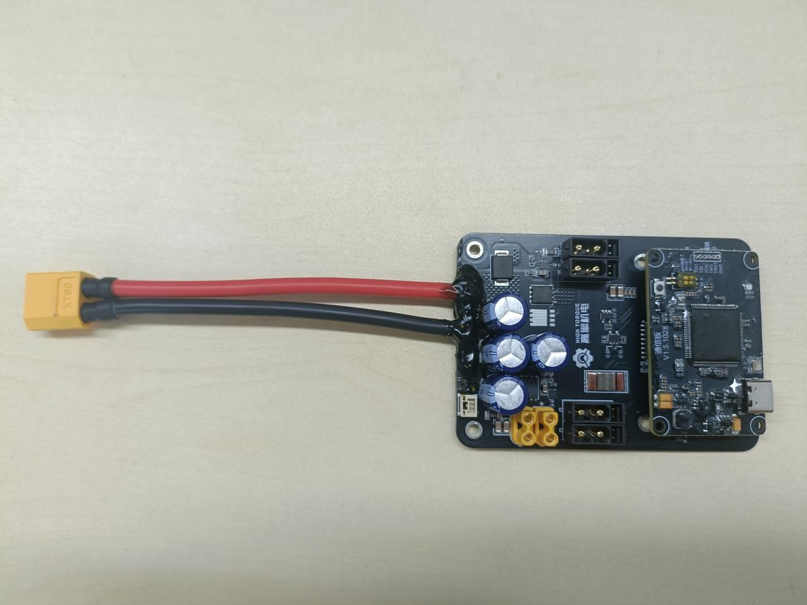

# 00-Reading Guide

Welcome to this product documentation library! To help you quickly locate the information you need, please refer to the following reading guide:

#### 🧩 Product Introduction

**Module Manual**: [1.1 HighTorque Electromechanical Module Product Manual.pdf](./01-motor/1.1-product-manual.md)

#### 🧩 Model Drawings

**Motor Model Drawings**: [Motor 3D Model Drawings](https://www.hightorque.cn/%e4%b8%8b%e8%bd%bd-%e8%a1%8c%e6%98%9f%e7%b3%bb%e5%88%97%e5%85%b3%e8%8a%82%e6%a8%a1%e7%bb%84%e6%a8%a1%e5%9e%8b%e5%9b%be)

#### 🧩 Instructions for Use

Please read the manual carefully before using HighTorque products.

1. **First-time users** can refer to the HighTorque Motor Debug Assistant quick start guide [2.1 PC Software Quick Start](./02-motor-debugging-assistant/2.1-quick-start.md) to learn how to use and connect the module and verify that the module is functioning normally. Then refer to the PC software manual [2.2 PC Software Instructions](./02-motor-debugging-assistant/2.2-user-guide.md) for initial module debugging and to learn about the various control modes.
2. **Users who purchased the module only (without a communication board) and are developing independently** can refer to the protocol routines as a reference. It is recommended to port the routines directly for use.
    - If using the **FDCAN protocol**, refer to the FDCAN routine detailed documentation [3.2 FDCAN Routine Detailed Description](./03-motor-example-code/3.2-FDCAN-example-details.md) and the FDCAN protocol parsing document [1.2 FDCAN Protocol Parsing](./01-motor/1.2-fdcan-protocol.md). If you are unfamiliar with microcontroller usage procedures, refer to the routine quick start [3.1 Quick Start](./03-motor-example-code/3.1-quick-start.md).
    - If using the **CAN protocol** for control, refer to [3.3 CAN Routine Detailed Description](./03-motor-example-code/3.3-CAN-example-details.md) and [1.3 CAN Protocol Parsing](./01-motor/1.3-CAN-protocol.md).
3. **Users with a matching communication board** can refer to the documents below based on the product purchased:
    - **h730 development board** users can first read the routine quick start guide [3.1 Quick Start](./03-motor-example-code/3.1-quick-start.md) to learn how to connect the development board and run programs, then read [3.2 FDCAN Routine Detailed Description](./03-motor-example-code/3.2-FDCAN-example-details.md) and [1.2 FDCAN Protocol Parsing](./01-motor/1.2-fdcan-protocol.md).
     h730 development board
    - **RS485-to-FDCAN board** users can first read [5.1 Hardware Description](./05-RS485-to-FDCAN/5.1-hardware-guide.md) to learn how to use and wire the communication board, then read [5.2 Usage Instructions](./05-RS485-to-FDCAN/5.2-user-guide.md) and [5.3 Register Table](./05-RS485-to-FDCAN/5.3-register-table.md) for debugging and use.
     RS485-to-FDCAN board
    - **SDK companion boards (including: 7-channel CAN master control box, universal box, 4-channel CAN stack board)** users can first read [4.1 SDK Quick Start](./04-SDK/4.1-SDK-quick-start.md), select the quick start guide corresponding to the purchased communication board solution to learn how to use the product, then refer to [4.2 Software Description](./04-SDK/4.2-software-guide.md) for debugging and use.

| SDK companion boards are shown below |  |  |
| --- | --- | --- |
|  7-channel CAN master control box |  Universal box |  4-channel CAN stack board |

**Important Notes:**

1. Do not hot-plug the motor. Before connecting or disconnecting motor wiring, please turn off the power first.
2. When using the motor, connect termination resistors (typically 120 Ω) at both ends of the CAN bus; the parallel resistance will be 60 Ω.
3. If you have any usage questions, please contact the HighTorque support team via WeChat. **Phone: 15021806766, WeChat ID: GQJD2022**
