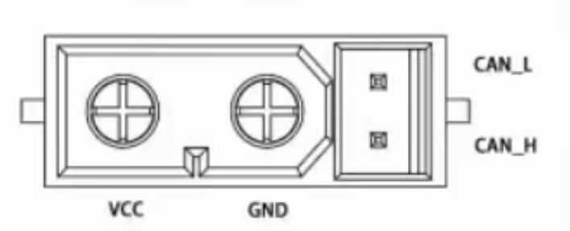

# 1.4 Motor Interface Description

## Description

**Notes:**

1. The motor interface uses an XT30 (2+2) connector for motor power supply and CAN signal transmission.
2. Connect the power supply via the XT30 (2+2) power cable; the rated voltage is 24V to power the motor.
3. Connect external control devices via the CAN communication connector to receive CAN control commands and feed back motor status information.
4. The motor includes two interfaces; either interface can be used independently or multiple motors can be daisy-chained, providing convenient cable routing.
