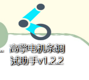
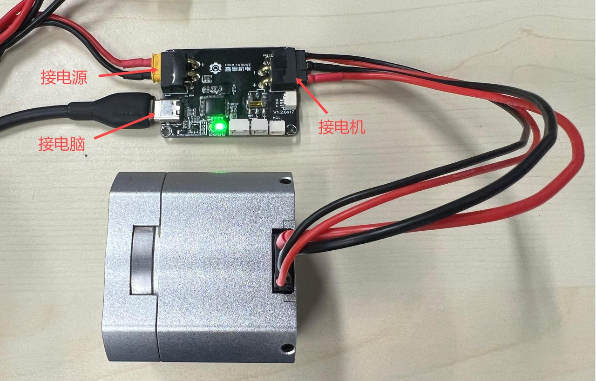
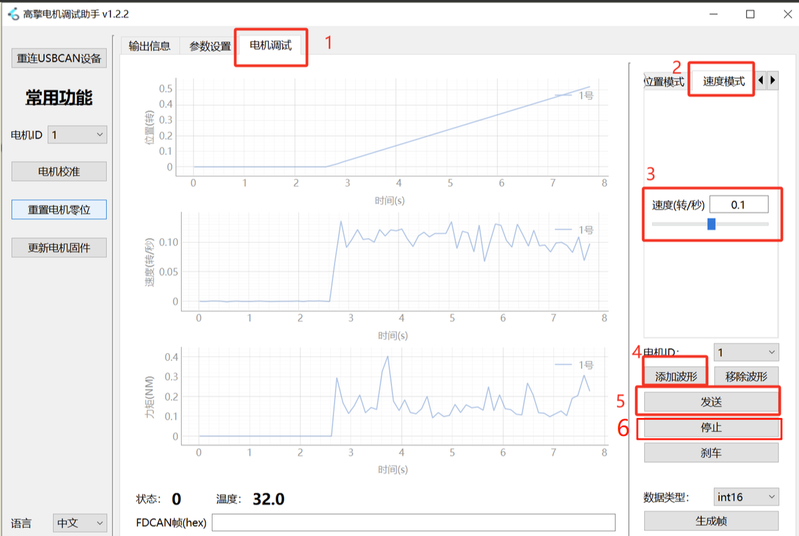

# 2.1 HT Motor Debugging Assistant Quick Start

## Purpose

**Purpose:**

- Use a USB-to-FDCAN debug board to connect to the HT Motor Debugging Assistant, and change the motor ID through the HT Motor Debugging Assistant.
- Send commands through the HT Motor Debugging Assistant to control the motor for slow rotation.

## Bill of Materials

| Item | Quantity | Image |
| --- | --- | --- |
| DC Regulated Power Supply | 1 |  |
| USB-to-FDCAN Debug Board | 1 |  |
| HT Motor (Model: 5047) | 1 |  |
| USB Cable | 1 |  |
| XT30 (2+2) Cable | 1 |  |
| XT30 Female Connector | 1 |  |
| HT Motor Debugging Assistant Software |  |  |

**Software download link:** [Motor Debugging Assistant Latest Version Download](https://www.hightorque.cn/%e4%b8%8b%e8%bd%bd-%e7%94%b5%e6%9c%ba%e8%b0%83%e8%af%95%e5%8a%a9%e6%89%8bv0-10-5)

**Note: The HT Motor Debugging Assistant only supports Windows 10 and above.**

## Hardware Preparation

### Device Connection

1. Motor rated voltage: 24V
2. Debug wiring:
    - USB-to-FDCAN debug board module: connect to the computer via Type-C interface.
    - Motor connection: use an XT30 (2+2) cable to connect the motor to the debug board module.
    - Power connection: use an XT30 cable to connect the power supply to any XT30 (2+2) port on the debug board (both ports have the same function and are interchangeable).

### Power-On Instructions

1. Turn on the power supply. At this point, a light on the bottom of the motor will illuminate, and the indicator light on the USB-to-FDCAN debug board will also light up.

## Software Usage

### Test Environment

- Operating System: Windows 10
- HT Motor Debugging Assistant Software: Motor Debugging Assistant v1.2.2
- Driver Support: COM port driver (ensure serial communication is functioning properly)

### Opening the HT Motor Debugging Assistant

1. Double-click the HT Motor Debugging Assistant. The output information panel of the HT Motor Debugging Assistant will display a successful motor connection message.

**Note:** If the result differs from the image below, please refer to the "HT Motor Debugging Assistant User Manual" connection instructions to troubleshoot the issue.

### Changing the Motor ID

**Motor ID:**

- The motor's serial number, used to identify the corresponding motor and control a specific motor.
- Motor IDs start from 1. Motors on the same CAN channel cannot have duplicate IDs.

**Steps to change the motor ID:**

1. Click on Parameter Settings.
2. Click Read Parameters.
3. View the motor ID and modify it to the desired motor ID.
4. Click Write Parameters to save the modified motor ID.

### Controlling the Motor

1. Navigate to the Motor Debug interface.
2. Click Speed Mode.
3. Set the speed to 0.1 rev/s.
4. Click Add Waveform to view the position, speed, and torque waveform charts.
5. Click Send. The motor will begin to rotate slowly, indicating that the motor is functioning normally.
6. To stop the motor, click the Stop button.
