# 2.2 HT Motor Debugging Assistant Guide

## Applicable Versions and System Requirements

- This **user guide** applies to HT Debugging Assistant v1.0.0 and above.
- The **HT Debugging Assistant** applies to motor firmware v3.1.0 and above.
- **HT Debugging Assistant supported systems**: Win10, Win11 (Win7 is not supported).

## Hardware Introduction

### Required Equipment

<br>XT30 cable

<br>XT30(2+2) cable (not required for 5046 motor)

<br>GH1.25_3P cable (required for 5046 motor only)


USB to FDCAN adapter board


USB data cable

### Device Connection

Voltage range: refer to motor voltage range

Motor interface: XT30 (2+2) connector

#### **Connection method:**

- As shown below: use a data cable to connect the computer to the Type-C port of the USB to FDCAN adapter board, connect the motor to the USB to FDCAN adapter board, and connect the DC regulated power supply to the USB to FDCAN adapter board.
- Example motor model: 5047
<br>Connection method

## Software Introduction

### Basic Information and Features


1. **Reconnect USBCAN Device:**
    - **Operations performed:**
        1. Scan and connect to the USBCAN device.
        2. Detect and connect to the motor.
    - When using the host computer to control the motor, execute this operation to reconnect the host computer and motor if a connection error occurs.
    - If the connection is lost during debugging or not all motors are detected when using multiple motors, click reconnect again.
2. **Output Info:** Displays motor connection status, calibration progress, and other debugging information.
3. **Common Functions**
    - **Motor ID:** Displays the ID of the currently connected motor.
        - Click the ID to select the motor to control.
        - You can select ALL to control all motors.
        - When connecting multiple motors, motor IDs must not be duplicated.
    - **Motor Calibration:** Recalibrates the motor. **The motor must have no load during calibration.** The calibration progress is printed in the output info window and displayed as a progress bar below.
    - **Reset Motor Zero Position:** Executes a zero position reset on the selected motor, setting the current position to 0.
    - **Update Motor Firmware:** Updates the selected firmware to the motor, with information printed as output. Updating motor firmware means updating the motor software version. The motor firmware version can be viewed on the parameter settings page. Refer to section 2.6 for the firmware update procedure.
4. **Language:** Supports Chinese and English interfaces.
5. **Progress Bar:** Used to display the progress of motor calibration and motor firmware update operations.

### Parameter Settings

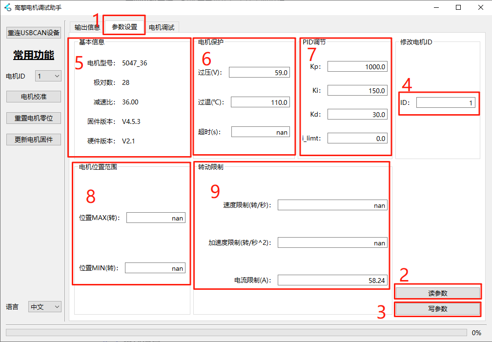

1. **Parameter Settings:** On the current "Parameter Settings" page, you can view and modify various motor operating parameters. All parameters are displayed by functional category for quick navigation.
2. **Read Parameters:** Click "Read Parameters" first to display the various motor parameter information.
3. **Write Parameters:** After completing parameter modifications, you must click this button to write the new parameters to the motor.
4. **Motor ID**: Displays the motor's ID; the motor ID can be modified.
    - The motor's serial number, used to identify the corresponding motor and control a specified motor.
    - Motor IDs start from 1. Motors on the same CAN channel cannot have duplicate IDs.
5. **Basic Info:** Displays the motor's basic information, which cannot be modified, including:
    - Motor model
    - Firmware version
    - Hardware version
    - Number of pole pairs
    - Gear ratio
6. **Motor Protection:**
    - Overvoltage: Sets the supply voltage limit. If the voltage exceeds the set value, the motor reports an error and stops to prevent motor damage.
    - Over-temperature: Sets the MOS transistor temperature limit. If the temperature exceeds the set value, the motor reports an error and stops to prevent motor damage.
    - Timeout: Sets the timeout duration. If the motor does not receive a new **control command** within the set time, it enters damping mode. This prevents the motor from continuing to move during a communication anomaly. `nan` indicates no limit.
7. **PID Tuning:** The motor's internal PID parameters (`i_limt` is the integral limit). PID parameters are the motor's internal position loop parameters and are generally not modified.
8. **Motor Position Range:**
    - Position MAX: Limits the maximum motor position value. The position cannot exceed this value when controlling the motor. (`nan` indicates no limit)
    - Position MIN: Limits the minimum motor position value. The position cannot go below this value when controlling the motor. (`nan` indicates no limit)
9. **Motion Limits:**
    - Speed Limit: Sets the speed limit. The speed will not exceed the set value when controlling the motor. (`nan` indicates no limit)
    - Acceleration Limit: Sets the acceleration limit, restricting the maximum acceleration during motor operation. This can be used to reduce acceleration and prevent errors caused by excessive acceleration during motor startup. (`nan` indicates no limit)
    - Current Limit: Sets the current limit, restricting the current input during motor operation. This can be used to reduce current input and prevent errors caused by excessive acceleration during motor startup and stop. (`nan` indicates no limit)

### Motor Debugging

1. **Motor Debugging Interface:** Supports switching between multiple control modes and can monitor the motor's running status and waveform data in real time.
2. **Motor Operating Mode:** Supports 8 control modes including position/speed/torque, and modes can be switched for motor control.
3. **Motor ID:** Select a specific motor to control via its ID (`ALL` indicates all motors).
4. **Add Waveform / Remove Waveform:** Can add/remove real-time waveforms for motor position, speed, and torque, as well as real-time status and temperature information.
5. **Motor Information:**
    - **Waveform:** Displays real-time waveforms for position, speed, and torque data.
    - **Status:** Indicates the motor's error code status.
        - `0`: Normal status
        - `Non-zero value`: For detailed error information, refer to [Table 3 - Motor Error Code Description](../06-appendix/table3-motor-error-codes.md).
    - **Temperature:** Displays the MOS transistor temperature during motor operation (unit: degrees Celsius).
6. **Send, Stop, and Brake:**
    - **Send:** Sends the control command set in item 2.
    - **Stop:** Disconnects all three motor phases. At this point, the motor has only its inherent friction force, equivalent to powering off the motor.
    - **Brake:** **Also known as damping mode.** All three motor phases are grounded, producing a "damping" effect. The resistance is positively correlated with the motor's rotational speed. The motor can rotate slowly under an external force in this state.
7. **Generate Frame:** FDCAN frame information for the motor's current operating state (selectable as float, int16, int32, or CAN frame).
    - **float, int16, int32:** Converts the selected mode and control data into a data frame.
    - For details, refer to [1.2 FDCAN Protocol Analysis](./1.2-fdcan-protocol.md) for data frame parsing (generally, the control functions from example code are used to control the motor, so you do not need to research or write the motor protocol yourself).
    - **CAN Frame:** For specific data frame parsing, refer to "[1.3 CAN Protocol Analysis](./1.3-CAN-protocol.md)" (generally, the control functions from example code are used to control the motor, so you do not need to research or write the motor protocol yourself).
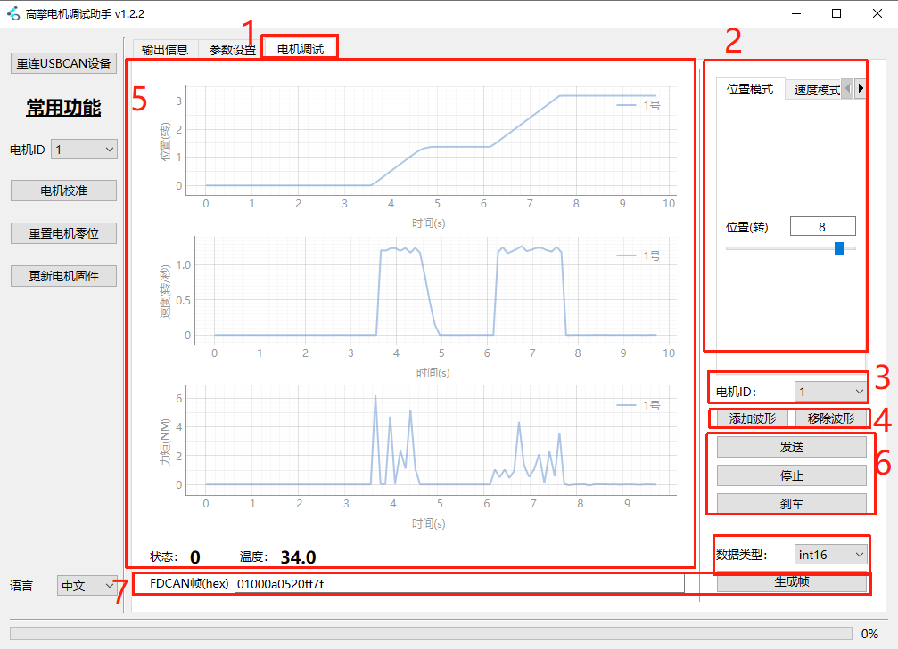

### Motor Operating Mode Description

#### Position Mode

**Description:**

1. The motor moves to the specified target position at maximum speed and maximum acceleration. Real-time motor status and waveform data can be monitored by adding waveforms.
2. Unit description:
    - `Position`: revolutions (rev)

**Notes:**

1. In this mode, both speed and torque are at maximum, making the motion relatively intense.
2. Instantaneous current may spike to 5A~10A. If the power supply response is not fast enough, or the power supply current limit is too low, the motor may not receive sufficient current instantaneously, causing an error.
3. This mode is suitable for situations with extreme response speed requirements and is generally not recommended. For position control, the **Trapezoidal Control** mode is recommended.


#### Speed Mode

**Description:**

1. The motor accelerates to the specified target speed at maximum acceleration. Real-time motor status and waveform data can be monitored by adding waveforms.
2. Unit description
    - Speed: revolutions per second (rps)


#### Torque Mode

**Description:**

1. The motor rotates according to the set target torque. Real-time motor status and waveform data can be monitored by adding waveforms.
2. Unit description
    - Torque: Newton-meters (N·m)

**Notes:**

1. If the set torque is too low, the motor may not be able to rotate.
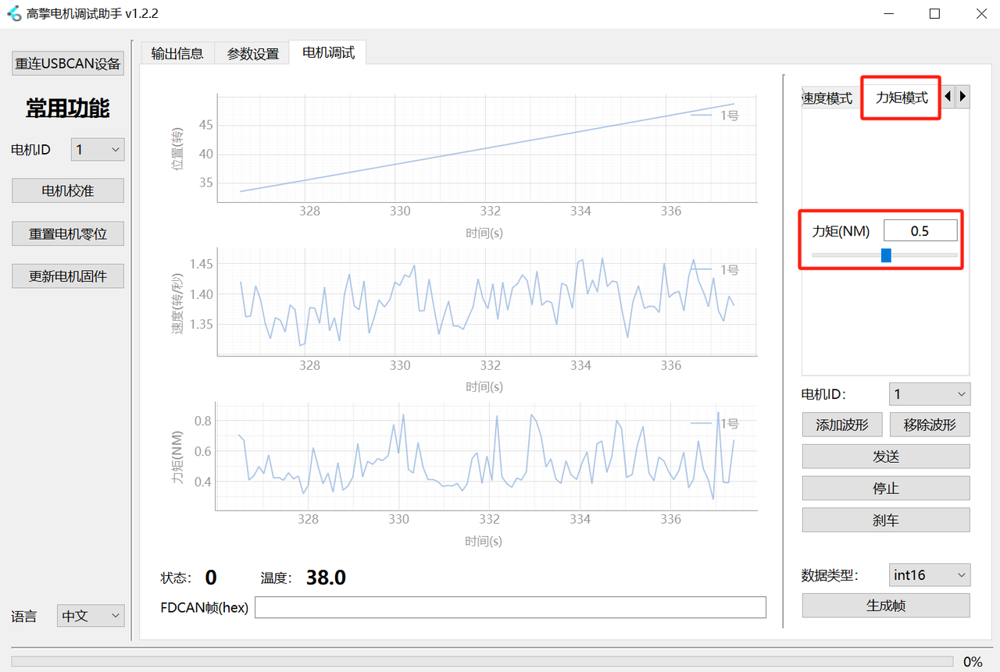

#### Voltage Mode

**Description:**

1. Controls the motor by applying a given Q-phase voltage. Real-time motor status and waveform data can be monitored by adding waveforms.
2. Unit description
    - Q-phase voltage: Volts (V)


#### Current Mode

**Description:**

1. Controls the motor by applying a given Q-phase current. Real-time motor status and waveform data can be monitored by adding waveforms.
2. Unit description
    - Q-phase current: Amperes (A)
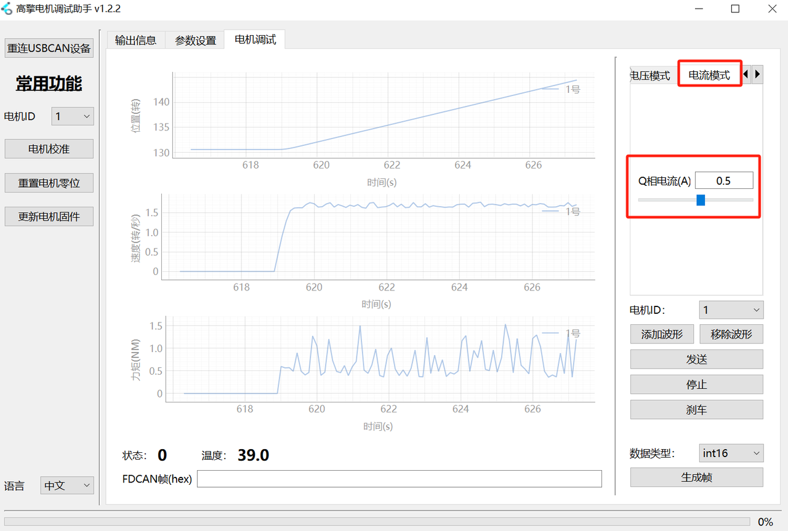

#### Position, Speed, Maximum Torque Mode

**Description:**

1. The motor moves to the specified target position at the target speed while limiting the maximum output torque. Real-time motor status and waveform data can be monitored by adding waveforms.
2. Unit description:
    - Position: revolutions (rev)
    - Speed: revolutions per second (rps)
    - Torque: Newton-meters (N·m)

**Notes:**

1. This mode limits the output torque. If the set maximum torque is too low, the motor may not be able to reach the target speed.
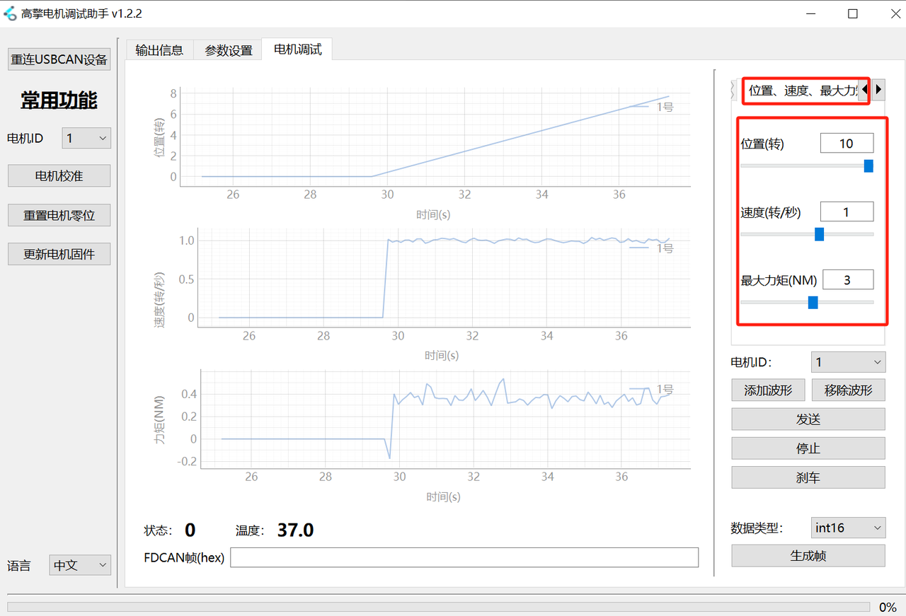

#### Trapezoidal Control Mode

**Description:**

1. The motor moves at a constant acceleration, implementing trapezoidal velocity control: accelerate → constant speed → decelerate. Real-time motor status and waveform data can be monitored by adding waveforms.
2. Unit description:
    - Position: revolutions (rev)
    - Speed: revolutions per second (rps)
    - Acceleration: revolutions per second squared (rps²)
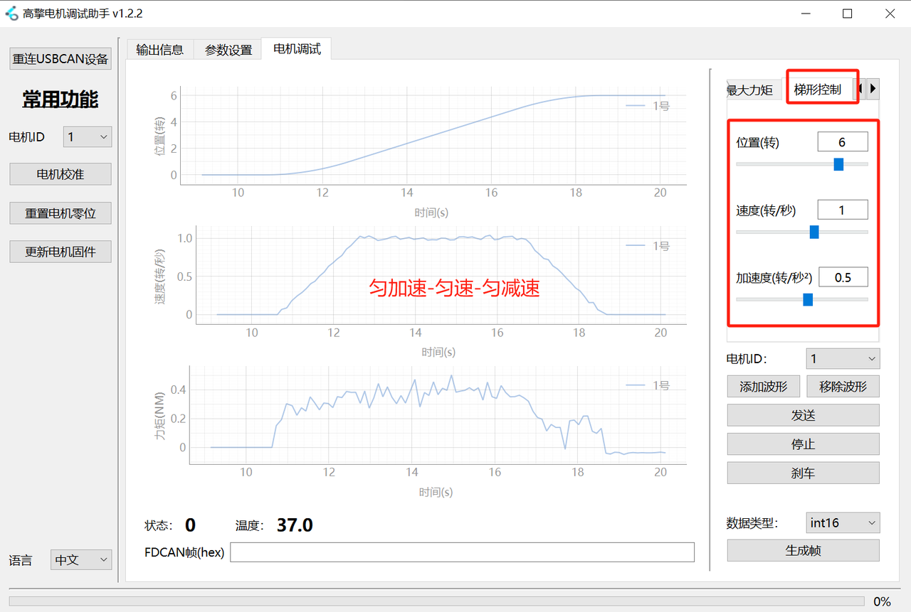

#### Motion Control Mode (MIT Mode)

**Description:**

1. The formula for calculating the motor output torque is:

```c
Output torque = position error * kp + velocity error * kd + feedforward torque
```

2. Mode usage description
    1. When kp=0 and kd=0, providing tqe achieves a given torque output. In this case, the motor continuously outputs a constant torque.
    2. When kp=0 and kd≠0, providing vel achieves constant-speed rotation. A velocity steady-state error exists during constant-speed rotation. Additionally, kd should not be too large, as an excessively large kd will cause oscillation.
    3. When kp≠0 and kd=0, oscillation will occur. That is, when controlling position, kd cannot be set to 0, otherwise the motor will oscillate or even lose control.
    4. When kp≠0 and kd≠0, there are multiple scenarios. Two common scenarios are briefly described below:
        - When the target position pos is a constant and the target velocity vel is 0, fixed-point control is achieved. The system will drive the actual position toward pos and the actual velocity toward 0, eventually coming to rest at the target position.
        - When pos is a continuously differentiable function of time and vel is the derivative of pos, position tracking and velocity tracking are achieved, i.e., rotating by the desired angle at the desired speed.
3. Real-time motor status and waveform data can be monitored by adding waveforms.
4. Unit description:
    - Position: revolutions (rev)
    - Speed: revolutions per second (rps)
    - Torque: Newton-meters (N·m)

**Notes:**

1. Appropriate `kp` and `kd` values must be set, otherwise the control effect may be poor.


### Motor Firmware Update Procedure

1. Go to the Parameter Settings page, click Read Parameters, and you can see the motor model.
    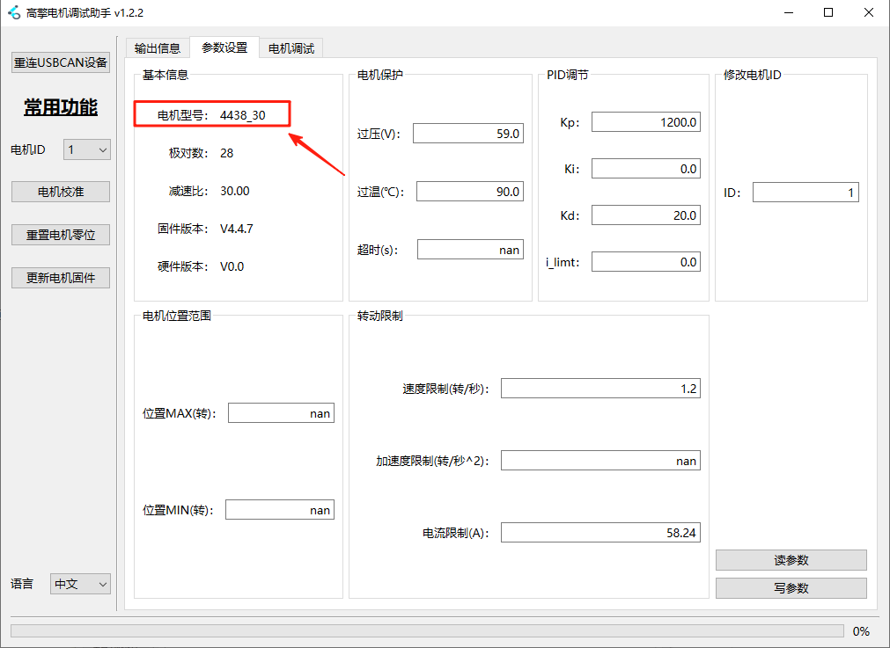
    - **Note**: Some motor model names differ between versions, as shown below:

| Motor Model | Gear Ratio | Firmware V3 Version | Firmware V4 and Above |
| --- | --- | --- | --- |
| 3536 | 32 | 3536 | 3536_32 |
| 4438 | 16 | 4438_2 | 4438_30 |
| 5046 | 20 | 5046 | 5046_20 |
| 5047 | 9 | 5047_1 | 5047_9 |
| 5047 | 36 | 5047_2 | 5047_36 |
| 6056 | 8 | 6056 | 6056_8 |

2. Click the "Update Motor Firmware" option on the main page.
    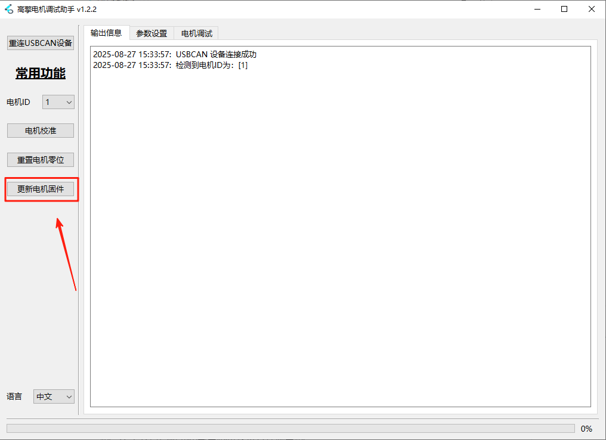
3. Locate the firmware file, select and open the firmware, then wait for the motor firmware update to complete.
    

    

**Notes:**

1. If the selected motor model does not match the firmware, the firmware update will fail and an error will be shown.
    
2. During the firmware update operation, do not operate the host computer or the motor, and be careful not to disconnect the motor power supply, as this will cause **motor damage**.

### Generate Frame Description

#### Usage Instructions

1. The generated data frames can be sent to the motor via a CAN communication device for control.
2. For the complete protocol description, refer to [1.2 FDCAN Protocol Analysis](./1.2-fdcan-protocol.md). Generally, the control functions from example code are used to control the motor, so you do not need to research or write the motor protocol yourself.

#### FDCAN Data Frame Usage

- Generate an `int16` data frame to control the motor to rotate 1 revolution: `01000a05201027`
    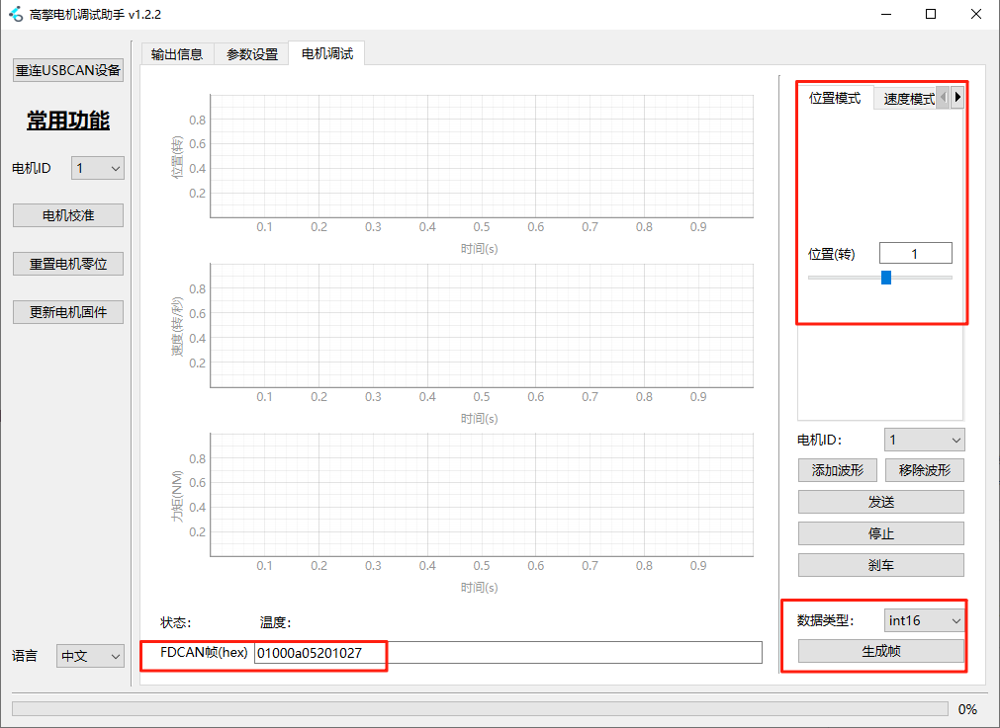
- Use CANPRO to send the data frame: click Device Management, start the device, and select the FDCAN protocol.
    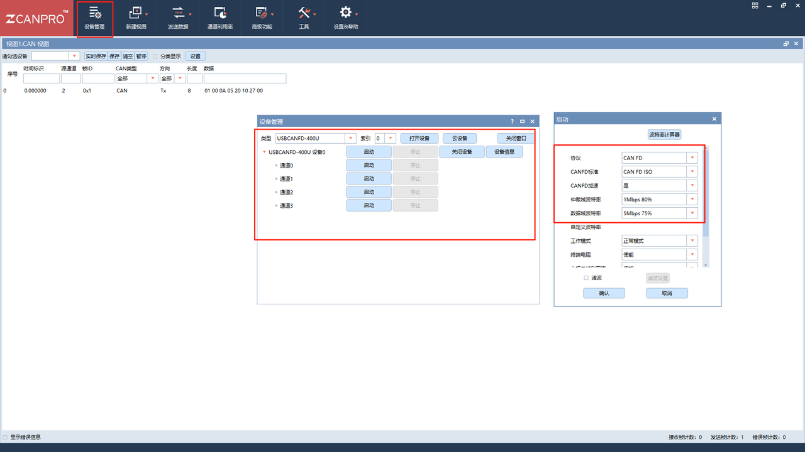
- Send the data frame:
    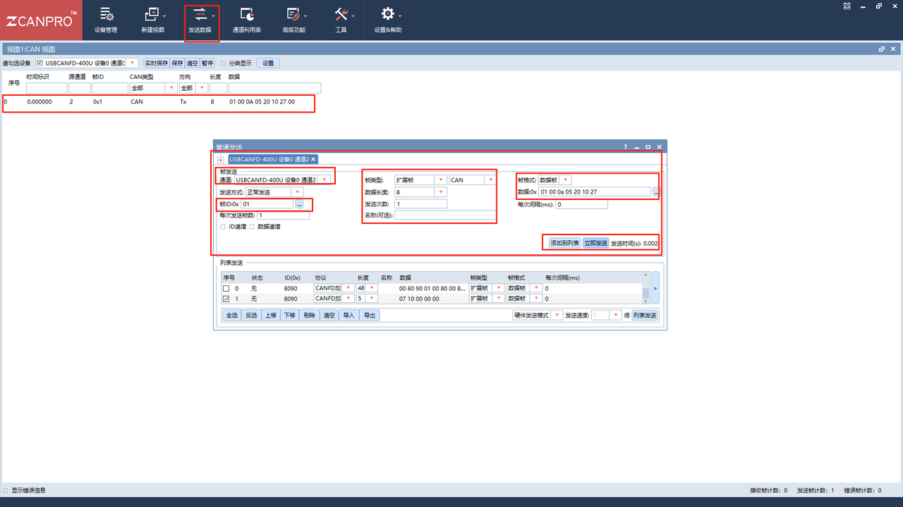
    - Click Send Data and select Normal Send.
    - Select the CAN channel to use.
    - Change the frame ID to the motor ID, set the data length, and enter the generated data frame here.
    - Click Send. The sent data frame can be seen on the main page, and the motor rotates to the 1-revolution position.

#### CAN Data Frame Usage

- Generate a CAN data frame to control the motor to rotate at 0.1 revolutions/second. The data frame is: `0707008090010080`.
    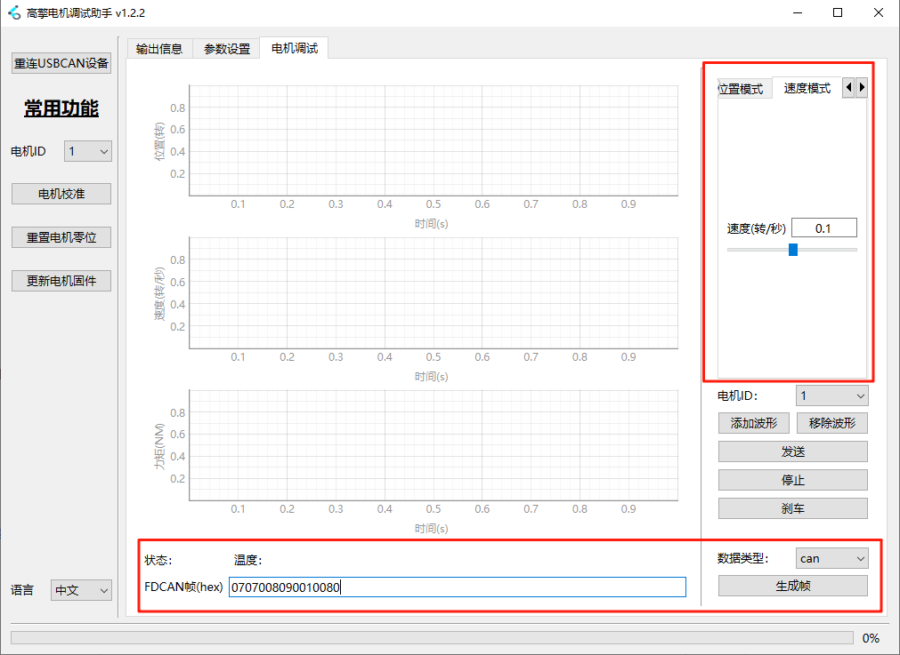
- Use CANPRO to send the data frame: click Device Management, start the device, and select the CAN protocol.
    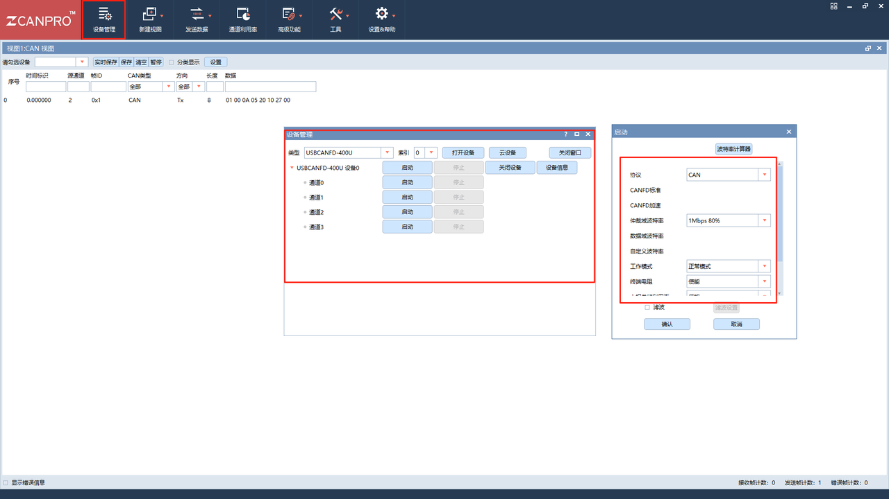
- Send the data frame:
    
    - Click Send Data and select Normal Send.
    - Select the CAN channel to use.
    - Change the frame ID to the motor ID, set the data length, and enter the generated data frame here.
    - Click Send. The sent data frame can be seen on the main page, and the motor begins to rotate.

## Usage Tips

### Checking the CAN Bus

#### Instructions

##### Symptom 1

After connecting the motor and powering it on, a connection failure occurs when trying to connect to the motor.

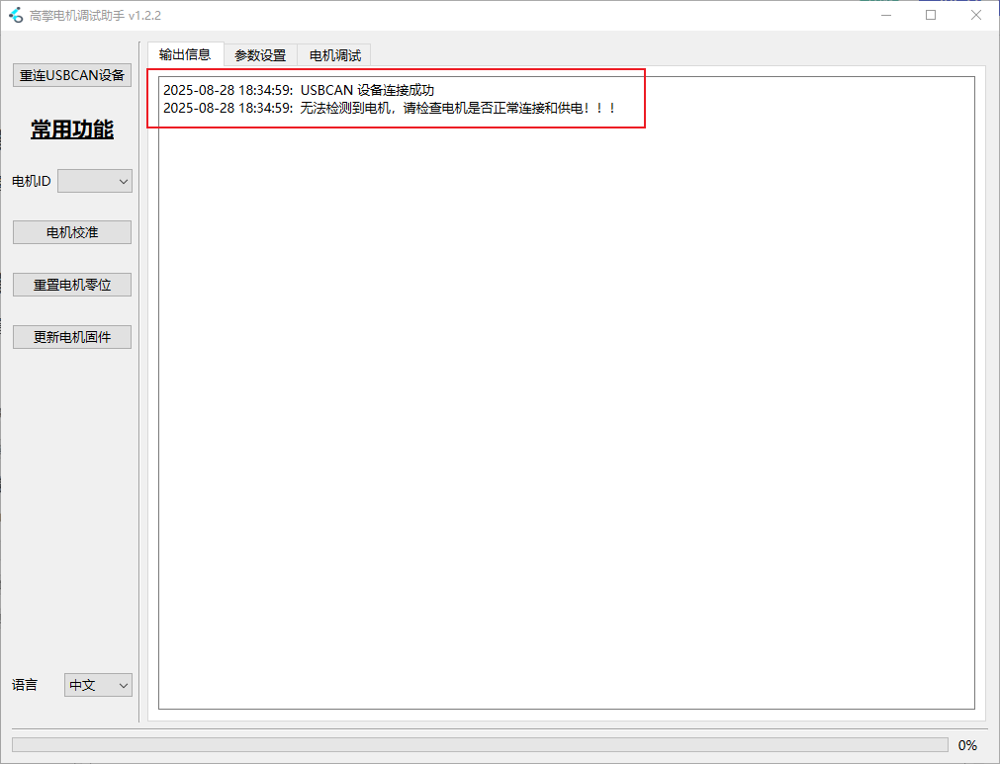

##### Symptom 2

When viewing motor waveforms, the host computer prompts that the motor has disconnected.

1. Connect the motor and the host computer, then click Motor Debugging to enter the motor debugging interface.
    

    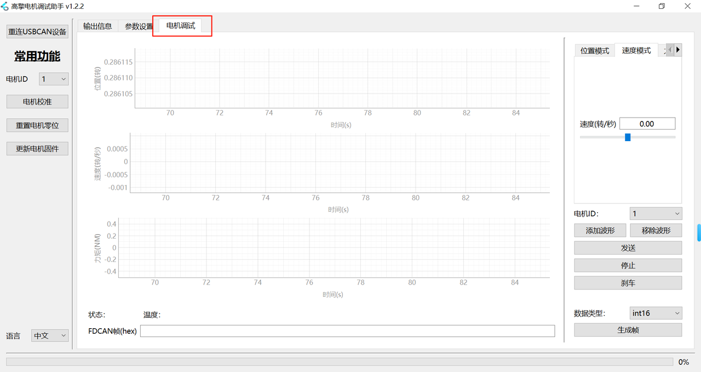
2. Click Add Waveform to view the position, speed, and torque data waveforms of the motor.
    
3. Interpret the results:
- After the waveform is generated, wait and observe for a period of time. If the host computer prompts **motor disconnected**, it indicates that the CAN bus has poor contact or has been disconnected.
    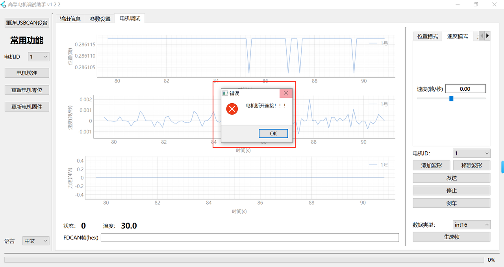<br>CAN signal disconnected

**Note:** In the host computer, the CAN communication baud rate is 1MHz, while in the program it is 5MHz. Compared to controlling the motor with the host computer, controlling the motor with a program is more susceptible to interference. Therefore, even if the CAN bus signal is detected as normal in the host computer, this does not necessarily mean the communication is completely reliable. Poor contact and interference on the CAN bus may still exist.

## Frequently Asked Questions

### Basic Questions

1. What loop does the PID tuning in the debugging assistant control?

Answer: It is the motor's position loop. Our motors do not have a speed loop.

1. What is the FDCAN frequency of the host computer?

Answer: 1MHz baud rate.

1. The upper speed limit set in the host computer is 5.0, but why can't the motor reach the given speed?

Answer: Data such as speed and torque must be checked against the motor's product specifications. Motors have maximum speed and torque values. Providing values greater than the motor's maximum to the host computer will only control the motor to run at maximum speed or maximum torque.

### Fault Issues

#### Debugging Assistant Shows Unable to Detect USBCAN

As shown below:


**Cause:**

- The debugging assistant cannot connect to the USB to FDCAN adapter board.


**Solution:**

1. Check whether the LED light on the USB to FDCAN adapter board is lit.
2. Replug the USB cable and click `Reconnect USBCAN Device`.
3. Replace the USB cable and click `Reconnect USBCAN Device`.

#### Debugging Assistant Shows Unable to Detect Motor

**As shown below:**

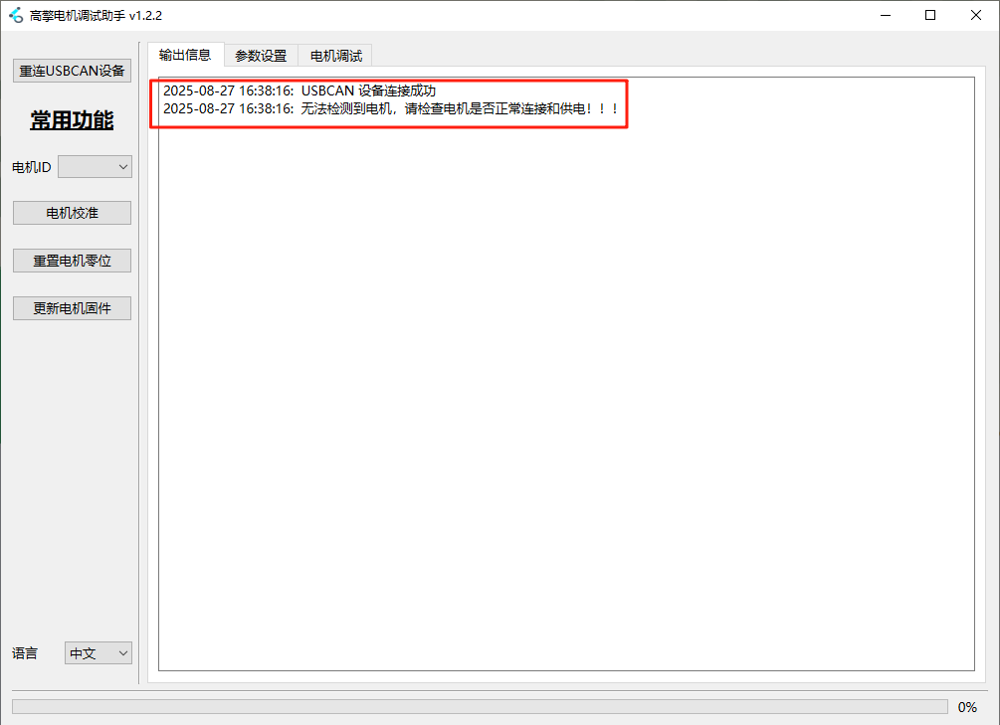

**Cause:**

- Cannot connect to the motor.


**Solution:**

- Check whether the indicator lights on the bottom of the motor and on the USB to FDCAN adapter board are lit normally.
- Restart the power supply to power the motor back on, and click `Reconnect USBCAN Device`.
- Replug the motor connection cable and click `Reconnect USBCAN Device`.
- Replace the motor connection cable and click `Reconnect USBCAN Device`.

#### When Connecting Multiple Motors, the Displayed Number of Connected Motors Is Incorrect.

**As shown below:**

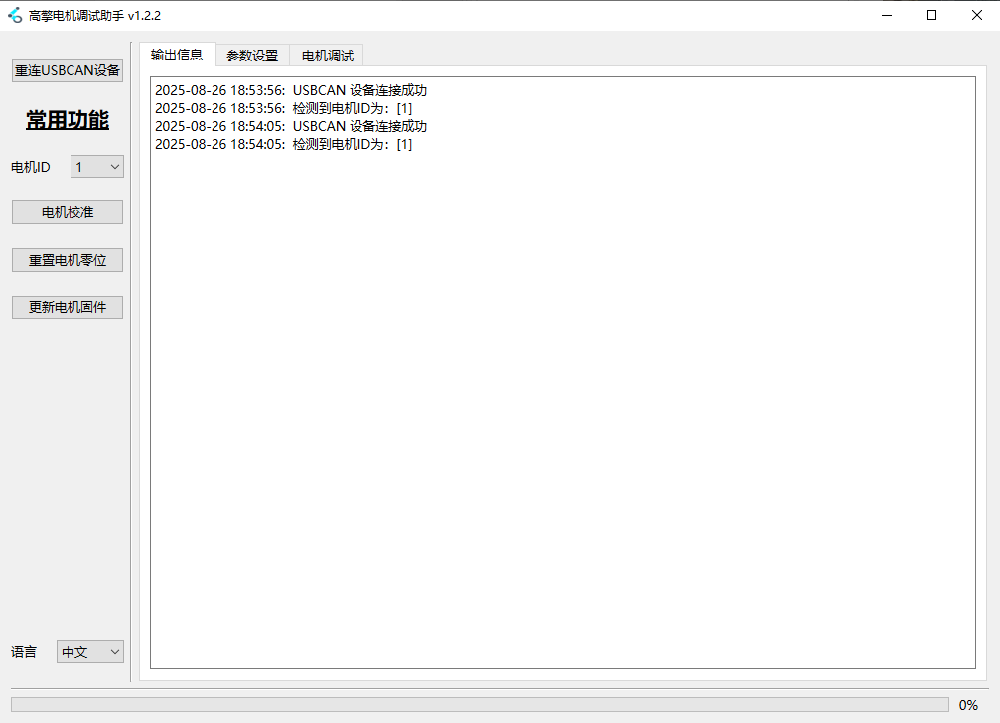

**Cause:**

- One or more motors were not detected.
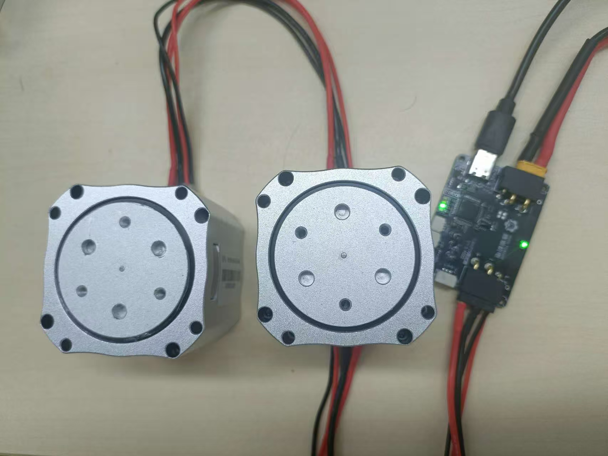

**Solution:**

1. Check whether the indicator lights on the bottom of the unconnected motors are lit normally.
2. Restart the power supply to power the motors back on, and click `Reconnect USBCAN Device`.
3. Replug the motor connection cables and click `Reconnect USBCAN Device`.
4. Replace the motor connection cables and click `Reconnect USBCAN Device`.

#### After Successfully Connecting the Motor, Entering Position Mode in the Motor Debugging Interface, Clicking Add Waveform, Sending a Target Position of 5 Revolutions — the Motor Starts, Then Loses Power and Reports an Error.


Problem: In this mode, stopping is achieved by outputting reverse torque at the current limit to perform an emergency stop. The current changes very rapidly at the moment of stopping, and if the power supply cannot respond fast enough, it will cause an instantaneous power loss and error.

Solution:

    - Reduce the current limit, or connect a capacitor in parallel on the motor line.
    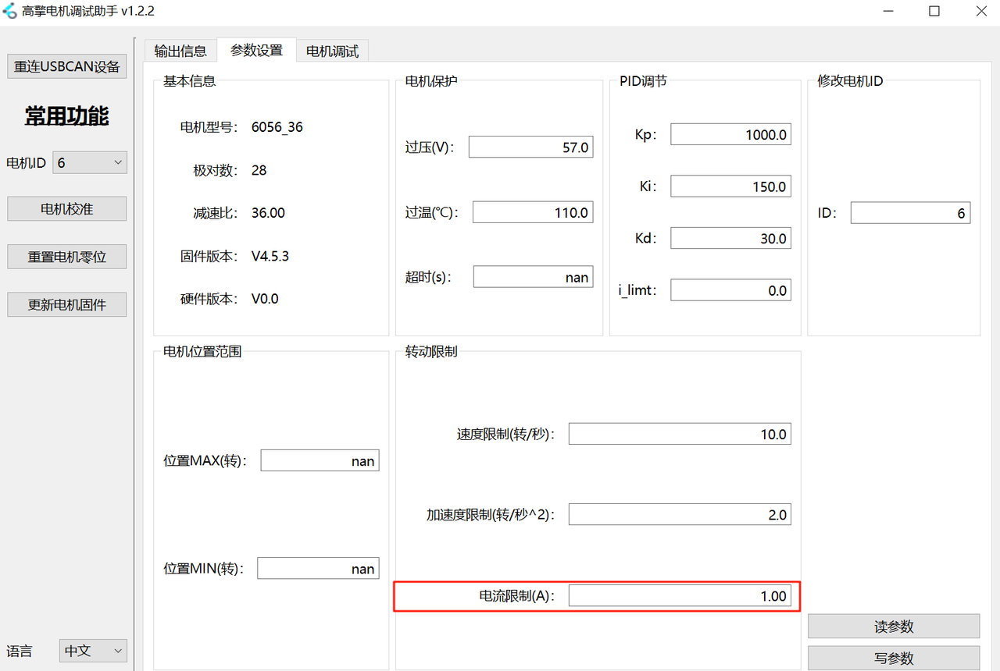
    - It is recommended to use Trapezoidal Control mode instead.
