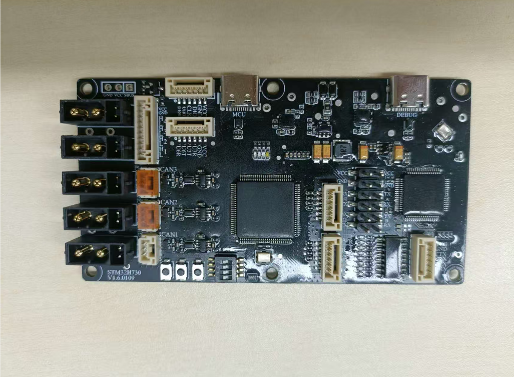
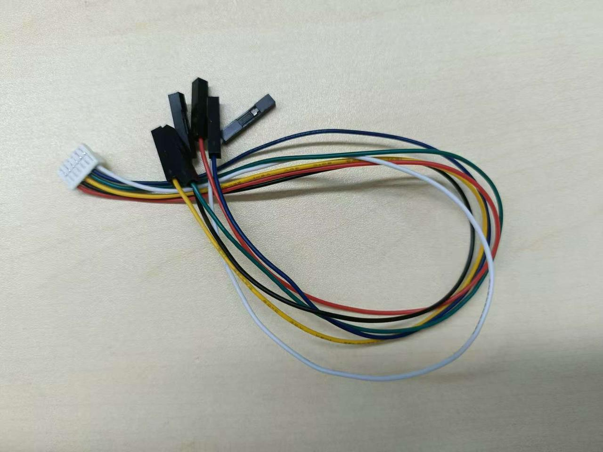
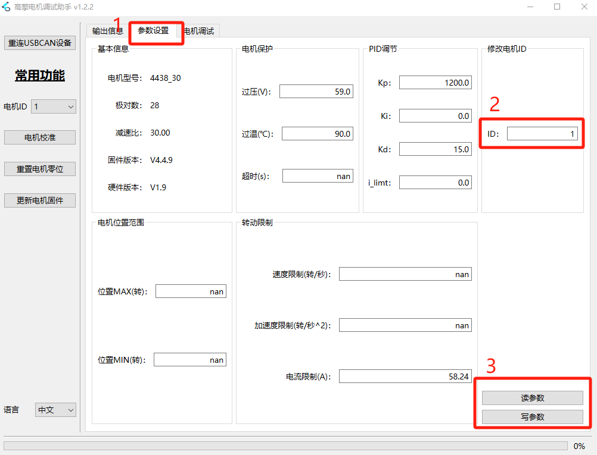
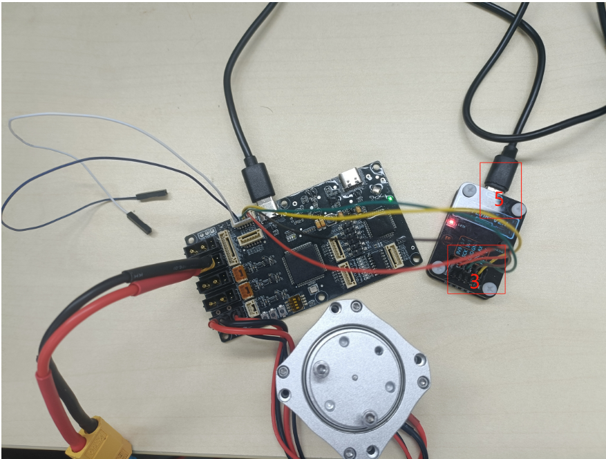
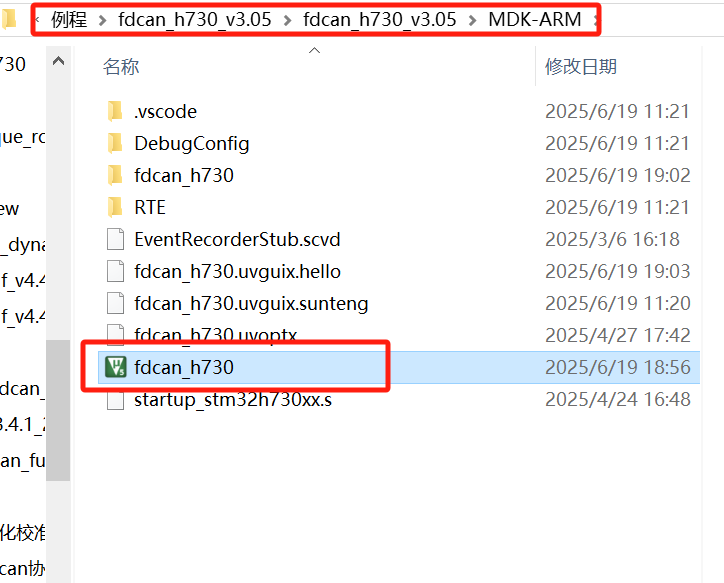
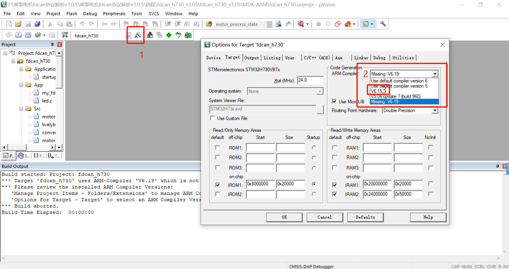
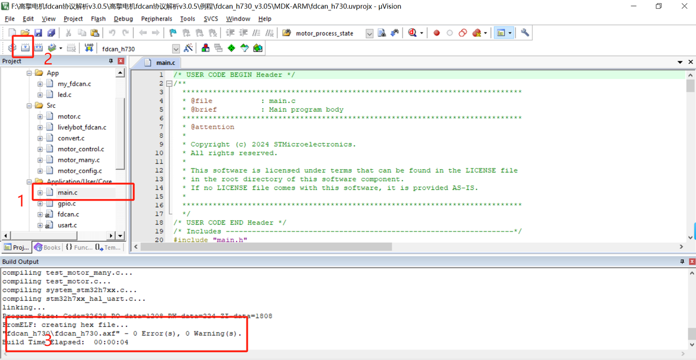
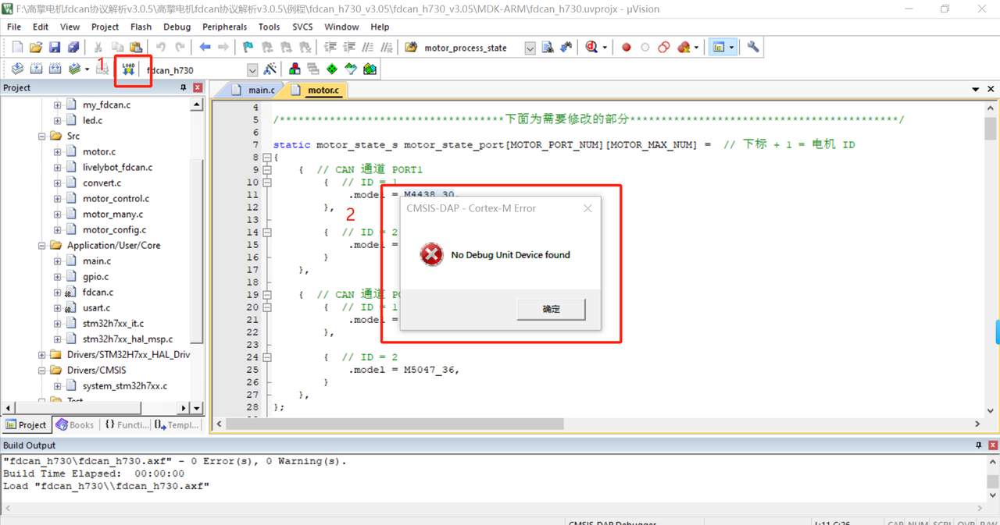
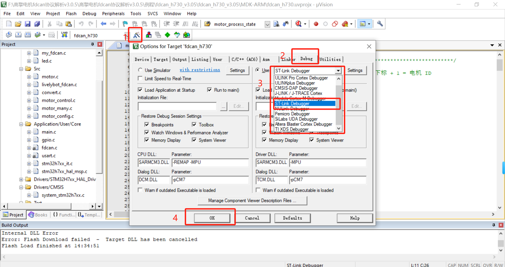
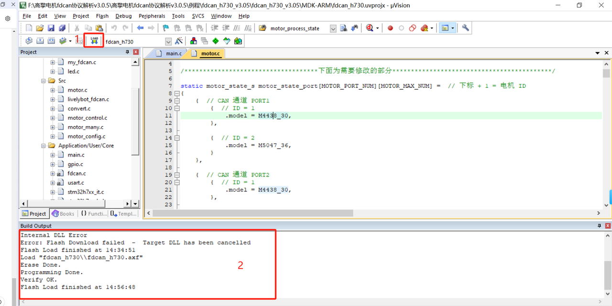

# 3.1 Quick Start

## 1. Hardware Preparation

- One DC regulated power supply
- One STM32H730VBT6 main control board
- One USB-to-FDCAN board
- Two USB cables
- Hightorque motor (here: 4438-30 motor)
- One programmer/downloader (here: ST-Link downloader; choose based on your setup)
- One 5-pin connector cable
- XT30(2+2) motor cable
- One TX30 power cable

STM32H730VBT6 main control board

ST-Link downloader

TX30 cable

 XT30(2+2) cable

5-pin connector cable

USB-to-FDCAN board

USB data cable

4438 motor

## 2. Modifying the ID

Connect the motor using the debug board and open the debug assistant (for details, refer to the debug assistant quick start guide [2.1 Quick Start](https://lingdongfangcheng.feishu.cn/wiki/BwSPwpjyLimtXTkTt0JczYOhned))

1. Click on Parameter Settings.
2. Click Read Parameters at position 3, and check the motor ID at position 2.
3. Change the motor ID to 1, then click Write Parameters to save.

Note: This example uses a motor with ID 1. In practice, set the motor ID according to your needs.

## 3. Wiring

1. Connect the power supply as shown in the figure on the right
2. Connect the motor
3. Connect the ST-Link downloader
- VCC——VCC  3.3V power
- GND——GND Ground
- DIO——SDO DIO signal line
- CLK——SCK CLK clock line
- U10T and U10K are not connected
1. Connect the USB port to the computer to power the microcontroller
2. Connect the ST-Link USB cable to the computer to download the program

1. Power on and check status

(1) The blue LED in the middle of the communication board blinks, the green LED on the right lights up, the ST-Link red LED lights up, and the blue LED at the bottom of the motor lights up.

## 4. Download, Compile, and Run the Program

Go to the Hightorque official website - Service & Support - Download Center - Joint Module section to download the FDCAN Protocol Parsing Instructions (which includes usable project code for the H730). If using the CAN example, the usage is the same as the FDCAN example — just download the CAN example instead.

Download links:

[FDCAN example download](https://www.hightorque.cn/%e3%80%90%e8%b5%84%e6%96%99%e4%b8%8b%e8%bd%bd%e3%80%91can%e5%8d%8f%e8%ae%ae%e8%a7%a3%e6%9e%90%e8%af%b4%e6%98%8e)

[CAN example download](https://www.hightorque.cn/%e9%ab%98%e6%93%8e%e6%9c%ba%e7%94%b5-can%e5%8d%8f%e8%ae%ae%e8%a7%a3%e6%9e%90%e8%af%b4%e6%98%8e)

The downloaded file contains the sample programs.

In the corresponding folder, find `fdcan_h730` and double-click to open it. (If you want to use this sample program, please install Keil first.)

### 1. Compiling the Program

Open the program and compile it.

Click the compile button at the top. If the result does not show `"fdcan_h730\fdcan_h730.axf" - 0 Error(s), 0 Warning(s).`

and instead shows the following:

Click position 1, then at position 2 select the compiler — choose the compiler you have available (here, V6.15 is used) — then click OK to confirm and save.

1. Double-click `main.c` to open the main program

2. Click the compile button to recompile

3. If compilation succeeds, the output will show `"fdcan_h730\fdcan_h730.axf" - 0 Error(s), 0 Warning(s).` — this means the program compiled successfully.

**Note**: Error indicates errors and must be 0. Warning may be non-zero for other reasons, which is acceptable.

### 2. Modifying the Program

(1) Click the Test folder, then click `test_motor.c` inside it.

(2) In `test_motor.c`, find `mode` and change its value to `3`, which corresponds to speed mode. (This test verifies whether the communication board is working correctly. During development, you can choose the mode as needed.)

(3) Position 3 shows the control mode corresponding to `mode`.

(1) Click `main.c` under the `Application/User/Core` folder.

(2) In the `while` loop inside the `int main(void)` main function, change the number in `test_motor_control(1);` to `1`. (The number corresponds to the motor ID — make sure the motor ID is correct during normal use.)

After modifying the program, recompile it and make sure it compiles successfully.

### 3. Downloading the Program

Click the download button at position 1. If the dialog shown at position 2 appears:

(1) Click the settings button at position 1 to open the dialog shown below.

(2) Click `Debug` at position 2.

(3) At position 3, select the downloader you are using (here: ST-Link).

(1) Click the download button at position 1.

(2) The output window shows that the download was successful.

Press the reset button on the communication board — the motor will now start rotating.

