# 3.2 FDCAN Example Detailed Description

### Introduction

This is a software interface package for controlling Haiqing Mechanical and Electrical motors.

Through this interface package, users can conveniently communicate with Haiqing motors, retrieve motor status information, and control motor actions.

### Software Structure Overview

- **App: Hardware**
    - `led`: Responsible for LED control.
    - `my_fdcan`: Hardware-related functionality for FDCAN.
- **Src: Application**
    - `convert`: Responsible for unit conversion, including motor position, velocity, acceleration, torque, voltage, current, PID, and unit conversions for **turns (rev), radians (rad), and degrees (°)**.
    - `livelybot_fdcan`: Implements the low-level motor protocol and handles raw data.
    - `motor_control`: Used for single-motor control, supporting 16 motor control modes.
    - `motor_many`: Used for one-to-many motor control, supporting 12 motor control modes.
    - `motor_config`: Responsible for motor configuration functions, including zero position reset with feedback and saving motor settings.
    - `motor`: Contains FDCAN interface channel mapping, motor type definitions, and motor return data parsing (including the implementation of the FDCAN interrupt function `HAL_FDCAN_RxFifo0Callback`). ***This is the main part to modify when porting and using the package.***
- **test: Testing**
    - `test_motor`: Contains single-motor function usage examples and some simple controls.
    - `test_motor_many`: Contains one-to-many mode function usage examples and some simple controls.

### Porting and Configuration Notes

- If there is no porting requirement, you can skip directly to Section 3.2 Configuration.
- Procedure:
    - Copy the `my_fdcan` folder from the `App` directory, and the `convert`, `livelybot_fdcan`, `motor_control`, `motor_many`, `motor_config`, and `motor` folders from the `Src` directory to the new project.
    - Add all 6 folders — `my_fdcan`, `convert`, `livelybot_fdcan`, `motor_control`, `motor_many`, `motor_config`, and `motor` — to the header file include paths.

#### Porting Guide

Detailed porting steps are as follows.

##### Create a New Project

1. Create project: Open STM32CubeMX and click `New Project`.
2. Select chip: In the chip selector, enter your microcontroller model (the example uses STM32H730VBT6) and double-click to select it.
3. Key system configuration: In the `Pinout & Configuration` tab, go to `System Core` -> `SYS` menu:
    - Set the `Debug` option to `Serial Wire`. This enables debugging and flashing via ST-Link.


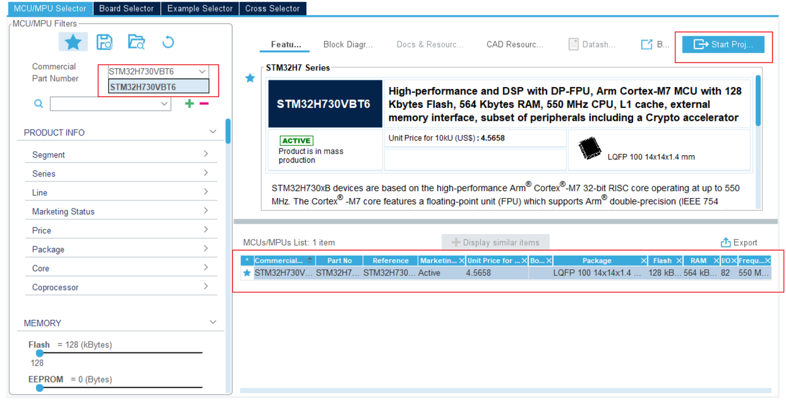

##### Clock and FDCAN Configuration

This section is critical for a successful port. Follow the steps strictly.

###### Configure External High-Speed Clock (HSE)

To ensure accurate and stable system clocking, the external high-speed clock source must be configured.

1. In the left panel, navigate to System Core > RCC (Reset and Clock Control).
2. Under RCC Mode and Configuration, find the High Speed Clock (HSE) option.
3. Change it from the default "Disable" to Crystal/Ceramic Resonator.
    - Purpose: This tells the microcontroller to use an external crystal oscillator as the high-speed clock source instead of the internal RC oscillator. An external crystal provides a more accurate clock frequency and is the foundation for stable system operation (including FDCAN communication baud rate).
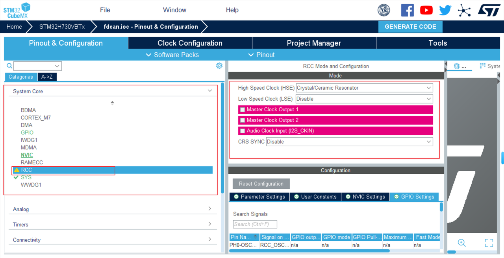

###### Configure the Clock Tree

1. Go to the `Clock Configuration` tab.
2. Set the main frequency according to your chip; in this example it is configured to 480 MHz.
3. **Find and confirm that the FDCAN clock source frequency is 80 MHz. This frequency is the basis for calculating the FDCAN communication baud rate and must match.**


###### Configure FDCAN

1. Under the `Connectivity` menu, enable all FDCAN modules you plan to use (e.g., FDCAN1, FDCAN2, FDCAN3).
2. For each enabled FDCAN module, configure the parameters according to the table below (this configuration is based on an 80 MHz clock and achieves 1 Mbps for the arbitration segment and 5 Mbps for the data segment):

> This table in Feishu/wiki is an **embedded spreadsheet** (`sheet` block) and will not be expanded in Docx `client_vars` exports. The table below matches the FDCAN parameters in CubeMX.

| Parameter Category | Parameter Name | Value | Description |
| --- | --- | --- | --- |
| Basic Parameters | Frame Format | FD mode with BitRate Switching | Enable bit rate switching |
| Basic Parameters | Mode | Normal mode | Mode: Normal / FD |
| Basic Parameters | Auto Retransmission | Enable | Automatic retransmission |
| Basic Parameters | Transmit Pause | Disable | Transmit pause |
| Basic Parameters | Protocol Exception | Enable | Protocol exception handling |
| Basic Parameters | Nominal Sync Jump Width | 8 | Arbitration segment sync jump width |
| Basic Parameters | Data Prescaler | 2 | Data segment prescaler |
| Basic Parameters | Data Sync Jump Width | 2 | Data segment sync jump width |
| Basic Parameters | Data Time Seq1 | 5 | Data segment phase buffer segment 1 |
| Basic Parameters | Data Time Seq2 | 2 | Data segment phase buffer segment 2 |
| Basic Parameters | Message Ram Offset | 0 | Message RAM start address offset |
| Basic Parameters | Std Filters Nbr | 0 | Number of standard ID filters |
| Basic Parameters | Ext Filters Nbr | 0 | Number of extended ID filters |
| Basic Parameters | Rx Fifo0 Elmts Nbr | 10 | Number of Rx FIFO0 elements |
| Basic Parameters | Rx Fifo0 Elmt Size | 64 bytes | FIFO0 element size |
| Basic Parameters | Rx Fifo1 Elmts Nbr | 0 | Number of Rx FIFO1 elements |
| Basic Parameters | Rx Fifo1 Elmt Size | 64 bytes | FIFO1 element size |
| Basic Parameters | Rx Buffers Nbr | 0 | Number of Rx buffers |
| Basic Parameters | Rx Buffer Size | 64 bytes | Rx buffer size |
| Basic Parameters | Tx Events Nbr | 0 | Number of Tx events |
| Basic Parameters | Tx Buffers Nbr | 0 | Number of Tx buffers |
| Basic Parameters | Tx Fifo Queue Elmts Nbr | 4 | Number of Tx FIFO queue elements |
| Basic Parameters | Tx Fifo Queue Mode | FiFO mode | Tx queue mode |
| Basic Parameters | Tx Elmt Size | 64 bytes | Tx element size |
| Clock Calibration | Clock Calibration | Disable | Clock calibration switch |
| Bit Timing Parameters | Nominal Prescaler | 2 | Arbitration segment prescaler |
| Bit Timing Parameters | Nominal Time Quantum | 25.0 ns | Arbitration segment time quantum |
| Bit Timing Parameters | Nominal Time Seq1 | 31 | Arbitration segment phase buffer segment 1 |
| Bit Timing Parameters | Nominal Time Seq2 | 8 | Arbitration segment phase buffer segment 2 |
| Bit Timing Parameters | Nominal Time for one Bit | 1000 ns | Arbitration segment time per bit |
| Bit Timing Parameters | Nominal Baud Rate | 1000000 bit/s | Arbitration segment baud rate |

3. Enable interrupts: For each FDCAN module, go to the `NVIC Settings` tab and enable `FDCANx Interrupt 0` (where x is the CAN number). This is required for receiving motor data; at least two FDCAN channel interrupts must be enabled.
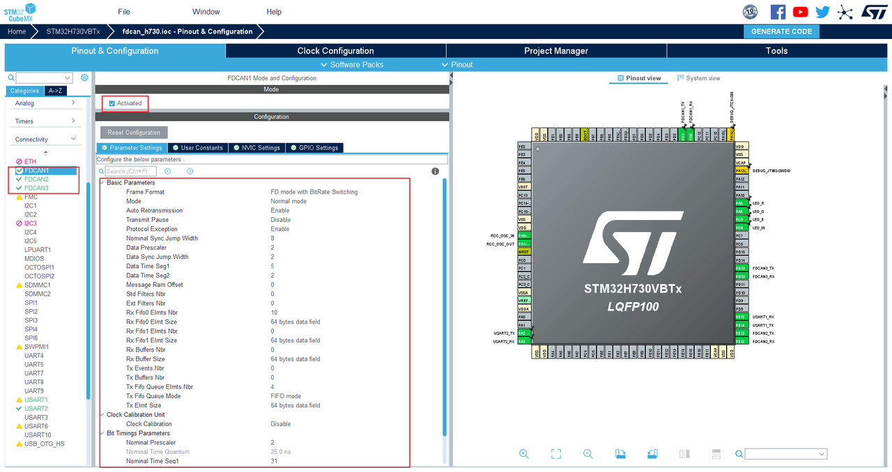


4. You can view the configuration in `fdcan.c` in your project:

```cpp
hfdcan1.Instance = FDCAN1;
    hfdcan1.Init.FrameFormat = FDCAN_FRAME_FD_BRS;
    hfdcan1.Init.Mode = FDCAN_MODE_NORMAL;
    hfdcan1.Init.AutoRetransmission = ENABLE;
    hfdcan1.Init.TransmitPause = DISABLE;
    hfdcan1.Init.ProtocolException = ENABLE;
    hfdcan1.Init.NominalPrescaler = 2;
    hfdcan1.Init.NominalSyncJumpWidth = 8;
    hfdcan1.Init.NominalTimeSeg1 = 31;
    hfdcan1.Init.NominalTimeSeg2 = 8;
    hfdcan1.Init.DataPrescaler = 2;
    hfdcan1.Init.DataSyncJumpWidth = 2;
    hfdcan1.Init.DataTimeSeg1 = 5;
    hfdcan1.Init.DataTimeSeg2 = 2;
    hfdcan1.Init.MessageRAMOffset = 0;
    hfdcan1.Init.StdFiltersNbr = 0;
    hfdcan1.Init.ExtFiltersNbr = 0;
    hfdcan1.Init.RxFifo0ElmtsNbr = 10;
    hfdcan1.Init.RxFifo0ElmtSize = FDCAN_DATA_BYTES_64;
    hfdcan1.Init.RxFifo1ElmtsNbr = 0;
    hfdcan1.Init.RxFifo1ElmtSize = FDCAN_DATA_BYTES_64;
    hfdcan1.Init.RxBuffersNbr = 0;
    hfdcan1.Init.RxBufferSize = FDCAN_DATA_BYTES_64;
    hfdcan1.Init.TxEventsNbr = 0;
    hfdcan1.Init.TxBuffersNbr = 0;
    hfdcan1.Init.TxFifoQueueElmtsNbr = 4;
    hfdcan1.Init.TxFifoQueueMode = FDCAN_TX_FIFO_OPERATION;
    hfdcan1.Init.TxElmtSize = FDCAN_DATA_BYTES_64;
```


###### Configure Other Peripherals (Optional)

Configure UART, LED GPIO, and other peripherals as needed for your project. The example enables these functions for reference.


##### Code Generation and File Porting

###### Generate Code:

1. Configure code generation options
- Go to `Project Manager` -> `Code Generator` for key settings:
    - Uncheck `Generate peripheral initialization as a pair of '.c/.h' files per peripheral`. This consolidates all peripheral initialization code into `main.c`, greatly simplifying the project structure and avoiding too many scattered files.
    - Be sure to check `Keep User Code when re-generating`. This is the most important setting; it protects code written within specific comment tags (`/* USER CODE BEGIN */`) from being overwritten when code is regenerated.
- Go to `Project Manager` -> `Project` tab, name your project, and select a save path.
    - In `Toolchain / IDE`, select the IDE you are using (e.g., `MDK-ARM`).
1. Generate project files
After completing the settings, return to the `Project` page, verify the project path and IDE options are correct, and click GENERATE CODE to generate the complete project code.

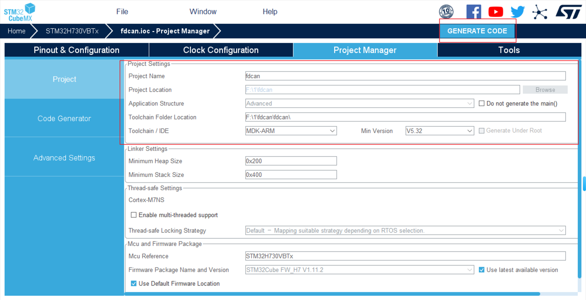


###### File Porting

- Copy the following folders from the original software package directory completely to the root directory of your newly generated STM32 project:

```bash
├── App/
│   └── my_fdcan/           # Hardware Abstraction Layer (HAL)
├── Src/
│   ├── convert/            # Unit conversion
│   ├── livelybot_fdcan/    # Low-level protocol handling
│   ├── motor_control/      # Single-motor control
│   ├── motor_many/         # One-to-many control
│   ├── motor_config/       # Motor configuration (e.g., zero position reset)
│   └── motor/              # [Core] Motor type definitions, communication mapping, data parsing
└── test/                   # (Recommended to copy, for reference)
    ├── test_motor/         # Single-motor usage examples
    └── test_motor_many/    # One-to-many usage examples
```

- (Recommended) Also copy the `test/test_motor` and `test/test_motor_many` folders to the project as usage reference examples.
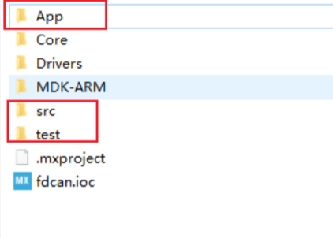

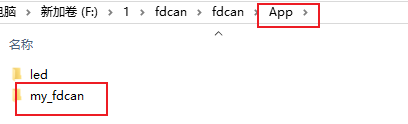


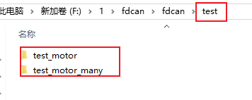

###### Add Header File Paths:

- Open the project in your IDE (e.g., Keil MDK), and go to `Options for Target` -> `C/C++` tab.
- In `Include Paths`, add all of the following paths (check carefully to ensure the paths are correct):

```xml
.\App\my_fdcan
.\Src\convert
.\Src\livelybot_fdcan
.\Src\motor_config
.\Src\motor_control
.\Src\motor_many
.\Src\motor
.\test\test_motor
.\test\test_motor_many
```

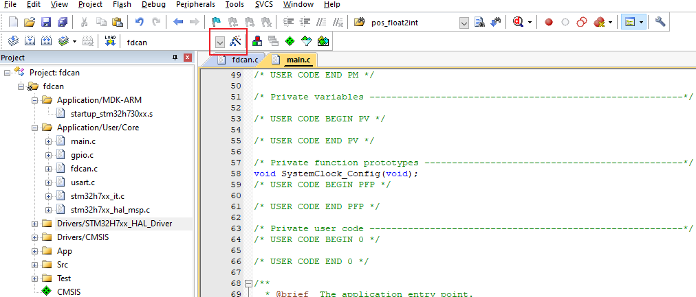

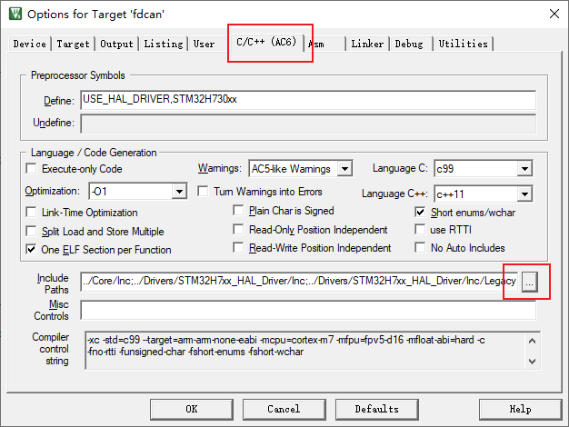

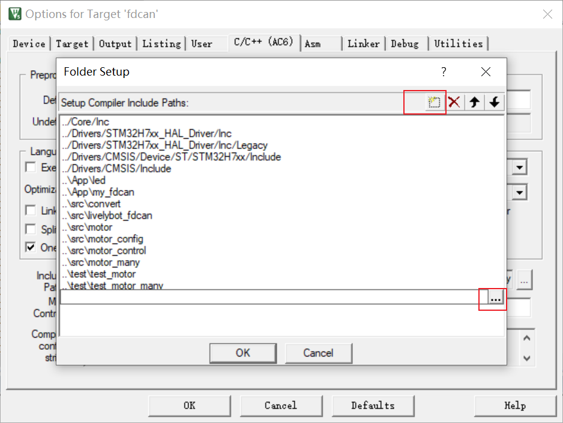

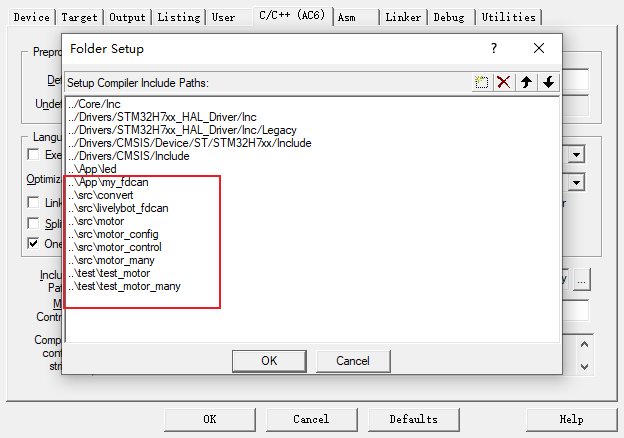

###### Add Source Files to the Project

1. In the IDE's project management window, create three new file groups named `App`, `Src`, and `Test`.
2. Drag or add the corresponding source files (`.c` files) to their respective groups:
    - `App` group: Add `my_fdcan.c` and `led.c` (not required).
    - `Src` group: Add `motor.c`, `livelybot_fdcan.c`, `convert.c`, `motor_control.c`, `motor_many.c`, `motor_config.c`.
    - `Test` group (optional): Add `test_motor.c` and `test_motor_many.c` as reference examples.
3. Add the corresponding source files to their respective groups. Once added successfully, you can see the complete, functionally grouped project file structure clearly in the IDE's project manager.

```xml
my_fdcan.c
convert.c
livelybot_fdcan.c
motor_control.c
motor_many.c
motor_config.c
motor.c
(Optional) test_motor.c and test_motor_many.c
```


###### Include Header Files in the Project

In your main program file (e.g., `main.c`), include the necessary header files:

```text
#include "motor.h"
#include "motor_control.h"
#include "motor_many.h"
#include "motor_config.h"

#include "test_motor.h"
#include "test_motor_many.h"
```

###### Modify Error Macros:

1. In the `convert.h` file, there are macros for checking certain configuration or usage errors. By default, `led_toggle_err` is used to make all LEDs blink simultaneously to indicate an error. Modify as needed.
2. `#include "led.h"` is included here only to use the `led_toggle_err` function. If not needed, simply delete it.

```text
#include "led.h"
#ifdef  LED_ERR_FLAG  // This macro is defined in led.h
#define  MOTOR_ERR    led_toggle_err  // All LEDs blink
#else
static inline void MOTOR_ERR(void) {}
#endif
```

1. Build successful, porting complete.

###### my_fdcan Porting File Description

1. Transmit

```c
FDCAN_TxHeaderTypeDef TxHeader =
{
    .TxFrameType = FDCAN_DATA_FRAME,
    .ErrorStateIndicator = FDCAN_ESI_ACTIVE,
    .BitRateSwitch = FDCAN_BRS_ON,
    .FDFormat = FDCAN_FD_CAN,
    .TxEventFifoControl = FDCAN_NO_TX_EVENTS,
    .MessageMarker = 0,
};

void fdcan_send(FDCAN_HandleTypeDef *fdcanHandle, uint32_t id, uint8_t *data, uint16_t size)
{
    TxHeader.Identifier = id;

    if(id > 0x7ff)
    {
        TxHeader.IdType = FDCAN_EXTENDED_ID;
    }
    else
    {

        TxHeader.IdType = FDCAN_STANDARD_ID;
    }
    TxHeader.DataLength = get_fdcan_dlc(size);
    HAL_FDCAN_AddMessageToTxFifoQ(fdcanHandle, &TxHeader, data);
}
```

    - `FDCAN_TxHeaderTypeDef TxHeader` is the transmit handle, configured as an FDCAN data frame with error state indicator, bit rate switching enabled, CAN FD frame format, no transmit event logging to Tx Event FIFO, and message marker set to 0.
    - `fdcan_send` is a function that automatically identifies standard frames and extended frames and sends CAN FD data.
2. Conversion between data length in bytes and DLC encoding values

```c
uint32_t get_fdcan_dlc(uint16_t size)
{
    uint32_t fdcan_dlc = 0;

    if(size == 0)
    {
        fdcan_dlc = FDCAN_DLC_BYTES_0;
    }
    else if(size <= 1)
    {
        fdcan_dlc = FDCAN_DLC_BYTES_1;
    }
    else if(size <= 2)
    {
        fdcan_dlc = FDCAN_DLC_BYTES_2;
    }
    else if(size <= 3)
    {
        fdcan_dlc = FDCAN_DLC_BYTES_3;
    }
    else if(size <= 4)
    {
        fdcan_dlc = FDCAN_DLC_BYTES_4;
    }
    else if(size <= 5)
    {
        fdcan_dlc = FDCAN_DLC_BYTES_5;
    }
    else if(size <= 6)
    {
        fdcan_dlc = FDCAN_DLC_BYTES_6;
    }
    else if(size <= 7)
    {
        fdcan_dlc = FDCAN_DLC_BYTES_7;
    }
    else if(size <= 8)
    {
        fdcan_dlc = FDCAN_DLC_BYTES_8;
    }
    else if(size <= 12)
    {
        fdcan_dlc = FDCAN_DLC_BYTES_12;
    }
    else if(size <= 16)
    {
        fdcan_dlc = FDCAN_DLC_BYTES_16;
    }
    else if(size <= 20)
    {
        fdcan_dlc = FDCAN_DLC_BYTES_20;
    }
    else if(size <= 24)
    {
        fdcan_dlc = FDCAN_DLC_BYTES_24;
    }
    else if(size <= 32)
    {
        fdcan_dlc = FDCAN_DLC_BYTES_32;
    }
    else if(size <= 48)
    {
        fdcan_dlc = FDCAN_DLC_BYTES_48;
    }
    else if(size <= 64)
    {
        fdcan_dlc = FDCAN_DLC_BYTES_64;
    }
    return fdcan_dlc;
}

uint16_t get_fdcan_data_size(uint32_t dlc)
{
    uint16_t size = 0;

    switch (dlc)
    {
    case FDCAN_DLC_BYTES_0:
        size = 0;
        break;
    case FDCAN_DLC_BYTES_1:
        size = 1;
        break;
    case FDCAN_DLC_BYTES_2:
        size = 2;
        break;
    case FDCAN_DLC_BYTES_3:
        size = 3;
        break;
    case FDCAN_DLC_BYTES_4:
        size = 4;
        break;
    case FDCAN_DLC_BYTES_5:
        size = 5;
        break;
    case FDCAN_DLC_BYTES_6:
        size = 6;
        break;
    case FDCAN_DLC_BYTES_7:
        size = 7;
        break;
    case FDCAN_DLC_BYTES_8:
        size = 8;
        break;
    case FDCAN_DLC_BYTES_12:
        size = 12;
        break;
    case FDCAN_DLC_BYTES_16:
        size = 16;
        break;
    case FDCAN_DLC_BYTES_20:
        size = 20;
        break;
    case FDCAN_DLC_BYTES_24:
        size = 24;
        break;
    case FDCAN_DLC_BYTES_32:
        size = 32;
        break;
    case FDCAN_DLC_BYTES_48:
        size = 48;
        break;
    case FDCAN_DLC_BYTES_64:
        size = 64;
        break;
    default:
        break;
    }

    return size;
}
```

    - These two functions implement bidirectional conversion between data length in bytes and DLC encoding values in CAN FD: `get_fdcan_dlc` maps the actual byte count to the CAN FD protocol DLC encoding, and `get_fdcan_data_size` converts the DLC encoding back to the corresponding byte count.
    - Simply copy and use as-is.
3. FDCAN filter

```c
void fdcan_filter_init(FDCAN_HandleTypeDef *fdcanHandle)
{
    if (HAL_FDCAN_ConfigGlobalFilter(fdcanHandle, FDCAN_ACCEPT_IN_RX_FIFO0, FDCAN_ACCEPT_IN_RX_FIFO0, FDCAN_FILTER_REMOTE, FDCAN_FILTER_REMOTE) != HAL_OK)
    {
        Error_Handler();
    }

    if (HAL_FDCAN_ActivateNotification(
                fdcanHandle, FDCAN_IT_RX_FIFO0_NEW_MESSAGE | FDCAN_IT_TX_FIFO_EMPTY, 0) != HAL_OK)
    {
        Error_Handler();
    }
    HAL_FDCAN_ConfigTxDelayCompensation(fdcanHandle, fdcanHandle->Init.DataPrescaler * fdcanHandle->Init.DataTimeSeg1, 0);
    HAL_FDCAN_EnableTxDelayCompensation(fdcanHandle);

    if (HAL_FDCAN_Start(fdcanHandle) != HAL_OK)
    {
        Error_Handler();
    }
}
```

- This is an accept-all filter, equivalent to "receive all data frames."

#### Configuration (Required on First Use)

This step is performed according to your actual hardware connections.

##### Modify Macro Definitions in `motor.h`

1. Modify the macro definition `MOTOR_MAX_NUM` based on the maximum number of motors to be connected on a single CAN channel.
    - For example, if three CAN channels are used — CAN1 with 1 motor, CAN2 with 2 motors, and CAN3 with 5 motors — set `MOTOR_MAX_NUM` to 5 (use the maximum motor count).

```text
#define  MOTOR_MAX_NUM  5
```

1. Modify the macro definition `MOTOR_PORT_NUM` to match the number of CAN channels used for motor communication.
    - For example, if the STM32G474 has three CAN channels and only CAN1 and CAN3 are used for motors, set `MOTOR_PORT_NUM` to 2.

```text
#define  MOTOR_PORT_NUM   2  // Number of channels
```

##### Modify the `motor_state_port` Struct Array (Configure Motor Models)

1. In `motor.c`, the struct array `motor_state_port[MOTOR_PORT_NUM][MOTOR_MAX_NUM]` is defined and must be modified according to the motor models for correct torque compensation.
2. Suppose we are connecting four motors in total, with two motors per channel, distributed as follows:

    1.`PORT1`:

        `1.4438_30`

        `2.5047_36`

    2.`PORT2`:

        `1.6056_36`

        `2.5046_20`
        The `motor_state_port` configuration would be as follows:

```text
static motor_state_s motor_state_port[MOTOR_PORT_NUM][MOTOR_MAX_NUM] =  // Index + 1 = motor ID
{
    {  // CAN channel PORT1
        {  // ID = 1
            .model = M4438_30,
        },

        {  // ID = 2
            .model = M5047_36,
        }
    },

    {  // CAN channel PORT2
        {  // ID = 1
            .model = M6056_36,
        },

        {  // ID = 2
            .model = M5046_20,
        }
    },
};
```

##### Modify the PORT, FDCAN, and STATE Mapping

1. In `motor.c`, the struct array `port_maping[MOTOR_PORT_NUM]` defines the mapping relationships between PORT, FDCAN, and STATE.
2. Suppose we are using two channels, CAN2 and CAN3, and we want to define:
    - `CAN2` mapped to `PORT1`, with state data stored in `motor_state_port[0]`.
    - `CAN3` mapped to `PORT2`, with state data stored in `motor_state_port[1]`.
3. The corresponding configuration is as follows:

```text
const port_mapping_s port_maping[MOTOR_PORT_NUM] =  // Channel mapping table
{
    {
        .port = PORT1,
        .fdcan = &hfdcan2,
        .state = motor_state_port[0],
    },

    {
        .port = PORT2,
        .fdcan = &hfdcan3,
        .state = motor_state_port[1],
    },
};
```

##### Modify Position and Velocity Units

- Position and velocity units support: **turns (rev), radians (rad), or degrees (°)**, switched via the macro definition `MOTOR_DATA_TYPE_FLAG` in `convert.h`. **The default is turns (rev).**
1. To use **turns (rev)** as the position and velocity unit:

```text
#define  MOTOR_DATA_TYPE_FLAG  TURNS
```

1. To use **radians (rad)** as the position and velocity unit:

```text
#define  MOTOR_DATA_TYPE_FLAG  RADIAN_2PI
```

1. To use **degrees (°)** as the position and velocity unit:

```text
#define  MOTOR_DATA_TYPE_FLAG  ANGLE_360
```

### Function Examples

#### Single-Motor Control Mode `motor_control.c`

- All functions in this file, except the motor soft restart function `motor_set_reset`, include motor status query functionality (parsing functions are in `motor.c`).
- All functions in this file send the corresponding FDCAN frame immediately upon being called, with no software buffer.
- The position and velocity units used in this file are determined by the macro definition `MOTOR_DATA_TYPE_FLAG`. See "Modify Position and Velocity Units" for details.
- The control frequency of functions in this file must not be too high. At 1 Mbps arbitration and 5 Mbps data rate, a single CAN bus can control at most 3 motors per millisecond — i.e., at most 3 motors at 1 kHz control frequency. To control more motors, reduce the control frequency or use one-to-many control mode (each control cycle includes both sending a command and receiving motor status).
- Units for each parameter are described in detail in the function comments in the code.
- `TINT16` corresponds to the `int16` data type; position control is limited to `±3.2` turns.

##### DQ Voltage Mode

**Description:**

1. Controls the motor by a given Q-phase voltage and retrieves motor status.
2. Parameter description:
    - `portx`: CAN channel selection
    - `type`: Communication protocol data type, affects data precision and range; `TFLOAT`, `TINT32`, `TINT16` correspond to `float`, `int32`, `int16`
    - `id`: Motor ID
    - `volt`: Q-phase voltage, unit: volts (V).
3. Function implementation:
    - `vol_float2int`: Scale conversion of voltage value.
    - `set_dq_volt_float`: Low-level control function for `float` data type.
    - `set_dq_volt_int32`: Low-level control function for `int32` data type.
    - `set_dq_volt_int16`: Low-level control function for `int16` data type.

```c
void motor_set_dq_vlot(port_t portx, const data_type_t type, const uint8_t id, const float volt)
{
    FDCAN_HandleTypeDef *fdcanHandle = motor_get_fdcan_pointer(portx);
    const float temp = vol_float2int(volt, type);

    switch(type)
    {
    case TFLOAT:
        set_dq_volt_float(fdcanHandle, id, temp);
        break;
    case TINT32:
        set_dq_volt_int32(fdcanHandle, id, temp);
        break;
    case TINT16:
        set_dq_volt_int16(fdcanHandle, id, temp);
        break;
    default:
        break;
    }
}
```

##### DQ Current Mode

**Description:**

1. Controls the motor by a given Q-phase current and retrieves motor status.
2. Parameter description:
    - `portx`: CAN channel selection
    - `type`: Communication protocol data type, affects data precision and range; `TFLOAT`, `TINT32`, `TINT16` correspond to `float`, `int32`, `int16`
    - `id`: Motor ID
    - `cur`: Q-phase current, unit: amperes (A).
3. Function implementation:
    - `cur_float2int`: Scale conversion of current value.
    - `set_dq_current_float`: Low-level control function for `float` data type.
    - `set_dq_current_int32`: Low-level control function for `int32` data type.
    - `set_dq_current_int16`: Low-level control function for `int16` data type.

```c
void motor_set_dq_current(port_t portx, const data_type_t type, const uint8_t id, const float cur)
{
    FDCAN_HandleTypeDef *fdcanHandle = motor_get_fdcan_pointer(portx);
    const float temp = cur_float2int(cur, type);

    switch(type)
    {
    case TFLOAT:
        set_dq_current_float(fdcanHandle, id, temp);
        break;
    case TINT32:
        set_dq_current_int32(fdcanHandle, id, temp);
        break;
    case TINT16:
        set_dq_current_int16(fdcanHandle, id, temp);
        break;
    default:
        break;
    }
}
```

##### Position Mode

**Description:**

1. The motor moves to the specified **target position** at **maximum speed** and **maximum acceleration**, and returns motor status.
2. Parameter description:
    - `portx`: CAN channel selection
    - `type`: Communication protocol data type, affects data precision and range; `TFLOAT`, `TINT32`, `TINT16` correspond to `float`, `int32`, `int16`
    - `id`: Motor ID
    - `pos`: Target position, unit can be turns (rev), radians (rad), or degrees (°), as determined by the macro definition `MOTOR_DATA_TYPE_FLAG`.
3. Function implementation:
    - `conv_to_turns`: Converts position unit to turns (rev).
    - `pos_float2int`: Scale conversion of position value.
    - `set_pos_float`: Low-level control function for `float` data type.
    - `set_pos_int32`: Low-level control function for `int32` data type.
    - `set_pos_int16`: Low-level control function for `int16` data type.

**Note:**

1. In this mode, speed and torque are both at maximum, resulting in aggressive motion.
2. Instantaneous current may spike to 5A–10A. If the power supply response is not fast enough or the current limit is too low, the motor may not receive sufficient current instantaneously and may report an error.
3. This mode is suitable for cases with extreme response speed requirements and is generally not recommended. For position control, the **trapezoidal control** mode is recommended.

```c
void motor_set_pos(port_t portx, const data_type_t type, const uint8_t id, const float pos)
{
    FDCAN_HandleTypeDef *fdcanHandle = motor_get_fdcan_pointer(portx);
    const float temp1 = conv_to_turns(pos, MOTOR_DATA_TYPE_FLAG);
    const float temp2 = pos_float2int(temp1, type);

    switch(type)
    {
    case TFLOAT:
        set_pos_float(fdcanHandle, id, temp2);
        break;
    case TINT32:
        set_pos_int32(fdcanHandle, id, temp2);
        break;
    case TINT16:
        set_pos_int16(fdcanHandle, id, temp2);
        break;
    default:
        break;
    }
}
```

##### Velocity Mode

**Description:**

1. The motor accelerates at **maximum acceleration** to the specified **target velocity**, and returns motor status.
2. Parameter description:
    - `portx`: CAN channel selection
    - `type`: Communication protocol data type, affects data precision and **range**; `TFLOAT`, `TINT32`, `TINT16` correspond to `float`, `int32`, `int16`
    - `id`: Motor ID
    - `vel`: Target velocity, unit can be turns per second (rps), radians per second (rad/s), or degrees per second (°/s), as determined by the macro definition `MOTOR_DATA_TYPE_FLAG`.
3. Function implementation:
    - `conv_to_turns`: Converts velocity unit to turns per second (rps).
    - `vel_float2int`: Scale conversion of velocity value.
    - `set_vel_float`: Low-level control function for `float` data type.
    - `set_vel_int32`: Low-level control function for `int32` data type.
    - `set_vel_int16`: Low-level control function for `int16` data type.

```c
void motor_set_vel(port_t portx, const data_type_t type, const uint8_t id, const float vel)
{
    FDCAN_HandleTypeDef *fdcanHandle = motor_get_fdcan_pointer(portx);
    const float temp1 = conv_to_turns(vel, MOTOR_DATA_TYPE_FLAG);
    const float temp2 = vel_float2int(temp1, type);

    switch(type)
    {
    case TFLOAT:
        set_vel_float(fdcanHandle, id, temp2);
        break;
    case TINT32:
        set_vel_int32(fdcanHandle, id, temp2);
        break;
    case TINT16:
        set_vel_int16(fdcanHandle, id, temp2);
        break;
    default:
        break;
    }
}
```

##### Torque Mode

**Description:**

1. The motor rotates according to the set target torque and returns motor status.
2. Parameter description:
    - `portx`: CAN channel selection
    - `type`: Communication protocol data type, affects data precision and range; `TFLOAT`, `TINT32`, `TINT16` correspond to `float`, `int32`, `int16`
    - `id`: Motor ID
    - `tqe`: Target torque, unit: Newton-meters (N·m).
3. Function implementation:
    - `tqe_adjust`: Torque output correction; motor internal torque processing is handled here to compensate the motor output torque.
    - `tqe_float2int`: Scale conversion of torque value.
    - `set_torque_float`: Low-level control function for `float` data type.
    - `set_torque_int32`: Low-level control function for `int32` data type.
    - `set_torque_int16`: Low-level control function for `int16` data type.

```c
void motor_set_tqe(port_t portx, const data_type_t type, const uint8_t id, const float tqe)
{
    FDCAN_HandleTypeDef *fdcanHandle = motor_get_fdcan_pointer(portx);
    const float temp1 = tqe_adjust(tqe, motor_get_model2(portx, id));
    const float temp2 = tqe_float2int(temp1, type);

    switch(type)
    {
    case TFLOAT:
        set_torque_float(fdcanHandle, id, temp2);
        break;
    case TINT32:
        set_torque_int32(fdcanHandle, id, temp2);
        break;
    case TINT16:
        set_torque_int16(fdcanHandle, id, temp2);
        break;
    default:
        break;
    }
}
```

##### Position and Velocity Mode

**Description:**

1. The motor moves to the specified target position at the target velocity, and returns motor status.
2. Parameter description:
    - `portx`: CAN channel selection
    - `type`: Communication protocol data type, affects data precision and range; supports int16, int32, and float
    - `id`: Motor ID
    - `pos`: Target position, unit can be turns (rev), radians (rad), or degrees (°), as determined by the macro definition `MOTOR_DATA_TYPE_FLAG`
    - `vel`: Target velocity, unit can be turns per second (rps), radians per second (rad/s), or degrees per second (°/s), as determined by the macro definition `MOTOR_DATA_TYPE_FLAG`
3. Function implementation:
    - `conv_to_turns`: Converts position unit to turns (rev) and velocity unit to turns per second (rps).
    - `pos_float2int`: Scale conversion of position value.
    - `vel_float2int`: Scale conversion of velocity value.
    - `set_pos_vel_tqe_float`: Low-level control function for `float` data type.
    - `set_pos_vel_tqe_int32`: Low-level control function for `int32` data type.
    - `set_pos_vel_tqe_int16`: Low-level control function for `int16` data type.

```c
void motor_set_pos_vel(port_t portx, const data_type_t type, const uint8_t id, const float pos, const float vel)
{
    FDCAN_HandleTypeDef *fdcanHandle = motor_get_fdcan_pointer(portx);
    const float pos1 = conv_to_turns(pos, MOTOR_DATA_TYPE_FLAG);
    const float vel1 = conv_to_turns(vel, MOTOR_DATA_TYPE_FLAG);
    const float pos2 = pos_float2int(pos1, type);
    const float vel2 = vel_float2int(vel1, type);
    switch(type)
    {
    case TFLOAT:
        set_pos_vel_tqe_float(fdcanHandle, id, pos2, vel2, NAN_FLOAT);
        break;
    case TINT32:
        set_pos_vel_tqe_int32(fdcanHandle, id, pos2, vel2, NAN_INT32);
        break;
    case TINT16:
        set_pos_vel_tqe_int16(fdcanHandle, id, pos2, vel2, NAN_INT16);
        break;
    default:
        break;
    }
}
```

##### Position, Velocity, and Maximum Torque Mode

**Description:**

1. The motor moves to the specified target position at the target velocity while limiting the maximum output torque, and returns motor status.
2. Parameter description:
    - `portx`: CAN channel selection
    - `type`: Communication protocol data type, affects data precision and range; `TFLOAT`, `TINT32`, `TINT16` correspond to `float`, `int32`, `int16`
    - `id`: Motor ID
    - `pos`: Target position, unit can be turns (rev), radians (rad), or degrees (°), as determined by the macro definition `MOTOR_DATA_TYPE_FLAG`
    - `vel`: Target velocity, unit can be turns per second (rps), radians per second (rad/s), or degrees per second (°/s), as determined by the macro definition `MOTOR_DATA_TYPE_FLAG`
    - `tqe`: Target torque, unit: Newton-meters (N·m).
3. Function implementation:
    - `conv_to_turns`: Converts position unit to turns (rev) and velocity unit to turns per second (rps).
    - `tqe_adjust`: Torque output correction; motor internal torque processing is handled here to compensate the motor output torque.
    - `pos_float2int`: Scale conversion of position value.
    - `vel_float2int`: Scale conversion of velocity value.
    - `tqe_float2int`: Scale conversion of torque value.
    - `set_pos_vel_tqe_float`: Low-level control function for `float` data type.
    - `set_pos_vel_tqe_int32`: Low-level control function for `int32` data type.
    - `set_pos_vel_tqe_int16`: Low-level control function for `int16` data type.

**Note:**

1. This mode limits the output torque. If the maximum torque is set too low, the motor may not be able to reach the target velocity.

```text
void motor_set_pos_vel_MAXtqe(port_t portx, const data_type_t type, const uint8_t id,
                              const float pos, const float vel, const float tqe)
{
    FDCAN_HandleTypeDef *fdcanHandle = motor_get_fdcan_pointer(portx);
    const float pos1 = conv_to_turns(pos, MOTOR_DATA_TYPE_FLAG);
    const float vel1 = conv_to_turns(vel, MOTOR_DATA_TYPE_FLAG);
    const float tqe1 = tqe_adjust(tqe, motor_get_model2(portx, id));
    const float pos2 = pos_float2int(pos1, type);
    const float vel2 = vel_float2int(vel1, type);
    const float tqe2 = tqe_float2int(tqe1, type);
    switch(type)
    {
    case TFLOAT:
        set_pos_vel_tqe_float(fdcanHandle, id, pos2, vel2, tqe2);
        break;
    case TINT32:
        set_pos_vel_tqe_int32(fdcanHandle, id, pos2, vel2, tqe2);
        break;
    case TINT16:
        set_pos_vel_tqe_int16(fdcanHandle, id, pos2, vel2, tqe2);
        break;
    default:
        break;
    }
}
```

##### Position, Velocity, and Acceleration Mode (Trapezoidal Control)

**Description:**

1. The motor moves at a **constant acceleration**, implementing a trapezoidal velocity profile of accelerate → cruise → decelerate, and returns motor status.
2. Parameter description:
    - `portx`: CAN channel selection
    - `type`: Communication protocol data type, affects data precision and range; `TFLOAT`, `TINT32`, `TINT16` correspond to `float`, `int32`, `int16`
    - `id`: Motor ID
    - `pos`: Target position, unit can be turns (rev), radians (rad), or degrees (°), as determined by the macro definition `MOTOR_DATA_TYPE_FLAG`
    - `vel`: Target velocity, unit can be turns per second (rps), radians per second (rad/s), or degrees per second (°/s), as determined by the macro definition `MOTOR_DATA_TYPE_FLAG`
    - `acc`: Acceleration, unit can be turns per second squared (rev/s^2), radians per second squared (rad/s^2), or degrees per second squared (°/s^2), as determined by the macro definition `MOTOR_DATA_TYPE_FLAG`
3. Function implementation:
    - `conv_to_turns`: Converts position unit to turns (rev), velocity unit to turns per second (rps), and acceleration unit to turns per second squared (rps²).
    - `pos_float2int`: Scale conversion of position value.
    - `vel_float2int`: Scale conversion of velocity value.
    - `acc_float2int`: Scale conversion of acceleration value.
    - `set_pos_velmax_acc_float`: Low-level control function for `float` data type.
    - `set_pos_velmax_acc_int32`: Low-level control function for `int32` data type.
    - `set_pos_velmax_acc_int16`: Low-level control function for `int16` data type.

```c
void motor_set_pos_velmax_acc(port_t portx, const data_type_t type, const uint8_t id, const float pos, const float vel, const float acc)
{
    FDCAN_HandleTypeDef *fdcanHandle = motor_get_fdcan_pointer(portx);
    const float pos1 = conv_to_turns(pos, MOTOR_DATA_TYPE_FLAG);
    const float vel1 = conv_to_turns(vel, MOTOR_DATA_TYPE_FLAG);
    const float acc1 = conv_to_turns(acc, MOTOR_DATA_TYPE_FLAG);
    const float pos2 = pos_float2int(pos1, type);
    const float vel2 = vel_float2int(vel1, type);
    const float acc2 = acc_float2int(acc1, type);
    switch(type)
    {
    case TFLOAT:
        set_pos_velmax_acc_float(fdcanHandle, id, pos2, vel2, acc2);
        break;
    case TINT32:
        set_pos_velmax_acc_int32(fdcanHandle, id, pos2, vel2, acc2);
        break;
    case TINT16:
        set_pos_velmax_acc_int16(fdcanHandle, id, pos2, vel2, acc2);
        break;
    default:
        break;
    }
}
```

##### Velocity and Acceleration Mode

**Description:**

1. Accelerates to the target velocity at the target acceleration, and returns motor status.
2. Parameter description:
    - `portx`: CAN channel selection
    - `type`: Communication protocol data type, affects data precision and range; `TFLOAT`, `TINT32`, `TINT16` correspond to `float`, `int32`, `int16`
    - `id`: Motor ID
    - `vel`: Target velocity, unit can be turns per second (rps), radians per second (rad/s), or degrees per second (°/s), as determined by the macro definition `MOTOR_DATA_TYPE_FLAG`
    - `acc`: Acceleration, unit can be turns per second squared (rev/s^2), radians per second squared (rad/s^2), or degrees per second squared (°/s^2), as determined by the macro definition `MOTOR_DATA_TYPE_FLAG`
3. Function implementation:
    - `conv_to_turns`: Converts position unit to turns (rev), velocity unit to turns per second (rps), and acceleration unit to turns per second squared (rps²).
    - `vel_float2int`: Scale conversion of velocity value.
    - `acc_float2int`: Scale conversion of acceleration value.
    - `set_vel_acc_float`: Low-level control function for `float` data type.
    - `set_vel_acc_int32`: Low-level control function for `int32` data type.
    - `set_vel_acc_int16`: Low-level control function for `int16` data type.

```c
void motor_set_vel_acc(port_t portx, const data_type_t type, const uint8_t id, const float vel, const float acc)
{
    FDCAN_HandleTypeDef *fdcanHandle = motor_get_fdcan_pointer(portx);
    const float vel1 = conv_to_turns(vel, MOTOR_DATA_TYPE_FLAG);
    const float acc1 = conv_to_turns(acc, MOTOR_DATA_TYPE_FLAG);
    const float vel2 = vel_float2int(vel1, type);
    const float acc2 = acc_float2int(acc1, type);
    switch(type)
    {
    case TFLOAT:
        set_vel_acc_float(fdcanHandle, id, vel2, acc2);
        break;
    case TINT32:
        set_vel_acc_int32(fdcanHandle, id, vel2, acc2);
        break;
    case TINT16:
        set_vel_acc_int16(fdcanHandle, id, vel2, acc2);
        break;
    default:
        break;
    }
}
```

##### Motion Control Mode (MIT Mode)

**Description:**

1. The motor output torque is calculated as:

```text
Output torque = position error * kp + velocity error * kd + feedforward torque
```

2. Mode usage notes:
    1. When kp=0, kd=0: providing tqe achieves a given torque output. The motor continuously outputs a constant torque.
    2. When kp=0, kd≠0: providing vel achieves constant-speed rotation. There is a velocity steady-state error, and kd should not be too large — excessive kd causes oscillation.
    3. When kp≠0, kd=0: oscillation occurs. When controlling position, kd must not be set to 0, otherwise the motor will oscillate and may lose control.
    4. When kp≠0, kd≠0: multiple scenarios are possible; two simple cases are introduced here:
        - When target position pos is constant and target velocity vel is 0, fixed-point control is achieved. The system drives the actual position toward pos and the actual velocity toward 0, ultimately coming to rest at the target position.
        - When pos is a continuously differentiable function of time and vel is the derivative of pos, both position tracking and velocity tracking are achieved — rotating by the desired angle at the desired velocity.
3. Parameter description:
    - `portx`: CAN channel selection
    - `type`: Communication protocol data type, affects data precision and range; `TFLOAT`, `TINT32`, `TINT16` correspond to `float`, `int32`, `int16`
    - `id`: Motor ID
    - `pos`: Target position, unit can be turns (rev), radians (rad), or degrees (°), as determined by the macro definition `MOTOR_DATA_TYPE_FLAG`
    - `vel`: Target velocity, unit can be turns per second (rps), radians per second (rad/s), or degrees per second (°/s), as determined by the macro definition `MOTOR_DATA_TYPE_FLAG`
    - `tqe`: Feedforward torque, unit: Newton-meters (N·m).
    - `kp`: Position proportional gain.
    - `kd`: Velocity proportional gain.
4. Function implementation:
    - `conv_to_turns`: Converts position unit to turns (rev) and velocity unit to turns per second (rps).
    - `conv_from_turns`: Converts `kp` and `kd` to the data corresponding to the unit in use. For example, if radians are used, this function converts the units of `kp` and `kd` to radians as well.
    - `tqe_adjust`: Torque output correction; motor internal torque processing is handled here to compensate the motor output torque.
    - `pos_float2int`: Scale conversion of position value.
    - `vel_float2int`: Scale conversion of velocity value.
    - `tqe_float2int`: Scale conversion of torque value.
    - `pid_float2int`: Scale conversion of `kp` and `kd` values to motor data values; converts the torque value to the integer format required by motor control according to the data type used.
    - `set_pos_vel_tqe_kp_kd_`: Automatically selects the corresponding low-level control function based on the data type.

```java
void motor_set_pos_vel_tqe_kp_kd_2(port_t portx, const data_type_t type, const uint8_t id,
                                   const float pos, const float vel, const float tqe, const float kp, const float kd)
{
    FDCAN_HandleTypeDef *fdcanHandle = motor_get_fdcan_pointer(portx);
    const motor_type_t model = motor_get_model2(portx, id);

    /* Convert units to turns */
    const float pos_turns = conv_to_turns(pos, MOTOR_DATA_TYPE_FLAG);
    const float vel_turns = conv_to_turns(vel, MOTOR_DATA_TYPE_FLAG);
    const float kp_turns = conv_from_turns(kp, MOTOR_DATA_TYPE_FLAG);
    const float kd_turns = conv_from_turns(kd, MOTOR_DATA_TYPE_FLAG);

    /* Torque correction */
    const float tqe_val_adjust = tqe_adjust(tqe, model);
    const float kp_val_adjust = pid_adjust(kp_turns, model);
    const float kd_val_adjust = pid_adjust(kd_turns, model);

    /* float -> int */
    const float pos_int = pos_float2int(pos_turns, type);
    const float vel_int = vel_float2int(vel_turns, type);
    const float tqe_int = tqe_float2int(tqe_val_adjust, type);
    const float kp_int = pid_float2int(kp_val_adjust, type);
    const float kd_int = pid_float2int(kd_val_adjust, type);

    switch(type)
    {
    case TFLOAT:
        set_pos_vel_tqe_kp_kd_float_2(fdcanHandle, id, pos_int, vel_int, tqe_int, kp_int, kd_int);
        break;
    case TINT32:
        set_pos_vel_tqe_kp_kd_int32_2(fdcanHandle, id, pos_int, vel_int, tqe_int, kp_int, kd_int);
        break;
    case TINT16:
        set_pos_vel_tqe_kp_kd_int16_2(fdcanHandle, id, pos_int, vel_int, tqe_int, kp_int, kd_int);
        break;
    default:
        break;
    }
}
```

**Note:**

1. This is the true motion control mode. The difference from `motor_set_pos_vel_tqe_kp_kd` is:
    - In `motor_set_pos_vel_tqe_kp_kd`, position is obtained by continuous integration, which can cause unexpected behavior at low control frequencies.
    - `motor_set_pos_vel_tqe_kp_kd_2` avoids this issue, providing more stable control.
2. Appropriate `kp` and `kd` values must be set, otherwise control performance may be poor.

```text
/* Not recommended */
void motor_set_pos_vel_tqe_kp_kd(port_t portx, const data_type_t type, const uint8_t id,
const float pos, const float vel, const float tqe, const float kp, const float kd);

/* Recommended */
void motor_set_pos_vel_tqe_kp_kd_2(port_t portx, const data_type_t type, const uint8_t id,
const float pos, const float vel, const float tqe, const float kp, const float kd);
```

##### Query Motor Status Information

**Description:**

1. Sends a command to query motor status information.
2. The status information returned by the motor includes mode, error code, position, velocity, and torque.
3. Motor status parsing is done in the `motor_process_state` function in `motor.c`.
4. Parameter description:
    - `portx`: CAN channel selection
    - `type`: Communication protocol data type, affects data precision and range; `TFLOAT`, `TINT32`, `TINT16` correspond to `float`, `int32`, `int16`
    - `id`: Motor ID

```text
void motor_get_state_send(port_t portx, const data_type_t type, const uint8_t id);
```

##### Query Motor Firmware Version

**Description:**

1. Sends a command to query the motor firmware version number.
2. Motor firmware version parsing is done in the `motor_process_state` function in `motor.c`.
3. Parameter description:
    - `portx`: CAN channel selection
    - `id`: Motor ID

```text
void motor_get_version(port_t portx, const uint8_t id);
```

##### Stop Mode

**Description:**

1. The motor enters stop mode; all three phases are left floating, allowing the motor to rotate freely.
2. Parameter description:
    - `portx`: CAN channel selection
    - `id`: Motor ID

```text
void motor_set_stop(port_t portx, const uint8_t id);
```

##### Brake Mode

**Description:**

1. Short-circuits all motor phases to ground, achieving a "damping brake" effect.
2. Braking resistance is proportional to motor speed.
3. Parameter description:
    - `portx`: CAN channel selection
    - `id`: Motor ID

```text
void motor_set_brake(port_t portx, const uint8_t id);
```

##### Motor Soft Restart

**Description:**

1. Performs a software restart of the motor. After restarting, the motor enters stop mode.
2. No feedback will be returned.
3. Parameter description:
    - `portx`: CAN channel selection
    - `id`: Motor ID

```text
void motor_set_reset(port_t portx, const uint8_t id);
```

#### One-to-Many Control Mode `motor_many.c`

- In this file, only `motor_many_send` is used to send commands; all other functions write commands to the buffer.
- In one-to-many mode, all motors on the same CAN channel share the same control mode.
- The general principle of one-to-many mode: a single common FDCAN frame is sent, with different bytes in the frame controlling different motors. The motor mode is determined by the ID. For detailed information, see 02-fdcan protocol parsing.
- In one-to-many mode, at 1 Mbps arbitration and 5 Mbps data rate, a single CAN bus can control at most 10 motors per millisecond — i.e., at most 10 motors at 1 kHz control frequency. To control more motors, reduce the control frequency.
- One-to-many mode uses the `int16` data type; position control is limited to `±3.2` turns.
- One-to-many mode **usage instructions**:

```text
/* Write to buffer */
motor_many_vel(PORT1, 1, 0.1);
motor_many_vel(PORT1, 2, 0.1);
motor_many_vel(PORT1, 3, 0.1);

/* Send command */
motor_many_send(PORT1);
```

##### DQ Voltage Mode

**Description:**

1. Controls the motor by a given Q-phase voltage and retrieves motor status.
2. Parameter description:
    - `portx`: CAN channel selection
    - `id`: Motor ID
    - `volt`: Q-phase voltage, unit: volts (V).
3. Function implementation:
    - `motor_get_many_pointer`: Selects the buffer for the corresponding channel based on `portx`.
    - `vol_float2int`: Scale conversion of voltage value.
    - `p_many_data`: Parameters are temporarily stored in the `p_many_data` buffer. In one-to-many mode, all motor control commands are sent in a single communication.

```c
void motor_many_dq_volt(port_t portx, const uint8_t id, const float vol)
{
    p_many_data_s p_many_data = motor_get_many_pointer(portx);
    const int16_t vol_int16 = vol_float2int(vol, TINT16);
    const uint16_t index = id - 1;

    if (p_many_data->mode != MODE_VOLTAGE)
    {
        p_many_data->mode = MODE_VOLTAGE;
        for (int i = 0; i < MANY_DATA_BUF_MAX_LEN / sizeof(int16_t); i++)
        {
            p_many_data->data16[i] = NAN_INT16;
        }
    }

    p_many_data->voltage[index] = vol_int16;
}
```

**Note:**

1. This function only writes the command to the buffer and does not send immediately. `motor_many_send` must be called for the command to take effect.

##### DQ Current Mode

**Description:**

1. Controls the motor by a given Q-phase current and retrieves motor status.
2. Parameter description:
    - `portx`: CAN channel selection
    - `id`: Motor ID
    - `cur`: Q-phase current, unit: amperes (A).
3. Function implementation:
    - `motor_get_many_pointer`: Selects the buffer for the corresponding channel based on `portx`.
    - `cur_float2int`: Scale conversion of current value.
    - `p_many_data`: Parameters are temporarily stored in the `p_many_data` buffer. In one-to-many mode, all motor control commands are sent in a single communication.

```c
void motor_many_dq_current(port_t portx, const uint8_t id, const float cur)
{
    p_many_data_s p_many_data = motor_get_many_pointer(portx);
    const int16_t cur_int16 = cur_float2int(cur, TINT16);
    const uint16_t index = id - 1;

    if (p_many_data->mode != MODE_CURRENT)
    {
        p_many_data->mode = MODE_CURRENT;
        for (int i = 0; i < MANY_DATA_BUF_MAX_LEN / sizeof(int16_t); i++)
        {
            p_many_data->data16[i] = NAN_INT16;
        }
    }

    p_many_data->current[index] = cur_int16;
}
```

**Note:**

1. This function only writes the command to the buffer and does not send immediately. `motor_many_send` must be called for the command to take effect.

##### Position Mode

**Description:**

1. The motor moves to the specified target position at maximum speed and maximum acceleration, and returns motor status.
2. Parameter description:
    - `portx`: CAN channel selection
    - `id`: Motor ID
    - `pos`: Target position, unit can be turns (rev), radians (rad), or degrees (°), as determined by the macro definition `MOTOR_DATA_TYPE_FLAG`
3. Function implementation:
    - `motor_get_many_pointer`: Selects the buffer for the corresponding channel based on `portx`.
    - `conv_to_turns`: Converts position and velocity units to turns (rev).
    - `pos_float2int`: Scale conversion of position value.
    - `p_many_data`: Parameters are temporarily stored in the `p_many_data` buffer. In one-to-many mode, all motor control commands are sent in a single communication.

```c
void motor_many_pos(port_t portx, const uint8_t id, const float pos)
{
    p_many_data_s p_many_data = motor_get_many_pointer(portx);
    const float pos_turns = conv_to_turns(pos, MOTOR_DATA_TYPE_FLAG);
    const int16_t pos_int16 = pos_float2int(pos_turns, TINT16);
    const uint16_t index = id - 1;

    if (p_many_data->mode != MODE_POSITION)
    {
        p_many_data->mode = MODE_POSITION;
        for (int i = 0; i < MANY_DATA_BUF_MAX_LEN / sizeof(int16_t); i++)
        {
            p_many_data->data16[i] = NAN_INT16;
        }
    }

    p_many_data->position[index] = pos_int16;
}
```

**Note:**

1. In this mode, speed and torque are both at maximum, resulting in aggressive motion.
2. Instantaneous current may spike to 5A–10A. If the power supply response is not fast enough or the current limit is too low, the motor may not receive sufficient current instantaneously and may report an error.
3. This mode is suitable for cases with extreme response speed requirements and is generally not recommended. For position control, the **trapezoidal control** mode is recommended.
4. This function only writes the command to the buffer and does not send immediately. `motor_many_send` must be called for the command to take effect.

##### Velocity Mode

**Description:**

1. The motor accelerates at maximum acceleration to the specified target velocity, and returns motor status.
2. Parameter description:
    - `portx`: CAN channel selection
    - `id`: Motor ID
    - `vel`: Target velocity, unit can be turns per second (rps), radians per second (rad/s), or degrees per second (°/s), as determined by the macro definition `MOTOR_DATA_TYPE_FLAG`
3. Function implementation:
    - `motor_get_many_pointer`: Selects the buffer for the corresponding channel based on `portx`.
    - `conv_to_turns`: Converts position and velocity units to turns (rev).
    - `vel_float2int`: Scale conversion of velocity value.
    - `p_many_data`: Parameters are temporarily stored in the `p_many_data` buffer. In one-to-many mode, all motor control commands are sent in a single communication.

```c
void motor_many_vel(port_t portx, const uint8_t id, const float vel)
{
    p_many_data_s p_many_data = motor_get_many_pointer(portx);
    const float vel_turns = conv_to_turns(vel, MOTOR_DATA_TYPE_FLAG);
    const int16_t vel_int16 = vel_float2int(vel_turns, TINT16);
    const uint16_t index = id - 1;

    if (p_many_data->mode != MODE_VELOCITY)
    {
        p_many_data->mode = MODE_VELOCITY;
        for (int i = 0; i < MANY_DATA_BUF_MAX_LEN / sizeof(int16_t); i++)
        {
            p_many_data->data16[i] = NAN_INT16;
        }
    }

    p_many_data->velocity[index] = vel_int16;
}
```

**Note:**

1. This function only writes the command to the buffer and does not send immediately. `motor_many_send` must be called for the command to take effect.

##### Torque Mode

**Description:**

1. The motor rotates according to the set target torque and returns motor status.
2. Parameter description:
    - `portx`: CAN channel selection
    - `id`: Motor ID
    - `tqe`: Target torque, unit: Newton-meters (N·m).
3. Function implementation:
    - `motor_get_many_pointer`: Selects the buffer for the corresponding channel based on `portx`.
    - `tqe_adjust`: Torque output correction; motor internal torque processing is handled here to compensate the motor output torque.
    - `tqe_float2int`: Scale conversion of torque value.
    - `p_many_data`: Parameters are temporarily stored in the `p_many_data` buffer. In one-to-many mode, all motor control commands are sent in a single communication.

```c
void motor_many_tqe(port_t portx, const uint8_t id, const float tqe)
{
    p_many_data_s p_many_data = motor_get_many_pointer(portx);
    const float tqe_float = tqe_adjust(tqe, motor_get_model2(portx, id));
    const int16_t tqe_int16 = tqe_float2int(tqe_float, TINT16);
    const uint16_t index = id - 1;

    if (p_many_data->mode != MODE_TORQUE)
    {
        p_many_data->mode = MODE_TORQUE;
        for (int i = 0; i < MANY_DATA_BUF_MAX_LEN / sizeof(int16_t); i++)
        {
            p_many_data->torque[i] = NAN_INT16;
        }
    }

    p_many_data->torque[index] = tqe_int16;
}
```

**Note:**

1. This function only writes the command to the buffer and does not send immediately. `motor_many_send` must be called for the command to take effect.

##### Position and Velocity Mode

**Description:**

1. The motor moves to the specified target position at the target velocity, and returns motor status.
2. Parameter description:
    - `portx`: CAN channel selection
    - `id`: Motor ID
    - `pos`: Target position, unit can be turns (rev), radians (rad), or degrees (°), as determined by the macro definition `MOTOR_DATA_TYPE_FLAG`
    - `vel`: Target velocity, unit can be turns per second (rps), radians per second (rad/s), or degrees per second (°/s), as determined by the macro definition `MOTOR_DATA_TYPE_FLAG`
3. Function implementation:
    - `motor_get_many_pointer`: Selects the buffer for the corresponding channel based on `portx`.
    - `conv_to_turns`: Converts position and velocity units to turns (rev).
    - `pos_float2int`: Scale conversion of position value.
    - `vel_float2int`: Scale conversion of velocity value.
    - `p_many_data`: Parameters are temporarily stored in the `p_many_data` buffer. In one-to-many mode, all motor control commands are sent in a single communication.

```c
void motor_many_pos_vel(port_t portx, const uint8_t id, const float pos, const float vel)
{
    p_many_data_s p_many_data = motor_get_many_pointer(portx);

    const float pos_turns = conv_to_turns(pos, MOTOR_DATA_TYPE_FLAG);
    const float vel_turns = conv_to_turns(vel, MOTOR_DATA_TYPE_FLAG);

    const int16_t pos_int16 = pos_float2int(pos_turns, TINT16);
    const int16_t vel_int16 = vel_float2int(vel_turns, TINT16);
    const uint16_t index = id - 1;

    if (p_many_data->mode != MODE_POS_VEL_TQE)
    {
        p_many_data->mode = MODE_POS_VEL_TQE;
        for (int i = 0; i < MANY_DATA_BUF_MAX_LEN / sizeof(int16_t); i++)
        {
            p_many_data->data16[i] = NAN_INT16;
        }
    }

    p_many_data->pos_vel_tqe[index].pos = pos_int16;
    p_many_data->pos_vel_tqe[index].vel = vel_int16;
    p_many_data->pos_vel_tqe[index].tqe = NAN_INT16;
}
```

**Note:**

1. This function only writes the command to the buffer and does not send immediately. `motor_many_send` must be called for the command to take effect.

##### Position, Velocity, and Maximum Torque Mode

**Description:**

1. The motor moves to the specified target position at the target velocity while limiting the maximum output torque, and returns motor status.
2. Parameter description:
    - `portx`: CAN channel selection
    - `id`: Motor ID
    - `pos`: Target position, unit can be turns (rev), radians (rad), or degrees (°), as determined by the macro definition `MOTOR_DATA_TYPE_FLAG`
    - `vel`: Target velocity, unit can be turns per second (rps), radians per second (rad/s), or degrees per second (°/s), as determined by the macro definition `MOTOR_DATA_TYPE_FLAG`
    - `tqe`: Target torque, unit: Newton-meters (N·m).
3. Function implementation:
    - `motor_get_many_pointer`: Selects the buffer for the corresponding channel based on `portx`.
    - `conv_to_turns`: Converts position and velocity units to turns (rev).
    - `tqe_adjust`: Torque output correction; motor internal torque processing is handled here to compensate the motor output torque.
    - `pos_float2int`: Scale conversion of position value.
    - `vel_float2int`: Scale conversion of velocity value.
    - `tqe_float2int`: Scale conversion of torque value.
    - `p_many_data`: Parameters are temporarily stored in the `p_many_data` buffer. In one-to-many mode, all motor control commands are sent in a single communication.

```c
void motor_many_pos_vel_MAXtqe(port_t portx, const uint8_t id, const float pos, const float vel, const float tqe)
{
    p_many_data_s p_many_data = motor_get_many_pointer(portx);

    const float pos_turns = conv_to_turns(pos, MOTOR_DATA_TYPE_FLAG);
    const float vel_turns = conv_to_turns(vel, MOTOR_DATA_TYPE_FLAG);
    const float tqe_float = tqe_adjust(tqe, motor_get_model2(portx, id));

    const int16_t pos_int16 = pos_float2int(pos_turns, TINT16);
    const int16_t vel_int16 = vel_float2int(vel_turns, TINT16);
    const int16_t tqe_int16 = tqe_float2int(tqe_float, TINT16);
    const uint16_t index = id - 1;

    if (p_many_data->mode != MODE_POS_VEL_TQE)
    {
        p_many_data->mode = MODE_POS_VEL_TQE;
        for (int i = 0; i < MANY_DATA_BUF_MAX_LEN / sizeof(int16_t); i++)
        {
            p_many_data->data16[i] = NAN_INT16;
        }
    }

    p_many_data->pos_vel_tqe[index].pos = pos_int16;
    p_many_data->pos_vel_tqe[index].vel = vel_int16;
    p_many_data->pos_vel_tqe[index].tqe = tqe_int16;
}
```

**Note:**

1. This mode limits the output torque. If the maximum torque is set too low, the motor may not be able to reach the target velocity.
2. This function only writes the command to the buffer and does not send immediately. `motor_many_send` must be called for the command to take effect.

##### Position, Velocity, and Acceleration Mode (Trapezoidal Control)

**Description:**

1. The motor moves at a constant acceleration, implementing a trapezoidal velocity profile of accelerate → cruise → decelerate, and returns motor status.
2. Parameter description:
    - `portx`: CAN channel selection
    - `id`: Motor ID
    - `pos`: Target position, unit can be turns (rev), radians (rad), or degrees (°), as determined by the macro definition `MOTOR_DATA_TYPE_FLAG`
    - `vel`: Target velocity, unit can be turns per second (rps), radians per second (rad/s), or degrees per second (°/s), as determined by the macro definition `MOTOR_DATA_TYPE_FLAG`
    - `acc`: Acceleration, unit: turns per second squared (rps²).
3. Function implementation:
    - `motor_get_many_pointer`: Selects the buffer for the corresponding channel based on `portx`.
    - `conv_to_turns`: Converts position and velocity units to turns (rev).
    - `pos_float2int`: Scale conversion of position value.
    - `vel_float2int`: Scale conversion of velocity value.
    - `acc_float2int`: Scale conversion of acceleration value.
    - `p_many_data`: Parameters are temporarily stored in the `p_many_data` buffer. In one-to-many mode, all motor control commands are sent in a single communication.

```c
void motor_many_pos_vel_acc(port_t portx, const uint8_t id, const float pos, const float vel, const float acc)
{
    p_many_data_s p_many_data = motor_get_many_pointer(portx);

    const float pos_turns = conv_to_turns(pos, MOTOR_DATA_TYPE_FLAG);
    const float vel_turns = conv_to_turns(vel, MOTOR_DATA_TYPE_FLAG);
    const float acc_turns = conv_to_turns(acc, MOTOR_DATA_TYPE_FLAG);

    const int16_t pos_int16 = pos_float2int(pos_turns, TINT16);
    const int16_t vel_int16 = vel_float2int(vel_turns, TINT16);
    const int16_t acc_int16 = acc_float2int(acc_turns, TINT16);
    const uint16_t index = id - 1;

    if (p_many_data->mode != MODE_POS_VEL_ACC)
    {
        p_many_data->mode = MODE_POS_VEL_ACC;
        for (int i = 0; i < MANY_DATA_BUF_MAX_LEN / sizeof(int16_t); i++)
        {
            p_many_data->data16[i] = NAN_INT16;
        }
    }

    p_many_data->pos_vel_tqe[index].pos = pos_int16;
    p_many_data->pos_vel_tqe[index].vel = vel_int16;
    p_many_data->pos_vel_tqe[index].tqe = acc_int16;
}
```

**Note:**

1. This function only writes the command to the buffer and does not send immediately. `motor_many_send` must be called for the command to take effect.

##### Motion Control Mode (MIT Mode)

**Description:**

1. The motor output torque is calculated as:

```text
Output torque = position error * kp + velocity error * kd + feedforward torque
```

2. Mode usage notes:
    1. When kp=0, kd=0: providing tqe achieves a given torque output. The motor continuously outputs a constant torque.
    2. When kp=0, kd≠0: providing vel achieves constant-speed rotation. There is a velocity steady-state error, and kd should not be too large — excessive kd causes oscillation.
    3. When kp≠0, kd=0: oscillation occurs. When controlling position, kd must not be set to 0, otherwise the motor will oscillate and may lose control.
    4. When kp≠0, kd≠0: multiple scenarios are possible; two simple cases are introduced here:
        - When target position pos is constant and target velocity vel is 0, fixed-point control is achieved. The system drives the actual position toward pos and the actual velocity toward 0, ultimately coming to rest at the target position.
        - When pos is a continuously differentiable function of time and vel is the derivative of pos, both position tracking and velocity tracking are achieved — rotating by the desired angle at the desired velocity.
3. Parameter description:
    - `portx`: CAN channel selection
    - `id`: Motor ID
    - `pos`: Target position, unit can be turns (rev), radians (rad), or degrees (°), as determined by the macro definition `MOTOR_DATA_TYPE_FLAG`
    - `vel`: Target velocity, unit can be turns per second (rps), radians per second (rad/s), or degrees per second (°/s), as determined by the macro definition `MOTOR_DATA_TYPE_FLAG`
    - `tqe`: Feedforward torque, unit: Newton-meters (N·m).
    - `kp`: Position proportional gain.
    - `kd`: Velocity proportional gain.
4. Function implementation:
    - `motor_get_many_pointer`: Selects the buffer for the corresponding channel based on `portx`.
    - `conv_to_turns`: Converts position and velocity units to turns (rev).
    - `conv_from_turns`: Converts `kp` and `kd` to the data corresponding to the unit in use. For example, if radians are used, this function converts the units of `kp` and `kd` to radians as well.
    - `tqe_adjust`: Torque output correction; motor internal torque processing is handled here to compensate the motor output torque.
    - `pos_float2int`: Scale conversion of position value.
    - `vel_float2int`: Scale conversion of velocity value.
    - `tqe_float2int`: Scale conversion of torque value.
    - `pid_float2int`: Scale conversion of `kp` and `kd` values.
    - `p_many_data`: Parameters are temporarily stored in the `p_many_data` buffer. In one-to-many mode, all motor control commands are sent in a single communication.

```c
void motor_many_pos_vel_tqe_kp_kd_2(port_t portx, const uint8_t id, const float pos, const float vel, const float tqe, const float kp, const float kd)
{
    p_many_data_s p_many_data = motor_get_many_pointer(portx);
    const motor_type_t model = motor_get_model2(portx, id);

    /* Convert units to turns */
    const float pos_turns = conv_to_turns(pos, MOTOR_DATA_TYPE_FLAG);
    const float vel_turns = conv_to_turns(vel, MOTOR_DATA_TYPE_FLAG);
    const float kp_turns = conv_from_turns(kp, MOTOR_DATA_TYPE_FLAG);
    const float kd_turns = conv_from_turns(kd, MOTOR_DATA_TYPE_FLAG);

    /* Torque correction */
    const float tqe_val_adjust = tqe_adjust(tqe, model);
    const float kp_val_adjust = pid_adjust(kp_turns, model);
    const float kd_val_adjust = pid_adjust(kd_turns, model);

    /* float -> int */
    const float pos_int16 = pos_float2int(pos_turns, TINT16);
    const float vel_int16 = vel_float2int(vel_turns, TINT16);
    const float tqe_int16 = tqe_float2int(tqe_val_adjust, TINT16);
    const float kp_int16 = pid_float2int(kp_val_adjust, TINT16);
    const float kd_int16 = pid_float2int(kd_val_adjust, TINT16);

    const uint16_t index = id - 1;

    if (p_many_data->mode != MODE_POS_VEL_TQE_KP_KD_2)
    {
        p_many_data->mode = MODE_POS_VEL_TQE_KP_KD_2;
        for (int i = 0; i < MANY_DATA_BUF_MAX_LEN / sizeof(int16_t); i++)
        {
            p_many_data->data16[i] = NAN_INT16;
        }
    }

    p_many_data->pos_vel_tqe_kp_kd[index].pos = pos_int16;
    p_many_data->pos_vel_tqe_kp_kd[index].vel = vel_int16;
    p_many_data->pos_vel_tqe_kp_kd[index].tqe = tqe_int16;
    p_many_data->pos_vel_tqe_kp_kd[index].kp = kp_int16;
    p_many_data->pos_vel_tqe_kp_kd[index].kd = kd_int16;
}
```

**Note:**

1. This is the true motion control mode. The difference from `motor_many_pos_vel_tqe_kp_kd` is:
    - In `motor_many_pos_vel_tqe_kp_kd`, position is obtained by continuous integration, which can cause unexpected behavior at low control frequencies.
    - `motor_many_pos_vel_tqe_kp_kd_2` avoids this issue, providing more stable control.
2. Appropriate `kp` and `kd` values must be set, otherwise control performance may be poor.
3. This function only writes the command to the buffer and does not send immediately. `motor_many_send` must be called for the command to take effect.

```text
/* Not recommended */
void motor_many_pos_vel_tqe_kp_kd(port_t portx, const uint8_t id,
const float pos, const float vel, const float tqe, const float kp, const float kd);

/* Recommended */
void motor_many_pos_vel_tqe_kp_kd_2(port_t portx, const uint8_t id,
const float pos, const float vel, const float tqe, const float kp, const float kd);
```

#### Motor Configuration `motor_config`

- All functions in this file are for motor configuration purposes.

##### Reset Motor Zero Position

**Description:**

1. Function:
    - Sets the motor's current position as the zero position.
    - Resetting one motor's zero position takes more than 300 ms and may fail.
    - Return values:
        - 0 - Success
        - 1 - Failure, indicating that resetting the motor zero position failed
        - 2 - Failure, indicating that writing the configuration failed
2. Parameter description:
    - `portx`: CAN channel selection
    - `id`: Motor ID

```text
uint8_t motor_pos_reset(port_t portx, const uint8_t id);
```

##### Save Motor Configuration

**Description:**

1. Function:
    - Saves motor configuration.
    - Generally used in conjunction with other commands.
    - Return values:
        - 0 - Success
        - 1 - Failure, indicating that writing the configuration failed
2. Parameter description:
    - `portx`: CAN channel; `PORT1`, `PORT2`, `PORT3` correspond to channels 1, 2, 3
    - `id`: Motor ID

```text
uint8_t motor_conf_write(port_t portx, const uint8_t id);
```

#### Motor Configuration and Protocol Parsing `motor`

- This file defines two important struct arrays; see Section 3.2 Configuration for details:
    - `motor_state_port[MOTOR_PORT_NUM][MOTOR_MAX_NUM]`: Used to configure motor models and store motor return information.
    - `port_maping[MOTOR_PORT_NUM]`: Used to configure the mapping relationships between PORT, FDCAN, and STATE.

##### Motor Information Parsing

**Description:**

- Parses motor status data from the FIFO of all CAN channels.
- `HAL_FDCAN_GetRxMessage` reads received CAN messages from the specified FDCAN receive FIFO.
- This function calls `motor_process_state` internally for parsing.
- **This function must be called continuously in the main loop, or can be called periodically as needed.**

```c
void motor_process_state_all()
{
    for (int i = 0; i < MOTOR_MAX_NUM; i++)
    {
        while (HAL_FDCAN_GetRxMessage(port_maping[i].fdcan, FDCAN_RX_FIFO0, &fdcan_rx_header, fdcan_rdata) == HAL_OK)
        {
            if (fdcan_rx_header.DataLength != 0)
            {
                const uint16_t len = get_fdcan_data_size(fdcan_rx_header.DataLength);

                motor_process_state(port_maping[i].fdcan, fdcan_rx_header.Identifier >> 8, fdcan_rdata, len);
            }
        }
    }
}
```
