# 3.3 CAN Example Detailed Description

### Introduction

This is a software interface package for controlling Haoting Electromechanical motors.

Through this interface package, users can conveniently communicate with Haoting Electromechanical motors, obtain motor status information, and control motor actions.

### Software Structure Overview

- **App: Hardware**
    - `led`: Responsible for LED control.
    - `my_can`: Hardware-related functionality for CAN.
- **Src: Application**
    - `convert`: Responsible for unit conversion, including motor position, velocity, acceleration, torque, voltage, current, PID, and unit conversions between **revolutions (r), radians (rad), and degrees (°)**.
    - `livelybot_can`: Implements the motor low-level protocol and handles raw data.
    - `motor_control`: Used for single-motor control, supporting 11 motor control modes.
    - `motor_config`: Responsible for motor setting-related functions, including motor zero position reset with feedback and motor settings save.
    - `motor`: Contains FDCAN interface channel mapping, motor type definitions, and motor return information parsing (including the implementation of the FDCAN interrupt function `HAL_FDCAN_RxFifo0Callback`). ***This is the main part to modify during porting and use***.
- **test: Testing**
    - `test_motor`: Contains single-motor function usage examples and some simple control routines.

### Porting and Configuration Notes

- If there are no porting requirements, you can skip directly to section 3.2 Configuration.
- Procedure:
    - Copy the `my_can` folder from the `App` directory, and the `convert`, `livelybot_can`, `motor_control`, `motor_many`, `motor_config`, and `motor` folders from the `Src` directory into the new project.
    - Add all 6 folders — `my_can`, `convert`, `livelybot_can`, `motor_control`, `motor_many`, `motor_config`, and `motor` — to the header file include paths.

#### Porting Guide

The specific porting steps are as follows:

##### Creating a New Project

1. Create the project: Open STM32CubeMX and click `New Project`.
2. Select the chip: In the chip selector, enter the microcontroller model you are using (the example uses STM32H730VBT6) and double-click to select it.
3. Key system configuration: In the `Pinout & Configuration` tab, go to `System Core` -> `SYS`:
    - Set the `Debug` option to `Serial Wire`. This enables debugging and flashing via ST-Link.


##### Clock and FDCAN Configuration

This section is critical to a successful port. Please follow the steps carefully.

###### Configure External High-Speed Clock (HSE)

To ensure the system clock is accurate and stable, the external high-speed clock source must be configured.

1. Find `System Core > RCC` (Reset and Clock Control) in the left category list.
2. Under `RCC Mode and Configuration`, find the `High Speed Clock (HSE)` option.
3. Change it from the default "Disable" to `Crystal/Ceramic Resonator`.
    - Purpose: This tells the microcontroller to use an external crystal oscillator as the high-speed clock source instead of the internal RC oscillator. The external crystal provides a more precise clock frequency, which is the foundation for the stability of the entire system (including the FDCAN communication baud rate).
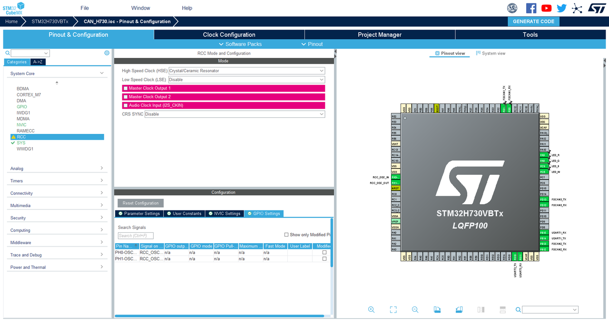

###### Configure the Clock Tree

1. Go to the `Clock Configuration` tab.
2. Set the main frequency according to your chip; in this example it is configured to 500 MHz.
3. **Find and confirm that the FDCAN clock source frequency is 100 MHz. This frequency is the basis for calculating the FDCAN communication baud rate and must be consistent.**
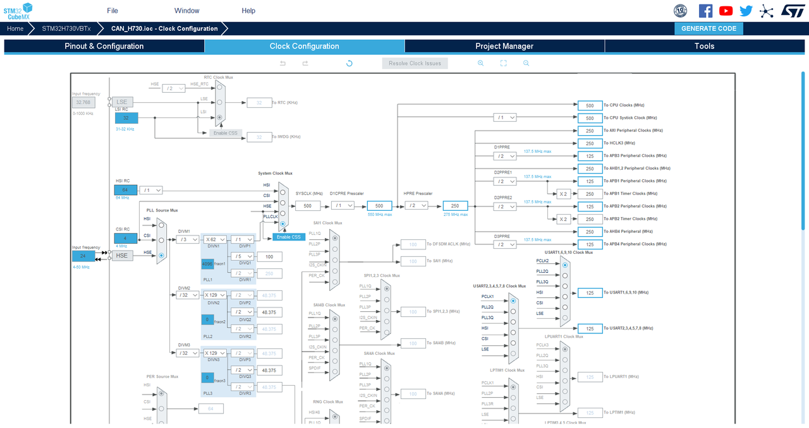

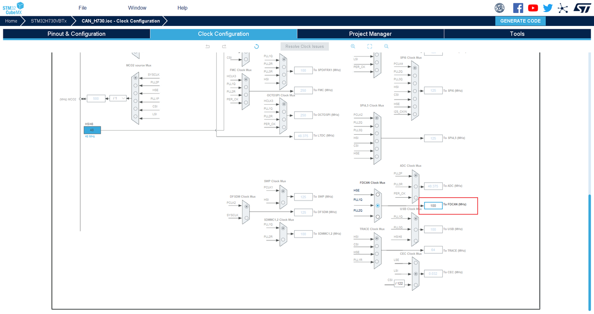

###### Configure FDCAN

1. Under the `Connectivity` menu, enable all FDCAN modules you plan to use (e.g., FDCAN1, FDCAN2, FDCAN3) and configure them in Classic CAN mode.
2. For each enabled FDCAN module, configure the parameters according to the table below (this configuration is based on a 100 MHz clock, achieving 1 Mbps arbitration phase and 1 Mbps data phase):

| Parameter Category | Parameter Name | Current Value | Description |
| --- | --- | --- | --- |
| Basic Parameters | Frame Format | Classic mode | Classic CAN mode |
| Basic Parameters | Mode | Normal mode | Normal mode |
| Basic Parameters | Auto Retransmission | Disable | Disable automatic retransmission |
| Basic Parameters | Transmit Pause | Disable | Disable transmit pause |
| Basic Parameters | Protocol Exception | Disable | Disable protocol exception |
| Basic Parameters | Nominal Sync Jump Width | 1 | Arbitration phase sync jump width |
| Basic Parameters | Data Prescaler | 10 | Data phase prescaler |
| Basic Parameters | Data Sync Jump Width | 1 | Data phase sync jump width |
| Basic Parameters | Data Time Seg1 | 6 | Data phase buffer segment 1 |
| Basic Parameters | Data Time Seg2 | 3 | Data phase buffer segment 2 |
| Basic Parameters | Message Ram Offset | 0 | Starting address offset of message RAM |
| Basic Parameters | Std Filters Nbr | 0 | Number of standard ID filters |
| Basic Parameters | Ext Filters Nbr | 0 | Number of extended ID filters |
| Basic Parameters | Rx Fifo0 Elmts Nbr | 8 | Number of Rx FIFO0 elements |
| Basic Parameters | Rx Fifo0 Elmt Size | 8 bytes | Size of FIFO0 elements |
| Basic Parameters | Rx Fifo1 Elmts Nbr | 8 | Number of Rx FIFO1 elements |
| Basic Parameters | Rx Fifo1 Elmt Size | 8 bytes | Size of FIFO1 elements |
| Basic Parameters | Rx Buffers Nbr | 0 | Number of Rx buffers |
| Basic Parameters | Rx Buffer Size | 8 bytes | Size of Rx buffers |
| Basic Parameters | Tx Events Nbr | 0 | Number of Tx events |
| Basic Parameters | Tx Buffers Nbr | 0 | Number of Tx buffers |
| Basic Parameters | Tx Fifo Queue Elmts Nbr | 8 | Number of Tx FIFO queue elements |
| Basic Parameters | Tx Fifo Queue Mode | FIFO mode | Tx queue mode |
| Basic Parameters | Tx Elmt Size | 8 bytes | Tx element size |
| Bit Timing Parameters | Nominal Prescaler | 10 | Arbitration phase prescaler |
| Bit Timing Parameters | Nominal Time Quantum | 100 ns | Arbitration phase time quantum |
| Bit Timing Parameters | Nominal Time Seg1 | 6 | Arbitration phase buffer segment 1 |
| Bit Timing Parameters | Nominal Time Seg2 | 3 | Arbitration phase buffer segment 2 |

3. Enable interrupts: For each FDCAN module, go to the `NVIC Settings` tab and check to enable `FDCANx Interrupt 0` (where x is the CAN number). This is a prerequisite for receiving motor data; at least two FDCAN channel interrupts must be enabled.
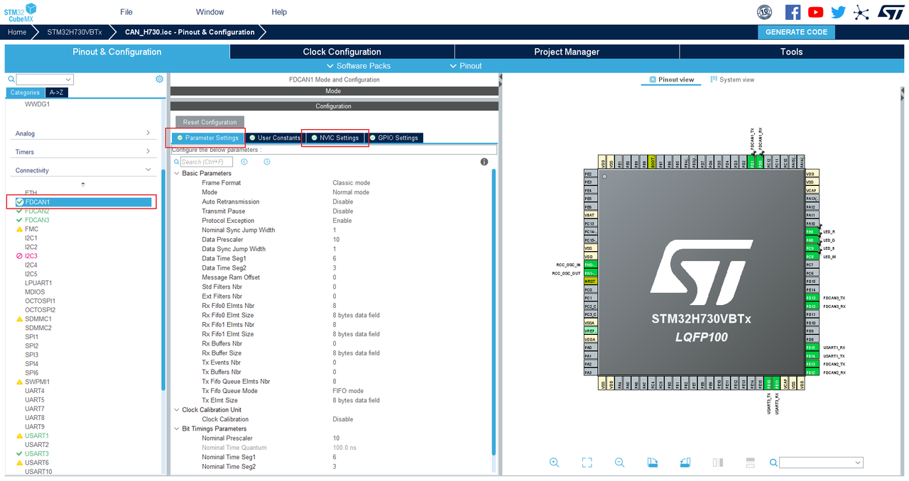

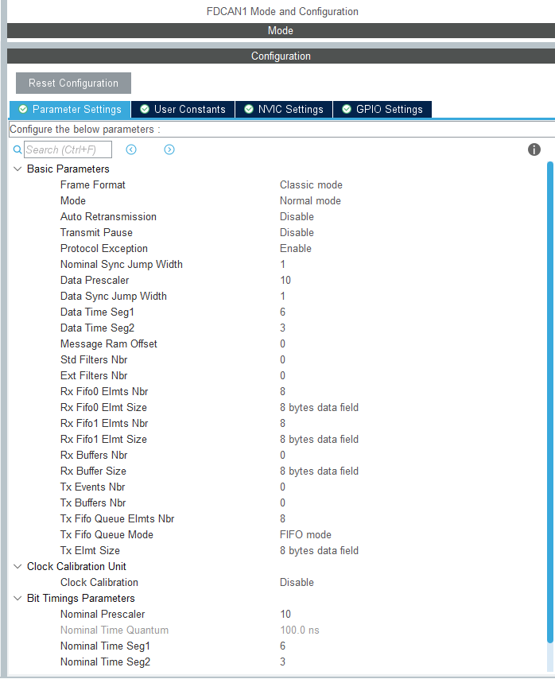

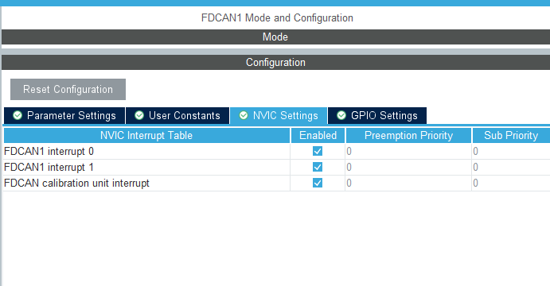

4. You can view the configuration in `fdcan.c` in the project:

```xml
hfdcan1.Instance = FDCAN1;
    hfdcan1.Init.FrameFormat = FDCAN_FRAME_CLASSIC;
    hfdcan1.Init.Mode = FDCAN_MODE_NORMAL;
    hfdcan1.Init.AutoRetransmission = DISABLE;
    hfdcan1.Init.TransmitPause = DISABLE;
    hfdcan1.Init.ProtocolException = ENABLE;
    hfdcan1.Init.NominalPrescaler = 10;
    hfdcan1.Init.NominalSyncJumpWidth = 1;
    hfdcan1.Init.NominalTimeSeg1 = 6;
    hfdcan1.Init.NominalTimeSeg2 = 3;
    hfdcan1.Init.DataPrescaler = 10;
    hfdcan1.Init.DataSyncJumpWidth = 1;
    hfdcan1.Init.DataTimeSeg1 = 6;
    hfdcan1.Init.DataTimeSeg2 = 3;
    hfdcan1.Init.MessageRAMOffset = 0;
    hfdcan1.Init.StdFiltersNbr = 0;
    hfdcan1.Init.ExtFiltersNbr = 0;
    hfdcan1.Init.RxFifo0ElmtsNbr = 8;
    hfdcan1.Init.RxFifo0ElmtSize = FDCAN_DATA_BYTES_8;
    hfdcan1.Init.RxFifo1ElmtsNbr = 8;
    hfdcan1.Init.RxFifo1ElmtSize = FDCAN_DATA_BYTES_8;
    hfdcan1.Init.RxBuffersNbr = 0;
    hfdcan1.Init.RxBufferSize = FDCAN_DATA_BYTES_8;
    hfdcan1.Init.TxEventsNbr = 0;
    hfdcan1.Init.TxBuffersNbr = 0;
    hfdcan1.Init.TxFifoQueueElmtsNbr = 8;
    hfdcan1.Init.TxFifoQueueMode = FDCAN_TX_FIFO_OPERATION;
    hfdcan1.Init.TxElmtSize = FDCAN_DATA_BYTES_8;
```

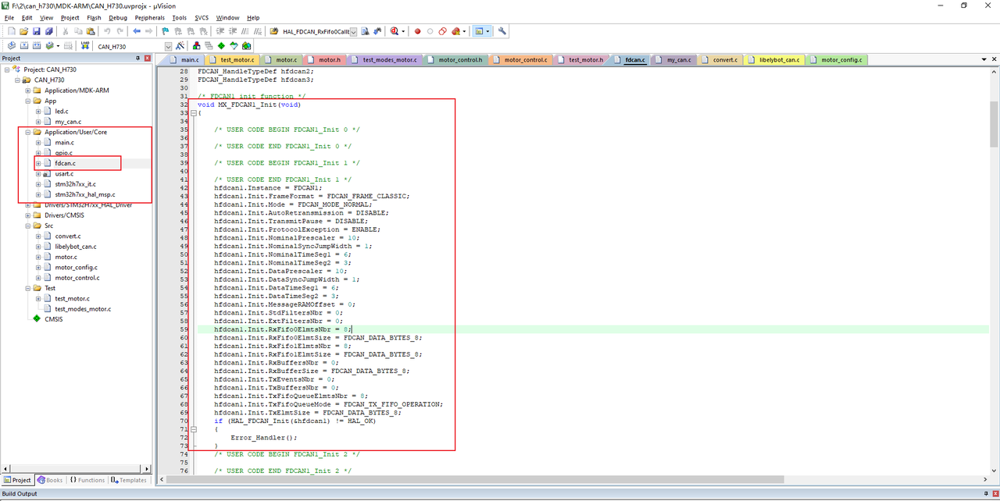

###### Configure Other Peripherals (Optional)

You can configure peripherals such as UART and LED GPIO according to your project requirements. The example has these features enabled for reference.

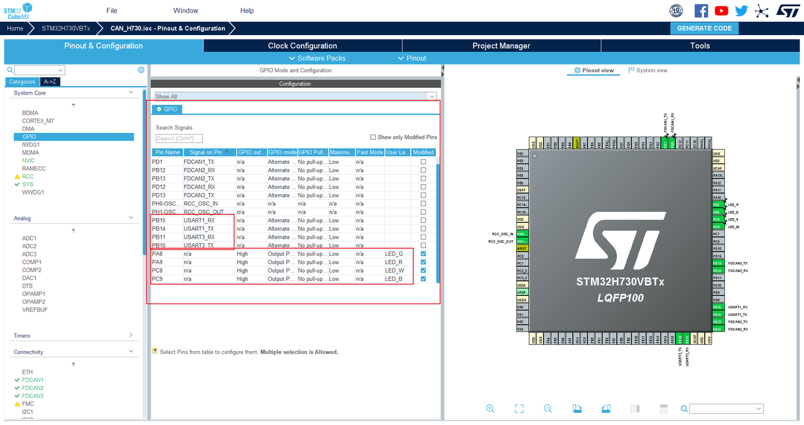

##### Code Generation and File Porting

###### Generate Code

1. Configure generation options
- Go to `Project Manager` -> `Code Generator` for key settings:
    - Uncheck `Generate peripheral initialization as a pair of '.c/.h' files per peripheral`. This consolidates all peripheral initialization code into `main.c`, greatly simplifying the project structure and avoiding excessive scattered files.
    - Be sure to check `Keep User Code when re-generating`. This is the most important setting; it protects code written within special comment tags (`/* USER CODE BEGIN */`) from being overwritten during regeneration.
- Go to `Project Manager` -> `Project` tab, name the project and select a save path.
    - Select your IDE under `Toolchain / IDE` (e.g., `MDK-ARM`).
1. Generate project files
After completing the settings, return to the `Project` page, verify the project path and IDE options are correct, and click the GENERATE CODE button to generate the complete project code.

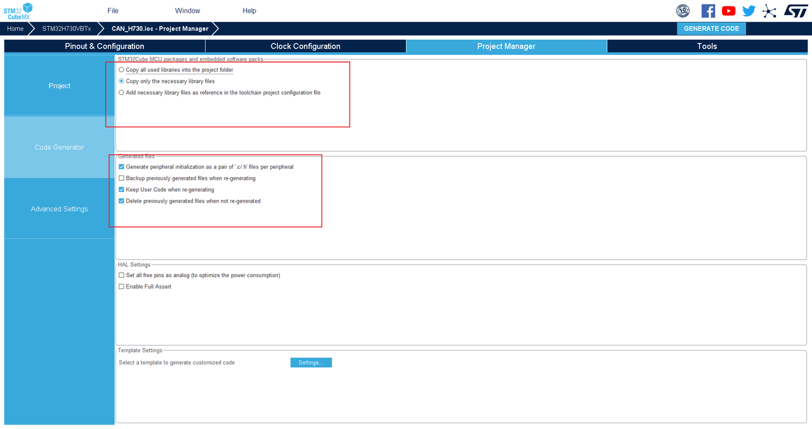

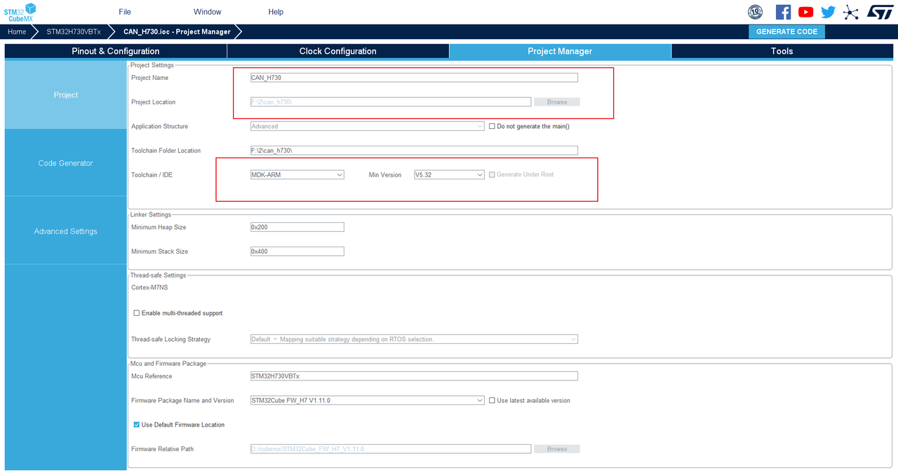

###### File Porting

- Copy the following folders in their entirety from the original software package directory to the root directory of your newly generated STM32 project:

```bash
├── App/
│   └── my_can/           # Hardware Abstraction Layer (HAL)
├── Src/
│   ├── convert/            # Unit conversion
│   ├── livelybot_can/    # Low-level protocol handling
│   ├── motor_control/      # Single motor control
│   ├── motor_many/         # One-to-many control
│   ├── motor_config/       # Motor settings (e.g., zero position reset)
│   └── motor/              # [Core] Motor type definitions, communication mapping, data parsing
└── test/                   # (Recommended to copy, for reference)
    └──  test_motor/         # Single motor usage examples
```

- (Recommended) Also copy the `test/test_motor` and `test/test_motor_many` folders into the project as usage reference examples.
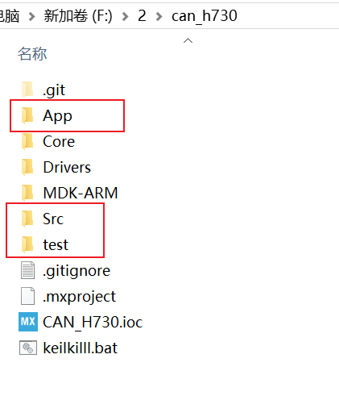

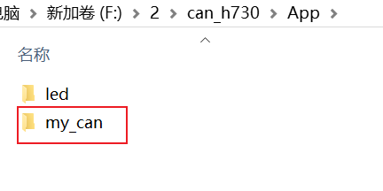

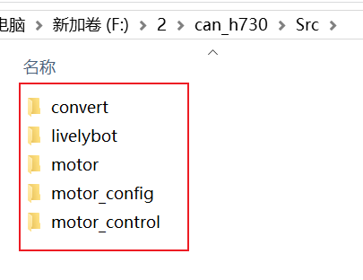

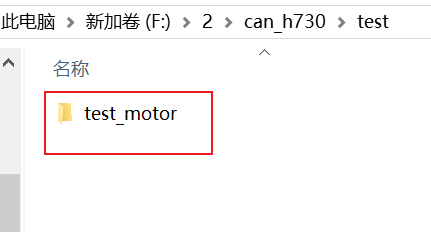

###### Add Header File Paths

- Open the project in your IDE (e.g., Keil MDK) and go to `Options for Target` -> `C/C++` tab.
- In `Include Paths`, add all of the following paths (check carefully to ensure the paths are correct):

```xml
.\App\my_can
.\Src\convert
.\Src\livelybot_can
.\Src\motor_config
.\Src\motor_control
.\Src\motor_many
.\Src\motor
.\test\test_motor
```

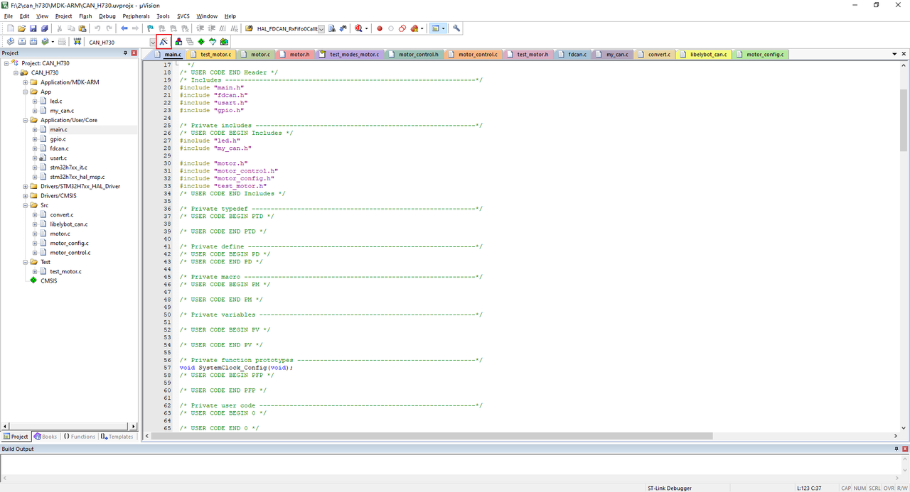

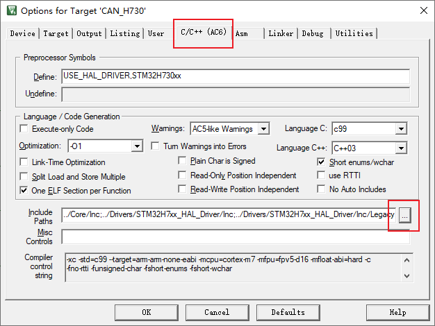

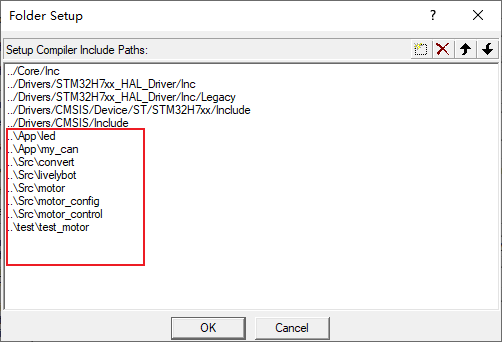

###### Add Source Files to the Project

1. In the IDE project manager window, create three new file groups named `App`, `Src`, and `Test`.
2. Drag or add the corresponding source files (`.c` files) to their respective groups:
    - `App` group: Add `my_fdcan.c`, `led.c`.
    - `Src` group: Add `motor.c`, `livelybot_fdcan.c`, `convert.c`, `motor_control.c`, `motor_many.c`, `motor_config.c`.
    - `Test` group (optional): Add `test_motor.c`, `test_motor_many.c` as reference examples.
3. Add the corresponding source files to each group. After adding successfully, you can clearly see the complete project file structure organized by functional module in the IDE project manager view.

```xml
my_can.c
convert.c
livelybot_can.c
motor_control.c
motor_many.c
motor_config.c
motor.c
(optional) test_motor.c
```

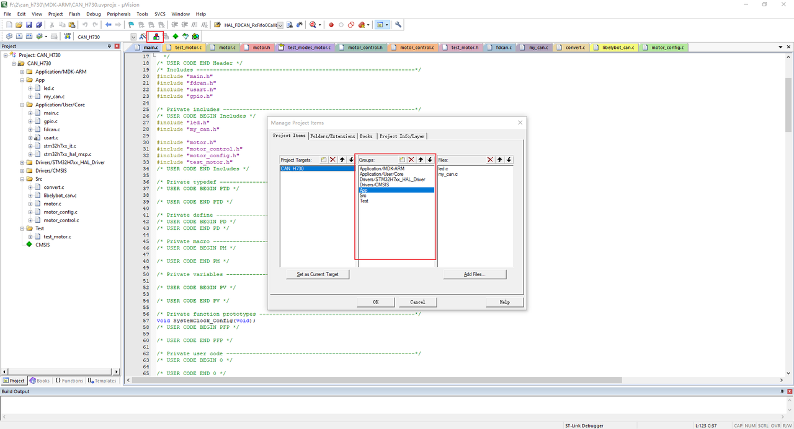

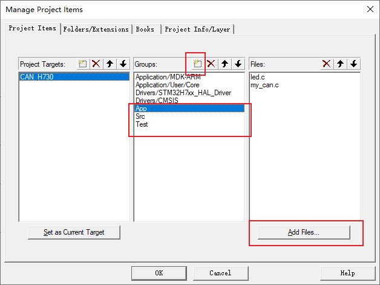

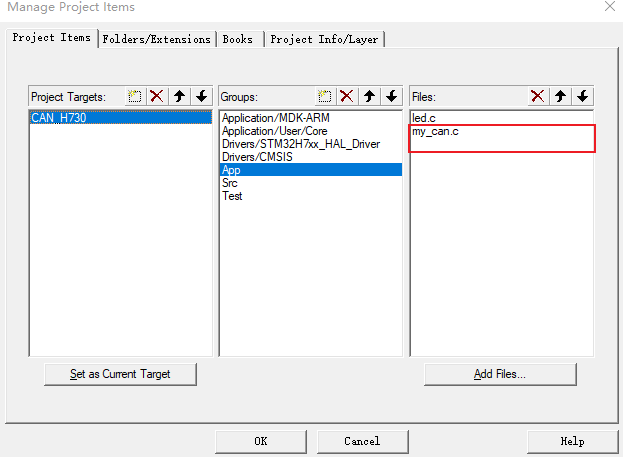

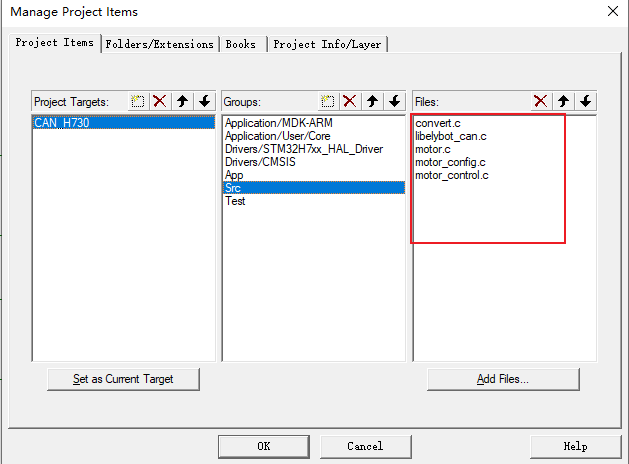

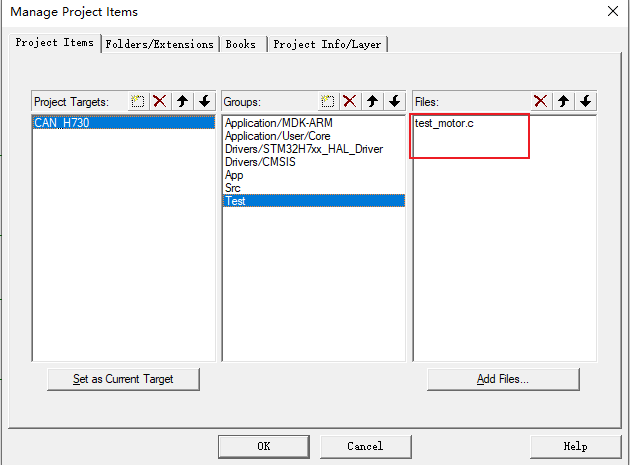

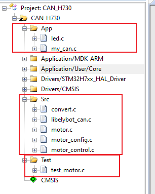

###### Include Header Files in the Project

In your main program file (e.g., `main.c`), include the necessary header files:

```text
#include "motor.h"
#include "motor_control.h"
#include "motor_many.h"
#include "motor_config.h"

#include "test_motor.h"
```

###### Modify Error Macros

1. In the `convert.h` file, there are macros used to check certain configuration or usage errors. By default, `led_toggle_err` is used to flash all LEDs simultaneously to indicate an error. You can modify this as needed.
2. `#include "led.h"` is included here solely to use the `led_toggle_err` function; if not needed, simply delete it.

```text
#include "led.h"
#ifdef  LED_ERR_FLAG  // This macro is defined in led.h
#define  MOTOR_ERR    led_toggle_err  // All LEDs flash
#else
static inline void MOTOR_ERR(void) {}
#endif
```

1. If the build succeeds, porting is complete.

###### my_can Porting File Description

1. Sending

```java
FDCAN_TxHeaderTypeDef TxHeader =
{
    .TxFrameType = FDCAN_DATA_FRAME,            // Data frame
    .ErrorStateIndicator = FDCAN_ESI_ACTIVE,    // Error state indicator
    .BitRateSwitch = FDCAN_BRS_OFF,             // Bit rate switch off
    .FDFormat = FDCAN_CLASSIC_CAN,              // Classic CAN format
    .TxEventFifoControl = FDCAN_NO_TX_EVENTS,   // Do not use Tx event FIFO
    .MessageMarker = 0,                         // Message marker
};

void can_send(FDCAN_HandleTypeDef *hfdcanx, uint32_t id, uint8_t *data, uint8_t len)
{
    TxHeader.Identifier = id;

    if(id > 0x7ff)
    {
        TxHeader.IdType = FDCAN_EXTENDED_ID;
    }
    else
    {

        TxHeader.IdType = FDCAN_STANDARD_ID;
    }

    TxHeader.DataLength = get_fdcan_dlc(len);
    HAL_FDCAN_AddMessageToTxFifoQ(hfdcanx, &TxHeader, data);
}
```

- `FDCAN_TxHeaderTypeDef TxHeader` is the transmission handle, configured with the basic CAN send structure.
- `can_send` is a function that automatically identifies standard frames and extended frames and sends CAN FD data.
1. Data length byte count and DLC encoding value conversion

```cpp
uint32_t get_fdcan_dlc(uint16_t size)
{
    uint32_t fdcan_dlc = 0;

    if(size == 0)
    {
        fdcan_dlc = FDCAN_DLC_BYTES_0;
    }
    else if(size <= 1)
    {
        fdcan_dlc = FDCAN_DLC_BYTES_1;
    }
    else if(size <= 2)
    {
        fdcan_dlc = FDCAN_DLC_BYTES_2;
    }
    else if(size <= 3)
    {
        fdcan_dlc = FDCAN_DLC_BYTES_3;
    }
    else if(size <= 4)
    {
        fdcan_dlc = FDCAN_DLC_BYTES_4;
    }
    else if(size <= 5)
    {
        fdcan_dlc = FDCAN_DLC_BYTES_5;
    }
    else if(size <= 6)
    {
        fdcan_dlc = FDCAN_DLC_BYTES_6;
    }
    else if(size <= 7)
    {
        fdcan_dlc = FDCAN_DLC_BYTES_7;
    }
    else if(size <= 8)
    {
        fdcan_dlc = FDCAN_DLC_BYTES_8;
    }
    else if(size <= 12)
    {
        fdcan_dlc = FDCAN_DLC_BYTES_12;
    }
    else if(size <= 16)
    {
        fdcan_dlc = FDCAN_DLC_BYTES_16;
    }
    else if(size <= 20)
    {
        fdcan_dlc = FDCAN_DLC_BYTES_20;
    }
    else if(size <= 24)
    {
        fdcan_dlc = FDCAN_DLC_BYTES_24;
    }
    else if(size <= 32)
    {
        fdcan_dlc = FDCAN_DLC_BYTES_32;
    }
    else if(size <= 48)
    {
        fdcan_dlc = FDCAN_DLC_BYTES_48;
    }
    else if(size <= 64)
    {
        fdcan_dlc = FDCAN_DLC_BYTES_64;
    }
    return fdcan_dlc;
}

uint16_t get_fdcan_data_size(uint32_t dlc)
{
    uint16_t size = 0;

    switch (dlc)
    {
    case FDCAN_DLC_BYTES_0:
        size = 0;
        break;
    case FDCAN_DLC_BYTES_1:
        size = 1;
        break;
    case FDCAN_DLC_BYTES_2:
        size = 2;
        break;
    case FDCAN_DLC_BYTES_3:
        size = 3;
        break;
    case FDCAN_DLC_BYTES_4:
        size = 4;
        break;
    case FDCAN_DLC_BYTES_5:
        size = 5;
        break;
    case FDCAN_DLC_BYTES_6:
        size = 6;
        break;
    case FDCAN_DLC_BYTES_7:
        size = 7;
        break;
    case FDCAN_DLC_BYTES_8:
        size = 8;
        break;
    case FDCAN_DLC_BYTES_12:
        size = 12;
        break;
    case FDCAN_DLC_BYTES_16:
        size = 16;
        break;
    case FDCAN_DLC_BYTES_20:
        size = 20;
        break;
    case FDCAN_DLC_BYTES_24:
        size = 24;
        break;
    case FDCAN_DLC_BYTES_32:
        size = 32;
        break;
    case FDCAN_DLC_BYTES_48:
        size = 48;
        break;
    case FDCAN_DLC_BYTES_64:
        size = 64;
        break;
    default:
        break;
    }

    return size;
}
```

- These two functions implement bidirectional conversion between the data length byte count and DLC encoding values in CAN FD: `get_fdcan_dlc` maps the actual byte count to the CAN FD protocol's DLC encoding, while `get_fdcan_data_size` performs the reverse conversion from DLC encoding to the corresponding byte count.
- These can be used directly by copying as-is.
1. CAN filter

```c
void can_filter_init(FDCAN_HandleTypeDef *fdcanHandle)
{
    if (HAL_FDCAN_ConfigGlobalFilter(fdcanHandle, FDCAN_ACCEPT_IN_RX_FIFO0, FDCAN_ACCEPT_IN_RX_FIFO0, FDCAN_FILTER_REMOTE, FDCAN_FILTER_REMOTE) != HAL_OK)
    {
        Error_Handler();
    }

    if (HAL_FDCAN_ActivateNotification(fdcanHandle, FDCAN_IT_RX_FIFO0_NEW_MESSAGE | FDCAN_IT_TX_FIFO_EMPTY, 0) != HAL_OK)
    {
        Error_Handler();
    }
    HAL_FDCAN_ConfigTxDelayCompensation(fdcanHandle, fdcanHandle->Init.DataPrescaler * fdcanHandle->Init.DataTimeSeg1, 0);
    HAL_FDCAN_EnableTxDelayCompensation(fdcanHandle);

    if (HAL_FDCAN_Start(fdcanHandle) != HAL_OK)
    {
        Error_Handler();
    }
}
```

- This is a global accept filter, equivalent to "receive all data frames".
- You can configure the accepted CAN data frames as needed.

#### Configuration (Must be configured on first use)

This step is configured according to your actual hardware connections.

##### Modify Macro Definitions in `motor.h`

1. Modify the macro `MOTOR_MAX_NUM` according to the maximum number of motors to be connected on a single CAN channel.
    - For example, if three CAN channels are used, with CAN1 connected to 1 motor, CAN2 connected to 2 motors, and CAN3 connected to 5 motors, set `MOTOR_MAX_NUM` to 5 (based on the maximum number of motors used).

```text
#define  MOTOR_MAX_NUM  5
```

1. Modify the macro `MOTOR_PORT_NUM` to match the number of CAN channels used for motor communication.
    - For example, if STM32G474 has three CAN channels total, and CAN1 and CAN3 are used to connect motors, set `MOTOR_PORT_NUM` to 2.

```text
#define  MOTOR_PORT_NUM   2  // Number of channels
```

##### Modify the `motor_state_port` Struct Array (Configure Motor Models)

1. In the `motor.c` file, the struct array `motor_state_port[MOTOR_PORT_NUM][MOTOR_MAX_NUM]` is defined and needs to be modified according to the motor models for correct torque correction.
2. Suppose we are connecting four motors in total, with two motors on each channel, distributed as follows:

    1.PORT1:

        1.4438_30

        2.5047_36

    2.PORT2:

        1.6056_36

        2.5046_20
        The `motor_state_port` configuration is as follows:

```c
static motor_state_s motor_state_port[MOTOR_PORT_NUM][MOTOR_MAX_NUM] =  // Index + 1 = Motor ID
{
    {  // CAN channel PORT1
        {  // ID = 1
            .model = M4438_30,
        },

        {  // ID = 2
            .model = M5047_36,
        }
    },

    {  // CAN channel PORT2
        {  // ID = 1
            .model = M6056_36,
        },

        {  // ID = 2
            .model = M5046_20,
        }
    },
};
```

##### Modify the PORT, FDCAN, STATE Mapping

1. In `motor.c`, the struct array `port_maping[MOTOR_PORT_NUM]` is defined to specify the mapping between PORT, FDCAN, and STATE.
2. Suppose we are using the CAN2 and CAN3 channels, and we want to define:
    - `CAN2` mapped to `PORT1`, with state data stored in `motor_state_port[0]`.
    - `CAN3` mapped to `PORT2`, with state data stored in `motor_state_port[1]`.
3. The corresponding modification is as follows:

```c
const port_mapping_s port_maping[MOTOR_PORT_NUM] =  // Channel mapping table
{
    {
        .port = PORT1,
        .fdcan = &hfdcan2,
        .state = motor_state_port[0],
    },

    {
        .port = PORT2,
        .fdcan = &hfdcan3,
        .state = motor_state_port[1],
    },
};
```

##### Modify Position and Velocity Units

- Position and velocity units support: **revolutions (rev), radians (rad), or degrees (°)**, switched via the macro `MOTOR_DATA_TYPE_FLAG` in `convert.h`. **The default is revolutions (rev)**.
1. To use **revolutions (rev)** as the position and velocity unit:

```text
#define  MOTOR_DATA_TYPE_FLAG  TURNS
```

1. To use **radians (rad)** as the position and velocity unit:

```text
#define  MOTOR_DATA_TYPE_FLAG  RADIAN_2PI
```

1. To use **degrees (°)** as the position and velocity unit:

```text
#define  MOTOR_DATA_TYPE_FLAG  ANGLE_360
```

### Function Examples

#### Motor Control Modes `motor_control.c`

- All functions in this file include the ability to query motor status information (the parsing function is located in `motor.c`), except for the motor soft reset function `motor_set_reset`.
- All functions in this file send the corresponding FDCAN frame immediately upon being called, with no software buffering.
- The position and velocity units in this file are determined by the macro `MOTOR_DATA_TYPE_FLAG`. See Modify Position and Velocity Units for details.
- The control frequency for the control methods in this file must not be too high. At 1 Mbps arbitration and 1 Mbps data, a single CAN bus can control at most 3 motors within 1 ms, i.e., at 1 kHz control frequency a maximum of 3 motors can be controlled. To control more motors, the control frequency must be reduced.
- The units for each parameter are described in detail in the function comments within the code.

##### DQ Voltage Mode

**Description:**

1. Controls motor operation by applying a given Q-phase voltage and requests the motor to return status information.
2. Parameter description:
    - `portx`: CAN channel selection
    - `id`: Motor ID
    - `volt`: Q-phase voltage, unit: volts (V).
3. Function implementation:
    - `vol_float2int`: Scale conversion of the voltage value.
    - `motor_control_volt`: Low-level control function.

```c
void motor_set_dq_vlot(port_t portx, const uint8_t id, const float volt)
{
    FDCAN_HandleTypeDef *fdcanHandle = motor_get_fdcan_pointer(portx);
    const float temp = vol_float2int(volt, TINT16);

    motor_control_volt(fdcanHandle, id, temp);

}
```

##### DQ Current Mode

**Description:**

1. Controls motor operation by applying a given Q-phase current and requests the motor to return status information.
2. Parameter description:
    - `portx`: CAN channel selection
    - `id`: Motor ID
    - `cur`: Q-phase current, unit: amperes (A).
3. Function implementation:
    - `cur_float2int`: Scale conversion of the current value.
    - `motor_control_cur`: Low-level control function.

```c
void motor_set_dq_current(port_t portx, const uint8_t id, const float cur)
{
    FDCAN_HandleTypeDef *fdcanHandle = motor_get_fdcan_pointer(portx);
    const float temp = cur_float2int(cur, TINT16);

    motor_control_cur(fdcanHandle, id, temp);

}
```

##### Position Mode

**Description:**

1. The motor moves to the specified target position at maximum speed and maximum acceleration, and requests the motor to return status information.
2. Parameter description:
    - `portx`: CAN channel selection
    - `id`: Motor ID
    - `pos`: Target position; units can be revolutions (rev), radians (rad), or degrees (°), determined by the macro `MOTOR_DATA_TYPE_FLAG`.
3. Function implementation:
    - `conv_to_turns`: Converts the position unit to revolutions (rev).
    - `pos_float2int`: Scale conversion of the position value.
    - `motor_control_pos`: Low-level control function.

**Notes:**

1. In this mode, speed and torque are both at maximum, resulting in relatively intense motion.
2. Instantaneous current may spike to 5 A–10 A. If the power supply response is not fast enough or the current limit is too small, the motor may receive insufficient current instantaneously, causing an error.
3. This mode is suitable for scenarios with extreme response speed requirements and is generally not recommended. For position control, the **trapezoidal control** mode is recommended.

```c
void motor_set_pos(port_t portx, const uint8_t id, const float pos)
{
    FDCAN_HandleTypeDef *fdcanHandle = motor_get_fdcan_pointer(portx);
    const float temp1 = conv_to_turns(pos, MOTOR_DATA_TYPE_FLAG);
    const float temp2 = pos_float2int(temp1, TINT16);

    motor_control_pos(fdcanHandle, id, temp2, INT16_NAN);

}
```

##### Velocity Mode

**Description:**

1. The motor accelerates to the specified target velocity at maximum acceleration and requests the motor to return status information.
2. Parameter description:
    - `portx`: CAN channel selection
    - `id`: Motor ID
    - `vel`: Target velocity; units can be revolutions per second (rps), radians per second (rad/s), or degrees per second (°/s), determined by the macro `MOTOR_DATA_TYPE_FLAG`.
3. Function implementation:
    - `conv_to_turns`: Converts the velocity unit to revolutions per second (rps).
    - `vel_float2int`: Scale conversion of the velocity value.
    - `motor_control_vel`: Low-level control function.

```c
void motor_set_vel(port_t portx, const uint8_t id, const float vel)
{
    FDCAN_HandleTypeDef *fdcanHandle = motor_get_fdcan_pointer(portx);
    const float temp1 = conv_to_turns(vel, MOTOR_DATA_TYPE_FLAG);
    const float temp2 = vel_float2int(temp1, TINT16);

    motor_control_vel(fdcanHandle, id, temp2, INT16_NAN);

}
```

##### Torque Mode

**Description:**

1. The motor rotates according to the set target torque and requests the motor to return status information.
2. Parameter description:
    - `portx`: CAN channel selection
    - `id`: Motor ID
    - `tqe`: Target torque, unit: Newton-meters (N·m).
3. Function implementation:
    - `tqe_adjust`: Torque output correction; we handle the motor's internal torque processing here to compensate for the motor's output torque.
    - `tqe_float2int`: Scale conversion of the torque value.
    - `motor_control_tqe`: Low-level control function.

```c
void motor_set_tqe(port_t portx, const uint8_t id, const float tqe)
{
    FDCAN_HandleTypeDef *fdcanHandle = motor_get_fdcan_pointer(portx);
    const float temp1 = tqe_adjust(tqe, motor_get_model2(portx, id));
    const float temp2 = tqe_float2int(temp1, TINT16);

    motor_control_tqe(fdcanHandle, id, temp2);

}
```

##### Position and Velocity Mode

**Description:**

1. The motor moves to the specified target position at the target velocity and requests the motor to return status information.
2. Parameter description:
    - `portx`: CAN channel selection
    - `id`: Motor ID
    - `pos`: Target position; units can be revolutions (rev), radians (rad), or degrees (°), determined by the macro `MOTOR_DATA_TYPE_FLAG`.
    - `vel`: Target velocity; units can be revolutions per second (rps), radians per second (rad/s), or degrees per second (°/s), determined by the macro `MOTOR_DATA_TYPE_FLAG`.
3. Function implementation:
    - `conv_to_turns`: Converts the position unit to revolutions (rev) and velocity unit to revolutions per second (rps).
    - `pos_float2int`: Scale conversion of the position value.
    - `vel_float2int`: Scale conversion of the velocity value.
    - `motor_control_pos_vel_MAXtqe`: Low-level control function.

```c
void motor_set_pos_vel(port_t portx, const uint8_t id, const float pos, const float vel)
{
    FDCAN_HandleTypeDef *fdcanHandle = motor_get_fdcan_pointer(portx);
    const float pos1 = conv_to_turns(pos, MOTOR_DATA_TYPE_FLAG);
    const float vel1 = conv_to_turns(vel, MOTOR_DATA_TYPE_FLAG);
    const float pos2 = pos_float2int(pos1, TINT16);
    const float vel2 = vel_float2int(vel1, TINT16);

    motor_control_pos_vel_MAXtqe(fdcanHandle, id, pos2, vel2, INT16_NAN);
}
```

##### Position, Velocity, and Maximum Torque Mode

**Description:**

1. The motor moves to the specified target position at the target velocity while limiting the maximum output torque, and requests the motor to return status information.
2. Parameter description:
    - `portx`: CAN channel selection
    - `id`: Motor ID
    - `pos`: Target position; units can be revolutions (rev), radians (rad), or degrees (°), determined by the macro `MOTOR_DATA_TYPE_FLAG`.
    - `vel`: Target velocity; units can be revolutions per second (rps), radians per second (rad/s), or degrees per second (°/s), determined by the macro `MOTOR_DATA_TYPE_FLAG`.
    - `tqe`: Target torque, unit: Newton-meters (N·m).
3. Function implementation:
    - `conv_to_turns`: Converts the position unit to revolutions (rev) and velocity unit to revolutions per second (rps).
    - `tqe_adjust`: Torque output correction; we handle the motor's internal torque processing here to compensate for the motor's output torque.
    - `pos_float2int`: Scale conversion of the position value.
    - `vel_float2int`: Scale conversion of the velocity value.
    - `tqe_float2int`: Scale conversion of the torque value.
    - `motor_control_pos_vel_MAXtqe`: Low-level control function.

**Notes:**

1. This mode limits the output torque. If the maximum torque set is too small, the motor may not be able to reach the target velocity.

```c
void motor_set_pos_vel_MAXtqe(port_t portx, const uint8_t id, const float pos, const float vel, const float tqe)
{
    FDCAN_HandleTypeDef *fdcanHandle = motor_get_fdcan_pointer(portx);
    const float pos1 = conv_to_turns(pos, MOTOR_DATA_TYPE_FLAG);
    const float vel1 = conv_to_turns(vel, MOTOR_DATA_TYPE_FLAG);
    const float tqe1 = tqe_adjust(tqe, motor_get_model2(portx, id));
    const float pos2 = pos_float2int(pos1, TINT16);
    const float vel2 = vel_float2int(vel1, TINT16);
    const float tqe2 = tqe_float2int(tqe1, TINT16);

    motor_control_pos_vel_MAXtqe(fdcanHandle, id, pos2, vel2, tqe2);
}
```

##### Position, Velocity, and Acceleration Mode (Trapezoidal Control)

**Description:**

1. The motor moves at a constant acceleration, achieving a trapezoidal velocity profile of accelerate → constant speed → decelerate, and requests the motor to return status information.
2. Parameter description:
    - `portx`: CAN channel selection
    - `type`: Data type for the communication protocol, affecting data precision and range. `TFLOAT`, `TINT32`, `TINT16` correspond to `float`, `int32`, `int16`.
    - `id`: Motor ID
    - `pos`: Target position; units can be revolutions (rev), radians (rad), or degrees (°), determined by the macro `MOTOR_DATA_TYPE_FLAG`.
    - `vel`: Target velocity; units can be revolutions per second (rps), radians per second (rad/s), or degrees per second (°/s), determined by the macro `MOTOR_DATA_TYPE_FLAG`.
    - `acc`: Acceleration; units can be revolutions per second squared (rev/s^2), radians per second squared (rad/s^2), or degrees per second squared (°/s^2), determined by the macro `MOTOR_DATA_TYPE_FLAG`.
3. Function implementation:
    - `conv_to_turns`: Converts the position unit to revolutions (rev), velocity unit to revolutions per second (rps), and acceleration unit to revolutions per second squared (rps²).
    - `pos_float2int`: Scale conversion of the position value.
    - `vel_float2int`: Scale conversion of the velocity value.
    - `acc_float2int`: Scale conversion of the acceleration value.
    - `motor_control_pos_vel_acc`: Low-level control function.

**Notes:**

1. Supported from motor firmware v4.6.0 onwards.

```c
void motor_set_pos_vel_acc(port_t portx, const uint8_t id, const float pos, const float vel, const float acc)
{
    FDCAN_HandleTypeDef *fdcanHandle = motor_get_fdcan_pointer(portx);
    const float pos1 = conv_to_turns(pos, MOTOR_DATA_TYPE_FLAG);
    const float vel1 = conv_to_turns(vel, MOTOR_DATA_TYPE_FLAG);
    const float acc1 = conv_to_turns(acc, MOTOR_DATA_TYPE_FLAG);
    const float pos2 = pos_float2int(pos1, TINT16);
    const float vel2 = vel_float2int(vel1, TINT16);
    const float acc2 = acc_float2int(acc1, TINT16);

    motor_control_pos_vel_acc(fdcanHandle, id, pos2, vel2, acc2);
}
```

##### Motion Control Mode (MIT Mode)

**Description:**

1. The formula for calculating the motor output torque is:

```c
Output torque = position error * kp + velocity error * kd + feedforward torque
```

2. Mode usage description:
    1. When kp=0 and kd=0, a given `tqe` achieves constant torque output. In this case, the motor continuously outputs a constant torque.
    2. When kp=0 and kd≠0, a given `vel` achieves constant speed rotation. There will be a steady-state velocity error during constant speed rotation; also, `kd` should not be too large — excessively large `kd` will cause oscillation.
    3. When kp≠0 and kd=0, oscillation will occur. That is, when controlling position, `kd` must not be set to 0, otherwise the motor will oscillate or even become uncontrollable.
    4. When kp≠0 and kd≠0, there are multiple scenarios; two simple cases are briefly described here:
        - When the target position `pos` is constant and the target velocity `vel` is 0, point control is achieved: the system drives the actual position toward `pos` and the actual velocity toward 0, eventually coming to rest at the target position.
        - When `pos` is a continuously differentiable function of time and `vel` is the derivative of `pos`, position tracking and velocity tracking are achieved, i.e., rotating to the desired angle at the desired velocity.
3. Parameter description:
    - `portx`: CAN channel selection
    - `id`: Motor ID
    - `pos`: Target position; units can be revolutions (rev), radians (rad), or degrees (°), determined by the macro `MOTOR_DATA_TYPE_FLAG`.
    - `vel`: Target velocity; units can be revolutions per second (rps), radians per second (rad/s), or degrees per second (°/s), determined by the macro `MOTOR_DATA_TYPE_FLAG`.
    - `tqe`: Feedforward torque, unit: Newton-meters (N·m).
    - `kp`: Position proportional gain.
    - `kd`: Velocity proportional gain.
4. Function implementation:
    - `conv_to_turns`: Converts the position unit to revolutions (rev) and velocity unit to revolutions per second (rps).
    - `conv_from_turns`: Converts `kp` and `kd` to data in the corresponding unit; for example, if radians are used, this function converts the units of `kp` and `kd` to radian units as well.
    - `tqe_adjust`: Torque output correction; we handle the motor's internal torque processing here to compensate for the motor's output torque.
    - `pos_float2int`: Scale conversion of the position value.
    - `vel_float2int`: Scale conversion of the velocity value.
    - `tqe_float2int`: Scale conversion of the torque value.
    - `pid_float2int`: Scale conversion of `kp` and `kd` values.
    - `motor_control_pos_vel_tqe_kp_kd`: Low-level control function.

**Notes:**

1. Appropriate `kp` and `kd` values must be set; otherwise the control performance may be poor.
2. Supported from motor firmware v4.6.0 onwards.

```c
void motor_set_pos_vel_tqe_kp_kd(port_t portx, const uint8_t id, const float pos, const float vel, float tqe, float kp, float kd)
{
    FDCAN_HandleTypeDef *fdcanHandle = motor_get_fdcan_pointer(portx);
    const motor_type_t model = motor_get_model2(portx, id);

    /* Convert units to revolutions */
    const float pos_turns = conv_to_turns(pos, MOTOR_DATA_TYPE_FLAG);
    const float vel_turns = conv_to_turns(vel, MOTOR_DATA_TYPE_FLAG);
    const float kp_turns = conv_from_turns(kp, MOTOR_DATA_TYPE_FLAG);
    const float kd_turns = conv_from_turns(kd, MOTOR_DATA_TYPE_FLAG);

    /* Torque correction */
    const float tqe_val_adjust = tqe_adjust(tqe, model);
    const float kp_val_adjust = pid_adjust(kp_turns, model);
    const float kd_val_adjust = pid_adjust(kd_turns, model);

    /* float -> int */
    const uint16_t pos_int = mit_float2int(pos_turns, -3.2768f, 3.2767f, 16);
    const uint16_t vel_int = mit_float2int(vel_turns, -2.0f, 2.0f, 12);
    const uint16_t tqe_int = mit_float2int(tqe_val_adjust, -10.0f, 10.0f, 12);
    const uint16_t kp_int = mit_float2int(kp_val_adjust, -400, 400, 12);
    const uint16_t kd_int = mit_float2int(kd_val_adjust, -100, 100, 12);

    motor_control_pos_vel_tqe_kp_kd(fdcanHandle, id, pos_int, vel_int, tqe_int, kp_int, kd_int);
}
```

##### Stop Mode

**Description:**

1. The motor enters stop mode; all three motor phases are left floating, allowing the motor to rotate freely.
2. Parameter description:
    - `portx`: CAN channel; `PORT1`, `PORT2`, `PORT3` correspond to channels 1, 2, 3.
    - `id`: Motor ID

```c
void motor_set_stop(port_t portx, const uint8_t id);
```


##### Brake Mode

**Description:**

1. All motor phases are short-circuited to ground, achieving a "damping brake" effect.
2. Braking resistance is positively correlated with motor speed.
3. Parameter description:
    - `portx`: CAN channel selection
    - `id`: Motor ID

```c
void motor_set_brake(port_t portx, const uint8_t id);
```

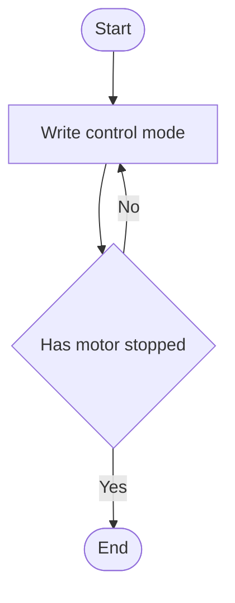

##### Query Motor Status Information

**Description:**

1. Sends a command to query motor status information.
2. The status information returned by the motor includes: mode, error code, position, velocity, and torque.
3. Motor status information is parsed in the `motor_process_state` function in `motor.c`.
4. Parameter description:
    - `portx`: CAN channel; `PORT1`, `PORT2`, `PORT3` correspond to channels 1, 2, 3.
    - `type`: Data type for the communication protocol, affecting data precision and range. `TFLOAT`, `TINT32`, `TINT16` correspond to `float`, `int32`, `int16`.
    - `id`: Motor ID

```c
void motor_get_state_send(port_t portx, const data_type_t type, const uint8_t id);
```

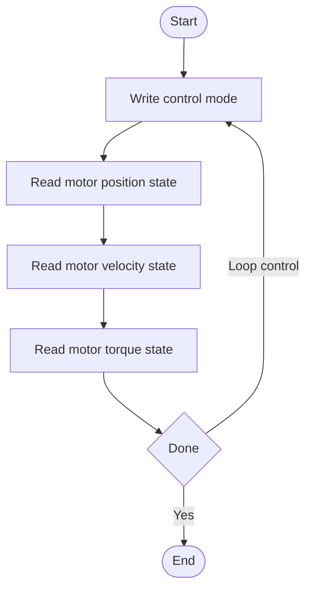

##### Query Motor Firmware Version

**Description:**

1. Sends a command to query the motor firmware version number.
2. Motor firmware version parsing is in the `motor_process_state` function in `motor.c`.
3. Parameter description:
    - `portx`: CAN channel selection
    - `id`: Motor ID

```c
void motor_get_version(port_t portx, const uint8_t id);
```

#### Motor Settings `motor_config`

- All functions in this file are related to motor settings.

##### Reset Motor Zero Position

**Description:**

1. Function:
    - Sets the motor's current position as the zero position.
    - Resetting the zero position of one motor requires more than 300 ms and may fail.
    - Return value: 0 = success, 1 = zero position reset failed, 2 = save failed.
2. Parameter description:
    - `portx`: CAN channel selection
    - `id`: Motor ID

```c
uint8_t motor_pos_reset(port_t portx, const uint8_t id);
```

##### Save Motor Settings

**Description:**

1. Function:
    - Saves motor settings.
    - Generally used in conjunction with other commands.
    - Return value: 0 = success, 1 = failure.
2. Parameter description:
    - `portx`: CAN channel selection
    - `id`: Motor ID

```c
uint8_t motor_conf_write(port_t portx, const uint8_t id);
```

#### Motor Configuration and Protocol Parsing `motor`

- This file defines two important struct arrays; see section 3.2 Configuration for details:
    - `motor_state_port[MOTOR_PORT_NUM][MOTOR_MAX_NUM]`: Used to configure motor models and store information returned by the motors.
    - `port_maping[MOTOR_PORT_NUM]`: Used to configure the mapping between PORT, FDCAN, and STATE.

##### Motor Information Parsing

**Description:**

- Parses motor status data from the FIFO of all CAN channels.
- `HAL_FDCAN_GetRxMessage` reads a received CAN message from the specified FDCAN receive FIFO.
- This function calls `motor_process_state` for parsing.
- **This function needs to be called continuously in the main loop, or can be called periodically as needed**.

```c
void motor_process_state_all()
{
    for (int i = 0; i < MOTOR_PORT_NUM; i++)
    {
        while (HAL_FDCAN_GetRxMessage(port_maping[i].fdcan, FDCAN_RX_FIFO0, &fdcan_rx_header, fdcan_rdata) == HAL_OK)
        {
            if (fdcan_rx_header.DataLength != 0)
            {
                const uint16_t len = get_fdcan_data_size(fdcan_rx_header.DataLength);
                                if (len <= 8)
                                {
                                        motor_process_state(port_maping[i].fdcan, fdcan_rx_header.Identifier >> 8, fdcan_rdata, len);
                                }
            }
        }
    }
}
```
