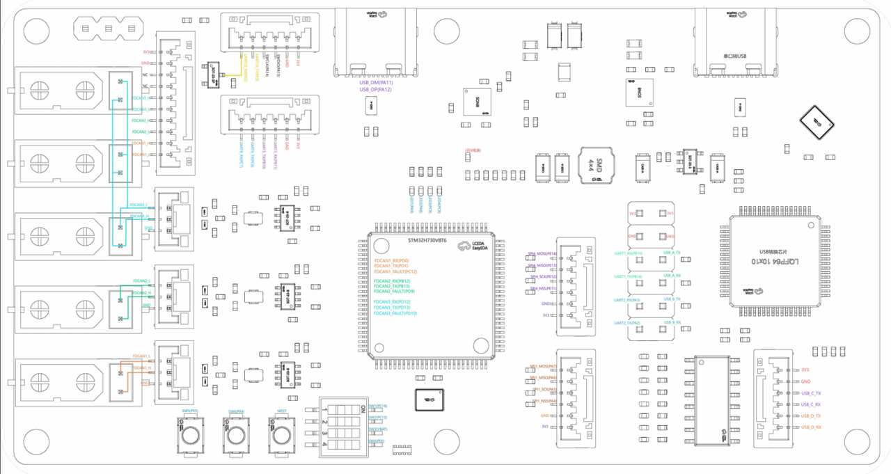

# 3.4 H730 Development Board Interface Description

## **Description:**

Annotation notes:

①　Controls whether the SBUS signal received via USART10_RX is inverted.

②　Independent power interface, isolated from the downstream circuitry on the board.

③　External custom development button, default pin pull-up.

④　External custom DIP switch, default pin pull-up. Note: pin 3 must be OFF.

⑤　Custom LED indicator.

⑥　Requires 6 jumper caps to short the left and right pins. The left side is UART1 and UART2 of the STM32 main controller; the right side is the two serial ports of the USB conversion chip.

⑦　USB conversion chip spare serial port (unused).

⑧　Board power Type-C interface, connected to the main controller's high-speed USB 2.0 (full-speed 12 MHz).

⑨　Board power Type-C interface (serial-to-USB 3.0, USB 3.0 connection required), connected to the USB data pins of the USB conversion chip. When connected to a PC, 4 serial ports are visible, but the microcontroller only uses two of them — specifically the 2 lower-numbered serial ports among the 4 virtual COM ports created by the PC.

⑩　UART10 and SWD download interface.
