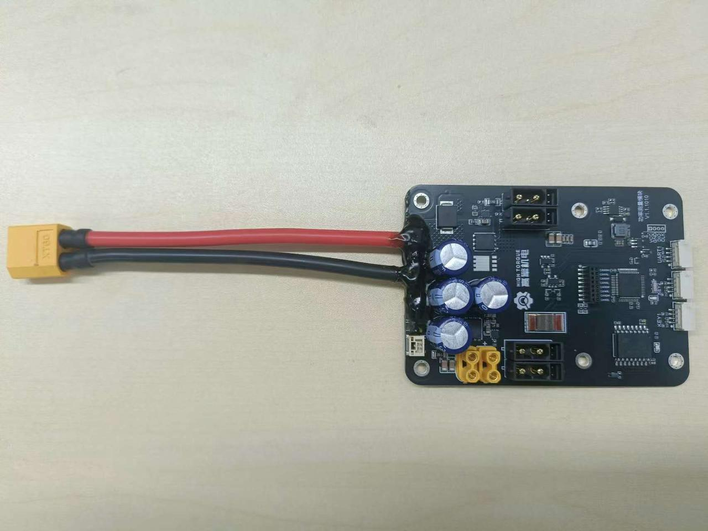
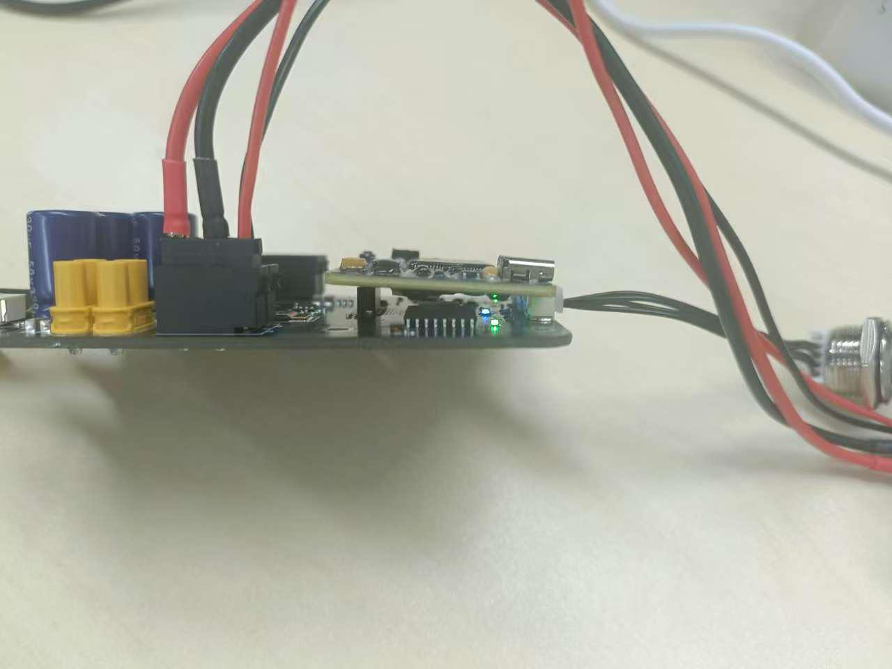
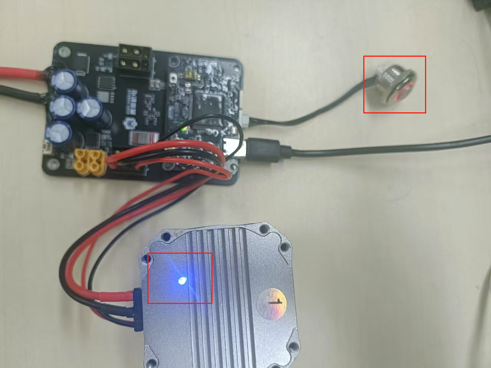
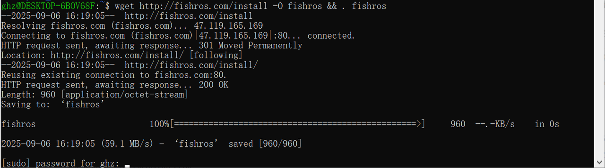
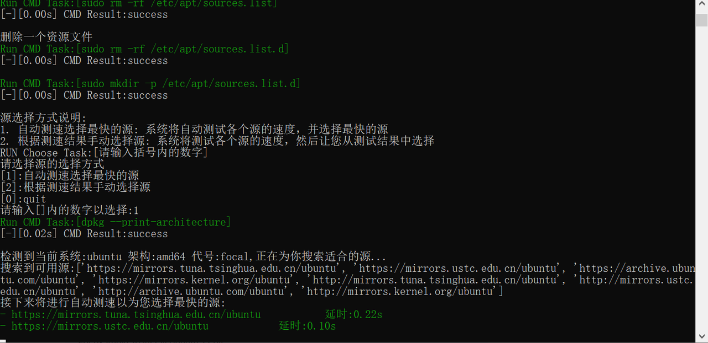
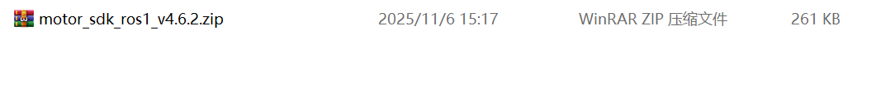
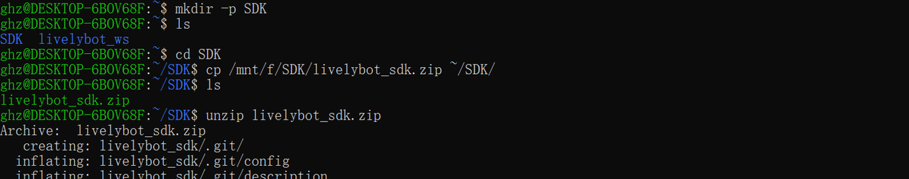
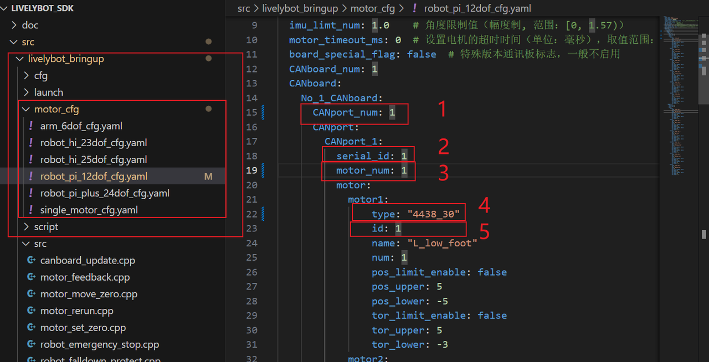

# 4.1.1 ROS SDK Quick Start for 4-Channel Stacked Board

### Purpose

Use the SDK program to control motor rotation on a 4-channel CAN stacked board.

### Bill of Materials

**Hardware:**

- DC regulated power supply
- Communication board
- Power board
- HiTorque motor (4438-30 motor used here)
- USB cable
- Motor cable XT30(2+2) wiring
- Power cable XT60 wiring
- Control button


Power board

<br>Communication board


USB cable


4438 motor


TX60 wiring

<br>XT30(2+2) wiring

<br>Control button

**Software:**

SDK package: The companion program for the SDK stacked board, used to control motors in conjunction with the stacked board.

**Download:**

### Preliminary Preparation

#### Viewing Basic Motor Information

Use the host software to check the motor model, firmware version, and hardware version.

Connect the motor using the USB-to-FDCAN adapter board and open the host software (for details, refer to the debug assistant quick start [2.1 Host Software Quick Start](../02-motor-debugging-assistant/2.1-quick-start.md))

1. Click Parameter Settings.
2. Click Read Parameters.
3. View the motor model, firmware version, and hardware version in the basic information section.

**Note:** V3 firmware versions will not display some information in the SDK program. For details, see [Software Introduction](https://lingdongfangcheng.feishu.cn/wiki/Nm7OwYkmki1eFLkEJ6xcRhR1nug)


#### Modifying the Motor ID

1. Connect the motor using the debug board and open the debug assistant (for details, refer to the debug assistant quick start [2.1 Quick Start](https://lingdongfangcheng.feishu.cn/wiki/BwSPwpjyLimtXTkTt0JczYOhned))
2. Click Parameter Settings.
3. Click Read Parameters.
4. View the motor ID and change it to 1.
5. Click Write Parameters to save the modified motor ID.

Note: This example uses a motor with ID 1. In actual use, the motor ID can be set according to the situation.


### Hardware Preparation

#### Interface and Wiring Description


**Interface Details:**

1. **Power Input Interface**: Uses an XT60 male connector, supports a voltage range of 12–24V.
2. **XT30(2+2) Motor Interface**:
    - Isolated from the power input via a MOSFET; output voltage matches input voltage, controlled by the switch below.
    - Supports FDCAN communication and can work with the communication board to convert FDCAN messages to serial messages along with the corresponding CAN channel number.
    - Motor interface CAN channel numbers are arranged in the order shown by the blue numbers in the diagram.
3. **Communication Board Connection Interface:** For connecting the communication board.
4. **XT30(2+2) Motor Control Button Interface**: Controls motor power supply; short press to toggle on/off.
5. **USB Interface**: For data exchange between the computer and the communication board.

**Connection Steps:**

1. Connect the power supply to the **Power Input Interface**;
2. Connect the motor to the **XT30(2+2) Motor Interface**;
3. Insert the communication board into the **Communication Board Interface**;
4. Connect the external switch button to the **Motor Control Button Interface**;
5. Connect to the computer via the **USB Interface**.

#### Power-On Instructions

**Note:**

- When using the SDK program, power all devices.
- Do not hot-plug devices.

##### Power Board Power Supply

- Connect the power supply to the XT60 power input channel to power the power board. The green LED on the power board will turn on and the blue LED will flash.


Power board indicator light status

<br>Power board indicator light side view

##### Communication Board Power Supply

- Connect the USB cable between the communication board and the host computer to power the communication board. The green LED on the communication board will turn on and the red LED will flash.
<br>Communication board indicator light status

##### Motor Power Supply

- Short press the motor power button to light up the button. The blue LED at the base of the motor will then turn on.
<br>Switch button and motor indicator light status

### Software Preparation

#### Setting Up the Environment

- Operating system: Linux (Ubuntu recommended)
- Test environment: This test is based on Ubuntu 20.04 with a ROS1 environment configured.

##### Environment Configuration

1. Run the fishros one-click installer as follows:

```text
wget http://fishros.com/install -O fishros && . fishros
```



1. Select to install ROS; choose `1` to install ROS.


1. Select to change the system source before installing.


1. Select to change the system source and clean third-party sources.


1. Select automatic speed testing to choose the fastest source.


1. Select to install ROS1; choose `3` here.


1. Select to install the desktop version; choose `1` here.


1. Installation complete. The system will prompt that the installation was successful.


##### Installing Dependencies

1. Install the serial communication related packages.

```bash
sudo apt-get install libserialport0 libserialport-dev
```


1. Install Python dependencies.

```bash
sudo apt update
sudo apt install python3-pip
python3 -m pip install empy
```


### Program Usage Instructions

#### Program Download

1. Program location

The program package is in the ROS1 version program within the resource package, named `motor_sdk_ros1_v4.6.2.zip`.




1. Create a folder named `SDK`, copy the program into it, and extract it. The command sequence is:

```text
//1. Create the SDK folder
  mkdir -p SDK
//2. Check if the folder was created successfully
  ls
//3. Enter the SDK folder
  cd SDK
//4. Copy the program into the SDK folder; /mnt/f/SDK/motor_sdk_ros1_v4.6.2.zip is the original file path, ~/SDK/ is the destination
  cp /mnt/f/SDK/motor_sdk_ros1_v4.6.2.zip ~/SDK/
//5. Check if the program package has been copied to the SDK folder
  ls
//6. Extract the program package
  unzip motor_sdk_ros1_v4.6.2.zip
//7. Check if the program has been extracted
  ls
//8. Enter the motor_sdk_ros1_v4.6.2 folder
  cd motor_sdk_ros1_v4.6.2
```




#### Program Compilation

1. Enter the `livelybot_sdk` folder; the path at this point is `/SDK/motor_sdk_ros1_v4.6.2/livelybot_sdk`.

```text
cd livelybot_sdk
```


1. Compile the program. A successful compilation will not produce any `error` messages. If errors appear, check whether the environment and dependencies were installed correctly.

```text
catkin build
```


1. Source the runtime workspace.

```text
source devel/setup.bash
```


#### Modifying the Configuration File

The `motor_cfg` directory under the `livelybot_bringup` folder contains multiple motor configuration files to choose from. Select the appropriate file based on motor usage and write its path in the `.launch` file under `livelybot_bringup/launch` to select the corresponding configuration file.

##### Selecting the Motor Model File

1. In the `xxx.launch` file under the `launch` folder within `livelybot_bring`, select the required `yaml` file.
2. The `.launch` file in the example program contains the configuration file path; modify the corresponding path to select the configuration file.
- Using `motor_rerun` as an example:

```bash
<launch>
  <rosparam file="$(find livelybot_bringup)/motor_cfg/robot_pi_12dof_cfg.yaml" command="load" />
  <node pkg="livelybot_bringup" name="motor_rerun" type="motor_rerun" output="screen" />
</launch>
```

The `.launch` configuration is as follows:

- `file`: Path to the motor configuration file. **Modify the configuration file name in this field to select a configuration file.**
- `pkg`: The node for the example program to run.
- `robot_pi_12dof_cfg.yaml` is used here. (Default is `robot_pi_12dof_cfg.yaml` for all)

**Note**: Each example program's configuration file selection is now located in that program's `.launch` file.


##### Modifying the Motor Configuration

`Locate motor_cfg under the livelybot_bring folder. In the motor_cfg folder, select robot_pi_12dof_cfg.yaml and open it to modify the following configuration (select according to your use case during development).`

1. Modify `CANport_num:1`: Set the number of CAN channels in use; set to `1` for this operation.
2. Modify `serial_id:1`: Set the CAN channel number; set to `1` for this operation.
3. Modify `motor_num: 1`: Set the number of motors; set to `1` for this operation.
4. Modify `type："4438_30"` under `motor1`: Set the motor model to 4438_30. This model is used in this operation; modify according to the actual situation.
5. Modify `id:1` under `motor1`: Set the motor ID to `1`.

**Note:**

- **Each CANport's motor IDs must start from 1. Be sure to modify the motor ID when in use.**
- Remember to save the program after modifying.


#### Running the Test Program

To run `motor_rerun.launch` under `launch` in `livelybot_bringup`, enter the following commands in the terminal. The corresponding test program is under `src`.

```cpp
//Set environment variables so the terminal can recognize and use ROS-related commands and tools; used to run launch files
source devel/setup.bash

//Run the test program
roslaunch livebot_bringup motor_rerun.launch
```

After running successfully, **the motor will perform slow forward and reverse rotation, and the current motor status will be updated in the terminal**.


