# 4.1.2 ROS SDK Quick Start for 7-Channel Master Control Box

### Purpose

Use the SDK program to control motor rotation on the 7-channel CAN master control box.

### Bill of Materials

**Hardware:**

- DC regulated power supply
- System motherboard
- Master control box base board
- Huiqing motor (4438-30 motor used here)
- USB data cable
- Motor cable XT30(2+2) wiring
- Power cable XT60 wiring
- Control button


Master control box base board

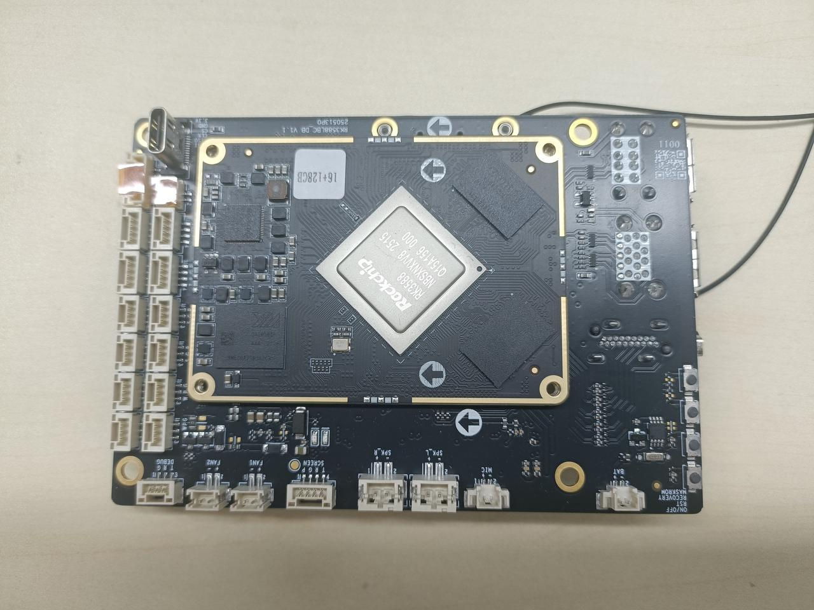

System motherboard


USB data cable


4438 model motor


TX60 wiring

<br>XT30(2+2) wiring

<br>Control button

**Software:**

SDK package: The companion program for the SDK stacking board, used to control motors in conjunction with the stacking board.

**Download:**

### Preliminary Preparation

#### Check Basic Motor Information

Use the host computer software to check the motor model, firmware version, and hardware version.

1. Connect the motor using the USB-to-FDCAN adapter board and open the host computer software (refer to the debugging assistant quick start guide [2.1 Host Computer Quick Start](../02-motor-debugging-assistant/2.1-quick-start.md))
2. Click Parameter Settings
3. Click Read Parameters
4. Check the motor model, firmware version, and hardware version in the basic information section.

**Note:** V3 firmware versions will not display some information in the SDK program. See [Software Introduction](https://lingdongfangcheng.feishu.cn/wiki/Nm7OwYkmki1eFLkEJ6xcRhR1nug) for details.


#### Modify Motor ID

1. Connect the motor using the debug board and open the debugging assistant (refer to the debugging assistant quick start guide [2.1 Quick Start](https://lingdongfangcheng.feishu.cn/wiki/BwSPwpjyLimtXTkTt0JczYOhned))
2. Click Parameter Settings.
3. Click Read Parameters.
4. View the motor ID and change it to 1.
5. Click Write Parameters to save the modified motor ID.

Note: This example uses a motor with ID 1. In actual use, the motor ID can be set according to circumstances.


### Hardware Preparation

#### Interface and Wiring Description

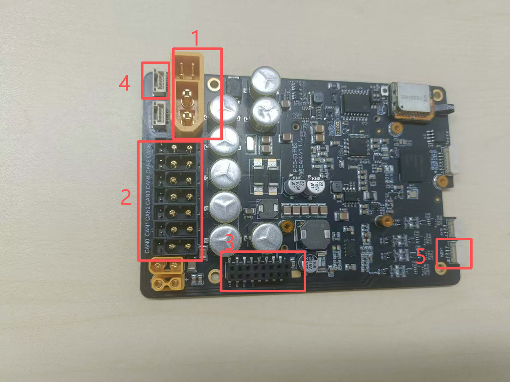

**Interface Details:**

1. **Power Input Interface**: Uses an XT60 male connector, supports 24–48V voltage range.
2. **XT30(2+2) Motor Interface**:
    - Isolated from the power input via a MOS transistor; the output voltage matches the input voltage and is controlled by the switch below.
    - Supports FDCAN communication and can work with the communication board to convert FDCAN signals into serial signals along with the corresponding CAN channel number.
    - Motor interface CAN channel numbers are arranged in the order of the blue numbers shown in the diagram.
3. **System Board Interface:** Connect the motherboard here.
4. **XT30(2+2) Motor Control Button Interface**: Used to control motor power supply; short press to toggle.
5. **System Board Power Button Interface:** Used to control system board power supply; long press to toggle.

**Connection Steps:**

1. Connect the power supply to the **Power Input Interface**;
2. Connect the motor to the **XT30(2+2) Motor Interface**;
3. Insert the system board into the **System Board Interface**;
4. Connect the external switch buttons to the **Motor Control Button Interface** and **System Board Power Button Interface** respectively;
5. It is recommended to connect a display and keyboard/mouse devices to the HDMI and USB interfaces on the system board.

#### Power-On Instructions

**Note:**

- When using the SDK program, ensure all devices are powered.
- Do not hot-plug devices.

##### Base Board Power

- Connect the power supply to the power input interface. The power section indicator light will turn on: solid green light, blinking blue light.
<br>Base board power section indicator light status

##### System Board Power

- Long press the system board power button to boot the system board computer. The button will light up, and the indicator lights on both the base board and system board will turn on. The power section shows solid green and blinking blue; the communication section shows solid red and blinking blue.
<br>Bottom indicator light status

- The system board indicator light shows solid red and blinking blue.
<br>System board indicator light status

##### Motor Power

Power on the motor, then short press the button at the power interface. The motor's bottom indicator light will turn on.

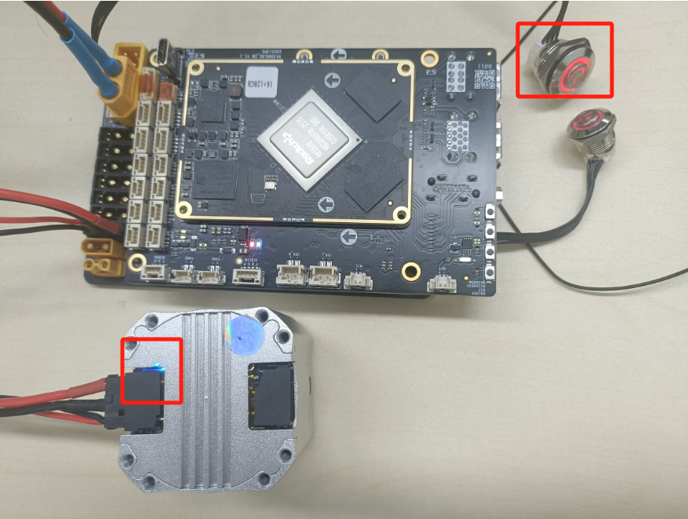<br>Switch button and motor indicator light status

### Software Preparation

#### Setting Up the Environment

- Operating system: Linux (Ubuntu recommended)
- Test environment: This test is based on Ubuntu 20.04 with a ROS1 environment configured
- The master control box comes with the environment pre-installed; you can proceed directly to **6. Program Usage Instructions** for program control

##### Environment Configuration

1. Run the fishros one-click installer as follows:

```text
wget http://fishros.com/install -O fishros && . fishros
```


1. Select Install ROS, choose `1` to install ROS.


1. Select to replace the system source before installing.
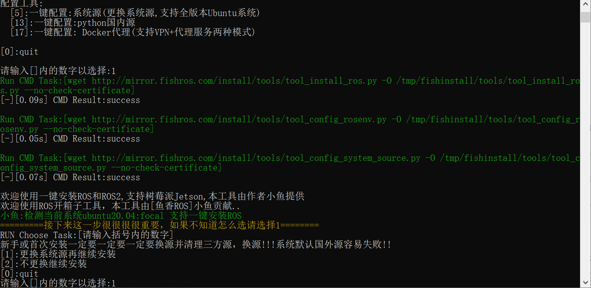

1. Select to replace the system source and clear third-party sources.


1. Select automatic speed test to choose the fastest source.


1. Select Install ROS1, choose `3` here.


1. Select the desktop version, choose `1` here.


1. Installation complete. The system will prompt that the installation was successful.
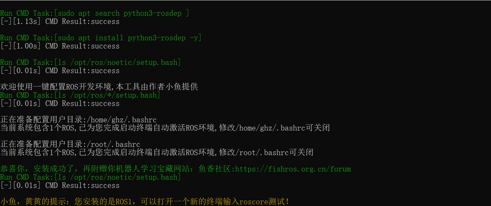

##### Install Dependencies

1. Install the serial communication related packages.

```bash
sudo apt-get install libserialport0 libserialport-dev
```

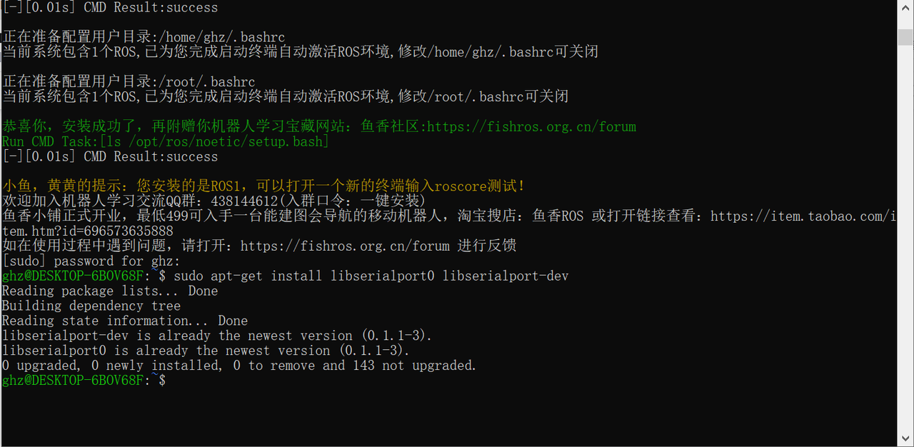

1. Install Python dependencies.

```bash
sudo apt update
sudo apt install python3-pip
python3 -m pip install empy
```


### Program Usage Instructions

#### Program Download

1. Program location

The program package is located in the ROS1 version program within the resource package, named `motor_sdk_ros1_v4.6.2.zip`.


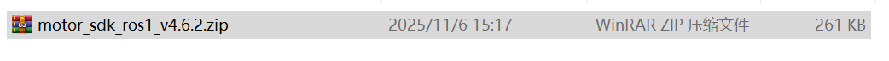

1. Create a folder named `SDK`, copy the program into it, and extract it. The command sequence is:

```text
//1. Create the SDK folder
  mkdir -p SDK
//2. Verify the folder was created successfully
  ls
//3. Enter the SDK folder
  cd SDK
//4. Copy the program into the SDK folder. /mnt/f/SDK/motor_sdk_ros1_v4.6.2.zip is the original file path; ~/SDK/ is the destination path
  cp /mnt/f/SDK/motor_sdk_ros1_v4.6.2.zip ~/SDK/
//5. Verify the package was copied into the SDK folder
  ls
//6. Extract the program package
  unzip motor_sdk_ros1_v4.6.2.zip
//7. Verify the program was extracted
  ls
//8. Enter the motor_sdk_ros1_v4.6.2 folder
  cd motor_sdk_ros1_v4.6.2
```


#### Program Compilation

1. Enter the `livelybot_sdk` folder. The current path is `/SDK/motor_sdk_ros1_v4.6.2/livelybot_sdk`.

```text
cd livelybot_sdk
```


1. Compile the program. A successful compilation will produce no `error` messages. If errors appear, check whether the environment and dependencies were installed successfully.

```text
catkin build
```

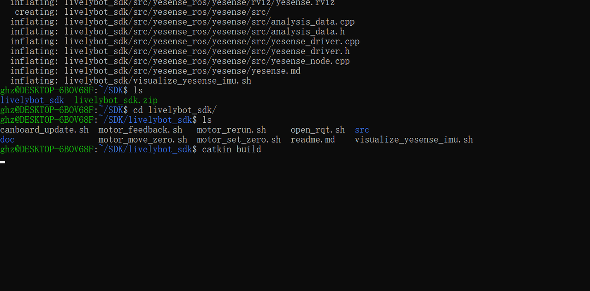


1. Source the runtime workspace.

```text
source devel/setup.bash
```


#### Modify Configuration Files

Under the `motor_cfg` directory in the `livelybot_bring` folder, there are multiple motor configuration files to choose from. Select the file based on the motor usage, and write its path in the `.launch` file under `livelybot_bringup/launch` to select the corresponding configuration file.

##### Select Motor Model File

1. In `xxx.launch` under the `launch` folder within `livelybot_bring`, select the required `yaml` file.
2. The `.launch` file in the example program contains the configuration file path. Modify the corresponding path to select the configuration file.
- Using `motor_rerun` as an example:

```bash
<launch>
  <rosparam file="$(find livelybot_bringup)/motor_cfg/robot_pi_12dof_cfg.yaml" command="load" />
  <node pkg="livelybot_bringup" name="motor_rerun" type="motor_rerun" output="screen" />
</launch>
```

The `.launch` configuration is as follows:

- `file`: The path to the motor configuration file. **Modify the configuration file name in this field to select the desired configuration file.**
- `pkg`: The node on which the example program runs.
- `robot_pi_12dof_cfg.yaml` is used here. (The default for all examples is `robot_pi_12dof_cfg.yaml`)

**Note**: Each example program's configuration file selection is now located in that program's `.launch` file.

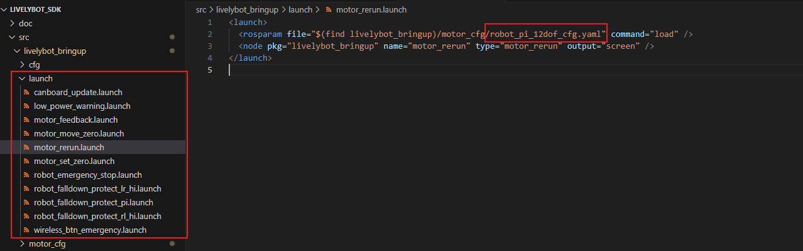

##### Modify Motor Configuration

`Find motor_cfg under the livelybot_bring folder. Within motor_cfg, select robot_pi_12dof_cfg.yaml and open it to modify the following settings (choose based on actual usage during development).`

1. Modify `CANport_num:1`: Set the number of CAN channels to use. Set to `1` for this operation.
2. Modify `serial_id:1`: Set the CAN channel number. Set to `1` for this operation.
3. Modify `motor_num: 1`: Set the number of motors. Set to `1` for this operation.
4. Modify `type:"4438_30"` under `motor1`: Set the motor model to 4438_30. This model is used in this example; modify according to actual conditions.
5. Modify `id:1` under `motor1`: Set the motor ID to `1`.

**Note**:

- **The motor ID under each CANport must start from 1. Be sure to modify the motor ID when using.**
- Remember to save after modifying the program.


#### Run the Test Program

From the `livelybot_sdk` path, run `motor_rerun.launch` under the `launch` folder in `livelybot_bringup` by entering the following command in the terminal. The corresponding test program is located under `src`.

```cpp
//Set environment variables so the terminal can recognize and use ROS-related commands and tools; required for using launch files
source devel/setup.bash

//Run the test program
roslaunch livebot_bringup motor_rerun.launch
```

After running normally, **the motor performs slow forward and reverse rotation, and the current motor status is updated in the terminal**.

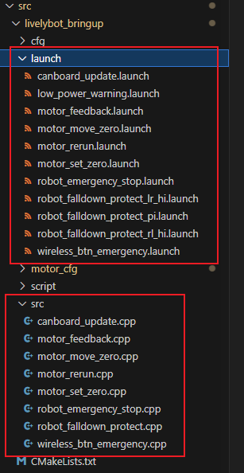


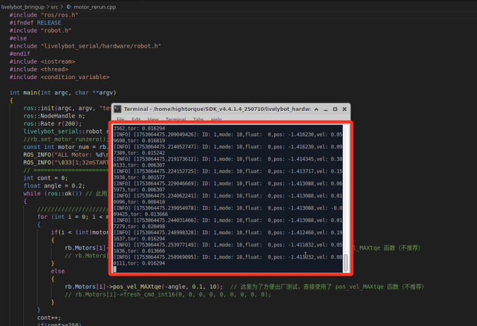
