# 4.1.3 ROS SDK Quick Start: Universal Box Power Board

### Purpose

Use the SDK program to control motor rotation on a 4-channel CAN stacking board.

### Bill of Materials

**Hardware:**

- DC regulated power supply
- Universal box power board
- Highgreat motor (4438-30 motor used here)
- USB cable
- Motor cable XT30(2+2) wiring
- Power cable XT60 wiring
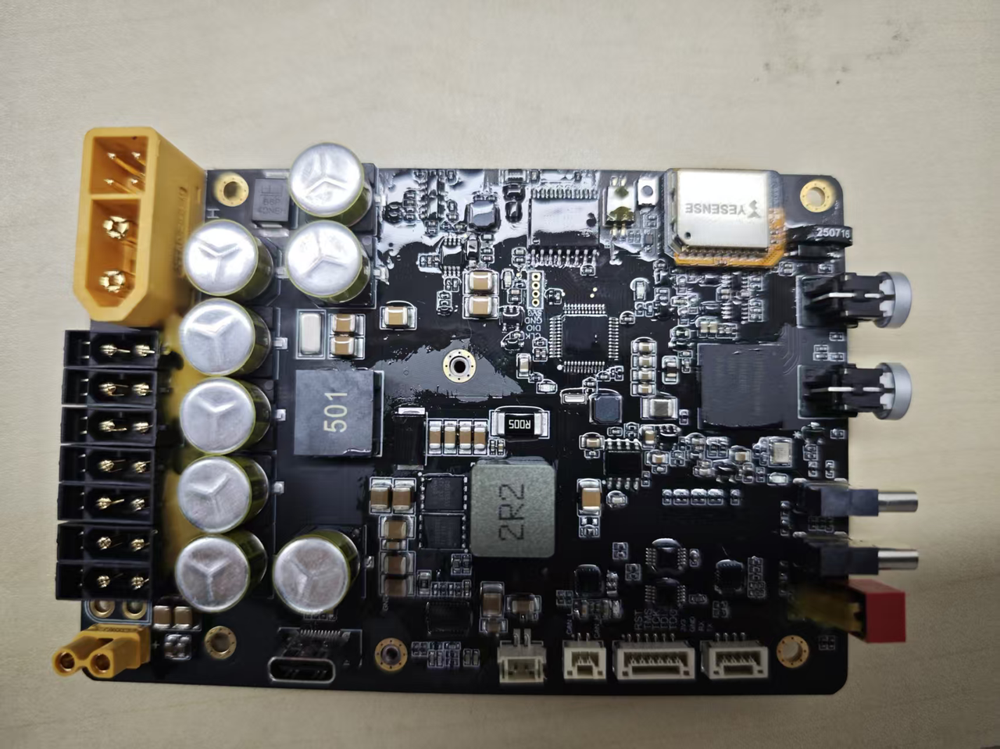

Power board


USB cable


Highgreat motor


TX60 wiring

<br>XT30(2+2) wiring

**Software:**

SDK package: The companion program for the stacking board, used to control motors in conjunction with the board.

**Download:**

### Prerequisites

#### Viewing Basic Motor Information

Use the host computer software to check the motor model, firmware version, and hardware version.

Connect the motor using a USB-to-FDCAN adapter board and open the host computer software (refer to the debugger quick start guide [2.1 Host Computer Quick Start](../02-motor-debugging-assistant/2.1-quick-start.md))

1. Click Parameter Settings.
2. Click Read Parameters.
3. View the motor model, firmware version, and hardware version under Basic Information.

**Note:** V3 firmware versions will not display some information in the SDK program. See the [Software Introduction](https://lingdongfangcheng.feishu.cn/wiki/Nm7OwYkmki1eFLkEJ6xcRhR1nug) for details.


#### Modifying the Motor ID

1. Connect the motor using the debug board and open the debug assistant (refer to the debugger quick start guide [2.1 Quick Start](https://lingdongfangcheng.feishu.cn/wiki/BwSPwpjyLimtXTkTt0JczYOhned))
2. Click Parameter Settings.
3. Click Read Parameters.
4. View the motor ID and change it to 1.
5. Click Write Parameters to save the modified motor ID.

Note: This example uses a motor with ID 1. The motor ID can be set as needed for actual use.


### Hardware Preparation

#### Interface Description

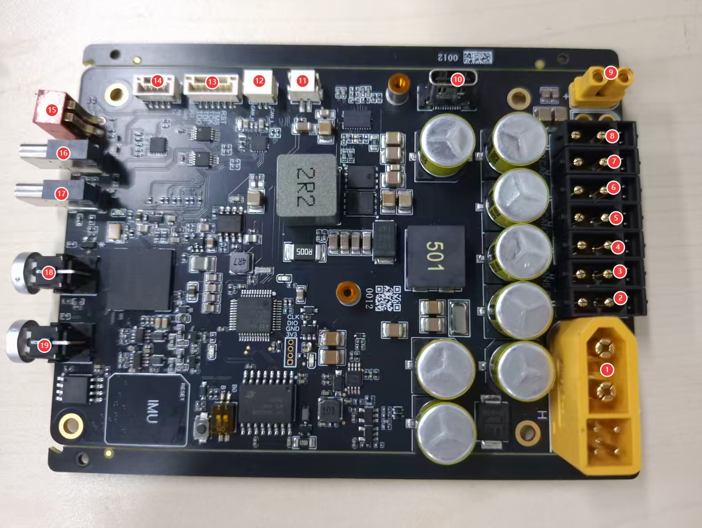

**Interface Details:**

| **Universal Box 7-Channel CAN Power Board Interface Overview** |  |  |
| --- | --- | --- |
| **Label** | **Name** | **Description** |
| ① | XT60(2+4)-M | Connector - XT60(2+4) - Power input, supports 12–24V voltage range |
| ②–⑧ | CAN0–CAN7 | Connector - XT30(2+2) - Power output |
| ⑨ | XT30-F | Connector - XT30 - Power output |
| ⑩ | USB 3.0 Type C | For communication with the computer |
| ⑪ | FAN CONNECT | Connector - ZH1.5-2p - vertical mount |
| ⑫ | CAN | Connector - GH1.25-2P - vertical mount with latch |
| ⑬ | JTAG debug port | Connector - GH1.25-6P - vertical mount with latch |
| ⑭ | UART debug port | Connector - GH1.25-4P - vertical mount with latch |
| ⑮ | DIP switch | For USB switching |
| ⑯ | USB2 | Reads IMU signals |
| ⑰ | USB3 | For flashing firmware to the communication chip |
| ⑱ | Key for Power | Control button for XT30 ⑨ 12V power output |
| ⑲ | Key for Power | Control button for XT30(2+2) ②–⑧ power output |

#### Wiring Instructions

1. **Power input connector**: Uses an XT60 male connector, supports 12–24V voltage range.
2. **XT30(2+2) power output port**:
    - Motor interface, used to connect motors.
    - Isolated from the power input via a MOSFET; output voltage matches input voltage, controlled by the switch below.
    - Supports FDCAN communication and can work with the communication board to convert FDCAN signals to serial signals with corresponding CAN channel numbers.
    - The CAN channel numbers for the motor interfaces are arranged as shown: ②–⑧ correspond to CAN7–CAN1.
3. **USB interface**: Used for data exchange between the computer and the communication board.

**Connection Steps:**

1. Connect the power supply to the **power input connector**;
2. Connect the motor to the **XT30(2+2) motor interface**;
3. Connect to the computer via the **USB interface**.


#### Power-On Instructions

**Note:**

- When using the SDK program, ensure all devices are powered on.
- Do not hot-plug devices.

##### Power Board Power Supply

- Connect the power supply to the XT60 power input channel to power the power board, and turn on the switch below. At this point, the green and red LEDs on the power board will light up, and the two blue LEDs will flash.
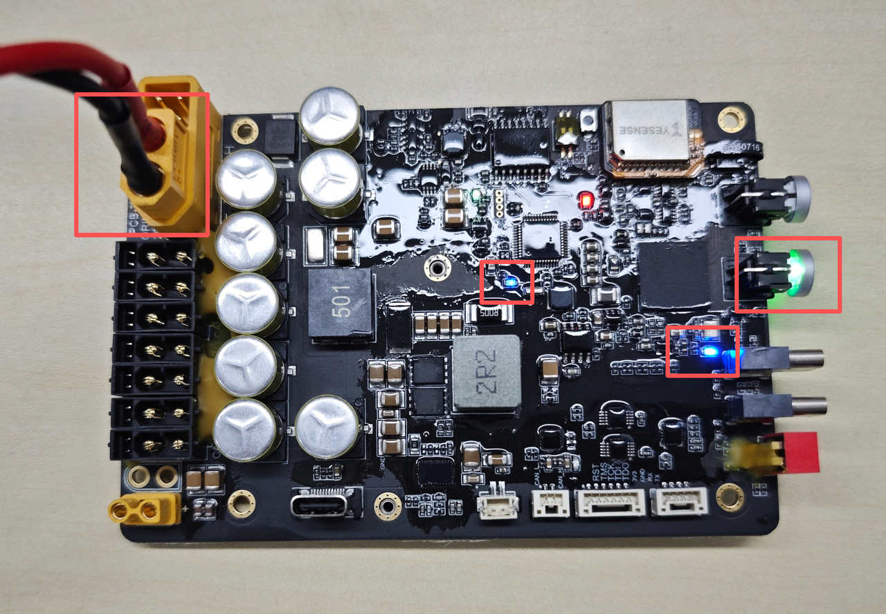<br>Power board LED status

##### Motor Power Supply

- Briefly press the motor power button to turn it on. At this point, the blue LED at the base of the motor will light up.
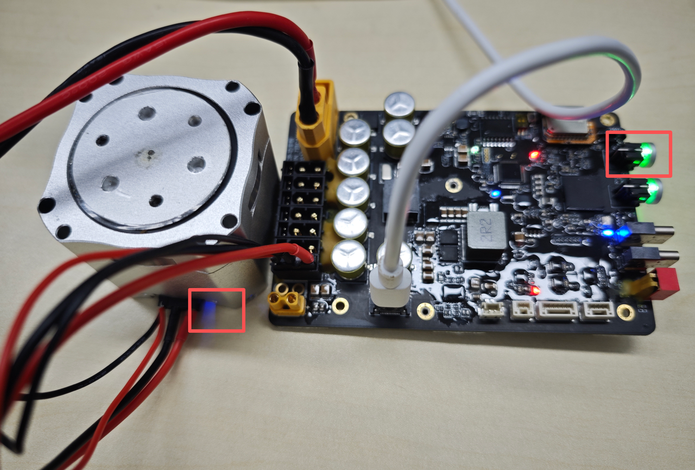

### Software Preparation

#### Setting Up the Environment

- Operating system: Linux (Ubuntu recommended)
- Test environment: This test is based on Ubuntu 20.04 with a ROS1 environment configured.

##### Environment Configuration

1. Run the fishros one-click installer as follows:

```text
wget http://fishros.com/install -O fishros && . fishros
```


1. Select to install ROS; choose `1` to install ROS.
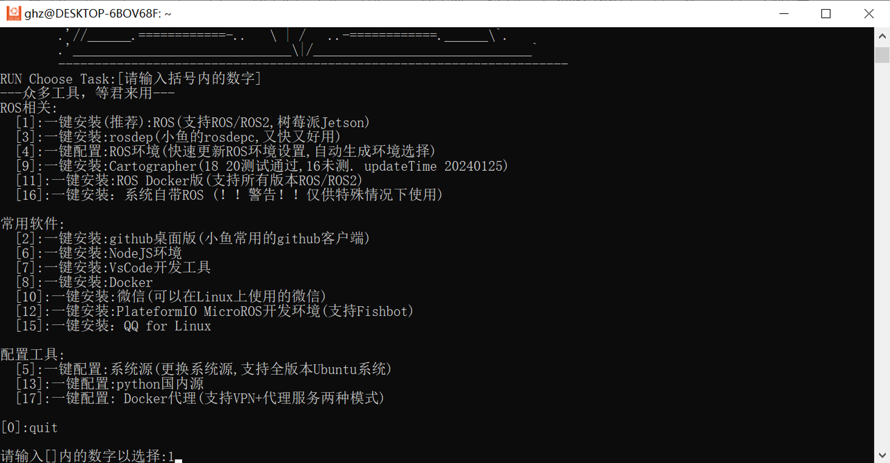

1. Select to change the system source before installing.


1. Select to change the system source and clear third-party sources.


1. Select automatic speed testing to choose the fastest source.


1. Select to install ROS1; choose `3` here.
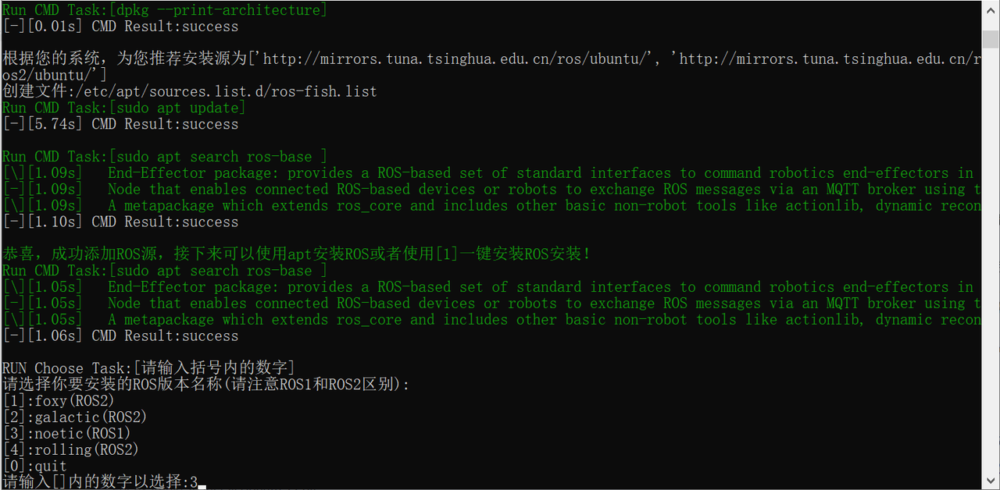

1. Select to install the desktop version; choose `1` here.
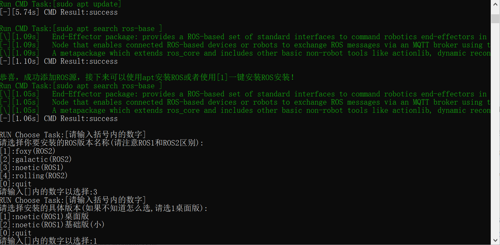

1. Installation complete; the system will display a success message.


##### Installing Dependencies

1. Install the serial communication packages.

```bash
sudo apt-get install libserialport0 libserialport-dev
```


1. Install Python dependencies.

```bash
sudo apt update
sudo apt install python3-pip
python3 -m pip install empy
```

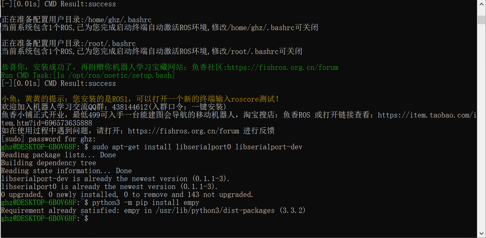

### Program Usage Instructions

#### Downloading the Program

1. Program location

The program package is in the ROS1 version programs within the resource package, named `motor_sdk_ros1_v4.6.2.zip`.

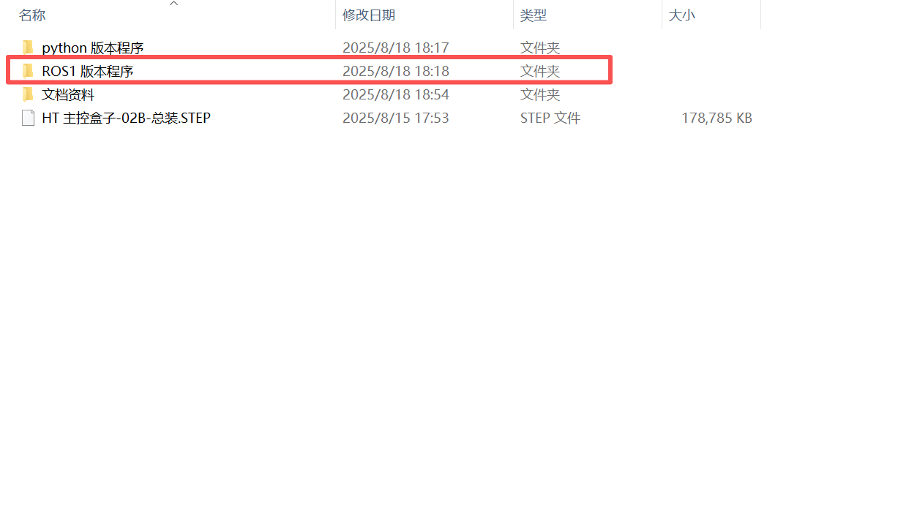

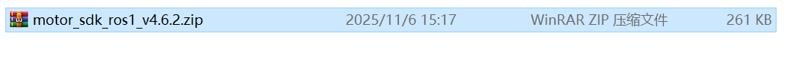

1. Create a folder named `SDK`, copy the program into it, and extract it. The command sequence is:

```text
//1. Create the SDK folder
  mkdir -p SDK
//2. Verify the folder was created successfully
  ls
//3. Enter the SDK folder
  cd SDK
//4. Copy the program into the SDK folder; /mnt/f/SDK/motor_sdk_ros1_v4.6.2.zip is the original file path, ~/SDK/ is the destination
  cp /mnt/f/SDK/motor_sdk_ros1_v4.6.2.zip ~/SDK/
//5. Verify the package was copied into the SDK folder
  ls
//6. Extract the program package
  unzip motor_sdk_ros1_v4.6.2.zip
//7. Verify the program was extracted
  ls
//8. Enter the motor_sdk_ros1_v4.6.2 folder
   cd motor_sdk_ros1_v4.6.2
```


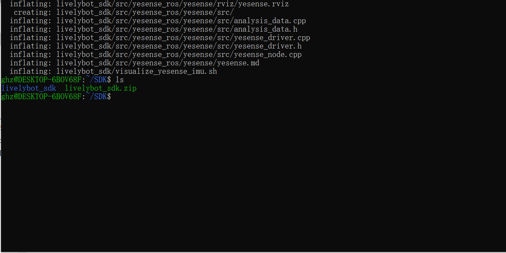

#### Compiling the Program

1. Enter the `livelybot_sdk` folder; the path at this point is `/SDK/motor_sdk_ros1_v4.6.2/livelybot_sdk`.

```text
cd livelybot_sdk
```

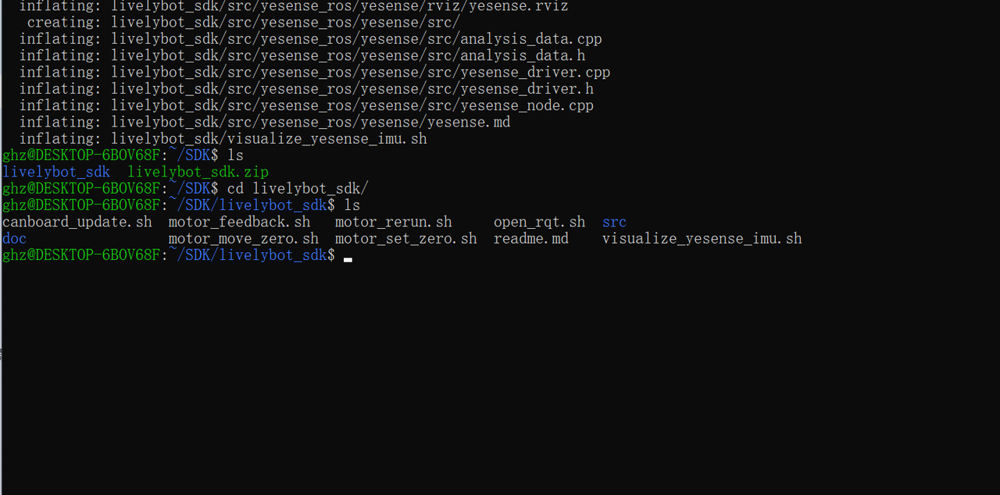

1. Compile the program. A successful compilation will not produce any `error` output. If errors appear, check whether the environment and dependencies were installed correctly.

```text
catkin build
```


1. Source the runtime workspace environment.

```text
source devel/setup.bash
```

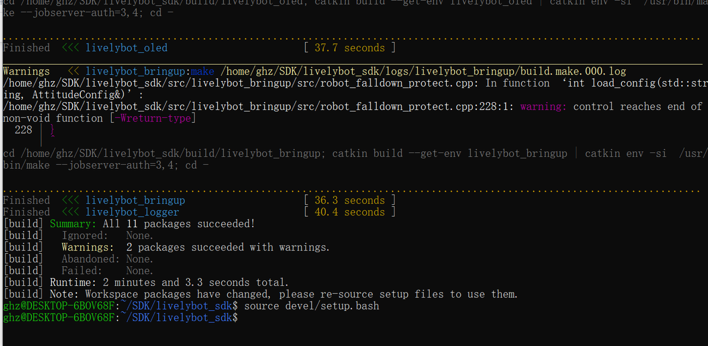

#### Modifying the Configuration File

Under the `motor_cfg` directory within the `livelybot_bringup` folder, there are multiple motor configuration files to choose from. Select the appropriate file based on how the motors are used, and specify its path in the `.launch` file under `livelybot_bringup/launch` to select the corresponding configuration file.

##### Selecting the Motor Model File

1. In the `xxx.launch` file under the `launch` directory within `livelybot_bring`, select the required `yaml` file.
2. The `.launch` file in the example program contains the configuration file path; modify the corresponding path to select a configuration file.
- Using `motor_rerun` as an example:

```bash
<launch>
  <rosparam file="$(find livelybot_bringup)/motor_cfg/robot_pi_12dof_cfg.yaml" command="load" />
  <node pkg="livelybot_bringup" name="motor_rerun" type="motor_rerun" output="screen" />
</launch>
```

The `.launch` configuration is as follows:

- `file`: Path to the motor configuration file. **Modify the configuration file name in this field to select a configuration file.**
- `pkg`: The node on which the example program runs.
- `robot_pi_12dof_cfg.yaml` is used here. (All examples default to `robot_pi_12dof_cfg.yaml`.)

**Note**: The configuration file selection for each example program is now found in that program's `.launch` file.


##### Modifying the Motor Configuration

`Locate motor_cfg under the livelybot_bring folder. Within motor_cfg, open robot_pi_12dof_cfg.yaml and modify the following settings (select according to actual usage during development).`

1. Modify `CANport_num:1`: Set the number of CAN channels in use; set to `1` for this example.
2. Modify `serial_id:1`: Set the CAN channel number; set to `1` for this example.
3. Modify `motor_num: 1`: Set the number of motors; set to `1` for this example.
4. Modify `type:"4438_30"` under `motor1`: Set the motor model to 4438_30. This model is used in this example; modify according to actual conditions.
5. Modify `id:1` under `motor1`: Set the motor ID to `1`.

**Note**:

- **The motor ID under each CANport must start from 1. Make sure to update the motor ID when in use.**
- Remember to save the file after making changes.


#### Running the Test Program

Run `motor_rerun.launch` under the `launch` directory of `livelybot_bringup` by entering the following commands in the terminal. The corresponding test program is located under `src`.

```cpp
//Set environment variables so the terminal can recognize and use ROS-related commands and tools; required for using launch files
source devel/setup.bash

//Run the test program
roslaunch livebot_bringup motor_rerun.launch
```

After running successfully, **the motor will rotate slowly back and forth, and the current motor status will be updated in the terminal**.


