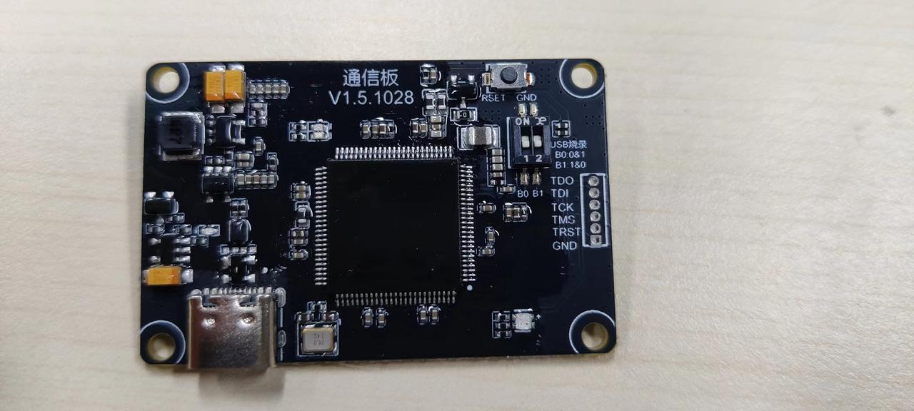
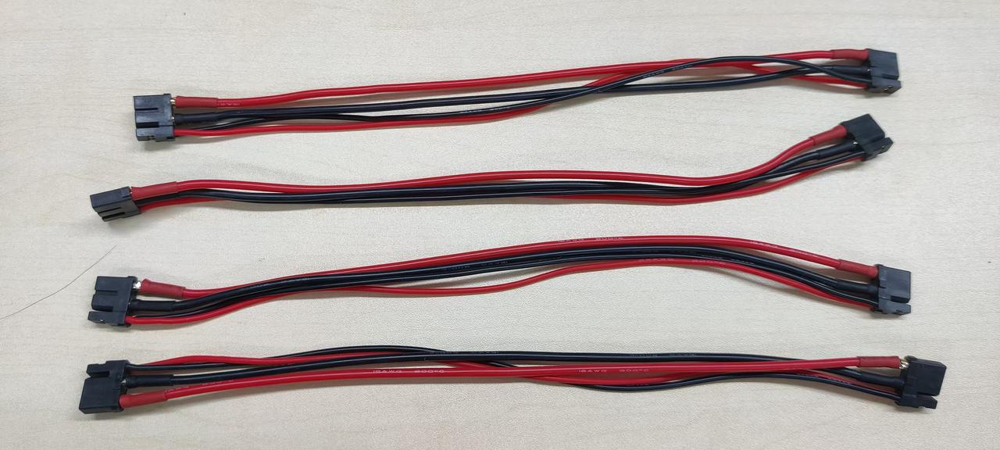
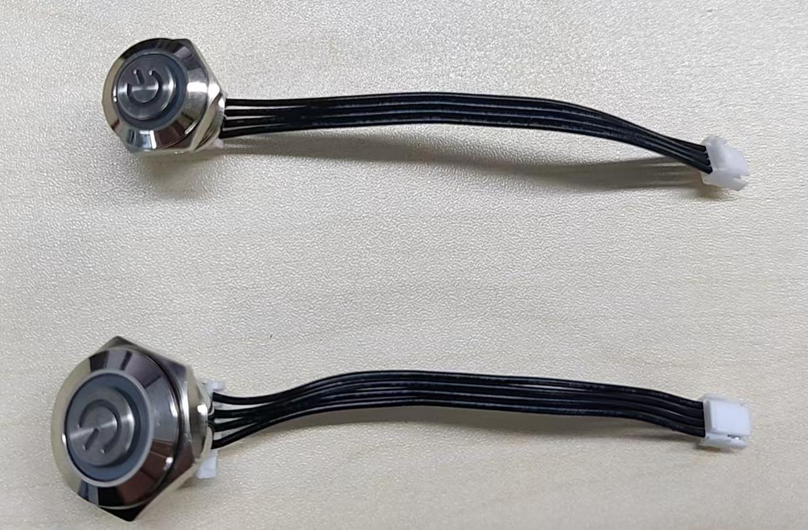
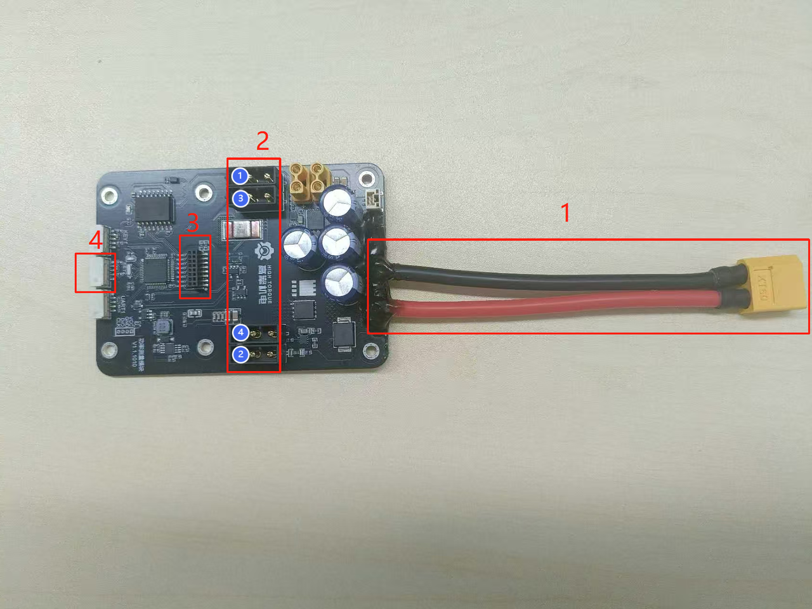
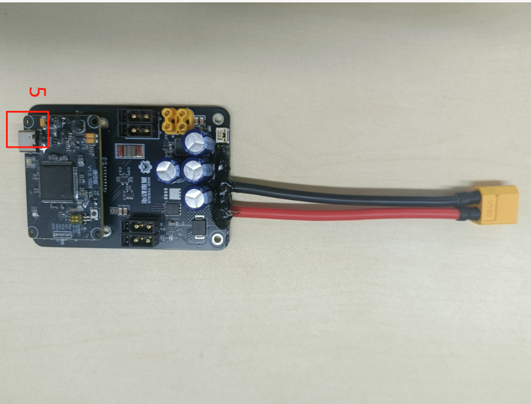
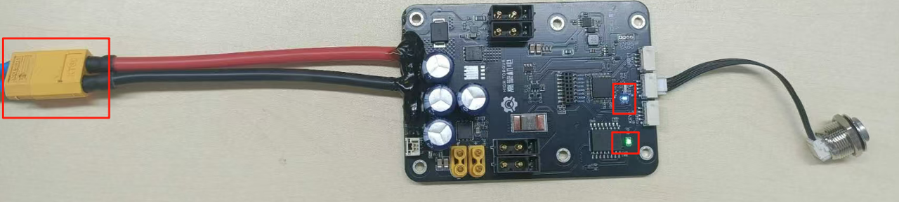
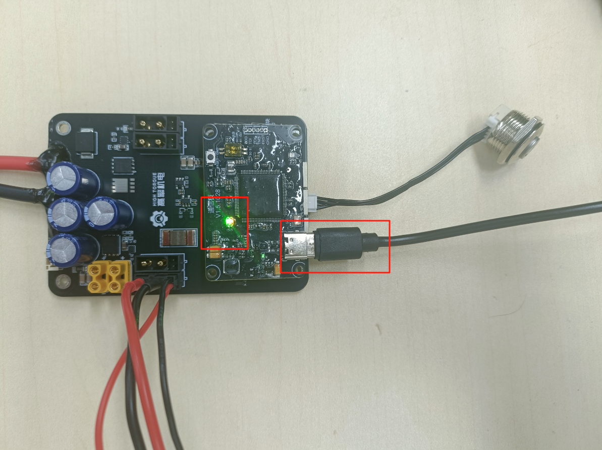
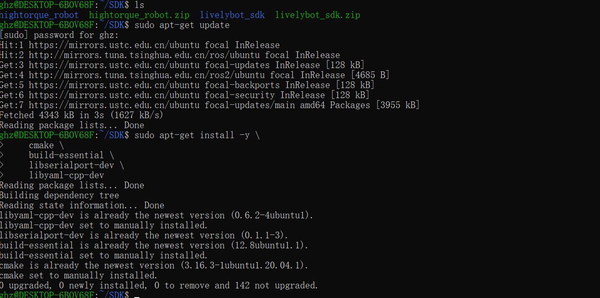
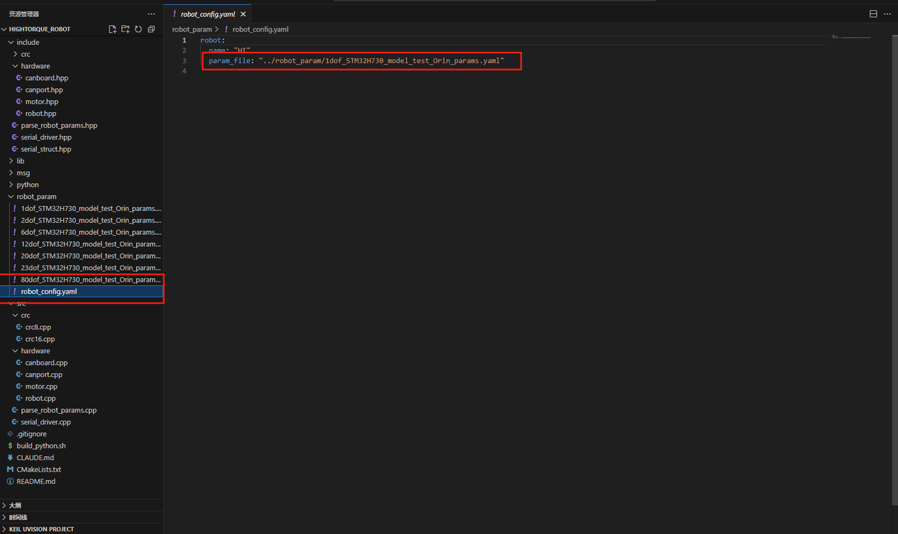
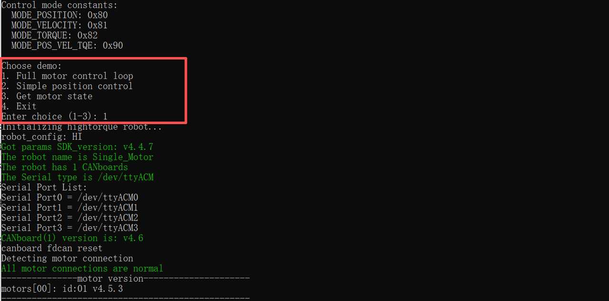

# 4.1.4 Python SDK Quick Start for 4-Channel Stacked Board

### Purpose

Use the Python SDK program to control motor rotation on a 4-channel CAN stacked board.

### Bill of Materials

**Hardware:**

- DC regulated power supply
- Communication board
- Power board
- Hightorque motor (4438-30 motor used here)
- USB data cable
- Motor cable XT30(2+2) wiring
- Power cable XT60 wiring
- Control button


Power board

<br>Communication board


USB data cable


4438 model motor


TX60 wiring

<br>XT30(2+2) wiring

<br>Control button

**Software:**

SDK program package: the companion program for the SDK stacked board, used together with the stacked board to control motors

**Download:**

### Prerequisites

#### Viewing Basic Motor Information

Use the host computer software to check the motor model, firmware version, and hardware version.

1. Connect the motor using a USB-to-FDCAN adapter board and open the host computer software (refer to the debug assistant quick start guide [2.1 Host Computer Quick Start](../02-motor-debugging-assistant/2.1-quick-start.md))
2. Click Parameter Settings
3. Click Read Parameters
4. View the motor model, firmware version, and hardware version in the basic information section.

**Note:** Firmware version V3 will not display some information in the SDK program. See [Software Introduction](https://lingdongfangcheng.feishu.cn/wiki/Nm7OwYkmki1eFLkEJ6xcRhR1nug) for details.


#### Modifying the Motor ID

1. Connect the motor using the debug board and open the debug assistant (refer to the debug assistant quick start guide [2.1 Quick Start](https://lingdongfangcheng.feishu.cn/wiki/BwSPwpjyLimtXTkTt0JczYOhned))
2. Click Parameter Settings.
3. Click Read Parameters.
4. View the motor ID and change it to 1.
5. Click Write Parameters to save the modified motor ID.

Note: This example uses a motor with ID 1. In actual use, the motor ID can be set according to the situation.


### Hardware Preparation

#### Interface and Wiring Description





**Interface Details:**

1. **Power Input Interface**: Uses an XT60 male connector, supports a voltage range of 12–24V.
2. **XT30(2+2) Motor Interface**:
    - Isolated from the power input via MOSFET; output voltage matches input voltage and is controlled by the switch below.
    - Supports FDCAN communication and can work with the communication board to convert FDCAN messages into serial messages along with the corresponding CAN channel number.
    - Motor interface CAN channel numbers are arranged in the order of the blue numbers shown in the diagram.
3. **Communication Board Connection Interface:** Used to connect the communication board.
4. **XT30(2+2) Motor Control Button Interface**: Used to control motor power supply; short press to toggle on/off.
5. **USB Interface**: Used for data exchange between the computer and the communication board.

**Connection Steps:**

1. Connect the power supply to the **Power Input Interface**;
2. Connect the motor to the **XT30(2+2) Motor Interface**;
3. Insert the communication board into the **Communication Board Interface**;
4. Connect the external switch button to the **Motor Control Button Interface**;
5. Connect to the computer via the **USB Interface**.

#### Power-On Instructions

**Note:**

- When using the SDK program, please supply power to all devices.
- Do not hot-plug devices.

##### Power Board Supply

- Connect the power supply to the XT60 power input channel to supply power to the power board. The power board green LED will light up and the blue LED will blink.
<br>Power board indicator light status

<br>Power board indicator light side view

##### Communication Board Supply

- Connect the USB cable between the communication board and the host computer to supply power to the communication board. The green LED on the communication board will light up and the red LED will blink.
<br>Communication board indicator light status

##### Motor Power Supply

- Short-press the motor power button to turn it on; the button will light up and the blue LED at the base of the motor will light up.
<br>Switch button and motor indicator light status

### Software Preparation

#### Setting Up the Environment

- Operating system: Linux (Ubuntu recommended)
- System environment: This test is based on Ubuntu 20.04

##### Installing Dependencies

###### Downloading the Program

Some third-party dependency packages are included in the program package to facilitate installation, so the program needs to be downloaded first.

1. Program location

The program package is in the Python version program within the resource package, named `motor_sdk_python_v4.5.4.zip`


1. Create a folder named `SDK`, copy the program into it, and extract it. The command sequence is:

```text
//1. Create the SDK folder
  mkdir -p SDK
//2. Check if the folder was created successfully
  ls
//3. Enter the SDK folder
  cd SDK
//4. Copy the program into the SDK folder. /mnt/f/SDK/motor_sdk_python_v4.5.4.zip is the original file path; ~/SDK/ is the destination. Modify as needed, or copy manually.
  cp /mnt/f/2/motor_sdk_python_v4.5.4.zip ~/SDK/
//5. Check if the program package has been copied into the SDK folder
  ls
//6. Extract the program package
  unzip motor_sdk_python_v4.5.4.zip
//7. Check if the program has been extracted
  ls
//8. Enter the motor_sdk_python_v4.5.4 folder
cd motor_sdk_python_v4.5.4
```


1. Install system dependencies
- Open a terminal and enter the following commands:

```text
sudo apt-get update
sudo apt-get install -y \
    cmake \
    build-essential \
    libserialport-dev \
    libyaml-cpp-dev
```

- The result is shown below:




- Install the Python binding dependencies by running the following command:

```python
pip install numpy
```

- The result is shown below:


###### Compiling the Program

- Enter the hightorque_robot directory and create a build folder.
    - Enter the following commands:

```text
cd hightorque_robot
mkdir build && cd build
```

    - The result is shown below:
        
- Run the cmake command:

```text
cmake ..
```

    - The result is shown below. Ensure there are no errors before proceeding.
        

    Run the make command:

```text
make
```

    The result is shown below. Ensure there are no errors before proceeding.

    

    

###### Move the hightorque_robot_py.*.so file generated in the build folder to the python folder

- Use the following command and verify that the file has been moved to the python directory.

```text
cp hightorque_robot_py.*.so ../python
```

- The name of `hightorque_robot_py.*.so` varies depending on the Python version. For example, with Python 3.8, `cpython-38` is generated, such as `hightorque_robot_py.cpython-38-aarch64-linux-gun.so` as shown below.
<br>build folder

<br>python folder

### Program Usage Instructions

#### Modifying the Configuration File

##### **Selecting the Motor Model File**

The main configuration file is located at `robot_param/robot_config.yaml`:

```yaml
robot:
  name: "HI"
  param_file: "../robot_param/1dof_STM32H730_model_test_Orin_params.yaml"
```

`1dof_STM32H730_model_test_Orin_params.yaml` is the motor parameter file. There are multiple motor parameter files available in the `robot_param` directory. Select the appropriate file based on the motor in use and write its path in `robot_config.yaml`.



##### **Modifying the Motor Configuration**


1. Modify `CANport_num:1` to set the number of CAN channels in use; set to `1` for this operation.
2. Modify `serial_id:1` to set the CAN channel number; set to `1` for this operation.
3. Modify `motor_num: 1` to set the number of motors; set to `1` for this operation.
4. Modify `type："4438_30"` under `motor1` to set the motor model to 4438_30; this model is used in this operation. Modify as appropriate for actual use.
5. Modify `id:1` under `motor1` to set the motor ID to `1`.

**Note:**

- **Motor IDs under each CANport start from 1. Remember to modify the motor ID when in use.**
- Remember to save the program after making changes.

#### Running the Test Program

Enter the python folder and run the test program `example_motor_control.py`.

```python
cd python
python3 example_motor_control.py
```

- The result is shown below. The Python script runs and executes the motor control program. Select 1 and the motor will perform a back-and-forth motion.



