# 4.1.5 Python SDK Quick Start for 7-Channel Master Control Box

### Purpose

Use the SDK program to control motor rotation on a 7-channel CAN master control box.

### Bill of Materials

**Hardware:**

- DC regulated power supply
- System motherboard
- Master control box base board
- Hightorque motor (4438-30 motor used here)
- USB data cable
- Motor cable XT30(2+2) wiring
- Power cable XT60 wiring
- Control button
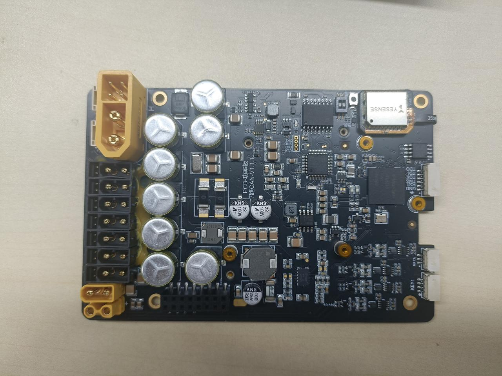

Master control box base board


System motherboard


USB data cable

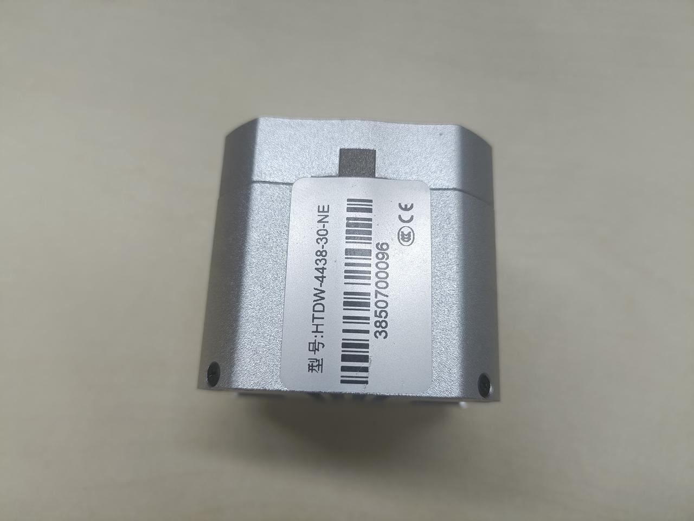

4438 model motor


TX60 wiring

<br>XT30(2+2) wiring

<br>Control button

**Software:**

SDK program package: companion program for the SDK stacking board, can be used with the stacking board to control the motor

**Download:**

### Preliminary Preparation

#### Check Basic Motor Information

Use the host computer software to view the motor model, firmware version, and hardware version.

1. Connect the motor using the USB-to-FDCAN adapter board and open the host computer software (refer to the debug assistant quick start guide [2.1 Host Computer Quick Start](../02-motor-debugging-assistant/2.1-quick-start.md))
2. Click Parameter Settings
3. Click Read Parameters
4. Check the motor model, firmware version, and hardware version in the basic information section.

**Note:** V3 firmware versions will not display some information in the SDK program. See [Software Introduction](https://lingdongfangcheng.feishu.cn/wiki/Nm7OwYkmki1eFLkEJ6xcRhR1nug) for details.


#### Modify Motor ID

1. Connect the motor using the debug board and open the debug assistant (refer to the debug assistant quick start guide [2.1 Quick Start](https://lingdongfangcheng.feishu.cn/wiki/BwSPwpjyLimtXTkTt0JczYOhned))
2. Click Parameter Settings.
3. Click Read Parameters.
4. View the motor ID and change it to 1.
5. Click Write Parameters to save the modified motor ID.

Note: This guide uses a motor with ID 1. In practice, the motor ID can be set according to actual needs.

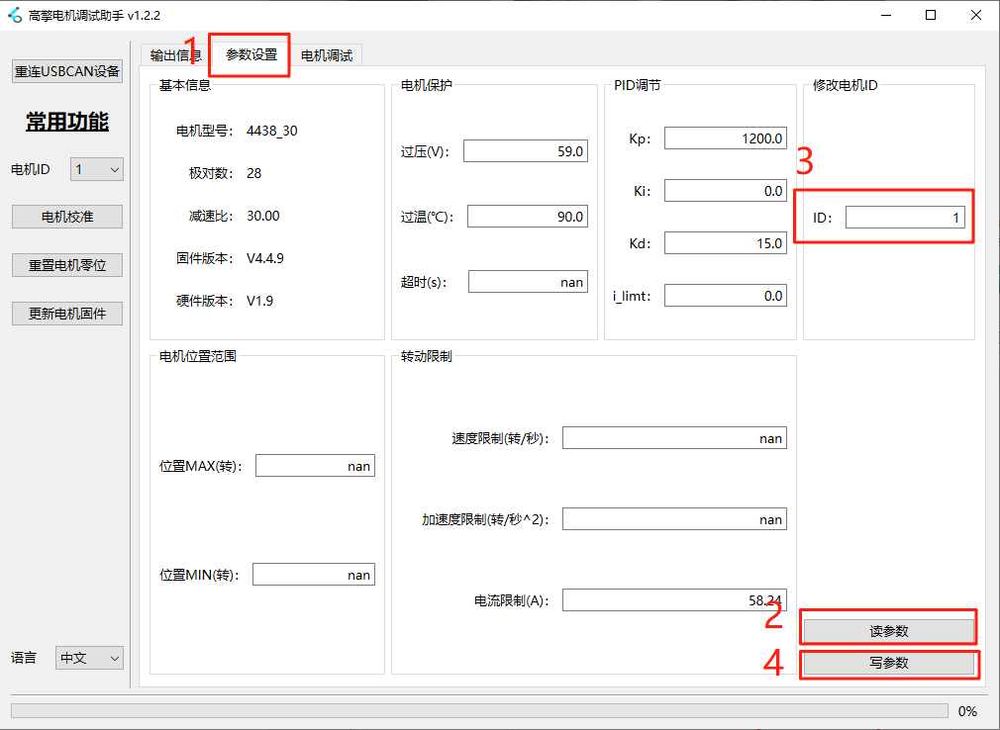

### Hardware Preparation

#### Interface and Wiring Description


**Interface Details:**

1. **Power Input Interface**: Uses an XT60 male connector, supports 24–48V voltage range.
2. **XT30(2+2) Motor Interface**:
    - Isolated from the power input via a MOSFET; output voltage matches input voltage and is controlled by the switch below.
    - Supports FDCAN communication; can work with the communication board to convert FDCAN signals into serial signals with corresponding CAN channel numbers.
    - The CAN channel numbers for the motor interfaces are arranged in the order of the blue numbers shown in the diagram.
3. **System Board Interface:** Connect the motherboard here.
4. **XT30(2+2) Motor Control Button Interface**: Used to control motor power supply; short press to toggle on/off.
5. **System Board Power Button Interface:** Used to control system board power supply; long press to toggle on/off.

#### Power-On Instructions

**Note:**

- When using the SDK program, please power all devices.
- Do not hot-plug devices while powered.

##### Base Board Power-On

- Connect the power supply to the power input interface. The power section indicator lights will turn on: green light steady on, blue light blinking.
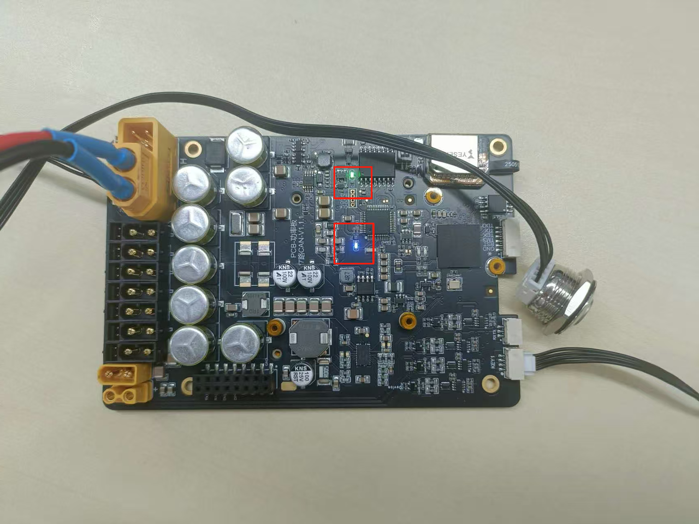<br>Base board power section indicator light status

##### System Board Power-On

- Long press the system board power button to boot the system computer on the system board. The button will light up, and the indicator lights on both the base board and system board will turn on: power section shows green steady, blue blinking; communication section shows red steady, blue blinking.
<br>Base indicator light status

- The system board indicator light shows red on, blue blinking.
<br>System board indicator light status

##### Motor Power-On

Power the motor and short press the button at the power interface. The indicator light at the bottom of the motor will turn on.

<br>Switch button and motor indicator light status

### Software Preparation

#### Setting Up the Environment

- Operating system: Linux (Ubuntu recommended)
- Test environment: This test is based on Ubuntu 20.04

##### Installing Dependencies

1. Download the program

    We have included some third-party dependency packages in the program package to make installation easier, so you need to download the program first for dependency installation.

    1. Program location

    The program package is in the Python version program within the data package, named `motor_sdk_python_v4.5.4.zip`

    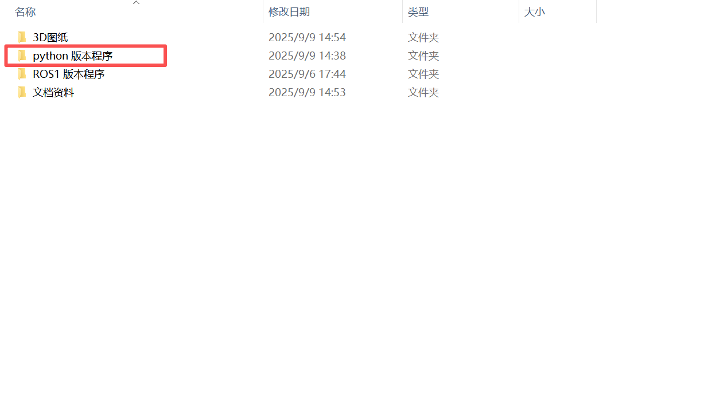

    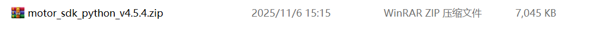
    1. Create a folder named `SDK`, copy the program into it, and extract it. The command sequence is:

```text
//1. Create the SDK folder
  mkdir -p SDK
//2. Verify the folder was created successfully
  ls
//3. Enter the SDK folder
  cd SDK
//4. Copy the program into the SDK folder. /mnt/f/SDK/motor_sdk_python_v4.5.4.zip is the original file path, ~/SDK/ is the destination path. Modify these according to your actual situation, or copy manually into the folder.
  cp /mnt/f/2/motor_sdk_python_v4.5.4.zip ~/SDK/
//5. Check whether the program package has been copied into the SDK folder
  ls
//6. Extract the program package
  unzip motor_sdk_python_v4.5.4.zip
//7. Check whether the program has been extracted
  ls
//8. Enter the motor_sdk_python_v4.5.4 folder
cd motor_sdk_python_v4.5.4
```

    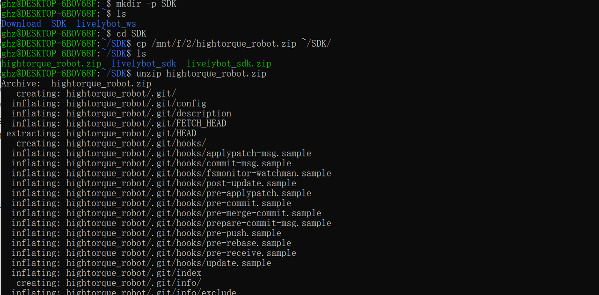

    
    1. Install system dependencies
    - Open a terminal and enter the following commands:

```text
sudo apt-get update
sudo apt-get install -y \
    cmake \
    build-essential \
    libserialport-dev \
    libyaml-cpp-dev
```

    - The result should appear as shown in the figure below.
    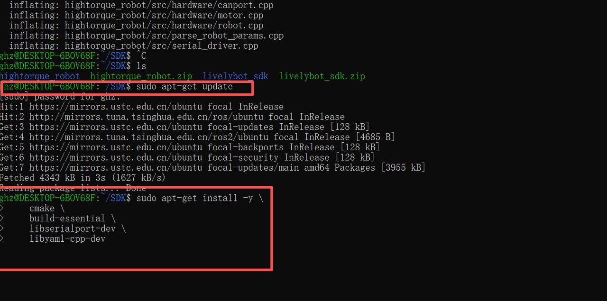

    
    - Install Python binding dependencies by running the following command:

```python
pip install numpy
```

    - The result should appear as shown in the figure below.
    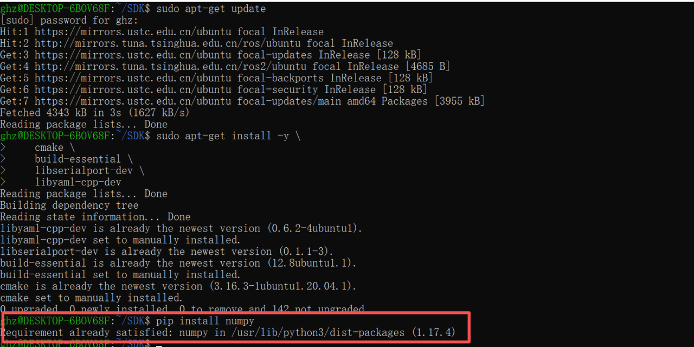

###### Compiling the Program

    - Enter the hightorque_robot directory and create a build folder.
        - Enter the following commands:

```text
cd hightorque_robot
mkdir build && cd build
```

        - The result should appear as shown in the figure below.
            
    - Run the cmake command:

```text
cmake ..
```

        - The result should appear as shown below. Make sure there are no errors before proceeding.
            

        Run the make command:

```text
make
```

        The result should appear as shown below. Make sure there are no errors before proceeding.

        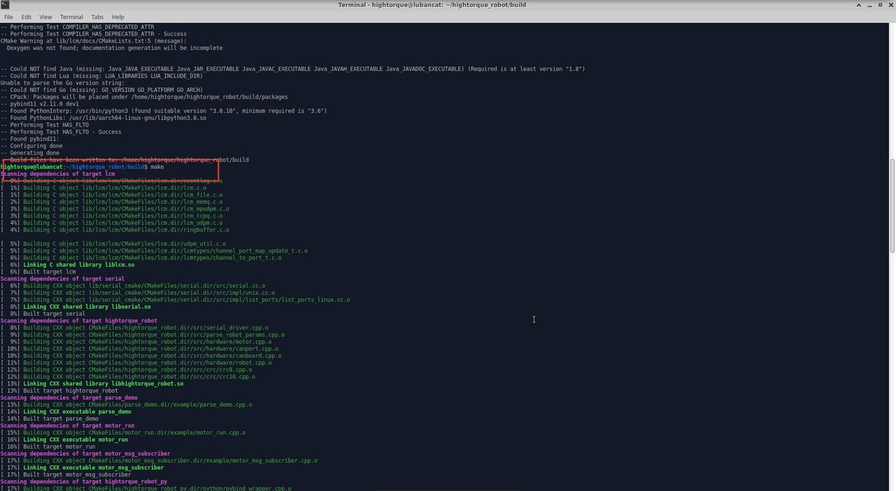

        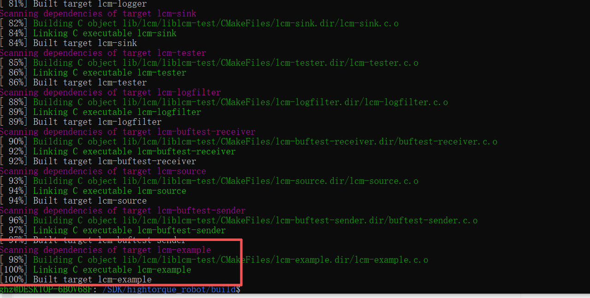

###### Move the hightorque_robot_py.*.so file generated in the build folder to the python directory

    - Use the following command to do so, and verify that the file has been moved into the python directory.

```text
cp hightorque_robot_py.*.so ../python
```

    - The name of `hightorque_robot_py.*.so` varies depending on the Python version. For example, when using Python 3.8, the file generated is `cpython-38`, such as `hightorque_robot_py.cpython-38-aarch64-linux-gun.so` shown below.
    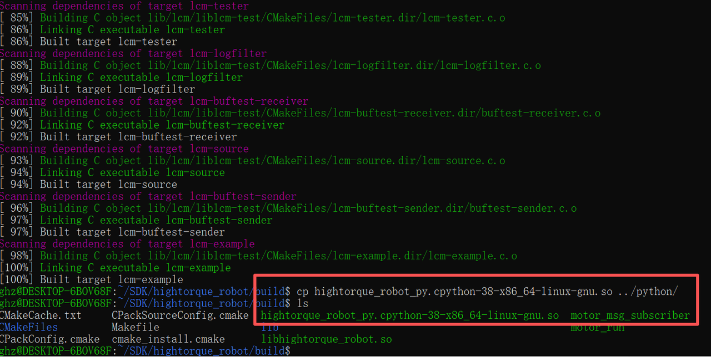<br>build directory

    <br>python directory

### Program Usage Instructions

#### Modifying the Configuration File

##### **Select the Motor Model File**

    The main configuration file is located at `robot_param/robot_config.yaml`:

```yaml
robot:
  name: "HI"
  param_file: "../robot_param/1dof_STM32H730_model_test_Orin_params.yaml"
```

    `1dof_STM32H730_model_test_Orin_params.yaml` is the motor parameter file. There are multiple motor parameter files available in the `robot_param` directory. Select the appropriate file based on your motor and enter its path in `robot_config.yaml`.

    

##### **Modify Motor Configuration**

    
    1. Modify `CANport_num:1` to set the number of CAN channels in use. Set to `1` for this operation.
    2. Modify `serial_id:1` to set the CAN channel number. Set to `1` for this operation.
    3. Modify `motor_num: 1` to set the number of motors. Set to `1` for this operation.
    4. Modify `type:"4438_30"` under `motor1` to set the motor model to 4438_30. This model is used for this operation; modify according to actual conditions.
    5. Modify `id:1` under `motor1` to set the motor ID to `1`.

    **Note:**

    - **Motor IDs under each CANport start from 1. Be sure to modify the motor ID when using.**
    - Remember to save the program after making modifications.

#### Running the Test Program

    Enter the python directory and run the test program `example_motor_control.py`.

```python
cd python
python3 example_motor_control.py
```

    - The result is shown below. The Python script runs, executes the motor control program, and when option 1 is selected, the motor performs a back-and-forth movement.
    

    
