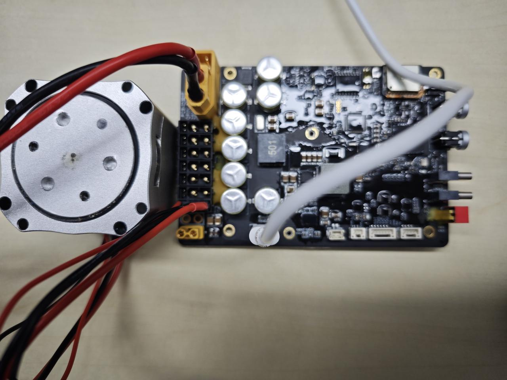
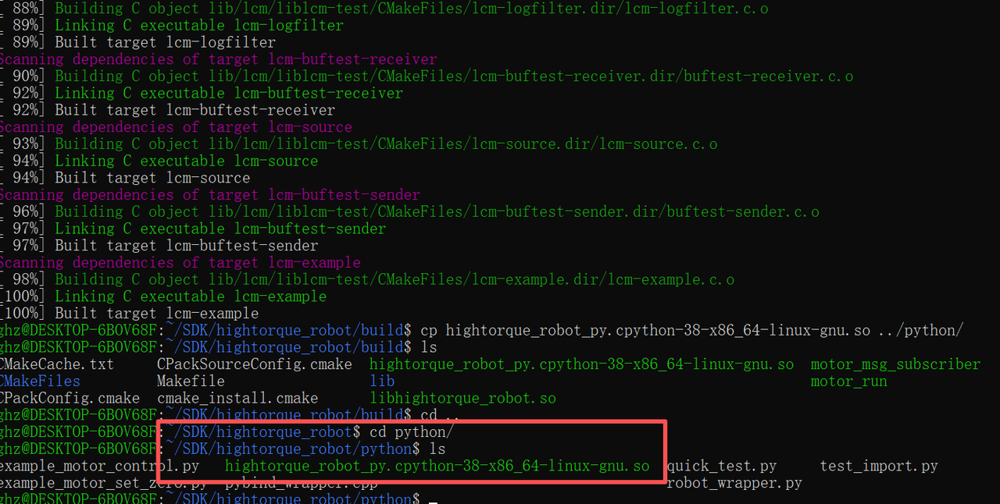

# 4.1.6 Python SDK Quick Start for Universal Box Power Board

### Purpose

Use the Python SDK program to control motor rotation on a 4-channel CAN stacking board.

### Bill of Materials

**Hardware:**

- DC regulated power supply
- Universal box power board
- HighTorque motor (4438-30 motor used here)
- USB data cable
- Motor cable XT30(2+2) wiring
- Power cable XT60 wiring


Power board


USB data cable


4438 model motor


TX60 cable

<br>XT30(2+2) cable

**Software:**

SDK package: The companion program for the SDK stacking board, which can be used with the stacking board to control motors.

**Download:**

### Prerequisites

#### Check Motor Basic Information

Use the host computer software to view the motor model, firmware version, and hardware version.

1. Connect the motor using a USB-to-FDCAN adapter board and open the host computer software (refer to the debugging assistant quick start guide [2.1 Host Computer Quick Start](../02-motor-debugging-assistant/2.1-quick-start.md))
2. Click Parameter Settings
3. Click Read Parameters
4. View the motor model, firmware version, and hardware version in the basic information section.

**Note:** Firmware version V3 has some information that will not be displayed in the SDK program. See [Software Introduction](https://lingdongfangcheng.feishu.cn/wiki/Nm7OwYkmki1eFLkEJ6xcRhR1nug) for details.


#### Modify Motor ID

1. Connect the motor using the debug board and open the debugging assistant (refer to the debugging assistant quick start guide [2.1 Quick Start](https://lingdongfangcheng.feishu.cn/wiki/BwSPwpjyLimtXTkTt0JczYOhned))
2. Click Parameter Settings.
3. Click Read Parameters.
4. Check the motor ID and change it to 1.
5. Click Write Parameters to save the modified motor ID.

Note: This guide uses a motor with ID 1. In actual use, motor IDs can be set according to your situation.


### Hardware Preparation

#### Interface and Wiring Description


**Interface Details:**

| **Universal Box 7-Channel CAN Power Board Interface Introduction** |  |  |
| --- | --- | --- |
| **Label** | **Name** | **Description** |
| ① | XT60(2+4)-M | Connector - XT60(2+4) - Power input, supports 12-24V voltage range |
| ②-⑧ | CAN0-CAN7 | Connector - XT30(2+2) - Power output |
| ⑨ | XT30-F | Connector - XT30 - Power output |
| ⑩ | USB 3.0 Type C | Used for communication with the computer |
| ⑪ | FAN CONNECT | Connector - ZH1.5-2p - vertical SMD |
| ⑫ | CAN | Connector - GH1.25-2P - vertical SMD with lock |
| ⑬ | JTAG debug port | Connector - GH1.25-6P - vertical SMD with lock |
| ⑭ | UART debug port | Connector - GH1.25-4P - vertical SMD with lock |
| ⑮ | DIP switch | Used for USB switching |
| ⑯ | USB2 | Reads IMU signal |
| ⑰ | USB3 | Used to flash firmware to the communication chip |
| ⑱ | Key for Power | Control button for XT30⑨ 12V power output |
| ⑲ | Key for Power | Control button for XT30(2+2)②-⑧ power output |

#### Wiring Instructions

1. **Power input interface**: Uses an XT60 male connector, supports 12-24V voltage range.
2. **XT30(2+2) power output port**:
    - Motor interface, used to connect motors.
    - Isolated from power input via MOSFET; output voltage matches input voltage, controlled by the switch below.
    - Supports FDCAN communication; can work with the communication board to convert FDCAN messages to serial messages and corresponding CAN channel numbers.
    - The CAN channel numbers of the motor interfaces are arranged as shown in the figure: ②-⑧ correspond to CAN7-CAN1.
3. **USB interface**: Used for data exchange between the computer and the communication board.

**Connection Steps:**

1. Connect the power supply to the **power input interface**;
2. Connect the motor to the **XT30(2+2) motor interface**;
3. Connect to the computer via the **USB interface**.


#### Power-On Instructions

**Note:**

- Please power all devices when using the SDK program.
- Do not hot-plug devices while powered.

##### Power Board Power Supply

- Connect the power supply to the XT60 power input channel to supply power to the power board. The green LED on the power board will light up and the blue LED will flash.
<br>Power board indicator status

##### Motor Power Supply

- Briefly press the motor power button to turn it on; the blue LED at the base of the motor will light up.


### Software Preparation

#### Setting Up the Environment

- Operating system: Linux (Ubuntu recommended)
- System environment: This test is based on Ubuntu 20.04

##### Install Dependencies

###### Download the Program

We have included some third-party dependency packages in the program package to facilitate installation, so you need to download the program first to install the dependencies.

1. Program location

The program package is in the Python version program within the resource package, named `motor_sdk_python_v4.5.4.zip`, which contains the program `hightorque_robot`.


1. Create a folder named `SDK`, copy the program into it, and extract it. The command sequence is as follows:

```text
//1. Create the SDK folder
  mkdir -p SDK
//2. Verify the folder was created successfully
  ls
//3. Enter the SDK folder
  cd SDK
//4. Copy the program into the SDK folder. /mnt/f/SDK/motor_sdk_python_v4.5.4.zip is the original file path, ~/SDK/ is the destination. Modify this according to your actual situation, or copy manually into the folder.
  cp /mnt/f/2/motor_sdk_python_v4.5.4.zip ~/SDK/
//5. Check whether the program package has been copied into the SDK folder
  ls
//6. Extract the program package
  unzip motor_sdk_python_v4.5.4.zip
//7. Check whether the program has been extracted
  ls
//8. Enter the motor_sdk_python_v4.5.4 folder
   cd motor_sdk_python_v4.5.4
```


1. Install system dependencies
- Open a terminal and enter the following commands:

```text
sudo apt-get update
sudo apt-get install -y \
    cmake \
    build-essential \
    libserialport-dev \
    libyaml-cpp-dev
```

- The result should look as shown in the figure:


- Install Python binding dependencies by running the following command:

```python
pip install numpy
```

- The result should look as shown below:


###### Compile the Program

- Enter the hightorque_robot folder and create a build folder.
    - Enter the following commands:

```text
cd hightorque_robot
mkdir build && cd build
```

    - The result should look as shown below:
        
- Run the compile command:

```text
cmake ..
```

    - The result should look as follows. Ensure there are no errors before proceeding.
        

    Run the make command:

```text
make
```

    The result should look as follows. Ensure there are no errors before proceeding.

    

    

###### Move the hightorque_robot_py.*.so file generated in the build folder to the python folder

- Use the following command and verify that the file has been moved into the python folder.

```text
cp hightorque_robot_py.*.so ../python
```

- The name of `hightorque_robot_py.*.so` varies depending on the Python version. For example, when using Python 3.8, it generates `cpython-38`, such as `hightorque_robot_py.cpython-38-aarch64-linux-gun.so` shown below.
<br>build folder

<br>python folder

### Program Usage Instructions

#### Modify the Configuration File

##### **Select the Motor Model File**

The main configuration file is located at `robot_param/robot_config.yaml`:

```yaml
robot:
  name: "HI"
  param_file: "../robot_param/1dof_STM32H730_model_test_Orin_params.yaml"
```

`1dof_STM32H730_model_test_Orin_params.yaml` is the motor parameter file. There are multiple motor parameter files available in the `robot_param` directory. Select the appropriate file based on your motor and enter its path in `robot_config.yaml`.


##### **Modify Motor Configuration**


1. Modify `CANport_num:1` to set the number of CAN channels in use. Set to `1` for this operation.
2. Modify `serial_id:1` to set the CAN channel number. Set to `1` for this operation.
3. Modify `motor_num: 1` to set the number of motors. Set to `1` for this operation.
4. Modify `type："4438_30"` under `motor1` to set the motor model to 4438_30. This model is used in this operation; modify according to your actual situation.
5. Modify `id:1` under `motor1` to set the motor ID to `1`.

**Note:**

- **Motor IDs under each CANport start from 1. Pay attention to modifying the motor ID when using.**
- Remember to save after modifying the program.

#### Run the Test Program

Enter the python folder and run the test program `example_motor_control.py`.

```python
cd python
python3 example_motor_control.py
```

- The result is shown below. The Python script runs and executes the motor control program. Select 1 to have the motor perform back-and-forth motion.


