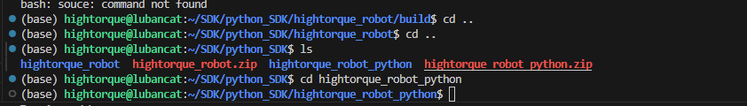
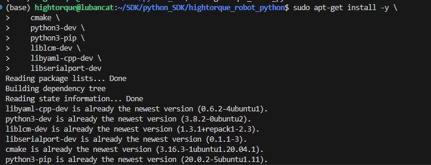
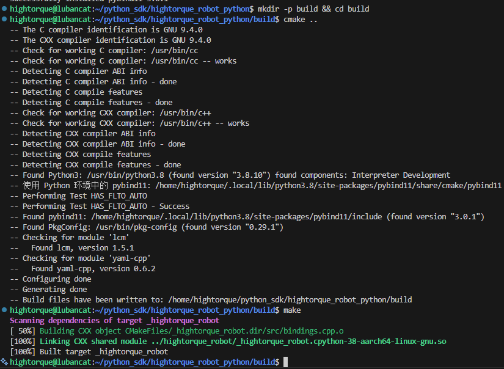

# 4.2.4 SDK Python Environment Configuration

This page describes how to set up the environment for the latest Python SDK. The SDK is provided in both C++ and Python versions; the C++ SDK is built first and is linked internally by the Python package.


### Build the C++ SDK

1. Go to the C++ SDK directory (`hightorque_robot`):

```bash
cd hightorque_robot
```


2. Install the serial port dependency:

```bash
sudo apt-get install libserialport-dev
```

3. Install the YAML parser dependency:

```bash
sudo apt-get install libyaml-cpp-dev
```


4. Build the C++ SDK:

```bash
mkdir build
cd build
cmake ..
make -j8
```

5. Install the built libraries:

```bash
sudo make install
```

6. **If `liblivelybot_serial.so.*` cannot be found** when another project links against this library, add the install location to the library search path in your current shell:

```bash
export LD_LIBRARY_PATH="/usr/local/lib:$LD_LIBRARY_PATH"
```

### Build the Python SDK

1. Go to the Python SDK directory:

```bash
cd hightorque_robot_python
```



2. Install system packages:

```bash
sudo apt-get install -y \
    cmake \
    python3-dev \
    python3-pip \
    liblcm-dev \
    libyaml-cpp-dev \
    libserialport-dev
```



3. Install Python packages:

```bash
pip3 install pybind11 numpy
```


4. Build `python_sdk` (from the Python SDK directory):

```bash
mkdir -p build && cd build
cmake ..
make
```



### Troubleshooting

#### **`hightorque_robot` module not found**

Install the Python package in editable mode from the Python SDK root:

```bash
cd path/to/hightorque_robot_python
pip3 install -e .
```
