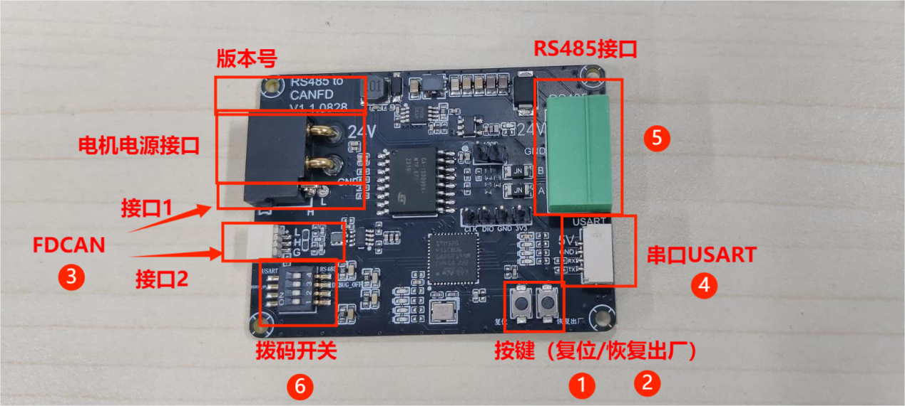
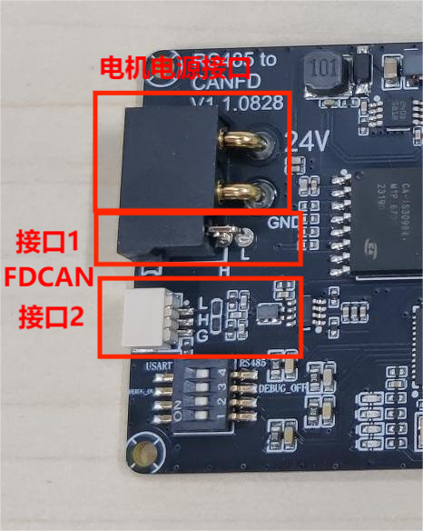
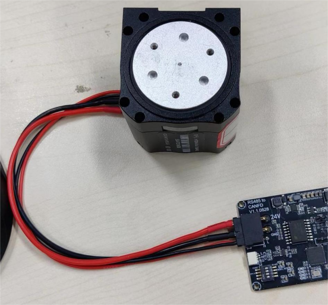
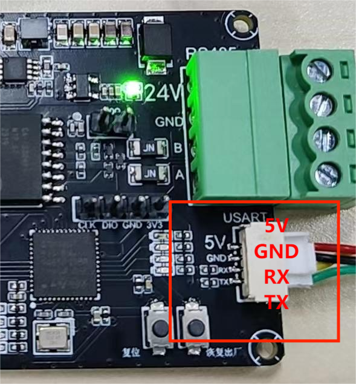
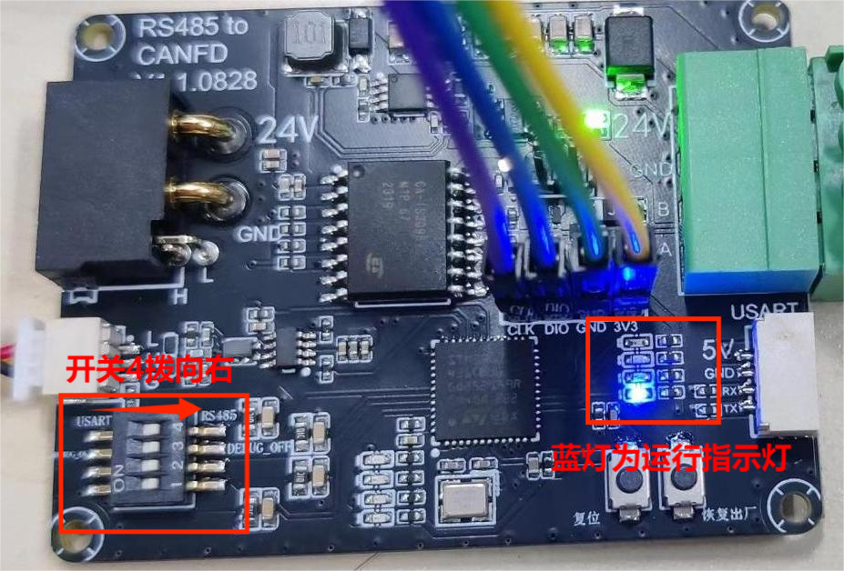
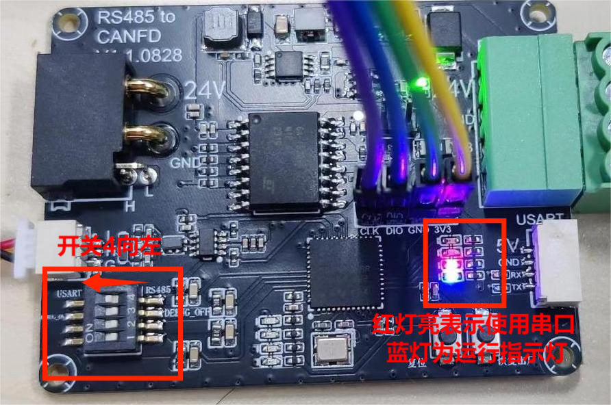

# 5.1 Hardware Guide

## **Interface Description**

**Note: Version compatible with V1.1.0828.**

### **Hardware Information Confirmation**

1. Reset (RES) button
    - This button restarts the hardware board.
2. Factory reset button
    - This button resets the hardware board to factory settings.
    - Factory configuration is as follows:
        - 1. Device address defaults to 1.
        - 2. Number of motors to control defaults to 1.
        - 3. Serial port baud rate defaults to 9600.
3. Motor power and FDCAN interface

This interface is used for connecting motors, with connector specification XT30 (2+2). The FDCAN interface on this connector is wired according to the motor model in use. If using a 5047 or 4438, the FDCAN line and power line share one slot — only connector 1 needs to be plugged in. If using a 5046 motor, the FDCAN line and power line are on separate slots — the power line connects to connector 1 and the FDCAN line connects to connector 2. See diagram below.

 (5046 motor) separate slot wiring

 (5047 motor) same slot wiring

1. Serial USART interface

This interface is used for serial data transfer. It can be connected to a PC host application for communication to send read/write commands. The detailed wiring sequence can be confirmed by the silkscreen markings on the hardware board.

Wiring: TX←→RX , RX←→TX , GND←→GND, (5V power supply).

1. RS485 interface

This interface is used for connecting to controllers (PLC) that use the RS485 protocol. The detailed wiring sequence can be confirmed by the silkscreen markings on the hardware board.

Wiring: A←→A , B←→B , GND←→GND, (24V power supply).

1. DIP switches
    

    DIP switch 4 toggles between using the RS485 interface or the USART serial interface. Switching right selects RS485; switching left selects serial USART.

    DIP switch 3 toggles whether the device sends basic configuration information on reset. Switching right disables sending; switching left enables sending.

 Reset response information when DIP switch 3 is on

 Using RS485

 Using serial USART

**Note:**

    - **DIP switch 3** is only used to confirm the interface and information at power-on. During normal operation, DIP switch 3 must be switched to the right.
    - DIP switches 1 and 2 currently have no functional design.

### **Basic Configuration Procedure**

When using the RS485-to-FDCAN board, you must first confirm the device ID address of the RS485-to-FDCAN board, the number of motors the device is to drive and control, and the baud rate set for data transmission. The device address defaults to 1, the number of motors to control defaults to 1, and the serial port baud rate defaults to 9600.

#### **Example: Modifying the Device ID Address (Using RS485 Interface)**

Objective: Set the RS485-to-FDCAN board device ID address from 1 to 2, then set it back from 2 to 1.

##### Example uses the RS485 interface of the RS485-to-FDCAN board connected via an RS485-to-USB serial adapter to a PC for demonstration.

**Note: In actual use, RS485 should serve as the power input and the motor interface end as the output.** When connecting the RS485-to-USB serial adapter, only connect the A and B terminals of the RS485 interface.
