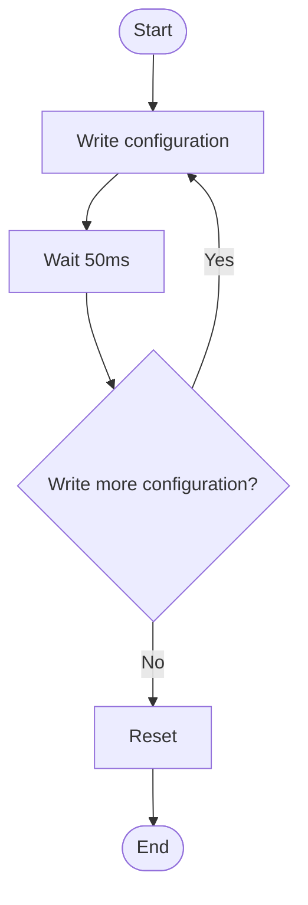
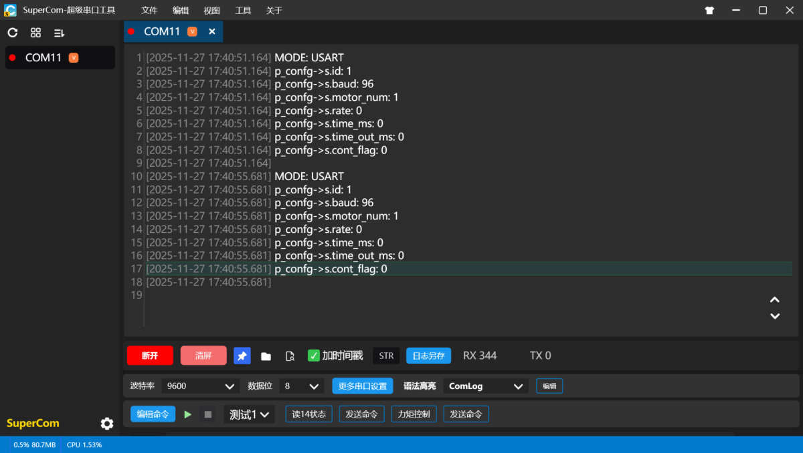
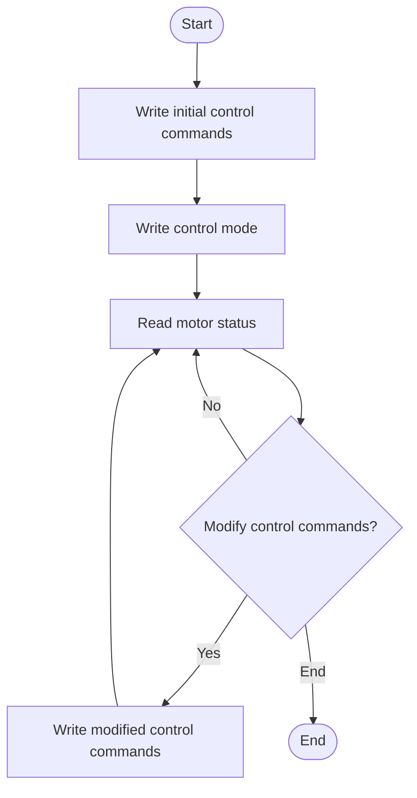
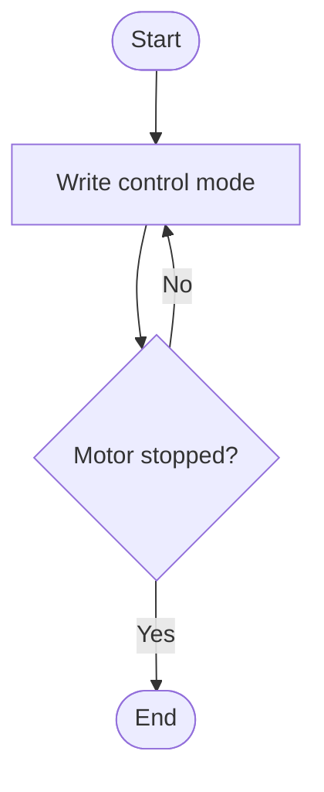
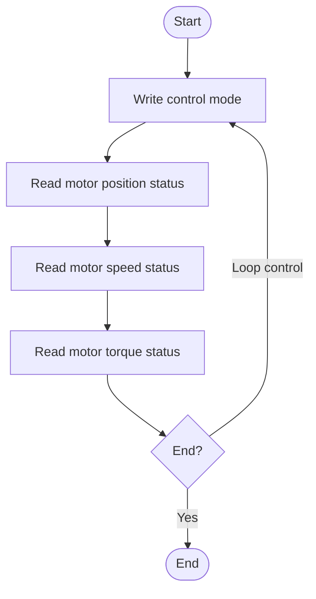

# 5.2 User Guide

**Note: This document is compatible with firmware version V4.0.0 and above**

## Basic Introduction

### Register Regions

#### Holding Registers

- Address range: `40002` - `41051` (protocol address), corresponding to `0` - `1049` (relative address)
- Core function: Used for device configuration and sending control commands.
- Supported function codes:
    - `03` Used to read one or more consecutive register values from holding registers
    - `06` Used to write data to a single holding register
    - `16` Used to write data to one or more consecutive holding registers.

Address space overview, see [Register Table](../05-RS485-to-FDCAN/5.3-register-table.md) for details:

| Address Range (Protocol) | Address Range (Relative) | Function Description | Data Format | Notes |
| --- | --- | --- | --- | --- |
| 40002 - 40051 | 1 - 50 | Device configuration area | int16 | Permanently stored, automatically saved after writing, save time 50ms, takes effect after restart. Currently only 1–7 (40002–40008) are defined and used. |
| 40052 - 40241 | 51 - 240 | One-to-many control mode command area | int16 | In this mode, used to send a unified set of control commands to multiple motors. |
| 40662 - 41051 | 661 - 1050 | Normal control mode command area | int16, int32 | Each motor's control mode uses a separate register. Motor control data (such as target position, speed) starts at address 691 (40692), using two consecutive 16-bit registers to form one 32-bit value. |

#### Input Registers

- Address range: `30001` - `30830` (protocol address), corresponding to `0` - `829` (relative address)
- Core function: Used to read device status and motor data.
- Supported function codes: `04` Used to read one or more consecutive register values from input registers

Address space overview, see [Register Table](../05-RS485-to-FDCAN/5.3-register-table.md) for details:

| Address Range (Protocol) | Address Range (Relative) | Function Description | Data Format | Notes |
| --- | --- | --- | --- | --- |
| 30001 - 30051 | 0 - 50 | Device status area | int16 | Stores read-only system information such as device ID and firmware version. |
| 30051 - 30261 | 50 - 260 | Motor status area | int16 | Motor status information (such as position, speed, torque, mode, error code). |
| 30651 - 30830 | 650 - 829 | Normal control mode position, speed, and torque area | int32 | In normal control mode, motor position, speed, torque, and other data consist of two consecutive 16-bit registers forming one 32-bit value. In normal control mode, only position, speed, and torque use int32 data; other data such as error codes and modes use int16 data. |

---

### Features

1. Communication Protocol
    - Protocol standard: Modbus-RTU
    - Physical interface: Serial interface and RS-485 interface.
    - Baud rate range: 4800 bps ~ 2 Mbps
2. FDCAN baud rate switching
3. Safety and protection features
4. Timed transmission feature
5. Control mode switching feature

---

## Configuration Instructions

### Configuration Parameters and Register Mapping

See the register table [Register Table](../05-RS485-to-FDCAN/5.3-register-table.md) for specific register relationships.

#### Device Address ID

- Modbus slave ID, i.e., the communication board's ID.

#### Number of Motors

- The number of motors configured must match the actual number connected.
- Motor IDs must start from 1.
    - For example, if the motor count is set to 3, the motors must have IDs 1, 2, and 3.

#### Baud Rate

- The master and slave baud rates must be the same for communication.
- The baud rate value is the number × 100; for example, 96 means baud rate 9600.

#### FDCAN Baud Rate Switching

- `0`: Use 1M FDCAN baud rate.
    - Advantages: More stable motor communication, strong anti-interference capability.
    - Disadvantages: Slower communication speed; control frequency should not be too high.
- `1`: Use 5M FDCAN baud rate.
    - Advantages: Fast motor communication response; can control more motors at the same control frequency.
    - Disadvantages: Susceptible to interference; high requirements for cable quality.

#### Timed Transmission Interval

- When timed transmission is enabled, manually sent commands are sent immediately without affecting or waiting for the next timed transmission cycle.
- Recommended interval: Depends on the number of connected motors.
    - For example, using 5M baud rate, controlling 10 motors in normal mode, set at least 4ms.
- `0`: Disables this feature.
- `Non-zero value`: Sets the timed transmission interval in milliseconds (ms).

#### Timeout Duration

- Function: When the communication time exceeds the configured timeout threshold, the motor enters stop mode to prevent abnormal control.
- `0`: Disables this feature.
- `Non-zero value`: Sets the motor communication timeout duration, in units of 10ms (i.e., a value of 1 means 10ms).

#### Control Mode Switching

- `0`: Normal control mode.
    - Advantages:
        - Position data uses int32; this mode must be used for control exceeding `±3.2` rotations.
        - Each motor is controlled independently, allowing different modes for each motor.
    - Disadvantages:
        - Large FDCAN data volume; one data value uses 2 registers. Suitable for controlling a small number of motors.
        - No synchronized motor control.
- `1`: One-to-many control mode, data uses int16.
    - Advantages:
        - Data for multiple motors is sent together; suitable for controlling a large number of motors.
        - Supports synchronized multi-motor control.
    - Disadvantages:
        - Due to data limitations, maximum rotation is `±3.2` turns.
        - Motor mode is controlled by a single register; all motors must use the same control mode.

---

#### Control Frequency Limits

- The following table shows the maximum number of motors that can be connected when using the RS485-to-FDCAN communication board for motor communication without FDCAN frame loss. This is unrelated to the RS485 communication and represents the FDCAN communication limit. It is recommended to use 80% of the values in the table below to ensure communication stability.
- For example, at 5M FDCAN baud rate, using 500Hz frequency to control motors in normal mode with position-speed-max-torque mode, a maximum of 7 motors is recommended.

<!-- HTML: merged cells consistent with Feishu; most Markdown renderers support inline HTML. -->
<table border="1" style="border-collapse:collapse;text-align:center;">
<thead>
<tr>
<th rowspan="2" style="padding:6px 10px;">FDCAN Baud Rate</th>
<th rowspan="2" style="padding:6px 10px;">Control Mode</th>
<th rowspan="2" style="padding:6px 10px;">Control Frequency</th>
<th colspan="8" style="padding:6px 10px;">Maximum Number of Connected Motors</th>
</tr>
<tr>
<th style="padding:4px 6px;">Voltage Mode</th>
<th style="padding:4px 6px;">Current Mode</th>
<th style="padding:4px 6px;">Speed Mode</th>
<th style="padding:4px 6px;">Position Mode</th>
<th style="padding:4px 6px;">Torque Mode</th>
<th style="padding:4px 6px;">Position-Speed Mode</th>
<th style="padding:4px 6px;">Position-Speed-Max-Torque Mode</th>
<th style="padding:4px 6px;">Position-Speed-Acceleration Mode</th>
</tr>
</thead>
<tbody>
<tr>
<td rowspan="6" style="padding:6px 10px;vertical-align:middle;">5M (FDCAN baud rate switching enabled)</td>
<td rowspan="3" style="padding:6px 10px;vertical-align:middle;">Normal Mode</td>
<td style="padding:4px 8px;">1000hz</td>
<td>5</td><td>5</td><td>5</td><td>5</td><td>4</td><td>5</td><td>5</td><td>5</td>
</tr>
<tr>
<td style="padding:4px 8px;">500hz</td>
<td>11</td><td>11</td><td>10</td><td>10</td><td>8</td><td>9</td><td>9</td><td>10</td>
</tr>
<tr>
<td style="padding:4px 8px;">250hz</td>
<td>20</td><td>20</td><td>20</td><td>20</td><td>16</td><td>18</td><td>18</td><td>20</td>
</tr>
<tr>
<td rowspan="3" style="padding:6px 10px;vertical-align:middle;">One-to-Many Mode</td>
<td style="padding:4px 8px;">1000hz</td>
<td>14</td><td>14</td><td>14</td><td>14</td><td>14</td><td>12</td><td>12</td><td>12</td>
</tr>
<tr>
<td style="padding:4px 8px;">500hz</td>
<td>14</td><td>14</td><td>24</td><td>24</td><td>24</td><td>23</td><td>23</td><td>23</td>
</tr>
<tr>
<td style="padding:4px 8px;">250hz</td>
<td>30</td><td>30</td><td>30</td><td>30</td><td>30</td><td>30</td><td>30</td><td>30</td>
</tr>
<tr>
<td rowspan="6" style="padding:6px 10px;vertical-align:middle;">1M (FDCAN baud rate switching disabled)</td>
<td rowspan="3" style="padding:6px 10px;vertical-align:middle;">Normal Mode</td>
<td style="padding:4px 8px;">1000hz</td>
<td>1</td><td>1</td><td>1</td><td>1</td><td>1</td><td>1</td><td>1</td><td>1</td>
</tr>
<tr>
<td style="padding:4px 8px;">500hz</td>
<td>3</td><td>3</td><td>3</td><td>3</td><td>2</td><td>3</td><td>3</td><td>3</td>
</tr>
<tr>
<td style="padding:4px 8px;">250hz</td>
<td>7</td><td>7</td><td>7</td><td>7</td><td>4</td><td>6</td><td>6</td><td>6</td>
</tr>
<tr>
<td rowspan="3" style="padding:6px 10px;vertical-align:middle;">One-to-Many Mode</td>
<td style="padding:4px 8px;">1000hz</td>
<td>5</td><td>5</td><td>5</td><td>5</td><td>5</td><td>3</td><td>3</td><td>3</td>
</tr>
<tr>
<td style="padding:4px 8px;">500hz</td>
<td>11</td><td>11</td><td>11</td><td>11</td><td>11</td><td>9</td><td>9</td><td>9</td>
</tr>
<tr>
<td style="padding:4px 8px;">250hz</td>
<td>23</td><td>23</td><td>23</td><td>23</td><td>23</td><td>17</td><td>17</td><td>17</td>
</tr>
</tbody>
</table>

---

### Configuration Procedure

**Configuration is only performed once when the device is used for the first time or when parameters need to be changed. Parameters are automatically saved after successful configuration; there is no need to repeat the setup during normal operation. You can proceed directly to the [Control Procedure].**

Please strictly follow the steps below in order to ensure successful configuration.

###### Step 1: Modify Configuration in Sequence

Send the corresponding setting values to the following registers in sequence. It is recommended to wait for a short system processing cycle (e.g., 50ms) after sending each command.

###### Step 3: Wait for Delay

After sending a command, you must wait at least 50ms. During this time, the device is writing the configuration to permanent storage. Do not power off or perform other operations.

###### Step 4: Reset the Device

After modifying the configuration, press the reset button or power cycle the device to ensure all new configurations take full effect.

**Note: If a configuration error is made, press the factory reset button to restore the configuration to its original state.**

### Usage Example

**Suppose you want to change the device address ID from 1 to 2 and change the baud rate to 115200.**

**Write to Registers**

- Use Modbus function code `06` to write data `0x0002` to register address `40002` (relative address 0x0001) to change the device address ID to 2.
- Use Modbus function code `06` to write data `0x0480` (hexadecimal for 1152) to register address 40004 (relative address 0x0003) to change the device baud rate to 115200.

#### Write Device Address

** 1. Write Target Command**

Write the target value for the device address ID.

- Device address
    - Register: 40002 (relative address 0x0001)
    - Value: `0x0002` (default is 1)
- Function code
    - 06: Write data to a single register

** 2. Wait 50ms**

#### Write Baud Rate

**1. Write Target Command**

Write the target baud rate value.

- Device address
    - Register: 40004 (relative address 3)
    - Value: `0x0480` (hexadecimal for 1152)
- Function code
    - 06: Write data to a single register

** 2. Wait 50ms**

#### Reset

**1. Press the reset button or power cycle the device to ensure all new configurations take full effect.**

### Verification

#### Method 1: Read Configuration via Serial Assistant

- Open the serial assistant and connect to the corresponding port.
    - For the serial port: set DIP switch 4 to the left, DIP switch 3 to the left.
    - For the RS485 port: set DIP switch 4 to the right, DIP switch 3 to the left.
- Press the reset button; the serial port prints the corresponding configuration information.

#### Method 2: Read Configuration Information Registers

##### **Configuration Information in Holding Registers**

1. Register addresses
    - Device ID
        - Register: 40002
    - Number of motors
        - Register: 40003
    - Device baud rate
        - Register: 40004
    - FDCAN baud rate switching
        - Register: 40005
    - Timed transmission interval
        - Register: 40006
    - Timeout duration
        - Register: 40007
    - Control mode switching
        - Register: 40008
2. Function code
    - 03: Read data from holding registers

##### **Configuration Information in Input Registers**

1. Register address
    - Device firmware version number
        - Register: 30002
2. 04: Read data from input registers

---

## Control Instructions

### Units

For example: When using an int32 type position value set to `100000`, it means controlling the motor to move to the position of `1 revolution`.

    When using an int32 type speed value set to `100000`, it means controlling the motor's movement speed at `1 revolution per second`.

    When using an int32 type torque value set to `1000`, it means controlling the motor's torque at `1 Newton-meter`.

    When using an int16 type acceleration value set to `1000`, it means controlling the motor's acceleration at `1 revolution per second²`.

### Control Procedure

The control mode usage flow follows the logic of "configure parameters → trigger execution → loop monitoring → dynamic adjustment".

1. Write initial control commands
    - According to control requirements, write target parameters to the corresponding control data registers.
    - Parameters for different control modes are described in the mode introductions below.
    - Example: In position-speed-max-torque mode, write the initial position, speed, and torque values to the corresponding control registers.
2. Write control mode command
    - Send a specific command code to the control mode register; the motor immediately executes the corresponding mode.
    - Example: Send control command (0x0A, decimal 10 representing position-speed-max-torque mode) to start the motor running to the specified position at the set speed.
3. Read motor status data
    - Read the motor's actual position, actual speed, actual torque, error status, and other state information.
    - Supports selective reading: read specific data according to monitoring requirements.
        - Can read only position and error status.
        - Can read only key operating parameters.
        - Can read complete status information.
4. Determine whether the control target needs to be modified
    - Determine based on control requirements whether control parameters need to be adjusted.
        - Yes: Proceed to the "Modify Control Commands" step for targeted parameter adjustment.

            Modify Control Commands

                - Adjust control parameters according to operational requirements.
                - Supports precise modification: can independently modify specific commands, such as:
                    - Modify only the position target value.
                    - Modify only the torque limit.
                    - Modify only the speed command.
                    - Or modify multiple parameters in combination.
        - No: Continue to loop and read status, maintaining current control.

### Normal Control Mode

- **Normal control mode requires setting register address** `40008` **(relative address** `0x0007`**) to** `0`. **See** `1.2 Configuration Procedure` **for specific operation.**
- **It is recommended to enable the timed transmission feature to ensure the device obtains real-time motor status data.**
- Note: Because some registers are non-contiguous, data must be written to or read from each register separately.
- Normal control mode supports the following motor controls:
    - 1: Get motor status (to read motor status individually, the motor must first be set to this mode)
    - 2: Stop
    - 3: Brake
    - 4: Voltage mode
    - 5: Current mode
    - 6: Position mode
    - 7: Speed mode
    - 8: Torque mode
    - 9: Position-speed mode
    - 10: Position-speed-max-torque mode
    - 11: Position-speed-acceleration mode
- Some data in this mode uses 32 bits, composed of two registers together.

#### Position-Speed-Max-Torque Control

Position-speed-torque control mode parameters: position, speed, torque

##### **1. Write Initial Control Commands**

- Description: Write the motor's target position, speed, and torque. There is no required order for writing these three parameters.
- Position
    - Registers:
        - `40692` (relative address `0x02B3`): Motor 1 - Position control value low 16 bits
        - `40693` (relative address `0x02B4`): Motor 1 - Position control value high 16 bits
    - Value: Target position value (32-bit)
        - Data value 100000: corresponding register data low 16 bits: 0x86A0, high 16 bits: 0x0001
- Speed
    - Registers:
        - `40752` (relative address `0x02EF`): Motor 1 - Speed control value low 16 bits
        - `40753` (relative address `0x02F0`): Motor 1 - Speed control value high 16 bits
    - Value: Target speed value (32-bit)
        - Data value 100000: corresponding register data low 16 bits: 0x86A0, high 16 bits: 0x0001
- Torque
    - Registers:
        - `40812` (relative address `0x032B`): Motor 1 - Torque control value low 16 bits
        - `40813` (relative address `0x032C`): Motor 1 - Torque control value high 16 bits
    - Value: Target torque value (32-bit)
        - Data value 100000: corresponding register data low 16 bits: 0x86A0, high 16 bits: 0x0001
- Function code
    - 16: Write data to multiple registers

##### **2.** **Write Control Mode**

- Description: Write the control mode to make the motor move according to the control mode.
- Register:
    - `40662` (relative address `0x0295`): Motor 1 - Control mode
- Value: `10` (represents position-speed-max-torque mode)
- Function code: 06 Write data to a single register

##### **3. Read Status**

- Description: Periodically read the motor's real-time status for monitoring, display, or logic decisions. One or more parameters can be read as needed, with no required order.
- Position
    - Registers:
        - `30651` (relative address `0x028A`): Motor 1 position status low 16 bits
        - `30652` (relative address `0x028B`): Motor 1 position status high 16 bits
    - Description: Motor actual position (32-bit) (see Units section for data magnitude)
- Speed
    - Registers:
        - `30711` (relative address `0x02C6`): Speed status low 16 bits
        - `30712` (relative address `0x02C7`): Speed status high 16 bits
    - Description: Motor actual speed (32-bit)
- Torque
    - Registers:
        - `30771` (relative address `0x0302`): Torque status low 16 bits
        - `30772` (relative address `0x0303`): Torque status high 16 bits
    - Description: Motor actual torque (32-bit)
- Function code
    - 04: Read data from input registers

##### **4.** **Loop Control and Dynamic Adjustment**

- Operation: Repeat **Step 3** to continuously monitor motor status.
- Adjustment: Proceed to **Step 5** when the motion target needs to change (e.g., reaching a new position, changing speed).

##### **5. Modify Control Commands**

- Description: Modify the motor's target position. (Using position modification as an example here.)
- Position
    - Registers:
        - `40692` (relative address `0x02B3`): Motor 1 - Position control value low 16 bits
        - `40693` (relative address `0x02B4`): Motor 1 - Position control value high 16 bits
    - Value: Target position value (32-bit)
- Function code
    - 16: Write data to multiple registers

---

#### Voltage Control

Voltage control mode parameters: voltage

##### **1. Write Initial Control Commands**

Write the initial target voltage value.

- Voltage data
    - Registers:
        - `40932` (relative address `0x03A3`): Motor 1 - Voltage control value low 16 bits
        - `40933` (relative address `0x03A4`): Motor 1 - Voltage control value high 16 bits
    - Value: Target voltage value (32-bit)
        - For example, data value 100000: corresponding register data low 16 bits: 0x86A0, high 16 bits: 0x0001
- Function code
    - 16: Write data to multiple registers

##### **2. Write Control Mode**

- Operation: Write the control mode to make the motor move according to the mode.
- Register:
    - `40662` (relative address `0x0295`): Motor 1 - Control mode
- Value: 4 (represents voltage mode)
- Function code: 06 Write data to a single register

##### **3. Read Status**

Note: There is no required order or required data for reading; read the data you need based on the situation (e.g., read only position data).

The following motor statuses can be read separately (registers shown here are for Motor 1):

- Position
    - Registers:
        - `30651` (relative address `0x028A`): Motor 1 position status low 16 bits
        - `30652` (relative address `0x028B`): Motor 1 position status high 16 bits
    - Description: Motor actual position (32-bit)
- Speed
    - Registers:
        - `30711` (relative address `0x02C6`): Speed status low 16 bits
        - `30712` (relative address `0x02C7`): Speed status high 16 bits
    - Description: Motor actual speed (32-bit)
- Torque
    - Registers:
        - `30771` (relative address `0x0302`): Torque status low 16 bits
        - `30772` (relative address `0x0303`): Torque status high 16 bits
    - Description: Motor actual torque (32-bit)
- Function code
    - 04: Read data from input registers

##### **4.** **Loop Control and Dynamic Adjustment**

- Operation: Repeat **Step 3** to continuously monitor motor status.
- Adjustment: Proceed to **Step 5** when the motion target needs to change (e.g., reaching a new position, changing speed).

##### **5. Modify Control Commands**

- Description: Modify the motor's voltage control value.
- Voltage
    - Registers:
        - `40932` (relative address `0x03A3`): Voltage control value low 16 bits
        - `40933` (relative address `0x03A4`): Voltage control value high 16 bits
    - Value: Target voltage value (32-bit)
- Function code
    - 16: Write data to multiple registers

---

#### Current Control

Current control mode parameters: current

##### **1. Write Initial Control Commands**

- Description: Write the target current value.
- Current
    - Registers:
        - `40992` (relative address `0x03DF`): Motor 1 - Current control value low 16 bits
        - `40993` (relative address `0x03E0`): Motor 1 - Current control value high 16 bits
    - Value: Target current value (32-bit)
        - For example, data value 100000: corresponding register data low 16 bits: 0x86A0, high 16 bits: 0x0001
- Function code
    - 16: Write data to multiple registers

##### 2. Write Control Mode

- Operation: Write the control mode to make the motor move according to the control mode.
- Register:
    - `40662` (relative address `0x0295`): Motor 1 - Control mode
- Value: 5 (represents current mode)
- Function code: 06 Write data to a single register

##### 3. Read Status

Note: There is no required order or required data for reading; read the data you need based on the situation (e.g., read only position data).

The following values can be read separately to monitor motor status (registers shown here are for Motor 1):

- Position
    - Registers:
        - `30651` (relative address `0x028A`): Motor 1 position status low 16 bits
        - `30652` (relative address `0x028B`): Motor 1 position status high 16 bits
    - Description: Motor actual position (32-bit)
- Speed
    - Registers:
        - `30711` (relative address `0x02C6`): Speed status low 16 bits
        - `30712` (relative address `0x02C7`): Speed status high 16 bits
    - Description: Motor actual speed (32-bit)
- Torque
    - Registers:
        - `30771` (relative address `0x0302`): Torque status low 16 bits
        - `30772` (relative address `0x0303`): Torque status high 16 bits
    - Description: Motor actual torque (32-bit)
- Function code
    - 04: Read data from input registers

**4.** **Loop Control and Dynamic Adjustment**

- Operation: Repeat **Step 3** to continuously monitor motor status.
- Adjustment: Proceed to **Step 5** when the motion target needs to change (e.g., reaching a new position, changing speed).

##### **5. Modify Control Commands**

- Description: Modify the motor's target position.
- Current
    - Registers:
        - `40992` (relative address `0x03DF`): Motor 1 - Current control value low 16 bits
        - `40993` (relative address `0x03E0`): Motor 1 - Current control value high 16 bits
    - Value: Target current value (32-bit)
- Function code
    - 16: Write data to multiple registers

---

#### Position Control

Position control mode parameters: position

##### 1. Write Initial Control Commands

- Description: Write the target position value.
- Position
    - Registers:
        - `40692` (relative address `0x02B3`): Motor 1 - Position control value low 16 bits
        - `40693` (relative address `0x02B4`): Motor 1 - Position control value high 16 bits
    - Value: Target position value (32-bit)
        - For example, data value 100000: corresponding register data low 16 bits: 0x86A0, high 16 bits: 0x0001
- Function code
    - 16: Write data to multiple registers

##### 2. Write Control Mode

- Operation: Write the control mode to make the motor move according to the control mode.
- Register:
    - `40662` (relative address `0x0295`): Motor 1 - Control mode
- Value: 6 (represents position mode)
- Function code: 06 Write data to a single register

##### 3. Read Status

Note: There is no required order or required data for reading; read the data you need based on the situation (e.g., read only position data).

The following values can be read separately to monitor motor status (registers shown here are for Motor 1):

- Position
    - Registers:
        - `30651` (relative address `0x028A`): Motor 1 position status low 16 bits
        - `30652` (relative address `0x028B`): Motor 1 position status high 16 bits
    - Description: Motor actual position (32-bit)
- Speed
    - Registers:
        - `30711` (relative address `0x02C6`): Speed status low 16 bits
        - `30712` (relative address `0x02C7`): Speed status high 16 bits
    - Description: Motor actual speed (32-bit)
- Torque
    - Registers:
        - `30771` (relative address `0x0302`): Torque status low 16 bits
        - `30772` (relative address `0x0303`): Torque status high 16 bits
    - Description: Motor actual torque (32-bit)
- Function code
    - 04: Read data from input registers

##### 4. Loop Control and Dynamic Adjustment

- Operation: Repeat **Step 3** to continuously monitor motor status.
- Adjustment: Proceed to **Step 5** when the motion target needs to change (e.g., reaching a new position, changing speed).

##### **5. Modify Control Commands**

- Description: Modify the motor's target position.
- Position
    - Registers:
        - `40692` (relative address `0x02B3`): Motor 1 - Position control value low 16 bits
        - `40693` (relative address `0x02B4`): Motor 1 - Position control value high 16 bits
    - Value: Target position value (32-bit)
- Function code
    - 16: Write data to multiple registers

---

#### Speed Control

Speed control mode parameters: speed

##### 1. Write Initial Control Commands

Description: Write the target speed value:

- Speed
    - Registers:
        - `40752` (relative address `0x02EF`): Motor 1 - Speed control value low 16 bits
        - `40753` (relative address `0x02F0`): Motor 1 - Speed control value high 16 bits
    - Value: Target speed value (32-bit)
        - For example, data value 100000: corresponding register data low 16 bits: 0x86A0, high 16 bits: 0x0001
- Function code
    - 16: Write data to multiple registers

##### 2. Write Control Mode

- Operation: Write the control mode to make the motor move according to the control mode.
- Register:
    - `40662` (relative address `0x0295`): Motor 1 - Control mode
- Value: 7 (represents speed mode)
- Function code: 06 Write data to a single register

##### 3. Read Status

Note: There is no required order or required data for reading; read the data you need based on the situation (e.g., read only position data).

The following values can be read separately to monitor motor status (registers shown here are for Motor 1):

- Position
    - Registers:
        - `30651` (relative address `0x028A`): Motor 1 position status low 16 bits
        - `30652` (relative address `0x028B`): Motor 1 position status high 16 bits
    - Description: Motor actual position (32-bit)
- Speed
    - Registers:
        - `30711` (relative address `0x02C6`): Speed status low 16 bits
        - `30712` (relative address `0x02C7`): Speed status high 16 bits
    - Description: Motor actual speed (32-bit)
- Torque
    - Registers:
        - `30771` (relative address `0x0302`): Torque status low 16 bits
        - `30772` (relative address `0x0303`): Torque status high 16 bits
    - Description: Motor actual torque (32-bit)
- Function code
    - 04: Read data from input registers

##### 4. Loop Control and Dynamic Adjustment

- Operation: Repeat **Step 3** to continuously monitor motor status.
- Adjustment: Proceed to **Step 5** when the motion target needs to change (e.g., reaching a new position, changing speed).

##### 5. Modify Control Commands

- Description: Modify the motor's target position.
- Speed
    - Registers:
        - `40752` (relative address `0x02EF`): Motor 1 - Speed control value low 16 bits
        - `40753` (relative address `0x02F0`): Motor 1 - Speed control value high 16 bits
    - Value: Target speed value (32-bit)
- Function code
    - 16: Write data to multiple registers

---

#### Torque Control

Torque control mode parameters: torque

##### 1. Write Initial Control Commands

Description: Write the target torque value.

- Torque
    - Registers:
        - `40812` (relative address `0x032B`): Motor 1 - Torque control value low 16 bits
        - `40813` (relative address `0x032C`): Motor 1 - Torque control value high 16 bits
    - Value: Target torque value (32-bit)
        - For example, data value 100000: corresponding register data low 16 bits: 0x86A0, high 16 bits: 0x0001
- Function code
    - 16: Write data to multiple registers

##### 2. Write Control Mode

- Operation: Write the control mode to make the motor move according to the above mode (registers shown here are for Motor 1).
- Register:
    - `40662` (relative address `0x0295`): Motor 1 - Control mode
- Value: 8 (represents torque mode)
- Function code: 06 Write data to a single register

##### 3. Read Status

Note: There is no required order or required data for reading; read the data you need based on the situation (e.g., read only position data).

The following values can be read separately to monitor motor status (registers shown here are for Motor 1):

- Position
    - Registers:
        - `30651` (relative address `0x028A`): Motor 1 position status low 16 bits
        - `30652` (relative address `0x028B`): Motor 1 position status high 16 bits
    - Description: Motor actual position (32-bit)
- Speed
    - Registers:
        - `30711` (relative address `0x02C6`): Speed status low 16 bits
        - `30712` (relative address `0x02C7`): Speed status high 16 bits
    - Description: Motor actual speed (32-bit)
- Torque
    - Registers:
        - `30771` (relative address `0x0302`): Torque status low 16 bits
        - `30772` (relative address `0x0303`): Torque status high 16 bits
    - Description: Motor actual torque (32-bit)
- Function code
    - 04: Read data from input registers

##### 4. Loop Control and Dynamic Adjustment

- Operation: Repeat **Step 3** to continuously monitor motor status.
- Adjustment: Proceed to **Step 5** when the motion target needs to change (e.g., reaching a new position, changing speed).

##### 5. Modify Control Commands

- Description: Modify the motor's target position.
- Torque
    - Registers:
        - `40812` (relative address `0x032B`): Motor 1 - Torque control value low 16 bits
        - `40813` (relative address `0x032C`): Motor 1 - Torque control value high 16 bits
    - Value: Target torque value (32-bit)
- Function code
    - 16: Write data to multiple registers

---

#### Position-Speed Mode

Position-speed control mode parameters: position, speed

##### 1. Write Initial Control Commands

- Description: Write two target values: position and speed.
- Position
    - Registers:
        - `40692` (relative address `0x02B3`): Motor 1 - Position control value low 16 bits
        - `40693` (relative address `0x02B4`): Motor 1 - Position control value high 16 bits
    - Value: Target position value (32-bit)
        - For example, data value 100000: corresponding register data low 16 bits: 0x86A0, high 16 bits: 0x0001
- Speed
    - Registers:
        - `40752` (relative address `0x02EF`): Motor 1 - Speed control value low 16 bits
        - `40753` (relative address `0x02F0`): Motor 1 - Speed control value high 16 bits
    - Value: Target speed value (32-bit)
        - For example, data value 100000: corresponding register data low 16 bits: 0x86A0, high 16 bits: 0x0001
- Function code
    - 16: Write data to multiple registers

##### 2. Write Control Mode

- Operation: Write the control mode to make the motor move according to the control mode (registers shown here are for Motor 1).
- Register:
    - `40662` (relative address `0x0295`): Motor 1 - Control mode
- Value: 9 (represents position-speed-max-torque mode)
- Function code: 06 Write data to a single register

##### 3. Read Status

Note: There is no required order or required data for reading; read the data you need based on the situation (e.g., read only position data).

The following values can be read separately to monitor motor status (registers shown here are for Motor 1):

- Position
    - Registers:
        - `30651` (relative address `0x028A`): Motor 1 position status low 16 bits
        - `30652` (relative address `0x028B`): Motor 1 position status high 16 bits
    - Description: Motor actual position (32-bit)
        - For example, data value 100000: corresponding register data low 16 bits: 0x86A0, high 16 bits: 0x0001
- Speed
    - Registers:
        - `30711` (relative address `0x02C6`): Speed status low 16 bits
        - `30712` (relative address `0x02C7`): Speed status high 16 bits
    - Description: Motor actual speed (32-bit)
        - For example, data value 100000: corresponding register data low 16 bits: 0x86A0, high 16 bits: 0x0001
- Torque
    - Registers:
        - `30771` (relative address `0x0302`): Torque status low 16 bits
        - `30772` (relative address `0x0303`): Torque status high 16 bits
    - Description: Motor actual torque (32-bit)
        - For example, data value 100000: corresponding register data low 16 bits: 0x86A0, high 16 bits: 0x0001
- Function code
    - 04: Read data from input registers

##### 4. Loop Control and Dynamic Adjustment

- Operation: Repeat **Step 3** to continuously monitor motor status.
- Adjustment: Proceed to **Step 5** when the motion target needs to change (e.g., reaching a new position, changing speed).

##### 5. Modify Control Commands

- Description: Modify the motor's target position.
- Position
    - Registers:
        - `40692` (relative address `0x02B3`): Motor 1 - Position control value low 16 bits
        - `40693` (relative address `0x02B4`): Motor 1 - Position control value high 16 bits
    - Value: Target position value (32-bit)
- Function code
    - 16: Write data to multiple registers

---

#### Position-Speed-Acceleration Control

Position-speed-acceleration control mode parameters: position, speed, acceleration

##### 1. Write Initial Control Commands

Description: Write three target values: position, speed, and acceleration.

- Position
    - Registers:
        - `40692` (relative address `0x02B3`): Motor 1 - Position control value low 16 bits
        - `40693` (relative address `0x02B4`): Motor 1 - Position control value high 16 bits
    - Value: Target position value (32-bit)
        - For example, data value 100000: corresponding register data low 16 bits: 0x86A0, high 16 bits: 0x0001
- Speed
    - Registers:
        - `40752` (relative address `0x02EF`): Motor 1 - Speed control value low 16 bits
        - `40753` (relative address `0x02F0`): Motor 1 - Speed control value high 16 bits
    - Value: Target speed value (32-bit)
        - For example, data value 100000: corresponding register data low 16 bits: 0x86A0, high 16 bits: 0x0001
- Acceleration
    - Registers:
        - 40872 (relative address `0x0367`): Acceleration control value low 16 bits
        - 40873 (relative address `0x0368`): Acceleration control value high 16 bits
    - Value: Target acceleration value (32-bit)
        - For example, data value 100000: corresponding register data low 16 bits: 0x86A0, high 16 bits: 0x0001
- Function code
    - 16: Write data to multiple registers

##### 2. Write Control Mode

- Operation: Write the control command to make the motor move according to the control command (registers shown here are for Motor 1).
- Register:
    - `40662` (relative address `0x0295`): Motor 1 - Control mode
- Value: 11 (represents position-speed-max-torque mode)
- Function code: 06 Write data to a single register

##### 3. Read Status

Note: There is no required order or required data for reading; read the data you need based on the situation (e.g., read only position data).

The following values can be read separately to monitor motor status (registers shown here are for Motor 1):

- Position
    - Registers:
        - `30651` (relative address `0x028A`): Motor 1 position status low 16 bits
        - `30652` (relative address `0x028B`): Motor 1 position status high 16 bits
    - Description: Motor actual position (32-bit)
- Speed
    - Registers:
        - `30711` (relative address `0x02C6`): Speed status low 16 bits
        - `30712` (relative address `0x02C7`): Speed status high 16 bits
    - Description: Motor actual speed (32-bit)
- Torque
    - Registers:
        - `30771` (relative address `0x0302`): Torque status low 16 bits
        - `30772` (relative address `0x0303`): Torque status high 16 bits
    - Description: Motor actual torque (32-bit)
- Function code
    - 04: Read data from input registers

##### 4. Loop Control and Dynamic Adjustment

- Operation: Repeat **Step 3** to continuously monitor motor status.
- Adjustment: Proceed to **Step 5** when the motion target needs to change (e.g., reaching a new position, changing speed).

##### 5. Modify Control Commands

- Description: Modify the motor's target position.
- Position
    - Registers:
        - `40692` (relative address `0x02B3`): Motor 1 - Position control value low 16 bits
        - `40693` (relative address `0x02B4`): Motor 1 - Position control value high 16 bits
    - Value: Target position value (32-bit)
- Function code
    - 16: Write data to multiple registers

---

#### Stop Mode

This mode is used to bring the motor to a quick stop. In this mode, the motor will immediately terminate its current motion.

##### 1. Send Stop Command

- Operation: Write the stop control command to the target motor.
- Register:
    - `40662` (relative address `0x0295`): Motor 1 - Control mode
- Value: 2 (represents stop mode)
- Function code: 06 Write data to a single register
- Description: Only this command needs to be sent; no need to pre-write position, speed, or torque data.

---

#### Brake Mode

This mode is used to bring the motor to a quick stop. In this mode, all motor phases are short-circuited to ground, achieving a "damping brake" effect.

##### 1. Send Brake Command

- Operation: Send the brake control command to the target motor.
- Register:
    - `40662` (relative address `0x0295`): Motor 1 - Control mode
- Value: 3 (represents brake mode)
- Description: Only this command needs to be sent; no need to pre-write position, speed, or torque data.

---

#### Get Motor Status

This mode is used to send commands to the motor to retrieve its status without controlling the motor.

##### 1. Write Control Mode

- Operation: Write the control mode to send the get motor status command to the target motor.
- Register:
    - `40662` (relative address `0x0295`): Motor 1 - Control mode
- Value: 1 (represents get motor status)
- Description: Only this command needs to be sent; no need to pre-write position, speed, or torque data.

##### 2. Read Status

Note: There is no required order or required data for reading; read the data you need based on the situation (e.g., read only position data).

The following values can be read separately to monitor motor status (registers shown here are for Motor 1):

- Position
    - Registers:
        - `30651` (relative address `0x028A`): Motor 1 position status low 16 bits
        - `30652` (relative address `0x028B`): Motor 1 position status high 16 bits
    - Description: Motor actual position (32-bit)
- Speed
    - Registers:
        - `30711` (relative address `0x02C6`): Speed status low 16 bits
        - `30712` (relative address `0x02C7`): Speed status high 16 bits
    - Description: Motor actual speed (32-bit)
- Torque
    - Registers:
        - `30771` (relative address `0x0302`): Torque status low 16 bits
        - `30772` (relative address `0x0303`): Torque status high 16 bits
    - Description: Motor actual torque (32-bit)
- Function code
    - 04: Read data from input registers

---

### One-to-Many Control Mode

- **One-to-many control mode requires setting register address** `40008` **(relative address** `0x0007`**) to** `1`. **See** `1.2 Configuration Procedure` **for specific operation.**
- It is recommended to enable the timed transmission feature to obtain real-time motor status.
- Note: Because registers are non-contiguous, data must be written to or read from each register separately.

One-to-many control mode supports the following motor controls:

    - 1: Get motor status
    - 2: Stop
    - 3: Brake
    - 4: Voltage mode
    - 5: Current mode
    - 6: Position mode
    - 7: Speed mode
    - 8: Torque mode
    - 9: Position-speed mode
    - 10: Position-speed-max-torque mode
    - 11: Position-speed-acceleration mode
- The following examples use 3 motors.

#### Position-Speed-Max-Torque Control

Position-speed-max-torque control mode parameters: position, speed, torque

##### 1. Write Initial Control Commands

Description: Write the motor's target position, speed, and torque. There is no required order for writing these three parameters.

- Position
    - Registers:
        - `40062` (relative address `0x003D`): Motor 1 - Position control value
        - `40063` (relative address `0x003E`): Motor 2 - Position control value
        - `40064` (relative address `0x003F`): Motor 3 - Position control value
    - Value: Target position value (16-bit)
- Speed
    - Registers:
        - `40092` (relative address `0x005B`): Motor 1 - Speed control value
        - `40093` (relative address `0x005C`): Motor 2 - Speed control value
        - `40094` (relative address `0x005D`): Motor 3 - Speed control value
    - Value: Target speed value (16-bit)
- Torque
    - Registers:
        - `40122` (relative address `0x0079`): Motor 1 - Torque control value
        - `40123` (relative address `0x007A`): Motor 2 - Torque control value
        - `40124` (relative address `0x007B`): Motor 3 - Torque control value
    - Value: Target torque value (16-bit)
- Function code
    - 16: Write data to multiple registers

##### 2. Write Control Mode

- Operation: Write the control command to make the motors move according to the control mode.
- Register:
    - `40052` (relative address 0x0033): Motor control mode, shared by all motors
- Value: 10 (represents position-speed-max-torque mode)
- Function code: 06 Write data to a single register

##### 3. Read Status

Note: There is no required order or required data for reading; read the data you need based on the situation (e.g., read only position data).

The following values can be read separately to monitor motor status:

- Position
    - Registers:
        - `30051` (relative address `0x0032`): Motor 1 - Position status
        - `30052` (relative address `0x0033`): Motor 2 - Position status
        - `30053` (relative address `0x0034`): Motor 3 - Position status
    - Description: Motor actual position (16-bit)
- Speed
    - Registers:
        - `30081` (relative address `0x0050`): Motor 1 - Speed status
        - `30082` (relative address `0x0051`): Motor 2 - Speed status
        - `30083` (relative address `0x0052`): Motor 3 - Speed status
    - Description: Motor actual speed (16-bit)
- Torque
    - Registers:
        - `30111` (relative address `0x006E`): Motor 1 - Torque status
        - `30112` (relative address `0x006F`): Motor 2 - Torque status
        - `30113` (relative address `0x0070`): Motor 3 - Torque status
    - Description: Motor actual torque (16-bit)
- Function code
    - 04: Read data from input registers

##### 4. Loop Control and Dynamic Adjustment

- Operation: Repeat **Step 3** to continuously monitor motor status.
- Adjustment: Proceed to **Step 5** when the motion target needs to change (e.g., reaching a new position, changing speed).

##### 5. Modify Control Commands

- Description: Modify the motor's target position. (Modifying motor position here; other values can also be modified.)
- Position
    - Registers:
        - `40062` (relative address `0x003D`): Motor 1 - Position control value
        - `40063` (relative address `0x003E`): Motor 2 - Position control value
        - `40064` (relative address `0x003F`): Motor 3 - Position control value
    - Value: Target position value (16-bit)
- Function code
    - 16: Write data to multiple registers

---

#### Voltage Control

Voltage control mode parameters: voltage

##### 1. Write Initial Control Commands

Write the target voltage value (registers shown here are for Motor 1):

- Target voltage value
    - Registers:
        - `40182` (relative address `0x00B5`): Motor 1 - Voltage control value
        - `40183` (relative address `0x00B6`): Motor 2 - Voltage control value
        - `40184` (relative address `0x00B7`): Motor 3 - Voltage control value
    - Value: Target voltage value (16-bit)
- Function code
    - 06: Write data to a single register

##### 2. Write Control Mode

- Operation: Write the control command to make the motors move according to the control mode.
- Register:
    - `40052` (relative address `0x0033`): Motor control mode, shared by all motors
- Value: 4 (represents voltage mode)
- Function code: 06 Write data to a single register

##### 3. Read Status

Note: There is no required order or required data for reading; read the data you need based on the situation (e.g., read only position data).

The following values can be read separately to monitor motor status:

- Position
    - Registers:
        - `30051` (relative address `0x0032`): Motor 1 - Position status
        - `30052` (relative address `0x0033`): Motor 2 - Position status
        - `30053` (relative address `0x0034`): Motor 3 - Position status
    - Description: Motor actual position (16-bit)
- Speed
    - Registers:
        - `30081` (relative address `0x0050`): Motor 1 - Speed status
        - `30082` (relative address `0x0051`): Motor 2 - Speed status
        - `30083` (relative address `0x0052`): Motor 3 - Speed status
    - Description: Motor actual speed (16-bit)
- Torque
    - Registers:
        - `30111` (relative address `0x006E`): Motor 1 - Torque status
        - `30112` (relative address `0x006F`): Motor 2 - Torque status
        - `30113` (relative address `0x0070`): Motor 3 - Torque status
    - Description: Motor actual torque (16-bit)
- Function code
    - 04: Read data from input registers

##### 4. Loop Control and Dynamic Adjustment

- Operation: Repeat **Step 3** to continuously monitor motor status.
- Adjustment: Proceed to **Step 5** when the motion target needs to change (e.g., reaching a new position, changing speed).

##### 5. Modify Control Commands

- Description: Modify the motor's voltage control value.
- Position
    - Registers:
        - `40182` (relative address `0x00B5`): Motor 1 - Voltage control value
        - `40183` (relative address `0x00B6`): Motor 2 - Voltage control value
        - `40184` (relative address `0x00B7`): Motor 3 - Voltage control value
    - Value: Target voltage value (16-bit)
- Function code
    - 16: Write data to multiple registers

---

#### Current Control

Current control mode parameters: current

##### 1. Write Initial Control Commands

Write the following target current values (registers shown here are for Motor 1):

- Current
    - Registers:
        - 40212 (relative address 0x00D3): Motor 1 - Current control value
        - 40213 (relative address 0x00D4): Motor 1 - Current control value
        - 40214 (relative address 0x00D5): Motor 1 - Current control value
    - Value: Target current value (16-bit)
- Function code
    - 06: Write data to a single register

##### 2. Write Control Mode

- Operation: Write the control command to make the motors move according to the control mode.
- Register:
    - `40052` (relative address `0x0033`): Motor control mode, shared by all motors
- Value: 5 (represents current mode)
- Function code: 06 Write data to a single register

##### 3. Read Status

Note: There is no required order or required data for reading; read the data you need based on the situation (e.g., read only position data).

The following values can be read separately to monitor motor status:

- Position
    - Registers:
        - `30051` (relative address `0x0032`): Motor 1 - Position status
        - `30052` (relative address `0x0033`): Motor 2 - Position status
        - `30053` (relative address `0x0034`): Motor 3 - Position status
    - Description: Motor actual position (16-bit)
- Speed
    - Registers:
        - `30081` (relative address `0x0050`): Motor 1 - Speed status
        - `30082` (relative address `0x0051`): Motor 2 - Speed status
        - `30083` (relative address `0x0052`): Motor 3 - Speed status
    - Description: Motor actual speed (16-bit)
- Torque
    - Registers:
        - `30111` (relative address `0x006E`): Motor 1 - Torque status
        - `30112` (relative address `0x006F`): Motor 2 - Torque status
        - `30113` (relative address `0x0070`): Motor 3 - Torque status
    - Description: Motor actual torque (16-bit)
- Function code
    - 04: Read data from input registers

##### 4. Loop Control and Dynamic Adjustment

- Operation: Repeat **Step 3** to continuously monitor motor status.
- Adjustment: Proceed to **Step 5** when the motion target needs to change (e.g., reaching a new position, changing speed).

##### 5. Modify Control Commands

- Description: Modify the motor's voltage control value.
- Voltage
    - Registers:
        - `40182` (relative address `0x00B5`): Motor 1 - Voltage control value
        - `40183` (relative address `0x00B6`): Motor 2 - Voltage control value
        - `40184` (relative address `0x00B7`): Motor 3 - Voltage control value
    - Value: Target voltage value (16-bit)
- Function code
    - 16: Write data to multiple registers

---

#### Position Control

Position control mode parameters: position

##### 1. Write Initial Control Commands

Write the following three target values (registers shown here are for Motors 1, 2, and 3):

- Position
    - Registers:
        - `40062` (relative address `0x003D`): Motor 1 - Position control value
        - `40063` (relative address `0x003E`): Motor 2 - Position control value
        - `40064` (relative address `0x003F`): Motor 3 - Position control value
    - Value: Target position value (16-bit)
- Function code
    - 16: Write data to multiple registers

##### 2. Write Control Mode

- Operation: Write the control command to make the motors move according to the control mode.
- Register:
    - `40052` (relative address `0x0033`): Motor control mode, shared by all motors
- Value: 6 (represents position mode)
- Function code: 06 Write data to a single register

##### 3. Read Status

Note: There is no required order or required data for reading; read the data you need based on the situation (e.g., read only position data).

The following values can be read separately to monitor motor status:

- Position
    - Registers:
        - `30051` (relative address `0x0032`): Motor 1 - Position status
        - `30052` (relative address `0x0033`): Motor 2 - Position status
        - `30053` (relative address `0x0034`): Motor 3 - Position status
    - Description: Motor actual position (16-bit)
- Speed
    - Registers:
        - `30081` (relative address `0x0050`): Motor 1 - Speed status
        - `30082` (relative address `0x0051`): Motor 2 - Speed status
        - `30083` (relative address `0x0052`): Motor 3 - Speed status
    - Description: Motor actual speed (16-bit)
- Torque
    - Registers:
        - `30111` (relative address `0x006E`): Motor 1 - Torque status
        - `30112` (relative address `0x006F`): Motor 2 - Torque status
        - `30113` (relative address `0x0070`): Motor 3 - Torque status
    - Description: Motor actual torque (16-bit)
- Function code
    - 04: Read data from input registers

##### 4. Loop Control and Dynamic Adjustment

- Operation: Repeat **Step 3** to continuously monitor motor status.
- Adjustment: Proceed to **Step 5** when the motion target needs to change (e.g., reaching a new position, changing speed).

##### 5. Modify Control Commands

- Description: Modify the motor's target position.
- Current
    - Registers:
        - `40062` (relative address `0x003D`): Motor 1 - Position control value
        - `40063` (relative address `0x003E`): Motor 2 - Position control value
        - `40064` (relative address `0x003F`): Motor 3 - Position control value
    - Value: Target position value (16-bit)
- Function code
    - 16: Write data to multiple registers

---

#### Speed Control

Speed control mode parameters: speed

##### 1. Write Initial Control Commands

Write the following three target values (registers shown here are for Motors 1, 2, and 3):

- Speed
    - Registers:
        - `40092` (relative address `0x005B`): Motor 1 - Speed control value
        - `40093` (relative address `0x005C`): Motor 2 - Speed control value
        - `40094` (relative address `0x005D`): Motor 3 - Speed control value
    - Value: Target speed value (16-bit)
- Function code
    - 16: Write data to multiple registers

##### 2. Write Control Mode

- Operation: Write the control command to make the motors move according to the control mode.
- Register:
    - `40052` (relative address `0x0033`): Motor control mode, shared by all motors
- Value: 7 (represents speed mode)
- Function code: 06 Write data to a single register

##### 3. Read Status

Note: There is no required order or required data for reading; read the data you need based on the situation (e.g., read only position data).

The following values can be read separately to monitor motor status:

- Position
    - Registers:
        - `30051` (relative address `0x0032`): Motor 1 - Position status
        - `30052` (relative address `0x0033`): Motor 2 - Position status
        - `30053` (relative address `0x0034`): Motor 3 - Position status
    - Description: Motor actual position (16-bit)
- Speed
    - Registers:
        - `30081` (relative address `0x0050`): Motor 1 - Speed status
        - `30082` (relative address `0x0051`): Motor 2 - Speed status
        - `30083` (relative address `0x0052`): Motor 3 - Speed status
    - Description: Motor actual speed (16-bit)
- Torque
    - Registers:
        - `30111` (relative address `0x006E`): Motor 1 - Torque status
        - `30112` (relative address `0x006F`): Motor 2 - Torque status
        - `30113` (relative address `0x0070`): Motor 3 - Torque status
    - Description: Motor actual torque (16-bit)
- Function code
    - 04: Read data from input registers

##### 4. Loop Control and Dynamic Adjustment

- Operation: Repeat **Step 3** to continuously monitor motor status.
- Adjustment: Proceed to **Step 5** when the motion target needs to change (e.g., reaching a new position, changing speed).

##### 5. Modify Control Commands

- Description: Modify the motor's target speed.
- Speed
    - Registers:
        - `40092` (relative address `0x005B`): Motor 1 - Speed control value
        - `40093` (relative address `0x005C`): Motor 2 - Speed control value
        - `40094` (relative address `0x005D`): Motor 3 - Speed control value
    - Value: Target speed value (16-bit)
- Function code
    - 16: Write data to multiple registers

---

#### Torque Control

Torque control mode parameters: torque

##### 1. Write Initial Control Commands

Write the following three target values (registers shown here are for Motors 1, 2, and 3):

- Torque
    - Registers:
        - `40122` (relative address `0x0079`): Motor 1 - Torque control value
        - `40123` (relative address `0x007A`): Motor 2 - Torque control value
        - `40124` (relative address `0x007B`): Motor 3 - Torque control value
    - Value: Target torque value (16-bit)
- Function code
    - 16: Write data to multiple registers

##### 2. Write Control Mode

- Operation: Write the control command to make the motors move according to the control mode.
- Register:
    - 40052 (relative address 0x0033): Motor control mode, shared by all motors
- Value: 8 (represents torque mode)
- Function code: 06 Write data to a single register

##### 3. Read Status

Note: There is no required order or required data for reading; read the data you need based on the situation (e.g., read only position data).

The following values can be read separately to monitor motor status:

- Position
    - Registers:
        - `30051` (relative address `0x0032`): Motor 1 - Position status
        - `30052` (relative address `0x0033`): Motor 2 - Position status
        - `30053` (relative address `0x0034`): Motor 3 - Position status
    - Description: Motor actual position (16-bit)
- Speed
    - Registers:
        - `30081` (relative address `0x0050`): Motor 1 - Speed status
        - `30082` (relative address `0x0051`): Motor 2 - Speed status
        - `30083` (relative address `0x0052`): Motor 3 - Speed status
    - Description: Motor actual speed (16-bit)
- Torque
    - Registers:
        - `30111` (relative address `0x006E`): Motor 1 - Torque status
        - `30112` (relative address `0x006F`): Motor 2 - Torque status
        - `30113` (relative address `0x0070`): Motor 3 - Torque status
    - Description: Motor actual torque (16-bit)
- Function code
    - 04: Read data from input registers

##### 4. Loop Control and Dynamic Adjustment

- Operation: Repeat **Step 3** to continuously monitor motor status.
- Adjustment: Proceed to **Step 5** when the motion target needs to change (e.g., reaching a new position, changing speed).

##### 5. Modify Control Commands

- Description: Modify the motor's target torque.
- Torque
    - Registers:
        - `40122` (relative address `0x0079`): Motor 1 - Torque control value
        - `40123` (relative address `0x007A`): Motor 2 - Torque control value
        - `40124` (relative address `0x007B`): Motor 3 - Torque control value
    - Value: Target torque value (16-bit)
- Function code
    - 16: Write data to multiple registers

---

#### Position-Speed Mode

Position-speed control mode parameters: position, speed

##### 1. Write Initial Control Commands

Write the following three target values (registers shown here are for Motors 1, 2, and 3):

- Position
    - Registers:
        - `40062` (relative address `0x003D`): Motor 1 - Position control value
        - `40063` (relative address `0x003E`): Motor 2 - Position control value
        - `40064` (relative address `0x003F`): Motor 3 - Position control value
    - Value: Target position value (16-bit)
- Speed
    - Registers:
        - `40092` (relative address `0x005B`): Motor 1 - Speed control value
        - `40093` (relative address `0x005C`): Motor 2 - Speed control value
        - `40094` (relative address `0x005D`): Motor 3 - Speed control value
    - Value: Target speed value (16-bit)
- Function code
    - 16: Write data to multiple registers

##### 2. Write Control Mode

- Operation: Write the control command to make the motors move according to the control mode.
- Register:
    - `40052` (relative address `0x0033`): Motor control mode, shared by all motors
- Value: 9 (represents position-speed-max-torque mode)
- Function code: 06 Write data to a single register

##### 3. Read Status

Note: There is no required order or required data for reading; read the data you need based on the situation (e.g., read only position data).

The following values can be read separately to monitor motor status:

- Position
    - Registers:
        - `30051` (relative address `0x0032`): Motor 1 - Position status
        - `30052` (relative address `0x0033`): Motor 2 - Position status
        - `30053` (relative address `0x0034`): Motor 3 - Position status
    - Description: Motor actual position (16-bit)
- Speed
    - Registers:
        - `30081` (relative address `0x0050`): Motor 1 - Speed status
        - `30082` (relative address `0x0051`): Motor 2 - Speed status
        - `30083` (relative address `0x0052`): Motor 3 - Speed status
    - Description: Motor actual speed (16-bit)
- Torque
    - Registers:
        - `30111` (relative address `0x006E`): Motor 1 - Torque status
        - `30112` (relative address `0x006F`): Motor 2 - Torque status
        - `30113` (relative address `0x0070`): Motor 3 - Torque status
    - Description: Motor actual torque (16-bit)
- Function code
    - 04: Read data from input registers

##### 4. Loop Control and Dynamic Adjustment

- Operation: Repeat **Step 3** to continuously monitor motor status.
- Adjustment: Proceed to **Step 5** when the motion target needs to change (e.g., reaching a new position, changing speed).

##### 5. Modify Control Commands

- Description: Modify the motor's target position. (Modifying motor position here; other values can also be modified.)
- Current
    - Registers:
        - `40062` (relative address `0x003D`): Motor 1 - Position control value
        - `40063` (relative address `0x003E`): Motor 2 - Position control value
        - `40064` (relative address `0x003F`): Motor 3 - Position control value
    - Value: Target position value (16-bit)
- Function code
    - 16: Write data to multiple registers

---

#### Position-Speed-Acceleration Control

Position-speed-acceleration control mode parameters: position, speed, acceleration

##### 1. Write Initial Control Commands

Write the following three target values (registers shown here are for Motors 1, 2, and 3):

- Position
    - Registers:
        - `40062` (relative address `0x003D`): Motor 1 - Position control value
        - `40063` (relative address `0x003E`): Motor 2 - Position control value
        - `40064` (relative address `0x003F`): Motor 3 - Position control value
    - Value: Target position value (16-bit)
- Speed
    - Registers:
        - `40092` (relative address `0x005B`): Motor 1 - Speed control value
        - `40093` (relative address `0x005C`): Motor 2 - Speed control value
        - `40094` (relative address `0x005D`): Motor 3 - Speed control value
    - Value: Target speed value (16-bit)
- Acceleration
    - Registers:
        - `40152` (relative address `0x0097`): Motor 1 - Acceleration control value
        - `40153` (relative address `0x0098`): Motor 2 - Acceleration control value
        - `40154` (relative address `0x0099`): Motor 3 - Acceleration control value
    - Value: Target acceleration value (16-bit)
- Function code
    - 16: Write data to multiple registers

##### 2. Write Control Mode

- Operation: Write the control command to make the motors move according to the control mode.
- Register:
    - `40052` (relative address `0x0033`): Motor control mode, shared by all motors
- Value: 11 (represents position-speed-max-torque mode)
- Function code: 06 Write data to a single register

##### 3. Read Status

Note: There is no required order or required data for reading; read the data you need based on the situation (e.g., read only position data).

The following values can be read separately to monitor motor status:

- Position
    - Registers:
        - `30051` (relative address `0x0032`): Motor 1 - Position status
        - `30052` (relative address `0x0033`): Motor 2 - Position status
        - `30053` (relative address `0x0034`): Motor 3 - Position status
    - Description: Motor actual position (16-bit)
- Speed
    - Registers:
        - `30081` (relative address `0x0050`): Motor 1 - Speed status
        - `30082` (relative address `0x0051`): Motor 2 - Speed status
        - `30083` (relative address `0x0052`): Motor 3 - Speed status
    - Description: Motor actual speed (16-bit)
- Torque
    - Registers:
        - `30111` (relative address `0x006E`): Motor 1 - Torque status
        - `30112` (relative address `0x006F`): Motor 2 - Torque status
        - `30113` (relative address `0x0070`): Motor 3 - Torque status
    - Description: Motor actual torque (16-bit)
- Function code
    - 04: Read data from input registers

##### 4. Loop Control and Dynamic Adjustment

- Operation: Repeat **Step 3** to continuously monitor motor status.
- Adjustment: Proceed to **Step 5** when the motion target needs to change (e.g., reaching a new position, changing speed).

##### 5. Modify Control Commands

- Description: Modify the motor's target position. (Modifying motor position here; other values can also be modified.)
- Position
    - Registers:
        - `40062` (relative address `0x003D`): Motor 1 - Position control value
        - `40063` (relative address `0x003E`): Motor 2 - Position control value
        - `40064` (relative address `0x003F`): Motor 3 - Position control value
    - Value: Target position value (16-bit)
- Function code
    - 16: Write data to multiple registers

---

#### Stop Mode

This mode is used to stop the motor. In this mode, the motor will immediately terminate its current motion.

##### 1. Write Control Mode

- Operation: Send the stop control command to the target motor.
- Register:
    - 40052 (relative address 0x0033): Motor control mode, shared by all motors
- Value: 2 (represents stop mode)
- Description: Only this command needs to be sent; no need to pre-write position, speed, or torque data.

---

#### Brake Mode

This mode is used to bring the motor to a quick stop. In this mode, all motor phases are short-circuited to ground, achieving a "damping brake" effect.

##### 1. Write Control Mode

- Operation: Send the brake control command to the target motor.
- Register:
    - `40052` (relative address `0x0033`): Motor control mode, shared by all motors
- Value: 3 (represents brake mode)
- Description: Only this command needs to be sent; no need to pre-write position, speed, or torque data.

---

#### Get Motor Status

This mode is used to send commands to the motor to retrieve its status without controlling the motor.

##### 1. Write Control Mode

- Operation: Send the get motor status command to the target motor.
- Register:
    - `40052` (relative address `0x0033`): Motor control mode, shared by all motors
- Value: 1 (represents get motor status)
- Description: Only this command needs to be sent; no need to pre-write position, speed, or torque data.

##### 2. Read Status

Note: There is no required order or required data for reading; read the data you need based on the situation (e.g., read only position data).

The following values can be read separately to monitor motor status (registers shown here are for Motor 1):

- Position
    - Registers:
        - `30651` (relative address `0x028A`): Motor 1 position status low 16 bits
        - `30652` (relative address `0x028B`): Motor 1 position status low 16 bits
    - Description: Motor actual position (32-bit)
- Speed
    - Registers:
        - `30711` (relative address `0x02C6`): Speed status low 16 bits
        - `30712` (relative address `0x02C7`): Speed status low 16 bits
    - Description: Motor actual speed (32-bit)
- Torque
    - Registers:
        - `30771` (relative address `0x0302`): Torque status low 16 bits
        - `30772` (relative address `0x0303`): Torque status low 16 bits
    - Description: Motor actual torque (32-bit)
- Function code
    - 04: Read data from input registers
